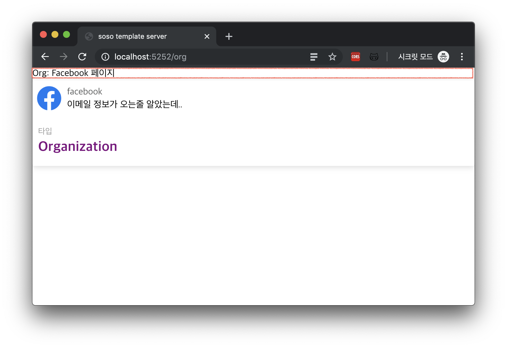
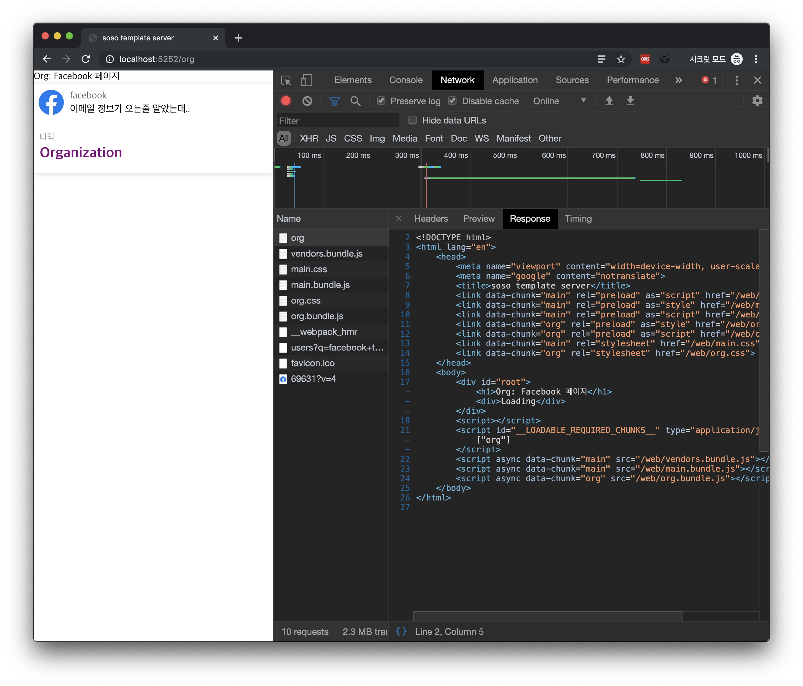

Grab the full code for this tutorial [here](https://github.com/SoYoung210/react-ssr-code-splitting/pull/12).

Bugs I ran into while building this are logged [here](https://github.com/soYoung210/react-ssr-code-splitting/issues). Look for issues tagged `✈️ SSR`.

I'm not going to get into the difference between CSR and SSR, or how either one works under the hood.

> If you want more on that, check the [references](https://so-so.dev/react/ssr-2-ssr---basic/#참고글) below.

## Before We Start

We're going to render the `header on the /org page`, the area boxed in red below, on the server.



The basic idea: `express`, which we're already running, interprets our React code, draws the content, and hands it off to the client.

So what does the server actually need to interpret React code?

- library: react, react-router-dom, etc.
- webpack loader(html, css, etc.)

There's more plumbing involved than that, but conceptually these two matter most.

## Organizing the Structure

Since server and client both need the same libraries, let's merge what used to be two separate modules into one.

Move both client's and server's package.json contents into the root package.json.

Then update that package.json's `scripts` section.

```json
"scripts": {
    "start": "npm run build:server && npm run build:client && node ./static/server.bundle.js",
    "build:server": "webpack --config ./webpack.server.js",
    "build:client": "webpack --config ./webpack.client.js"
  },
```

`start` builds server and client with their own webpack configs, then boots the node server.

Let's give server and client each their own webpack file.

### webpack.server.js

Let's build `/webpack.server.js` off the `server/webpack.config.js` we made in [the first tutorial](https://so-so.dev/react/ssr-1-codesplitting/).

```js {2,9,22,35}
const pathResolve = require('path').resolve
const babelConfig = require('./babelrc.server')
const nodeExternals = require('webpack-node-externals')

module.exports = {
  target: 'node',
  name: 'server',
  node: false,
  entry: pathResolve(__dirname, 'server/app.tsx'),
  output: {
    filename: 'server.bundle.js',
    path: pathResolve(__dirname, 'static'),
  },
  module: {
    rules: [
      {
        test: /\.(ts|tsx|js)?$/,
        exclude: /node_modules/,
        use: [
          {
            loader: 'babel-loader',
            options: babelConfig,
          },
        ],
      },
    ],
  },
  resolve: {
    alias: {
      '@': pathResolve('client/src'),
    },
    modules: ['node_modules'],
    extensions: ['.ts', '.tsx', '.js'],
  },
  externals: [nodeExternals()],
}
```

What's new is highlighted. The entry changed to match the new file location, and I split `babelrc` out so client and server can each use their own.

### babelrc.server.js

Let's create `/babelrc.server.js` to hold the settings SSR needs.

```js {3}
module.exports = {
  presets: ['@babel/typescript', '@babel/react'],
  plugins: ['@loadable/babel-plugin'],
}
```

The server needs to read React code too, so `@babel/react` goes into the presets.
It also needs to read code-split output, so `@loadable/babel-plugin` gets added as well.

### webpack.client.js

This is where the biggest changes happen.

```js {28,29,59}
const webpack = require('webpack')
const LoadablePlugin = require('@loadable/webpack-plugin')
const pathResolve = require('path').resolve
const nodeExternals = require('webpack-node-externals')
const IS_PRODUCTION = process.env.NODE_ENV === 'production'

const getMode = () => (IS_PRODUCTION ? 'production' : 'development')

const getOutputConfig = name => ({
  filename: '[name].bundle.js',
  chunkFilename: '[name].bundle.js',
  path: pathResolve(__dirname, `static/${name}`),
  publicPath: `/${name}/`,
  libraryTarget: name === 'web' ? 'var' : 'commonjs2',
})

const getResolveConfig = () => ({
  alias: {
    '@': pathResolve('client/src'),
  },
  modules: ['node_modules'],
  extensions: ['.ts', '.tsx', '.js', '.json', '.less'],
})

const clientRenderConfig = {
  entry: [hotMiddlewareScript, './client/src/index.tsx'],
  target: 'web',
  name: 'web',
  mode: getMode(),
  output: getOutputConfig('web'),
  module: {
    rules: moduleRules,
  },
  optimization: {
    splitChunks: {
      cacheGroups: {
        commons: {
          test: /[\\/]node_modules[\\/]/,
          name: 'vendors',
          chunks: 'initial',
        },
      },
    },
  },
  plugins: [
    new LoadablePlugin(),
    new MiniCssExtractPlugin({
      filename: '[name].css',
      chunkFilename: '[name].css',
    }),
  ],
  resolve: getResolveConfig(),
}

const nodeRenderConfig = {
  target: 'node',
  name: 'node',
  entry: [pathResolve('./client/src/routes/index.tsx')],
  output: getOutputConfig('node'),
  mode: getMode(),
  externals: ['@loadable/component', nodeExternals()],
  module: {
    rules: moduleRules,
  },
  plugins: [
    new LoadablePlugin(),
    new MiniCssExtractPlugin({
      filename: '[name].css',
      chunkFilename: '[name].css',
    }),
  ],
  resolve: getResolveConfig(),
}

module.exports = [clientRenderConfig, nodeRenderConfig]
```

I could trim some duplication here, but for now I've spelled it out explicitly.
The most obvious shift: the webpack config now runs as a multi-compiler setup.

A multi-compiler setup just means you can run different kinds of compilers depending on the situation.

Now a single task, rendering, happens on both the client (browser) and the server.
Let's run through each setting briefly.

**target**: we're using both 'web' and 'node'. Per the [webpack docs on target](https://webpack.js.org/configuration/target/), the default is web, meaning it's built for the browser.
But since we also need to render in a node environment, we've set this value to 'node' as well.

**name**: names the compiled output. Splitting it into web and node lets `@loadable`, and the webpack-hot-middleware (WHM) we'll set up soon, tell which format a given file is in.

**getEntryPoint**: SSR changes the entry file too. As we'll see shortly, `server/app.tsx` takes over the job `client/src/index.tsx` used to do.

**output**: sorts files into folders based on the injected `target`, so SSR output stays separate from CSR output.
libraryTarget is set to `commonjs2` when `target: node`, since Node.js's module system is commonjs. web just keeps the default, `var`.

**plugins**: since SSR runs in node, we add `webpack-node-externals` — but we still need to read the code-split files, so `@loadable-component` goes in too.

## Turning server/app.ts into server/app.tsx

```tsx {8,10,13,17,20}
import React from 'react'
import { ChunkExtractor } from '@loadable/server'
// import other library

app.get('*', (req, res) => {
  const nodeStats = path.resolve(__dirname, './node/loadable-stats.json')
  const webStats = path.resolve(__dirname, './web/loadable-stats.json')
  const nodeExtractor = new ChunkExtractor({ statsFile: nodeStats })
  const { default: EntryRoute } = nodeExtractor.requireEntrypoint()
  const webExtractor = new ChunkExtractor({ statsFile: webStats })

  const tsx = webExtractor.collectChunks(
    <StaticRouter location={req.url}>
      <EntryRoute />
    </StaticRouter>
  )
  const html = renderToString(tsx)

  res.set('content-type', 'text/html')
  res.send(renderFullPage(webExtractor, html))
})
```

**ChunkExtractor**: the SSR-focused API from [@loadable/server](https://www.smooth-code.com/open-source/loadable-components/docs/api-loadable-server/). `collectChunk` gathers info on the split components, and getLinkTag, getStyleTag, and getScriptTag hand back which files need to load.

**StaticRouter**: the router the server uses in place of BrowserRouter. It hands the route info for the requested URL over to the client-side files.

**renderToString**: the SSR method [react-dom](https://reactjs.org/docs/react-dom-server.html#rendertostring) ships with. It's tightly linked to `hydrate`, which we'll use on the client soon — more on that below.

> 🍿 (spoiler): once markup rendered on the server via renderToString reaches the client, the client doesn't re-render it — it just wires up event handlers.
> `hydrate`: think of it as filling in, the work of filling the server's output back in on the client.

**renderFullPage**: a function I wrote myself to help split up the code. It defines the template the server sends content down in.

```tsx
export const renderFullPage = (webExtractor, html) => `
    <!DOCTYPE html>
      <html lang="ko">
        <head>
          <meta name="viewport" content="width=device-width, user-scalable=no">
          <meta name="google" content="notranslate">
          <title>soso template server</title>
          ${webExtractor.getLinkTags()}
          ${webExtractor.getStyleTags()}
        </head>
        <body>
          <div id="root">${html}</div>
          ${webExtractor.getScriptTags()}
        </body>
      </html>
`
```

The hardest part is behind us now. I skipped over plenty of code along the way, so I'd recommend following along with the code at the [link](https://github.com/SoYoung210/react-ssr-code-splitting/pull/12) above.

## Updating client/src/index.tsx

Unlike before, the HTML coming down now already has its content rendered on the server. Let's compare the As-is and To-be to see what that looks like.

### As-is (CSR)

```html
<!DOCTYPE html>
<html lang="ko">
  <head>
    <!-- meta tags -->
    <title>soso template</title>
  </head>
  <body>
    <div id="root"></div>
  </body>
</html>
<script type="text/javascript" src="/vendors.bundle.js"></script>
<script type="text/javascript" src="/main.bundle.js"></script>
```

An empty div comes down, and rendering happens by parsing `bundle.js` and stuffing content underneath it.

### To-be (SSR)

```html
<!DOCTYPE html>
<html lang="en">
  <head>
    <!-- meta tags -->
    <title>soso template server</title>
    <link
      data-chunk="main"
      rel="preload"
      as="script"
      href="/web/vendors.bundle.js"
    />
    <!-- more link tags -->
  </head>
  <body>
    <div id="root">
      <h1>Org: Facebook Page</h1>
      <div>Loading</div>
    </div>
    <script id="__LOADABLE_REQUIRED_CHUNKS__" type="application/json">
      ["org"]
    </script>
    <script async data-chunk="main" src="/web/vendors.bundle.js"></script>
    <!-- more script tags -->
  </body>
</html>
```

The div that used to sit empty is now **already filled in** — part of the content arrives pre-rendered straight from the server.

But an area that's already been drawn doesn't need redrawing on the client, right?
**That's exactly what hydrate is for.** Let's update `client/src/index.tsx`.

```tsx
import { loadableReady } from '@loadable/component'
import { hydrate } from 'react-dom'
import EntryRoute from './routes'

loadableReady(() => {
  const root = document.getElementById('root')
  hydrate(
    <BrowserRouter>
      <EntryRoute />
    </BrowserRouter>,
    root
  )
})
```

`ReactDOM.render` is gone, and `hydrate` has taken its place.

As mentioned, **its job is filling in what's already been drawn.** It inserts just the string the first render needs into the HTML, and once the bundle js the client needs arrives, it wires up events on those HTML tags.

### Checking the Result

That's SSR plus code splitting, up and running for the first time.
Run `npm start` and hit the `/org` page, and here's what you should see.

This post doesn't include every line of code needed to actually run it, so follow along with the [PR](https://github.com/SoYoung210/react-ssr-code-splitting/pull/12)!

Next up, we'll go beyond server rendering and fetch data so we can deliver the full content.

## References

#### [react-router/StaticRouter](https://github.com/ReactTraining/react-router/blob/master/packages/react-router/docs/api/StaticRouter.md)

#### [Rendering on the Web](https://shlrur.github.io/develog/2019/02/14/rendering-on-the-web/)

#### [Setting Up a React + TypeScript + SSR + Code-Splitting Environment](https://medium.com/@minoo/react-typescript-ssr-code-splitting-%ED%99%98%EA%B2%BD%EC%84%A4%EC%A0%95%ED%95%98%EA%B8%B0-d8cec9567871)
