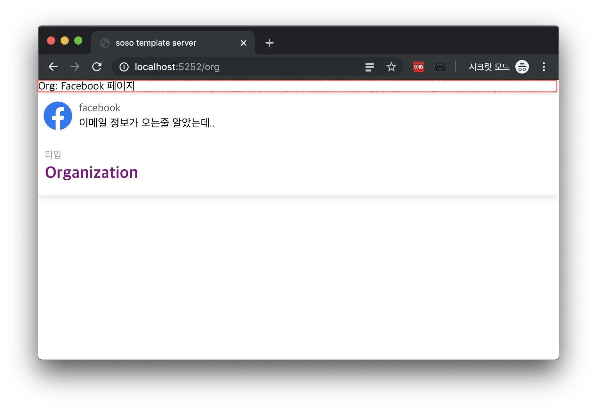
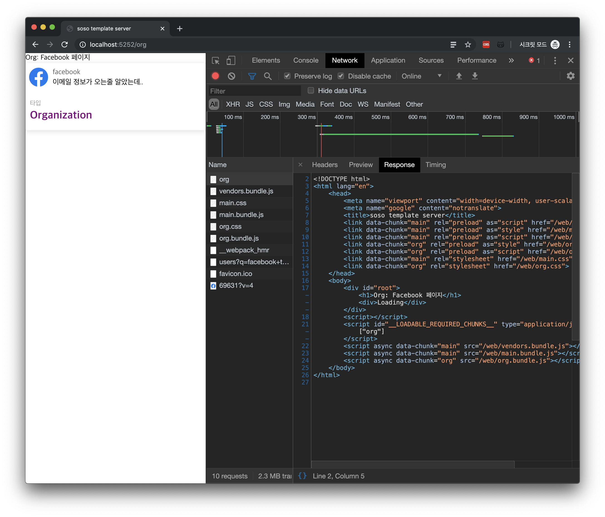

이 튜토리얼에 대한 전체 코드는 [여기](https://github.com/SoYoung210/react-ssr-code-splitting/pull/12)에서 보실 수 있습니다.

프로젝트를 만들면서 해결한 버그는 [이 곳](https://github.com/soYoung210/react-ssr-code-splitting/issues)에 정리되어 있습니다. `✈️ SSR` 라벨의 이슈를 참고해주세요.

본 글에서는 CSR과 SSR의 차이나 기본 원리에 대해서 자세히 다루지 않습니다.

> 혹시 이에 대해 더 알고싶으시다면 아래의 [참고글](https://so-so.dev/react/ssr-2-ssr---basic/#참고글)을 확인해주세요.

## 들어가기에 앞서

아래 빨간 네모 박스 영역인 `/org 페이지의 헤더 영역`을 ServerSide에서 렌더링하게 됩니다.


기본적인 원리는 우리가 사용하고 있는 `express`에서 React코드를 해석하여 컨텐츠를 그리고, 이를 client에게 전달하는 방식입니다.

서버에서 React코드를 해석할 수 있도록 하기 위해서는 어떤 것들이 필요할까요?

- library: react, react-router-dom, etc.
- webpack loader(html, css, etc.)

더 많은 장치가 필요하지만, 개념적으로 이 두 가지가 가장 중요한 요소입니다.

## 구조 정리

먼저, 서버와 클라이언트 모두 공통적인 라이브러리가 필요하니, 두 개의 모듈로 나누어서 관리하던 것을 하나로 통합하겠습니다.

client와 server의 package.json 내용을 모두 root의 package.json으로 옮겨주세요.

그리고 이 package.json의 `scripts`영역을 수정합니다.

```json
"scripts": {
    "start": "npm run build:server && npm run build:client && node ./static/server.bundle.js",
    "build:server": "webpack --config ./webpack.server.js",
    "build:client": "webpack --config ./webpack.client.js"
  },
```

`start` 명령어는 server와 client를 각각의 webpack파일로 build후, node서버를 동작시키는 명령을 수행합니다.

server와 client에게 각각의 webpack file을 만들어주도록 하겠습니다.

### webpack.server.js

[첫 번째 튜토리얼](https://so-so.dev/react/ssr-1-codesplitting/)에서 만들었던 `server/webpack.config.js` 의 내용을 기반으로 `/webpack.server.js`를 만들어 봅시다.

```js{2,9,22,35}
const pathResolve = require('path').resolve
const babelConfig = require('./babelrc.server')
const nodeExternals = require('webpack-node-externals')

module.exports = {
  target: 'node',
  name: 'server',
  node: false,
  entry: pathResolve(__dirname, 'server/app.tsx'),
  output: {
    filename: 'server.bundle.js',
    path: pathResolve(__dirname, 'static'),
  },
  module: {
    rules: [
      {
        test: /\.(ts|tsx|js)?$/,
        exclude: /node_modules/,
        use: [
          {
            loader: 'babel-loader',
            options: babelConfig,
          },
        ],
      },
    ],
  },
  resolve: {
    alias: {
      '@': pathResolve('client/src'),
    },
    modules: ['node_modules'],
    extensions: ['.ts', '.tsx', '.js'],
  },
  externals: [nodeExternals()],
}
```

기존에 비해 달라진 점은 코드 하이라이팅 된 부분입니다. 위치가 달라졌으니, entry의 내용이 바뀌었고 `babelrc`도 클라이언트와 따로 사용하기 위해 분리하였습니다.

### babelrc.server.js

SSR에 필요한 설정을 담은 `/babelrc.server.js`를 만들어 봅시다.

```js{3}
module.exports = {
  presets: ['@babel/typescript', '@babel/react'],
  plugins: ['@loadable/babel-plugin'],
}
```

서버에서도 React코드를 읽는 설정이 필요하니, preset에 `@babel/react`을 추가해주어야 합니다.
코드 스플리팅 된 내용도 읽어야 하니 `@loadable/babel-plugin`도 추가해 줍니다.

### webpack.client.js

이 부분이 기존에 비해 가장 많이 변화하는 부분 입니다.

```js{28,29,59}
const webpack = require('webpack')
const LoadablePlugin = require('@loadable/webpack-plugin')
const pathResolve = require('path').resolve
const nodeExternals = require('webpack-node-externals')
const IS_PRODUCTION = process.env.NODE_ENV === 'production'

const getMode = () => (IS_PRODUCTION ? 'production' : 'development')

const getOutputConfig = name => ({
  filename: '[name].bundle.js',
  chunkFilename: '[name].bundle.js',
  path: pathResolve(__dirname, `static/${name}`),
  publicPath: `/${name}/`,
  libraryTarget: name === 'web' ? 'var' : 'commonjs2',
})

const getResolveConfig = () => ({
  alias: {
    '@': pathResolve('client/src'),
  },
  modules: ['node_modules'],
  extensions: ['.ts', '.tsx', '.js', '.json', '.less'],
})

const clientRenderConfig = {
  entry: [hotMiddlewareScript, './client/src/index.tsx'],
  target: 'web',
  name: 'web',
  mode: getMode(),
  output: getOutputConfig('web'),
  module: {
    rules: moduleRules,
  },
  optimization: {
    splitChunks: {
      cacheGroups: {
        commons: {
          test: /[\\/]node_modules[\\/]/,
          name: 'vendors',
          chunks: 'initial',
        },
      },
    },
  },
  plugins: [
    new LoadablePlugin(),
    new MiniCssExtractPlugin({
      filename: '[name].css',
      chunkFilename: '[name].css',
    }),
  ],
  resolve: getResolveConfig(),
}

const nodeRenderConfig = {
  target: 'node',
  name: 'node',
  entry: [pathResolve('./client/src/routes/index.tsx')],
  output: getOutputConfig('node'),
  mode: getMode(),
  externals: ['@loadable/component', nodeExternals()],
  module: {
    rules: moduleRules,
  },
  plugins: [
    new LoadablePlugin(),
    new MiniCssExtractPlugin({
      filename: '[name].css',
      chunkFilename: '[name].css',
    }),
  ],
  resolve: getResolveConfig(),
}

module.exports = [clientRenderConfig, nodeRenderConfig]
```

좀 더 중복을 제거할 수 도 있지만, 우선 명시적으로 이렇게 적어보았습니다.
가장 눈에띄는 점은 webpack설정이 mul-compiler방식으로 변했다는 방식입니다.

mul-compiler방식이란, 상황에 맞게 다른 종류의 compiler를 사용할 수 있도록 제공하는 방식입니다.

rendering이라는 하나의 작업이 client(browser), 서버에서 진행되도록 변경하였습니다.  
각 설정에 대해 간단하게 살펴보도록 하겠습니다.

**target** : ‘web’과 ‘node’를 사용하고 있습니다. [webpack공식문서 - target](https://webpack.js.org/configuration/target/)을 보면 알 수 있듯, default option은 web입니다. 주로 브라우저에서 사용한다는 뜻입니다.
하지만 우리는 node환경에서 rendering하는 옵션이 필요하므로 이 값을 ‘node’로도 지정해준 것입니다.

**name** : 컴파일된 파일에 이름을 붙이는 옵션입니다. `@loadable`과 앞으로 셋팅할 webpack-hot-middleware(WHM)가 해당 파일의 형식을 알 수 있도록 web과 node 로 구분해줍니다.

**getEntryPoint**: SSR에서는 entry파일도 변경해 줍니다. 이제 곧 소개될 내용이지만, `client/src/index.tsx`의 역할은 `server/app.tsx`가 담당하게 됩니다.

**output**: SSR에 필요한 파일과 CSR에 필요한 파일을 나누기 위해 주입되는 `target`에 따라 폴더를 구분해줍니다.
libraryTarget은 `target: node`일 경우 `commonjs2`로 설정해 줍니다. node.js는 module시스템에서 commonjs방식을 채택했기 때문입니다. web은 default설정인 `var`로 설정하였습니다.

**plugins**: SSR은 node환경에서 실행되므로 `webpack-node-externals`를 추가해주되, Code Splitting된 파일은 읽어야 하므로 `@loadable-component`는 추가해 줍니다.

## server/app.ts => server/app.tsx 수정

```tsx{8,10,13,17,20}
import React from 'react'
import { ChunkExtractor } from '@loadable/server'
// import other library

app.get('*', (req, res) => {
  const nodeStats = path.resolve(__dirname, './node/loadable-stats.json')
  const webStats = path.resolve(__dirname, './web/loadable-stats.json')
  const nodeExtractor = new ChunkExtractor({ statsFile: nodeStats })
  const { default: EntryRoute } = nodeExtractor.requireEntrypoint()
  const webExtractor = new ChunkExtractor({ statsFile: webStats })

  const tsx = webExtractor.collectChunks(
    <StaticRouter location={req.url}>
      <EntryRoute />
    </StaticRouter>
  )
  const html = renderToString(tsx)

  res.set('content-type', 'text/html')
  res.send(renderFullPage(webExtractor, html))
})
```

**ChunkExtractor** : [@loadable/server](https://www.smooth-code.com/open-source/loadable-components/docs/api-loadable-server/)에서 제공하는 SSR용 API입니다. `collectChunk` 로 splitting 된 컴포넌트 정보를 취합하고 getLinkTag, getStyleTag, getScriptTag 로 로드할 파일 정보를 전달합니다.

**StaticRouter** : 서버에서 BrowserRouter대신 사용하는 router입니다. 사용자가 요청한 url의 route정보를 클라이언트 파일에 전달해주는 역할을 합니다.

**renderToString** : [react-dom](https://reactjs.org/docs/react-dom-server.html#rendertostring)에서 지원하는 SSR용 라이브러리입니다. 이 메소드는 앞으로 client에서 사용할 hydrate와 아주 많은 연관이 있습니다. 밑에서 자세히 설명될 예정입니다.

> 🍿(스포): renderToString으로 서버에서 렌더링 된 마크업을 클라이언트에게 내려주면, 클라이언트에서는 리렌더링하지 않고 이벤트 핸들러 정도만 연결합니다.
> `hydrate` : 채워넣는다. 서버의 결과물을 채워넣는 작업이다. 라고 이해하시면 됩니다.

**renderFullPage** : 코드를 분할하기 위해 직접 만든 함수입니다. 서버에서 어떤 템플릿으로 내용물을 내려줄지 적어줍니다.

```tsx
export const renderFullPage = (webExtractor, html) => `
    <!DOCTYPE html>
      <html lang="ko">
        <head>
          <meta name="viewport" content="width=device-width, user-scalable=no">
          <meta name="google" content="notranslate">
          <title>soso template server</title>
          ${webExtractor.getLinkTags()}
          ${webExtractor.getStyleTags()}
        </head>
        <body>
          <div id="root">${html}</div>
          ${webExtractor.getScriptTags()}
        </body>
      </html>
`
```

가장 힘든 작업이 끝났습니다. 중간중간 생략한 코드가 많습니다. 상단 [링크](https://github.com/SoYoung210/react-ssr-code-splitting/pull/12)에 나와있는 코드를 함께 확인하시는것을 추천드립니다.

## client/src/index.tsx 수정

기존과 다르게 서버에서 컨텐츠가 그려진 html이 내려옵니다. 어떤 상황인지 As-is와 To-be로 살펴보겠습니다.

### As-is (CSR)

```html
<!DOCTYPE html>
<html lang="ko">
  <head>
    <!-- meta tags -->
    <title>soso template</title>
  </head>
  <body>
    <div id="root"></div>
  </body>
</html>
<script type="text/javascript" src="/vendors.bundle.js"></script>
<script type="text/javascript" src="/main.bundle.js"></script>
```

비어있는 div가 내려오고 `bundle.js` parsing을 통해 div하위에 내용을 추가하는 방식으로 rendering합니다.

### To-be (SSR)

```html
<!DOCTYPE html>
<html lang="en">
  <head>
    <!-- meta tags -->
    <title>soso template server</title>
    <link
      data-chunk="main"
      rel="preload"
      as="script"
      href="/web/vendors.bundle.js"
    />
    <!-- 더 많은 link tags -->
  </head>
  <body>
    <div id="root">
      <h1>Org: Facebook 페이지</h1>
      <div>Loading</div>
    </div>
    <script id="__LOADABLE_REQUIRED_CHUNKS__" type="application/json">
      ["org"]
    </script>
    <script async data-chunk="main" src="/web/vendors.bundle.js"></script>
    <!-- 더 많은 script tags -->
  </body>
</html>
```

비어 있던 div영역이 **채워집니다.**
일정부분 서버에서 컨텐츠를 채워서 내려받게 됩니다.

헌데, 이미 그려진 영역은 client에서 다시 그릴필요가 없겠죠?
**그래서 hydrate가 필요합니다.** `client/src/index.tsx`의 내용을 변경합니다.

```tsx
import { loadableReady } from '@loadable/component'
import { hydrate } from 'react-dom'
import EntryRoute from './routes'

loadableReady(() => {
  const root = document.getElementById('root')
  hydrate(
    <BrowserRouter>
      <EntryRoute />
    </BrowserRouter>,
    root
  )
})
```

기존의 `ReactDOM.rendering`은 사라지고 `hydrate`가 등장했습니다.

앞서 말했듯, **이미 그려진 영역을 채워주는 역할**을 합니다. 첫 렌더링에 필요한 string만 html에 삽입시켜주고 client에 필요한 bundle js가 도착하면 html tag에 이벤트를 달아주는 역할을 합니다.

### 확인

첫번째 SSR + CodeSplitting적용이 완료되었습니다.
`npm start`를 수행하고 `/org`페이지에 접근해보면 이런 결과를 확인할 수 있습니다.

이 글에는 정상작동에 필요한 full code를 담지않았으니, [PR](https://github.com/SoYoung210/react-ssr-code-splitting/pull/12)을 보면서 따라해보세요!

다음 장에서 server에서 렌더링외에 data fetch를 통한 full contents를 내려주는 작업이 진행됩니다.

## 참고글

#### [react-router/StaticRouter](https://github.com/ReactTraining/react-router/blob/master/packages/react-router/docs/api/StaticRouter.md)

#### [Web에서의 Rendering](https://shlrur.github.io/develog/2019/02/14/rendering-on-the-web/)

#### [React + Typescript + SSR + Code-splitting 환경설정하기](https://medium.com/@minoo/react-typescript-ssr-code-splitting-%ED%99%98%EA%B2%BD%EC%84%A4%EC%A0%95%ED%95%98%EA%B8%B0-d8cec9567871)
