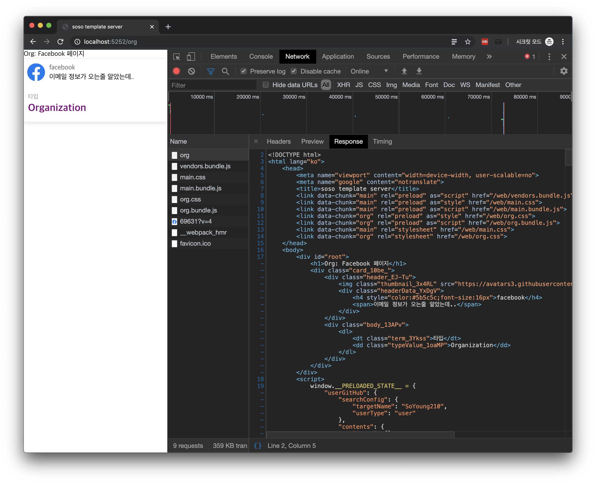

You can find the full code for this tutorial [here](https://github.com/SoYoung210/react-ssr-code-splitting/pull/16).

The bugs I ran into while building this project are logged [here](https://github.com/soYoung210/react-ssr-code-splitting/issues). Check the issues tagged `✈️ SSR`.

## What we'll cover

Here's what this post sets out to do.

1. Declare the business logic needed on the client.
2. Have the server carry out the behavior defined in step 1.
3. Pass the result of step 2 to the client.
4. Have the client initialize its store using the data it received.

## 1. react-router-config

Since the behavior the client used to handle now needs to be shared with the server, we'll change how routes are defined. First, let's declare a `RouteBranch` interface like this.

```ts
export interface RouteBranch {
  path: string;
  exact?: boolean;
  component: React.ComponentType<any>;
  loadaData?: (params: any) => any;
  routes: Array<RouteBranch>;
}
```

We define the elements needed to make up a route (path, component, etc.), and express the **work** that route needs to perform as a function called loadData.
> Later, the server will use this function to carry out its business logic.

Now let's declare every `route` for this project.

```tsx
const UserView = loadable(
  () => import(/* webpackChunkName: "user" */ '../User'), { ssr: false }
);
const OrgView = loadable(
  () => import(/* webpackChunkName: "org" */'../Org')
);

export const routes: Array<RouteBranch> = [
  {
    path: '/user',
    component: UserView,
  },
  {
    path: '/org',
    component: OrgView,
    loadData: (store: Store) => {
      store.dispatch(
        orgGitHub.fetch({
          // fetch Data
        })
      )
    }
  },
];
```

We won't render the `/user` route with SSR, and naturally there's no data-fetching work to do on the server, so we didn't write a loadData for it.

Looking at the `/org` route config, it takes **store** and dispatches an action.
> Since every piece of business logic in this project is handled through action dispatch -> middleware -> store, we kept it consistent with that pattern.

This **store** gets passed in from the server.

## 2. Updating server/app.tsx

On the server, we'll do the following:

1. Create a store,
2. Inspect the route to run whatever loadData work is needed, then
3. Hand the result over to the client.

Let's carry this out inside `handleRenderer`.

```tsx
const handleRender =(req, res) => {
  try {
    const appStore = getStore();

    loadBranchData(req.url)(appStore).then((data) => {
      if (data.every((data) => data === null)) {
        const config = getHtmlConfigs(req, appStore);
        const { html, webExtractor } = config;
        res.send(renderFullPage(webExtractor,html, {}));

        return;
      } 
    });
  } catch(e) {
    // error handling
  }
}
app.get('*', handleRender);
```

handleRenderer deals with two cases.

#### 1. When the client has no business logic declared

In this case, we just finish rendering and hand it over to the client. We check for the no-business-logic case with the `if (data.every((data) => data === null)` statement.

We made `loadData` return null when it has no work to do. So, when every result from `loadData` is null, we **treat it as having no work to perform** and return the html via `res.send`.

#### 2. When the client has business logic declared

```tsx
const handleRender = (req, res) => {
  try {
    const appStore = getStore();

    loadBranchData(req.url)(appStore).then((data) => {
      if (data.every((data) => data === null)) {
        // case 1
      }
      // case 2
      const unsubscribe = appStore.subscribe(() => {
        const config = getHtmlConfigs(req, appStore);
        const finalState = appStore.getState();
        const loadingKeys = Object.keys(finalState.loading);
        const { html, webExtractor } = config;
        const fetchState = new Array(loadingKeys.length).fill(false);

        loadingKeys.forEach((key: string, index: number) => {
          const isFetched = finalState.loading[key] !== HttpStatusCode.LOADING;

          fetchState[index] = isFetched;
        });
  
        const isAllFetched = fetchState.every((state) => state);
        if (isAllFetched) {
          unsubscribe();
          res.send(renderFullPage(webExtractor, html, finalState));

          return;
        }
      });
    });
  } catch(e) {
    // error handling
  }
};
```

Let's walk through this code in a few steps.

1. After dispatching the action, we **subscribe to the store** so we can tell when it changes, and wait until the actual data arrives.
2. We create an array to hold fetchState, and store true whenever the loading reducer status pulled from the store's finalState is not `HttpStatusCode.LOADING`.
3. Once the array we built in step 2 is filled with **all true** values, we `unsubscribe` from the store and return the html.

In this project, we set up a separate [loading reducer](https://github.com/soYoung210/react-ssr-code-splitting/blob/master/client/src/store/_modules/loading.ts), which is why we wrote the code this way. Add whatever logic fits your own structure for checking fetchState.

### loadBranchData

What role does the `loadBranchData` function play?

```ts
// server/util.ts
import { MatchedRoute, matchRoutes } from 'react-router-config';
import { applyMiddleware, compose, createStore, Store } from "redux";
import root from 'window-or-global';

import { routes } from '@/routes/controller';
import epics from '@/store/epics';
import reducers from '@/store/reducers';

export const loadBranchData = (pathname: string) => (store: Store) => {
  // Get exact MatchedRoute.
  const branch: Array<MatchedRoute<any>> = matchRoutes(routes, pathname);

  const promises = branch.map(({ route }) => (
    route.loadData ? route.loadData(store) : Promise.resolve(null)
  ));

  return Promise.all(promises);
};
```

This function takes pathname and store as parameters.

* **pathname**: it finds the element in the client's declared routes array that matches the current route requested to express. Finding the matching element relies on react-router-config's `matchRoutes` helper.
* **store**: the loadData functions defined on the client, which handle business logic, are set up to receive a store. We pass the store created on the server so the client-defined logic can be carried out with it.

We handle the necessary work using [Promise.all()](https://developer.mozilla.org/ko/docs/Web/JavaScript/Reference/Global_Objects/Promise/all).

### getStore

```ts
// server/util.ts
export const getStore = () => {
  const epicMiddleware = createEpicMiddleware();
  const composeEnhancers = (root as any).__REDUX_DEVTOOLS_EXTENSION_COMPOSE__ || compose;
  const appStore = createStore(reducers, composeEnhancers(applyMiddleware(epicMiddleware)));
  epicMiddleware.run(epics);

  return appStore;
};
```
We write this the same way we wrote the code that created the store on the client.
> 🍿(spoiler): the function that creates the store on the client is about to change.

## 3. Passing the initial store value to the client

So far, we've only had the server **carry out the work declared on the client and produce a result.** Now we need to pass that result along to the client.

Let's write this by following Redux's [Server Rendering docs](https://redux.js.org/recipes/server-rendering). The state created on the server gets passed along by attaching it to a `window` variable.

```ts
export const renderFullPage = (
  webExtractor: ChunkExtractor,
  html: string,
  preloadedState: RootStoreState | {},
) => {
  return(`
    <!DOCTYPE html>
      <html lang="ko">
        <head>
          <meta name="viewport" content="width=device-width, user-scalable=no">
          <meta name="google" content="notranslate">
          <title>soso template server</title>
          ${webExtractor.getLinkTags()}
          ${webExtractor.getStyleTags()}
        </head>
        <body>
          <div id="root">${html}</div>
          <script>
            window.__PRELOADED_STATE__ = ${JSON.stringify(preloadedState).replace(/</g,'\\u003c')}
          </script>
          ${webExtractor.getScriptTags()}
        </body>
      </html>
  `)
}
```

We store the initial state produced by the server in `window.__PRELOADED_STATE__`.

## 4. Initializing the store with data received from the server

Let's look at the client code that creates the store using this value.

```ts
import root from 'window-or-global';

export default (() => {
  const preloadedState = root.__PRELOADED_STATE__;

  delete root.__PRELOADED_STATE__;

  const epicMiddleware = createEpicMiddleware();
  const composeEnhancers = (root as any).__REDUX_DEVTOOLS_EXTENSION_COMPOSE__ || compose;
  const store = createStore(
    reducers, preloadedState, composeEnhancers(applyMiddleware(epicMiddleware))
  );
  epicMiddleware.run(epics);

  return store;
})();
```

> To work around [window is not defined](https://github.com/SoYoung210/react-ssr-code-splitting/issues/7), we used `window-or-global` and referenced `root` instead of window.

By referencing the root (window) variable, we pull in the state the server already prepared and pass it along when creating the store. This lets us initialize with the state the server built ahead of time.

## Checking the result

All the necessary work is done. Shall we check it out?
> This post doesn't include the full code, so I recommend reading it alongside [this PR](https://github.com/SoYoung210/react-ssr-code-splitting/pull/16).

```bash
npm start
```

Type the command above into your terminal and visit the `/org` page.

Previously, only the Header area and a Loading area came down; now a document filled with the Full Contents comes down instead.
When requesting a specific url, an html with the content already drawn comes down **without any loader.**

Once you get to this stage, you might start wondering, "is skipping straight to content with no loader actually good UX?"

So, **in the last post of this tutorial, we'll take a look at SSR from a UX perspective.**
