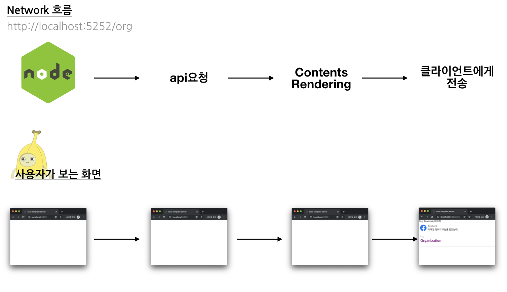
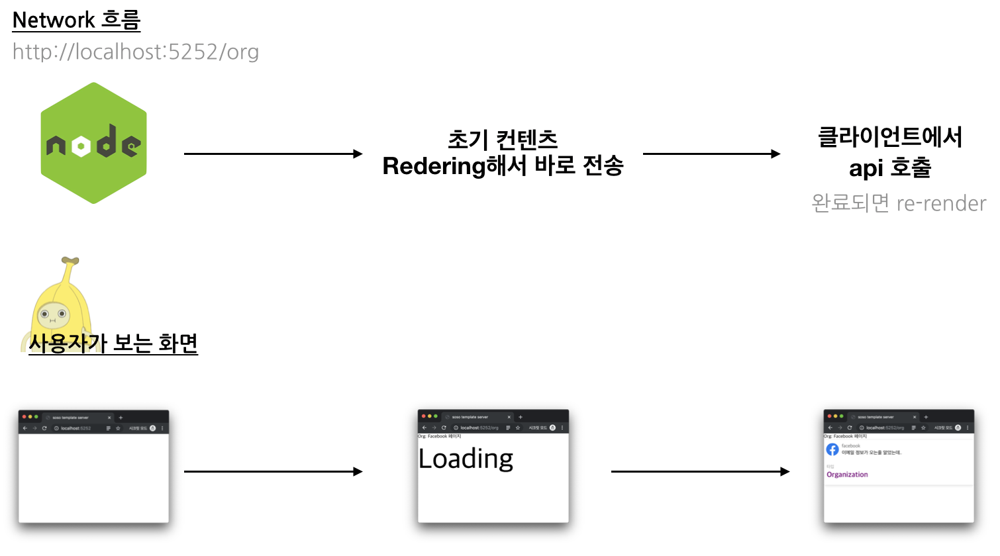
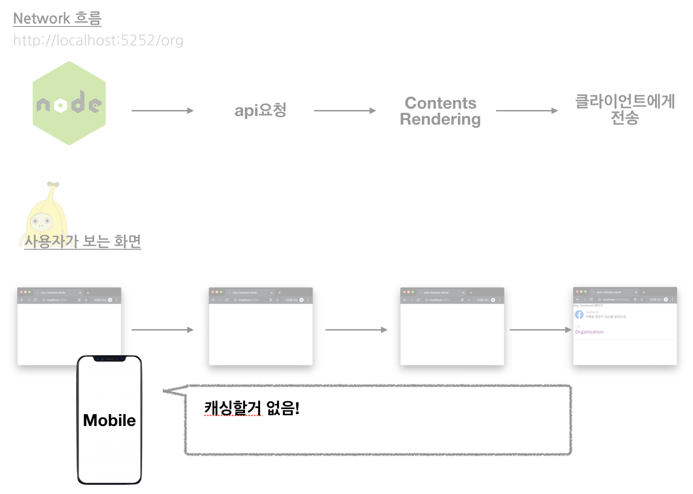
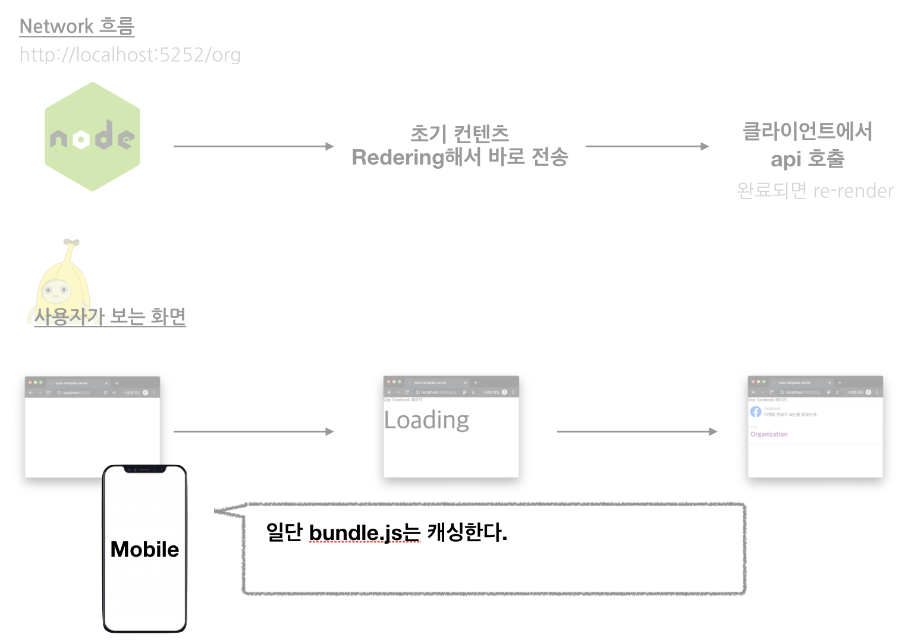

We've now built two different setups using SSR. The second one was probably harder to pull off than the first — but did all that extra effort actually buy us better UX?

My answer: `not really.`

## The user's perspective

### Fetching data on the server

Here's a diagram of what actually happens on a request, using the approach from [3. SSR - Data Fetch](https://so-so.dev/react/ssr-3-ssr-data-fetch/).

The request hits express, and until the api call resolves and an html with the content already drawn reaches the client, **the user is staring at a blank screen. That's it.**

The longer the api call takes, the longer that blank screen sticks around. Hard to call that good UX.

> Cache the content-filled html itself, and this gets faster — that would likely help UX in a real way.
> This tutorial won't get into that, though.

### Delivering quickly from the server

Now switch to the approach from [2. SSR - Basic](https://so-so.dev/react/ssr-2-ssr---basic/).
The server skips the api call entirely, renders just the client's `Loader` or `header`, and ships that down fast. Everything after that gets handed off to the client.

Now the user sees something fast. The diagram just shows a big `Loading` label, but swap in a skeleton UI and the UX gets even better.

### Fetching data on the server - WebView

This approach also loses a real advantage once you're inside a webview.

When the server handles the api request itself, what the client gets back is a finished html document, so none of it can be cached.

### Delivering quickly from the server - WebView

With the second approach, at least part of the bundle needed for client-side rendering can be cached. Naturally, that beats fetching the bundle from express every single time.

## It's not all downside

That said, this isn't purely a downside either. Flip it around, and the real story is that the client **always ends up at the mercy of whatever express is doing.** Let's walk through a `low-tier device` scenario.

**_Downloading the full contents_**

Every request and every api call happens on express, so the only variables affecting how fast the user gets content are the `network` and express's own specs (server CPU, and so on).
On a device whose CPU is worse than express's, content can actually load faster this way than through the other approach.

**_SSR + CSR_**

Here, what matters for download speed is the user's own network and their device specs.
On a low-end device, both of those are working against you, so content loads painfully slowly. In that case, you're better off letting express deliver everything.

## Closing out this tutorial

And that's the SSR tutorial, done.
Building SSR without a framework threw a lot of bugs and rough edges at me along the way, and I hope walking through it helps anyone else stuck on the same problems.

You can find all the code from this tutorial [here](https://github.com/SoYoung210/react-ssr-code-splitting).
I'd really appreciate any feedback, whether that's a comment or a GitHub issue. 🙂
