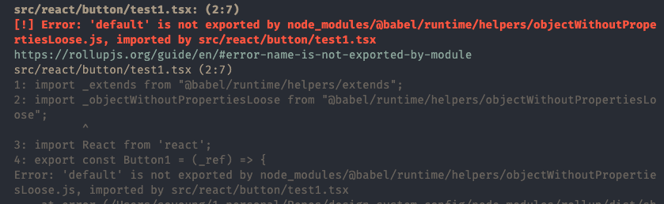
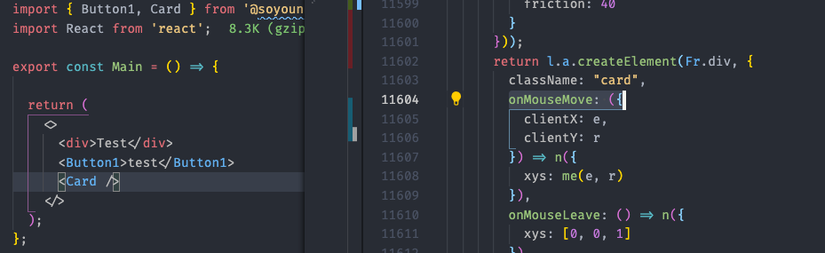
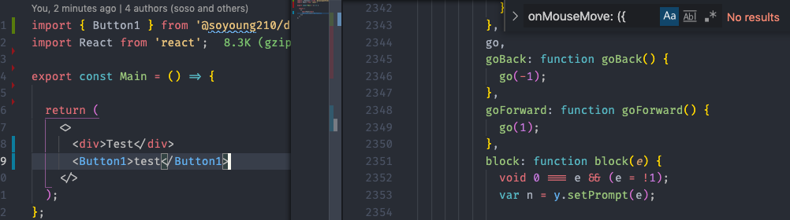

This post covers [rollup.js](https://rollupjs.org/) and its library configuration while setting up a design system's development environment. It's not a full configuration tutorial though, so it doesn't cover everything you'd need.

If you just want to see the environment setup covered in this post, you can find it at [@soyoung/design-system-config](https://github.com/SoYoung210/design-system-config).

## Table Of Contents

- [Rollup](https://so-so.dev/tool/rollup/rollupjs-config/#rollupjs)
  - [Config](https://so-so.dev/tool/rollup/rollupjs-config/#config)
  - [preserveModules](https://so-so.dev/tool/rollup/rollupjs-config/#preservemodules)
  - [babel](https://so-so.dev/tool/rollup/rollupjs-config/#babel)
- [Tree Shaking Result](https://so-so.dev/tool/rollup/rollupjs-config/#tree-shaking-result)
- [Why not Webpack?](https://so-so.dev/tool/rollup/rollupjs-config/#why-not-webpack)
- [Why not babel cli?](https://so-so.dev/tool/rollup/rollupjs-config/#why-not-babel-cli)
- [package.json](https://so-so.dev/tool/rollup/rollupjs-config/#packagejson)
- [TypeScript](https://so-so.dev/tool/rollup/rollupjs-config/#typescript)
  - [tsc](https://so-so.dev/tool/rollup/rollupjs-config/#tsc)
  - [rollup-plugin-typescript2](https://so-so.dev/tool/rollup/rollupjs-config/#rollup-plugin-typescript2)

## Rollup.js

Rollup.js is a bundler like [webpack](https://webpack.js.org/) or [parcel](https://parceljs.org/) that turns large, complex modules (files) of code into a library or an application.

### Config

rollup.js lets you configure many plugins and options. A `rollup.config.js` that supports both `es` (ES module) and `cjs` (Common JS) formats can be structured as follows.

```jsx
// rollup.config.js
const inputSrc = [
  ['./src/index.ts', 'es'],
  ['./src/index.ts', 'cjs'],
];

export default inputSrc
  .map(([input, format]) => {
    return {
      input,
      output: {
        dir: 'dist',
        format,
      },
      plugins: [],
    };
  });
```

Add the **required plugins**.

```jsx
import babel from '@rollup/plugin-babel';
import commonjs from '@rollup/plugin-commonjs';
import { nodeResolve } from '@rollup/plugin-node-resolve';
import peerDepsExternal from 'rollup-plugin-peer-deps-external';
import postcss from 'rollup-plugin-postcss';
import { terser } from 'rollup-plugin-terser';

export default inputSrc
  .map(([input, format]) => {
    return {
      input,
      output: {
        dir: `dist2/${format}`,
        format,
        exports: 'auto',
      },
      external: [/@babel\/runtime/],
      // explained later
      preserveModules: format === 'cjs',
      plugins: [
        babel({
          babelHelpers: 'runtime',
          exclude: 'node_modules/**',
          extensions,
        }),
        nodeResolve({
          extensions,
        }),
        // https://velog.io/@peterkimzz/rollup-%ED%94%8C%EB%9F%AC%EA%B7%B8%EC%9D%B8
        // Helps rollup interpret CommonJS modules by converting them to ES6.
        commonjs({
          extensions: [...extensions, '.js'],
        }),
        peerDepsExternal(),
        postcss({
          plugins: [],
        }),
        terser(),
      ],
    };
  });
```

- [@rollup/plugin-babel](https://www.npmjs.com/package/@rollup/plugin-babel): a plugin that lets you use babel in rollup.
- [@rollup/plugin-node-resolve](https://www.npmjs.com/package/@rollup/plugin-node-resolve): used to consume third-party modules within the library (dependencies in package.json), and also used to load files with extensions other than js (ts, tsx). It also supports Tree Shaking for external modules.
- [@rollup/plugin-commonjs](https://www.npmjs.com/package/@rollup/plugin-commonjs): converts modules written in CommonJS form to ES6 so they can be included in the output. If you exclude the `commonjs` plugin in the example project and build, you'll see the following error.

  

- [rollup-plugin-peer-deps-external](https://www.npmjs.com/package/rollup-plugin-peer-deps-external): excludes the `peerDependency` modules specified in package.json from the library bundle output.

  ```jsx
  // module reference in the bundle without peer-deps-external
  import { someThing } from '../../../node_modules/some'

  // with peer-deps-external added, it stays as below and is resolved from node_modules wherever it's used
  import { someThing } from 'some'
  ```

- [rollup-plugin-terser](https://www.npmjs.com/package/rollup-plugin-terser): minifies the bundle output.

### preserveModules

Setting rollup.js's `preserveModules` option to `true` preserves the bundle output's folder structure.

- With the default value of false, the output is generated as a single file

According to the official docs, **this value doesn't affect Tree Shaking support.** The difference is that when only certain elements are used in a `cjs` or `amd` format, not all the code gets imported.

> ⚠️ The official docs state that '**the `preserveModule: true` setting also** supports tree shaking.'  
> However, since setting `preserveModules: true` minimizes the blast radius so that even if treeshaking fails in one file, it doesn't cause failures in other files, I recommend testing it in the actual bundle. (related issue: [webpack - tree shaking not working es module library](https://github.com/webpack/webpack/issues/9337))

```jsx
// Before
const module = require('@soyoung210/design-system-config')

render(module.Card);

// After
const Card = require('@soyoung210/design-system-config/dist/cjs/react/card/card3D');
render(Card);
```

Since cjs doesn't support separate tree shaking, if a single file contains all the code, the application's bundle size can grow.

> 📝 This option originally came about to support tree shaking in applications using "Ember.js". ([related PR](https://github.com/rollup/rollup/pull/1878))

### babel

I configured babel in rollup.config.js as follows.

```jsx
babel({
  babelHelpers: 'runtime',
  exclude: 'node_modules/**',
  extensions,
}),
```

Among [@rollup/plugin-babel](https://www.npmjs.com/package/@rollup/plugin-babel)'s options, `babelHelpers` can take 4 values.

- **runtime:** the option recommended by the official docs 'when building a library'. It must be used together with [@babel/plugin-transform-runtime](https://www.npmjs.com/package/@babel/plugin-transform-runtime), and @babel/runtime must be declared as a dependency of the library.  
If you're curious about @babel/plugin-transform-runtime, check out the [official docs](https://babeljs.io/docs/en/babel-plugin-transform-runtime) and the ["you don't know polyfill - babel/plugin-transform-runtime"](https://so-so.dev/web/you-dont-know-polyfill/#babelplugin-transform-runtime) post.
  > ⚠️ If you use this option, you need to add `external: [/@babel\/runtime/]`.
- **bundled:** an option that includes the babel helper functions in the bundle output. Mainly used when developing an application.
- **external:** this option comes with a caution to use it carefully. Instead of automatically generating internal helper functions, it's an option you can customize yourself. For more details on this option, see [this post](https://brunoscopelliti.com/a-simple-babel-optimization-i-recently-learned/).
- **inline:** this option isn't recommended. That's because the helper function ends up duplicated in each file.

Of the 4 options, let's look at `runtime` and `bundled` in more detail.

The [example code](https://github.com/SoYoung210/design-system-config) used for the build test consists of a `Button1` component built with just react and css, and a `Card` component that uses `react-spring`.

#### babelHelpers: bundled

```jsx
export default [
	// ...
  plugins: [
    babel({
      babelHelpers: 'bundled', // default value
      exclude: 'node_modules/**',
      extensions,
    })
  ]
]
```

With this setting, the babel helper function is included in the bundle output. The bundle output looks like this.

```jsx
function _objectWithoutPropertiesLoose(source, excluded) {
  /* omitted */
}

const Button1 = (_ref) => {
  let {
    children
  } = _ref,
      props = _objectWithoutPropertiesLoose(_ref, ["children"]);
```

You can see that the `_objectWithoutPropertiesLoose` function is included in the file.

#### babelHelpers: bundled + external: [/@babel\/runtime/]

```jsx
export default [
  // ...
  external: [/@babel\/runtime/],
  plugins: [
    babel({
      babelHelpers: 'bundled',
      exclude: 'node_modules/**',
      extensions,
    })
  ]
```

What happens if you use this option together?

```jsx
import _extends$1 from '@babel/runtime/helpers/esm/extends';
import _objectWithoutPropertiesLoose$1 from '@babel/runtime/helpers/esm/objectWithoutPropertiesLoose';

function _extends() {
  /* omitted */
}

function _objectWithoutPropertiesLoose(source, excluded) {
  /* omitted */
}
```

`_objectWithoutPropertiesLoose$1` was changed to reference the `@babel/runtime` module, while `_objectWithoutPropertiesLoose` was generated internally.

`_objectWithoutPropertiesLoose$1` is referenced by `node_modules/react-spring`. The `@babel/runtime` referenced by the external module (react-spring, included in this post's example project) was kept 'external'.

Meanwhile, the `@babel/runtime` module needed by `Button1` was generated inside the bundle.

#### babelHelpers: runtime + external: [/@babel\/runtime/]

```jsx
export default [
	// ...
  external: [/@babel\/runtime/],
  plugins: [
    babel({
      babelHelpers: 'runtime',
      exclude: 'node_modules/**',
      extensions,
    })
  ]
]
```

**All** references to `@babel/runtime` get changed to **external**. `@babel/transform-runtime` must be included in the babel config.

```jsx
import _objectWithoutPropertiesLoose from '@babel/runtime/helpers/objectWithoutPropertiesLoose';

const Button1 = (_ref) => {
  let {
    children
  } = _ref,
      props = _objectWithoutPropertiesLoose(_ref, ["children"]);
```

Instead of the `_objectWithoutPropertiesLoose` function's implementation being generated internally, it was changed to reference the external module.

#### babelHelpers: runtime

```jsx
export default [
	// ...
  // external: [/@babel\/runtime/],
  plugins: [
    babel({
      babelHelpers: 'runtime',
      exclude: 'node_modules/**',
      extensions,
    })
  ]
]
```

If you build without the `external: [/@babel\/runtime/]` setting that the official docs guide you toward, you'll find the result is the same as with `babelHelpers: 'bundled'`.

```jsx
function _objectWithoutPropertiesLoose(source, excluded) {
  /* omitted */

  return target;
}

const Button1 = (_ref) => {
  let {
    children
  } = _ref,
      props = _objectWithoutPropertiesLoose(_ref, ["children"]);
```

So, when applying the runtime option, you must always set up the external option as well.

## Tree Shaking Result

One of the important things in a library is Tree Shaking. If a user only uses part of a library's code, but the entire thing gets included in the bundle output and unnecessarily inflates the size, then even a well-made library becomes hard to reach for.

When everything is bundled into a single file, it's hard to check the result in a Bundle Analyzer. In that case, you can check whether Tree Shaking was applied by looking at the application's final bundle output.

I checked the result by installing `@soyoung210/design-system-config`.

### When the Card component is included



The onMouseMove and related code that makes up the `Card` component (function) was included in the final bundle.

### When the Card component is not included



The code making up the `Card` component disappeared, but the `react-spring`-related code used by the `Card` component was still included. This looks like it could be a [react-spring issue](https://github.com/pmndrs/react-spring/issues/1158), but it's also an example of the situation mentioned in [preserveModules](https://so-so.dev/tool/rollup/rollupjs-config/#preservemodules), where a tree shake failure in one file affects the whole.

If you're curious about the details of Tree Shaking, I recommend reading [this post](https://medium.com/@craigmiller160/how-to-fully-optimize-webpack-4-tree-shaking-405e1c76038).

## Why not Webpack?

webpack is also a JavaScript Bundler. Since it basically does the same job, you could use webpack as well, but there are a few reasons to choose rollup over webpack as a library bundler.

**webpack can't bundle in ESM form.**

The condition for Tree Shaking is that the bundled output must be in ESM form, but Webpack can't bundle in ESM form. Rollup, on the other hand, is capable of bundling in ESM form.
🔔  Webpack5 is [planning support for ESM form, but as of 2021.01.10 it's still experimental](https://webpack.js.org/configuration/output/#outputmodule).

Also, when bundling the same output, Rollup.js comes out to 22KB while Webpack comes out to 29KB — the file size is larger when bundled with webpack.
If you'd like to know more about this, see [Migrating from Webpack to Rollup](https://medium.com/naver-fe-platform/webpack%EC%97%90%EC%84%9C-rollup%EC%A0%84%ED%99%98%EA%B8%B0-137dc45cbc38).

## Why not babel cli?

You could also configure things so that modules aren't bundled and are only transpiled by [babel](https://babeljs.io/). This is the approach used by many open source projects, such as [chakra-ui](https://github.com/chakra-ui/chakra-ui/blob/develop/packages/switch/package.json) and [react-query](https://react-query.tanstack.com/) (esm).

- Pros: no bundler-related configuration is needed, and react-query keeps this non-bundling setup for [this reason](https://github.com/tannerlinsley/react-query/pull/994).
- Cons: since babel isn't a bundler, it can't perform tasks beyond transpiling, and it can't handle the following situations.

### Situation 1: when using internal dependencies

```jsx
// babel cli
import { animated, useSpring } from 'react-spring';

export function Card() {
  return /*#__PURE__*/React.createElement(animated.div, { ... })
}

// rollup
import { useSpring, animated as extendedAnimated } from '../../../node_modules/react-spring/web.js';
```

If you want `react-spring` to be treated as an internal dependency of the library, this is hard to handle. Since a transformation through babel doesn't separately transform the `import { .. } from 'react-spring'` syntax, any external dependency you use has to be handled as a `peerDependencies`.

### Situation 2: custom style sheet

When a component uses a style sheet. A bundler interprets and transforms the style file appropriately, but babel doesn't.

```jsx
// babel cli
import './styles.css';
import React from 'react';

// rollup
import React from 'react';
import './styles.css.js';

// how rollup handles the style sheet, styles.css.js
import styleInject from '../../../node_modules/style-inject/dist/style-inject.es.js';

var css_248z = ".card {\n  width: 45ch;}\n";
styleInject(css_248z);

export default css_248z;
```

## package.json

If a bundler supports various formats such as `cjs (or umd)` and `esm`, you need to wire up `package.json` to match the right format.

- [module](https://github.com/rollup/rollup/wiki/pkg.module): the `module` field is the entry point location for the ES6 module.
- main: the location of the file that gets returned when you run `require('foo')` after installing the package.

If you specify both options together, bundlers like rollup and webpack will reference the `module` field, while environments that can't use ES6, such as Jest, will reference the file in the `main` field.

## TypeScript

When dealing with TypeScript code, you need to add a JS conversion step and also generate a type definition file.

The JS conversion can be done via `@rollup/plugin-babel`, configured earlier, or `rollup-plugin-typescript2`, and the type definition file can be simply generated via `tsc`. Let's first look at generating type definitions via `tsc`.

> 💡 The officially supported TypeScript plugin for rollup is [@rollup/plugin-typescript](https://www.npmjs.com/package/@rollup/plugin-typescript), but due to an issue introduced below, this post covers rollup-plugin-typescript2 instead.

### tsc

First, configure `tsconfig` as follows. (It doesn't necessarily have to match this exactly.)

```json
{
  "compilerOptions": {
    "target": "ESNext",
    "module": "ESNext",
    "lib": ["dom", "esnext"],
    "strict": true,
    "noFallthroughCasesInSwitch": true,
    "moduleResolution": "Node",
    "suppressImplicitAnyIndexErrors": true,
    "noImplicitAny": true,
    "strictFunctionTypes": true,
    "strictNullChecks": true,
    "strictPropertyInitialization": true,
    "jsx": "react",
    "esModuleInterop": true,
    "skipLibCheck": true
  },
  "include": ["src/**/*"]
}
```

Modify `package.json` a bit so that the type definition file is also generated during `build`.

```json
"scripts": {
  "build:rollup": "rimraf ./dist2 && rollup -c ./scripts/rollup/rollup.config.js && npm run build:types2",
  "build:types2": "tsc --emitDeclarationOnly --declaration --declarationDir dist2/types"
},
```

### [rollup-plugin-typescript2](https://www.npmjs.com/package/rollup-plugin-typescript2)

When using Rollup and TypeScript together, you can use `rollup-plugin-typescript2` or `@babel/preset-typescript` (w. @rollup/plugin-babel).

The main difference between these two approaches is **how they handle TypeScript resolution**.

- rollup-plugin-typescript2: fully supports `tsc` internally.
- @babel/preset-env: transpiles TypeScript to JavaScript, but doesn't perform type checking. (see - [@babel/plugin-transform-typescript official docs](https://babeljs.io/docs/en/babel-plugin-transform-typescript))

There isn't a big difference either way you choose. The project covered in this post uses babel as the transpiler and takes the strategy of only using `tsc` to generate the type definition file, so I only used `@rollup/plugin-babel`.

> 📝: rollup-plugin-typescript2 is a library forked from rollup's official TypeScript tool, `@rollup/plugin-typescript`, in order to include TypeScript compile error functionality. You can use TypeScript's powerful features, but there's [an issue where the build speed is very slow](https://github.com/ezolenko/rollup-plugin-typescript2/issues/148).

> ⚠️  During Tree Shaking, if there's a `/*#__PURE__ */` annotation, it's judged to have no sideEffect and gets removed. [babel has supported pure annotations since v7](https://babeljs.io/blog/2018/08/27/7.0.0#pure-annotation-support), but TypeScript doesn't support it yet. It's a good idea to also check whether pure annotations are included in the bundle output.

## Wrapping Up

I looked into and organized the parts I was curious about while putting together the Rollup.js configuration file. I hope this post was helpful if you weren't familiar with Rollup.js, and if anything is lacking or needs correcting, please leave a comment — I'd appreciate it.
