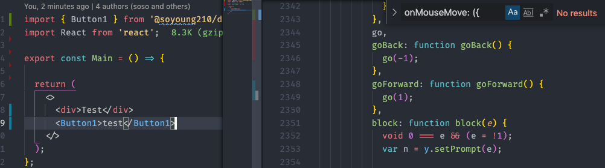

이 글에서는 디자인 시스템 개발 환경을 구축하는 단계에서 [rollup.js](https://rollupjs.org/)과 라이브러리 설정에 관한 내용을 정리하는 글입니다. 하지만 환경설정에 대한 튜토리얼은 아니기 때문에 필요한 모든 내용을 다루지는 않습니다.

이 글에서 구성한 환경 구축 내용만 보고 싶으시다면 [@soyoung/design-system-config](https://github.com/SoYoung210/design-system-config) 에서 보실 수 있습니다.

## Table Of Contents

- [Rollup](https://so-so.dev/tool/rollup/rollupjs-config/#rollupjs)
  - [Config](https://so-so.dev/tool/rollup/rollupjs-config/#config)
  - [preserveModules](https://so-so.dev/tool/rollup/rollupjs-config/#preservemodules)
  - [babel](https://so-so.dev/tool/rollup/rollupjs-config/#babel)
- [Tree Shaking Result](https://so-so.dev/tool/rollup/rollupjs-config/#tree-shaking-result)
- [Why not Webpack?](https://so-so.dev/tool/rollup/rollupjs-config/#why-not-webpack)
- [Why not babel cli?](https://so-so.dev/tool/rollup/rollupjs-config/#why-not-babel-cli)
- [package.json](https://so-so.dev/tool/rollup/rollupjs-config/#packagejson)
- [TypeScript](https://so-so.dev/tool/rollup/rollupjs-config/#typescript)
  - [tsc](https://so-so.dev/tool/rollup/rollupjs-config/#tsc)
  - [rollup-plugin-typescript2](https://so-so.dev/tool/rollup/rollupjs-config/#rollup-plugin-typescript2)

## Rollup.js

Rollup.js은 [webpack](https://webpack.js.org/)이나 [parcel](https://parceljs.org/)과 같이 크고 복잡한 코드의 모듈(파일)을 라이브러리나 어플리케이션으로 만들어주는 번들러입니다.

### Config

rollup.js에는 많은 플러그인과 옵션을 설정할 수 있습니다. `es`(ES module) 형식과 `cjs`(Common JS)형식을 지원하는 `rollup.config.js` 는 다음과 같이 구성할 수 있습니다.

```jsx
// rollup.config.js
const inputSrc = [
  ['./src/index.ts', 'es'],
  ['./src/index.ts', 'cjs'],
];

export default inputSrc
  .map(([input, format]) => {
    return {
      input,
      output: {
        dir: 'dist',
        format,
      },
      plugins: [],
    };
  });
```

**필수 플러그인**을 추가합니다.

```jsx
import babel from '@rollup/plugin-babel';
import commonjs from '@rollup/plugin-commonjs';
import { nodeResolve } from '@rollup/plugin-node-resolve';
import peerDepsExternal from 'rollup-plugin-peer-deps-external';
import postcss from 'rollup-plugin-postcss';
import { terser } from 'rollup-plugin-terser';

export default inputSrc
  .map(([input, format]) => {
    return {
      input,
      output: {
        dir: `dist2/${format}`,
        format,
        exports: 'auto',
      },
      external: [/@babel\/runtime/],
      // 추후 설명
      preserveModules: format === 'cjs',
      plugins: [
        babel({
          babelHelpers: 'runtime',
          exclude: 'node_modules/**',
          extensions,
        }),
        nodeResolve({
          extensions,
        }),
        // https://velog.io/@peterkimzz/rollup-%ED%94%8C%EB%9F%AC%EA%B7%B8%EC%9D%B8
        // CommonJS 로 작성된 모듈들을 ES6 바꾸어서 rollup이 해석할 수 있게 도와줍니다.
        commonjs({
          extensions: [...extensions, '.js'],
        }),
        peerDepsExternal(),
        postcss({
          plugins: [],
        }),
        terser(),
      ],
    };
  });
```

- [@rollup/plugin-babel](https://www.npmjs.com/package/@rollup/plugin-babel): rollup에서 babel을 사용할 수 있게 해주는 플러그인입니다.
- [@rollup/plugin-node-resolve](https://www.npmjs.com/package/@rollup/plugin-node-resolve): 라이브러리 내에서 써드파티 모듈(package.json내의 dependencies)을 사용하는 용도로 사용하며, js이외의 확장자(ts, tsx) 파일을 불러오기 위해서도 사용합니다. 외부 모듈에 대한 Tree Shaking또한 지원합니다.
- [@rollup/plugin-commonjs](https://www.npmjs.com/package/@rollup/plugin-commonjs): CommonJS 형태로 이루어진 모듈의 코드를 ES6로 변환하여 결과물에 포함될 수 있게 해줍니다. 예시 프로젝트에서 `commonjs` 플러그인을 제외하고 빌드 시 아래와 같은 에러를 확인할 수 있습니다.

  

- [rollup-plugin-peer-deps-external](https://www.npmjs.com/package/rollup-plugin-peer-deps-external): package.json에 명시된 `peerDependency`모듈을 라이브러리 번들 결과물에서 제외합니다.

  ```jsx
  // peer-deps-external없을 때의 번들에서의 모듈 참조
  import { someThing } from '../../../node_modules/some'

  // peer-deps-external추가 시 아래와 같이 유지되고 사용되는 곳에서의 node_modules참조
  import { someThing } from 'some'
  ```

- [rollup-plugin-terser](https://www.npmjs.com/package/rollup-plugin-terser): 번들 결과물을 minify해줍니다.

### preserveModules

rollup.js의 `preserveModules`옵션을 `true`로 지정할 경우 번들 결과물의 폴더 구조를 유지할 수 있습니다.

- 기본값 false일 경우 결과물은 단일 파일로 생성됨

공식문서에 따르면, **이 값은 Tree shaking지원에 영향을 주지 않습니다.** `cjs` 혹은 `amd` 포맷에서 특정 요소만 사용할 시 모든 코드를 import하지 않는다는 차이점이 있습니다.

> ⚠️ 공식문서에서는 '**preserveModule: true 설정도** tree shaking을 지원한다.' 라고 명시되어 있습니다.  
> 하지만, `preserveModules: true`로 설정할 경우 한 파일에서 treeshake가 실패하더라도 다른 파일까지 실패하지 않도록 영향범위를 최소화해주기 때문에, 실제 번들에서 테스트해 보시는 것을 추천합니다. (관련 이슈: [webpack - tree shaking not working es module library](https://github.com/webpack/webpack/issues/9337))

```jsx
// Before
const module = require('@soyoung210/design-system-config')

render(module.Card);

// After
const Card = require('@soyoung210/design-system-config/dist/cjs/react/card/card3D');
render(Card);
```

cjs는 별도 tree shaking이 지원되지 않기 때문에, 단일 파일에서 모든 코드를 포함하고 있으면 어플리케이션의 번들 사이즈가 커질 수 있습니다.

> 📝 이 옵션의 탄생 배경은 "Ember.js"를 사용하는 어플리케이션에서의 트리 쉐이킹을 지원하기 위해 만들어진 것입니다. ([관련 PR](https://github.com/rollup/rollup/pull/1878))

### babel

rollup.config.js에서의 babel을 아래와 같이 설정해주었습니다.

```jsx
babel({
  babelHelpers: 'runtime',
  exclude: 'node_modules/**',
  extensions,
}),
```

[@rollup/plugin-babel](https://www.npmjs.com/package/@rollup/plugin-babel)의 옵션 중 `babelHelpers` 는 4가지 값을 가질 수 있습니다.

- **runtime:** 공식 document에서 '라이브러리 빌드 시' 추천하는 옵션입니다. [@babel/plugin-transform-runtime](https://www.npmjs.com/package/@babel/plugin-transform-runtime) 과 함께 사용해야 하며, 라이브러리의 디펜던시로 @babel/rutime을 명시해야 합니다.  
@babel/plugin-transform-runtime에 대해 궁금하다면 [공식문서](https://babeljs.io/docs/en/babel-plugin-transform-runtime)와 [you don'k know polyfill - babel/plugin-transform-runtime](https://so-so.dev/web/you-dont-know-polyfill/#babelplugin-transform-runtime)글을 참고해주세요.
  > ⚠️ 이 옵션을 사용할 경우 `external: [/@babel\/runtime/]`을 추가해야 합니다.
- **bundled:** babel helper함수들이 번들 결과물에 포함되도록 하는 옵션입니다. 주로 어플리케이션 개발 시 사용합니다.
- **external:** 이 옵션은 주의해서 사용할 것을 당부하고 있습니다. 내부 helper function을 자동으로 생성하는 것이 아니라, 커스텀하게 설정할 수 있는 옵션입니다. 이 옵션에 대한 자세한 내용은 [이 글](https://brunoscopelliti.com/a-simple-babel-optimization-i-recently-learned/) 을 참고해주세요.
- **inline:** 이 옵션은 권장되지 않습니다. helper function이 각 파일에 중복적으로 생성되기 때문입니다.

4가지 옵션 중 `runtime` 옵션과 `bundled` 옵션에 대해 자세히 알아보겠습니다.

빌드 테스트에 사용되는 [예시 코드](https://github.com/SoYoung210/design-system-config)는 react와 css만을 사용해 만든 `Button1`컴포넌트와 `react-spring`을 사용한 `Card`컴포넌트로 구성되어 있습니다.

#### babelHelpers: bundled

```jsx
export default [
	// ...
  plugins: [
    babel({
      babelHelpers: 'bundled', // default value
      exclude: 'node_modules/**',
      extensions,
    })
  ]
]
```

이렇게 설정할 경우, 번들 결과물에 babel helper function이 포함됩니다. 번들 결과물은 다음과 같습니다.

```jsx
function _objectWithoutPropertiesLoose(source, excluded) {
  /* 생략 */
}

const Button1 = (_ref) => {
  let {
    children
  } = _ref,
      props = _objectWithoutPropertiesLoose(_ref, ["children"]);
```

`_objectWithoutPropertiesLoose`함수가 파일에 포함된 것을 확인할 수 있습니다.

#### babelHelpers: bundled + external: [/@babel\/runtime/]

```jsx
export default [
  // ...
  external: [/@babel\/runtime/],
  plugins: [
    babel({
      babelHelpers: 'bundled',
      exclude: 'node_modules/**',
      extensions,
    })
  ]
```

이 옵션을 같이 사용할 경우 어떻게 될까요?

```jsx
import _extends$1 from '@babel/runtime/helpers/esm/extends';
import _objectWithoutPropertiesLoose$1 from '@babel/runtime/helpers/esm/objectWithoutPropertiesLoose';

function _extends() {
  /* 생략 */
}

function _objectWithoutPropertiesLoose(source, excluded) {
  /* 생략 */
}
```

`_objectWithoutPropertiesLoose$1`은 `@babel/runtime`모듈에서 참조하도록 변경되었고, `_objectWithoutPropertiesLoose`은 내부에 생성되었습니다.

`_objectWithoutPropertiesLoose$1` 은 `node_modules/react-spring`에서 참조하고 있습니다. 외부 모듈(이 글에서의 예시 프로젝트에서 포함 한react-spring)에서 참조하는 `@babel/runtime` 은 '외부'로 유지되었습니다.

반면, `Button1` 에서 필요한 `@babel/runtime`의 모듈은 번들 내부에 생성되었습니다.

#### babelHelpers: runtime + external: [/@babel\/runtime/]

```jsx
export default [
	// ...
  external: [/@babel\/runtime/],
  plugins: [
    babel({
      babelHelpers: 'runtime',
      exclude: 'node_modules/**',
      extensions,
    })
  ]
]
```

`@babel/runtime`에 대한 **모든 참조가** **외부**로 변경됩니다. babel config에 `@babel/transform-runtime`가 반드시 포함되어 있어야 합니다.

```jsx
import _objectWithoutPropertiesLoose from '@babel/runtime/helpers/objectWithoutPropertiesLoose';

const Button1 = (_ref) => {
  let {
    children
  } = _ref,
      props = _objectWithoutPropertiesLoose(_ref, ["children"]);
```

`_objectWithoutPropertiesLoose` 함수 구현이 내부에 생성되는 것이 아니라 외부 모듈을 참조하도록 변경되었습니다.

#### babelHelpers: runtime

```jsx
export default [
	// ...
  // external: [/@babel\/runtime/],
  plugins: [
    babel({
      babelHelpers: 'runtime',
      exclude: 'node_modules/**',
      extensions,
    })
  ]
]
```

공식문서에서 가이드 하고있는 `external: [/@babel\/runtime/]`설정을 제외하고 빌드해보면 `babelHelpers: 'bundled'`와 같은 결과임을 확인할 수 있습니다.

```jsx
function _objectWithoutPropertiesLoose(source, excluded) {
  /* 생략 */

  return target;
}

const Button1 = (_ref) => {
  let {
    children
  } = _ref,
      props = _objectWithoutPropertiesLoose(_ref, ["children"]);
```

따라서, runtime 옵션 적용시 external 설정을 반드시 해주어야 합니다.

## Tree Shaking Result

라이브러리에서 중요한 것 중 하나는 Tree Shaking입니다. 유저가 라이브러리 코드 중 일부만 사용했는데, 전체가 번들 결과물에 포함되어 불필요하게 용량을 증가시킨다면 아무리 잘 만든 라이브러리라도 선뜻 사용하기 어려울 것입니다.

하나의 파일로 번들링 될 경우 Bundle Analyzer에서 결과를 확인하기 어려운데, 이 경우 어플리케이션의 최종 번들 결과물을 확인해보면 Tree Shaking적용 여부를 알 수 있습니다.

`@soyoung210/design-system-config`를 install하여 결과를 확인하였습니다.

### Card컴포넌트를 포함했을 때


`Card`컴포넌트(함수)를  이루는 onMouseMove와 관련 코드들이 최종 번들에 포함되었습니다.

### Card컴포넌트를 포함하지 않았을 때



`Card` 컴포넌트를 이루는 코드는 사라졌지만, `Card` 컴포넌트에서 사용한 `react-spring` 관련 코드들은 포함되었습니다. 이는 [react-spring의 이슈](https://github.com/pmndrs/react-spring/issues/1158) 같기도 하지만, [preserverModules](https://so-so.dev/tool/rollup/rollupjs-config/#preservemodules)에서 언급한 하나의 파일에서 tree shake가 실패하여 전체에 영향을 주는 예시입니다.

Tree Shaking에 관해 자세한 내용이 궁금하시다면 [이 글](https://medium.com/@craigmiller160/how-to-fully-optimize-webpack-4-tree-shaking-405e1c76038)을 읽어보시는 것을 추천드립니다.

## Why not Webpack?

webpack 역시 JavaScript Bundler입니다. 기본적으로 같은 기능을 수행하므로 webpack을 사용할 수도 있지만, 라이브러리 Bundler로 webpack보다 rollup을 선택하는 몇 가지 이유가 있습니다.

**webpack은 ESM형태로 번들이 불가능합니다.**

Tree Shaking조건은 번들링 된 결과물이 ESM형태여야 하지만, Webpack은 ESM형태로 번들할 수 없습니다. 이에 반해, Rollup은 ESM형태로 번들링하는 것이 가능합니다.
🔔  Webpack5에서 [ESM형태의 지원을 계획하고 있으나, 2021.01.10 기준 아직 실험단계](https://webpack.js.org/configuration/output/#outputmodule)입니다.

또, 같은 결과물을 번들링 했을 때 Rollup.js는 22KB / Webpack은 29KB로 webpack으로 번들링했을 때의 파일크기가 더 큽니다.
이 내용에 대해 더 자세히 알고 싶으시다면 [Webpack에서 Rollup 전환기](https://medium.com/naver-fe-platform/webpack%EC%97%90%EC%84%9C-rollup%EC%A0%84%ED%99%98%EA%B8%B0-137dc45cbc38)를 참고해 주세요.

## Why not babel cli?

모듈을 번들링하지 않고 [babel](https://babeljs.io/)로 transpile만 하도록 설정할 수도 있습니다. [chakra-ui](https://github.com/chakra-ui/chakra-ui/blob/develop/packages/switch/package.json), [react-query](https://react-query.tanstack.com/)(esm)등 많은 오픈소스에서 사용하고 있는 방식입니다.

- 장점: 번들러 관련 환경설정이 필요없고, react-query에서는 [이런 이유](https://github.com/tannerlinsley/react-query/pull/994)로 번들링하지 않는 설정을 유지합니다.
- 단점: babel은 번들러가 아니기 때문에 트랜스파일링 외의 작업을 수행할 수 없고, 아래 상황들에 대응할 수 없습니다.

### 상황 1: 내부 디펜던시를 사용하는 경우

```jsx
// babel cli
import { animated, useSpring } from 'react-spring';

export function Card() {
  return /*#__PURE__*/React.createElement(animated.div, { ... })
}

// rollup
import { useSpring, animated as extendedAnimated } from '../../../node_modules/react-spring/web.js';
```

`react-spring`이 라이브러리 내부 디펜던시로 취급되는 것을 바랄 경우 대응이 어렵습니다. babel을 통한 변환은 `import { .. } from 'raect-spring`구문을 따로 변환하지 않으므로 사용하는 외부 디펜던시는 모두 `peerDependencies`로 다뤄져야 합니다.

### 상황 2: custom style sheet

컴포넌트 내에서 style sheet를 사용하는 경우. 번들러는 스타일 파일을 해석해서 적절히 변환하지만, babel은 그렇지 않습니다.

```jsx
// babel cli
import './styles.css';
import React from 'react';

// rollup
import React from 'react';
import './styles.css.js';

// rollup이 style sheet를 처리하는 방식 styles.css.js
import styleInject from '../../../node_modules/style-inject/dist/style-inject.es.js';

var css_248z = ".card {\n  width: 45ch;}\n";
styleInject(css_248z);

export default css_248z;
```

## package.json

번들러를 통해 `cjs(or umd)`, `esm` 등 다양한 형식을 지원한다면, `package.json`에 맞는 포맷을 연결해주어야 합니다.

- [module](https://github.com/rollup/rollup/wiki/pkg.module): `module`필드는 ES6 모듈의 시작점 위치입니다.
- main: 패키지를 설치한 뒤 `require('foo')`를 실행했을 때 반환될 파일의 위치입니다.

두 가지 옵션을 함께 명시하면 rollup이나 webpack등의 번들러를 사용할 때는 `module`필드를 참조하고, ES6를 사용할 수 없는 Jest환경 등에서는 `main`필드의 파일을 참조하게 됩니다.

## TypeScript

TypeScript코드를 다룰 때는 JS 변환과정을 추가해야 하고, type definition파일을 생성해야 합니다.

JS 변환은 앞서 설정한 `@rollup/plugin-babel`혹은 `rollup-plugin-typescript2`를 통해 수행할 수 있고, type defnition파일은 `tsc`를 통해 간단하게 수행할 수 있습니다. 먼저, `tsc`를 통한 type defnition생성에 대해 알아보겠습니다.

> 💡 rollup에서 공식지원하는 typescript plugin은 [@rollup/plugin-typescirpt](https://www.npmjs.com/package/@rollup/plugin-typescript)  이나, 밑에서 소개할 이슈로 본 글에서는 rollup-plugin-typescript2를 소개합니다.

### tsc

 우선, `tsconfig`를 아래와 같이 설정해 줍니다. (반드시 아래 설정과 일치할 필요는 없습니다.)

```json
{
  "compilerOptions": {
    "target": "ESNext",
    "module": "ESNext",
    "lib": ["dom", "esnext"],
    "strict": true,
    "noFallthroughCasesInSwitch": true,
    "moduleResolution": "Node",
    "suppressImplicitAnyIndexErrors": true,
    "noImplicitAny": true,
    "strictFunctionTypes": true,
    "strictNullChecks": true,
    "strictPropertyInitialization": true,
    "jsx": "react",
    "esModuleInterop": true,
    "skipLibCheck": true
  },
  "include": ["src/**/*"]
}
```

`package.json`을 일부 수정하여 `build` 시 type definition파일이 함께 생성되도록 합니다.

```json
"scripts": {
  "build:rollup": "rimraf ./dist2 && rollup -c ./scripts/rollup/rollup.config.js && npm run build:types2",
  "build:types2": "tsc --emitDeclarationOnly --declaration --declarationDir dist2/types"
},
```

### [rollup-plugin-typescript2](https://www.npmjs.com/package/rollup-plugin-typescript2)

Rollup과 TypeScript를 함께 사용할 때, `rollup-plugin-typescript2`를 사용하거나 `@babel/preset-typescript(w. @rollup/plugin-babel)`을 사용할 수 있습니다.

이 두 가지 방식의 주요 차이점은 **TypeScript해석에 대한 접근방식**입니다.

- rollup-plugin-typescript2: 내부적으로 `tsc`를 완벽하게 지원합니다.
- @babel/preset-env: TypeScript를 JavaScript로 transpile하지만, type check기능은 수행하지 않습니다. (참고 - [@babel/plugin-transform-typescript 공식문서](https://babeljs.io/docs/en/babel-plugin-transform-typescript))

어느 쪽을 선택해도 큰 차이는 없습니다. 이 글에서 다루는 프로젝트는 babel을 transpiler로 사용하고 `tsc`로 type definition파일만 생성하는 전략을 가져가고 있어 `@rollup/plugin-babel`만 사용했습니다.

> 📝: rollup-plugin-typescript2는 rollup의 공식 TypeScript도구인 `@rollup/plugin-typescript`에서 TypeScript compile error 기능을 포함하기 위해 fork하여 제작된 라이브러리입니다. TypeScript의 강력한 기능을 사용할 수 있지만, [빌드 속도가 아주 느리다는 이슈](https://github.com/ezolenko/rollup-plugin-typescript2/issues/148)가 있습니다.

> ⚠️  Tree Shaking과정에서 `/*#__PURE__ */` annotation이 있으면 sideEffect가 없다고 판단하여 제거하는데, [babel은 v7부터 pure annotation을 지원](https://babeljs.io/blog/2018/08/27/7.0.0#pure-annotation-support)하지만, TypeScript는 아직 지원하지 않습니다. 번들 결과물에서 pure annotation포함 여부도 확인해보는 것이 좋습니다.

## 마무리

Rollup.js 설정파일을 구성하며 궁금했던 부분을 조사하고 정리해봤습니다. 이 글이 Rollup.js와 친숙하지 않으셨던 분께는 도움이 되셨길 바라고, 글에 부족한 내용이나 수정이 필요한 부분이 있다면 코멘트로 남겨주시면 감사하겠습니다.
