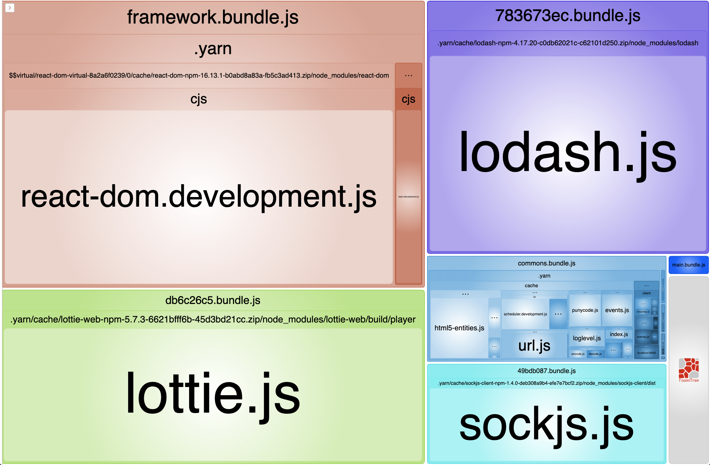
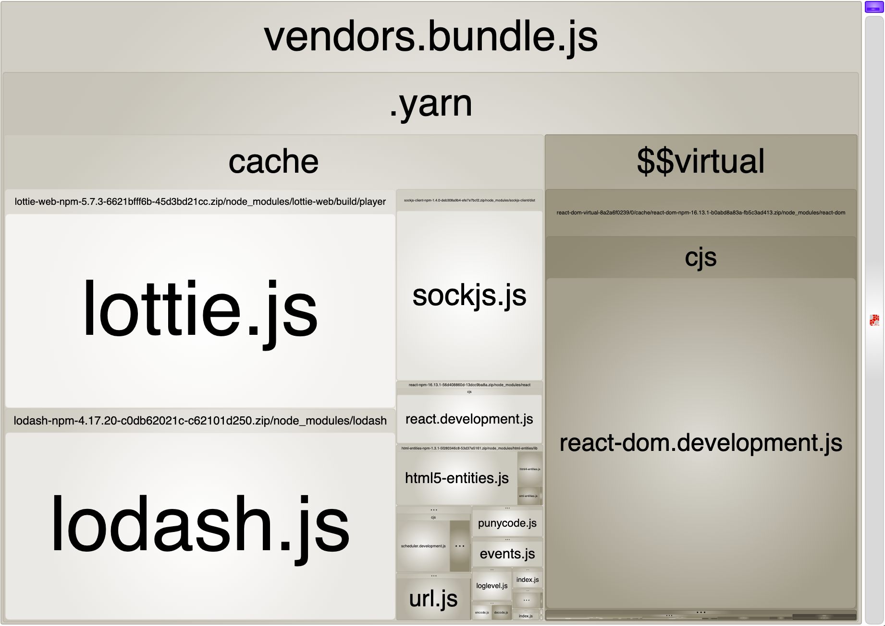

When building a web application, we use various libraries to support many features quickly and easily. How these libraries are built can have a big impact on initial page load speed.

This post introduces a way to split node modules into multiple bundle files by modifying `webpack`'s splitChunk option.

> All the code used here can be found in [this repository](https://github.com/SoYoung210/webpack-node-modules-splitting).

## cacheGroups

The main thing we'll be modifying is webpack splitChunks' `cacheGroups` option.

**[cacheGroups](https://webpack.js.org/plugins/split-chunks-plugin/#splitchunkscachegroups) is a rule definition that specifies that a chunk file should be created based on certain conditions.** The key of the cacheGroups object becomes the name of each "rule." The cacheGroups rules explained in this post are a slightly modified version of [Next.js's webpack-config.ts](https://github.com/vercel/next.js/blob/ed0820f763e74d0071625030aed70b3b21184aef/packages/next/build/webpack-config.ts).

## The Three Rules: framework, lib, commons

Explicitly set cacheGroups' default settings to false, marking them as "unused," and define three custom rules.

```js
cacheGroups: {
  default: false,
  vendors: false,
  framework: {},
  lib: {},
  commons: {}
}
```

> The names here don't necessarily need to match the example above. The [webpack splitChunk docs](https://webpack.js.org/plugins/split-chunks-plugin/#splitchunkscachegroups) describe it in the form `splitChunks.cacheGroups.{cacheGroup}.priority`.

- framework: A chunk that separates out core frameworks the project uses, like react and react-router-dom
- lib: A separate chunk for node modules that exceed a certain size threshold
- commons: A chunk for all other modules

The config containing the rules above looks like this.

```js {7, 14}
cacheGroups: {
  default: false,
  vendors: false,
  framework: {
    chunks: 'all',
    name: 'framework',
    test: /(?<!node_modules.*)[\\/]node_modules[\\/](react|react-dom|react-router-dom)[\\/]/,
    priority: 40,
    enforce: true,
  },
  lib: {
    test(module) {
      return (
        module.size() > 80000 &&
        /node_modules[/\\]/.test(module.identifier())
      );
    },
    name(module) {
      const hash = crypto.createHash('sha1');

      hash.update(module.libIdent({ context: __dirname }));

      return hash.digest('hex').substring(0, 8);
    },
    priority: 30,
    minChunks: 1,
    reuseExistingChunk: true,
  },
  commons: {
    name: 'commons',
    minChunks: 1, // entry points length
    priority: 20,
  }
}
```

This is the bundle split according to these rules. It's split into framework, commons, and the [hash] names defined in lib.



Now let's look at the properties that make up each rule.

### Priority

Each node module can belong to multiple cacheGroups depending on cacheGroups' `test rule`.

When a module could belong to two or more groups, this priority is used, and it ends up belonging to the rule with the higher priority.

### chunks: all

There are three options you can give to the chunks setting.

**initial, async, all**

```jsx
// a.js
import React from 'react'
import('lodash') // dynamic load

console.log('hello a')

export default a;
```

In `a.js`, lodash is dynamically imported, and react is imported eagerly.

```js
// webpack.config.js
splitChunks: {
  cacheGroups: {
    defaultVendors: {
      test: /[\\/]node_modules[\\/]/,
      chunks: 'async'
    },
  }
}
```

The setting above creates a chunk group called defaultVendors, and it's configured so that **this group includes files under the node_modules folder that were imported asynchronously**.

If the chunks option is `all`, then regardless of how a file is imported, every file under node_modules gets split into the defaultVendors.js module.

The whole premise of webpack node_modules splitting is that since browsers can load resources in parallel, splitting the bundle into smaller pieces reduces the overall loading time.

### enforce: true?

This specifies that a chunk should always be created for this group, ignoring webpack splitChunks' other settings (minSize, minChunks, maxAsyncRequests, etc.).

### default, vendors, defaultVendors: false?

```jsx
cacheGroups: {
  default: false,
  vendors: false,
 // vendors was renamed to defaultVendors
  defaultVendors: false,
}
```

What does it mean to set these properties to `false`?

webpack provides basic splitChunk options by default.

The [SplitChunk options docs](https://github.com/webpack/webpack.js.org/blob/master/src/content/plugins/split-chunks-plugin.md) specify the following default value settings.

```jsx
module.exports = {
  //...
  optimization: {
    splitChunks: {
      chunks: 'async',
      minSize: 20000,
      minRemainingSize: 0,
      maxSize: 0,
      minChunks: 1,
      maxAsyncRequests: 30,
      maxInitialRequests: 30,
      automaticNameDelimiter: '~',
      enforceSizeThreshold: 50000,
      cacheGroups: {
        defaultVendors: {
          test: /[\\/]node_modules[\\/]/,
          priority: -10
        },
        default: {
          minChunks: 2,
          priority: -20,
          reuseExistingChunk: true
        }
      }
    }
  }
};
```

Setting all the options above to false means none of the default `SplitChunk` settings are used, and only the custom rules are applied.

### The modules Passed as Parameters to test and name

If you set a small size threshold in the `lib` config, CSS-related modules can also end up included under the lib rule, and this can cause a CSS module–related error.

```text
TypeError: module.libIdent is not a function
    at Object.name [as getName] (/webpack.config.js:169:34)
    at addModuleToChunksInfoMap (/webpack/lib/optimize/SplitChunksPlugin.js:497:31)
    at /webpack/lib/optimize/SplitChunksPlugin.js:630:9
    at SyncBailHook.eval [as call] (eval at create (/node_modules/tapable/lib/HookCodeFactory.js:19:10), <anonymous>:5:16)
    at SyncBailHook.lazyCompileHook (/node_modules/tapable/lib/Hook.js:154:20)
```

Let's look again at the config we wrote earlier.

```jsx
 lib: {
   test(module) {
     return (
       module.size() > 80000 &&
         /node_modules[/\\]/.test(module.identifier())
      );
    },
   name(module) {
     const hash = crypto.createHash('sha1');
     if (!module.libIdent) {
       throw new Error(
         `Encountered unknown module type: ${module.type}. Please open an issue.`,
        );
      }

     hash.update(module.libIdent({ context: __dirname }));

     return hash.digest('hex').substring(0, 8);
   }
},
```

The CSS module's size satisfied the `test` condition, and an error was thrown in the naming logic in the `name` part.

CSS modules generated by the mini-css-extract plugin don't have `libIdent`. We need a conditional that checks whether the module type is one split off by mini-css-extract.

```jsx
const isModuleCSS = (module) => {
  return module.type === 'css/mini-extract';
};

lib: {
  test(module) {
    return (
      module.size() > 80000 &&
      /node_modules[/\\]/.test(module.identifier())
    );
  },
  name(module) {
    const hash = crypto.createHash('sha1');

    if (isModuleCSS(module)) {
      module.updateHash(hash);

      return hash.digest('hex').substring(0, 8);
    } else {
      if (!module.libIdent) {
        throw new Error(
          `Encountered unknown module type: ${module.type}. Please open an issue.`,
        );
      }
    }
    hash.update(module.libIdent({ context: __dirname }));

    return hash.digest('hex').substring(0, 8);
  },
  priority: 30,
  minChunks: 1,
  reuseExistingChunk: true,
}
```

Here's a brief summary of the module object information being used.

- libIdent: The module's location information. Calling module.libIndent() gives a result like the following.
  - ex: /${projectPath}/node_modules/${moduleName}/${fileName}js
- type: The module's type. Most node modules are of type `javascript/auto`, and CSS modules are `css/mini-extract`.
- size: The module's size

## Wrap-up

Here are the [bundle analyzer](https://www.npmjs.com/package/webpack-bundle-analyzer) results before and after applying `cacheGroups`.

### Before



### After


By splitting relatively large modules like lottie and lodash into their own chunks and loading them in parallel, you can improve first-page load speed.

## Reference

- [https://medium.com/@simsimjae/webpack4-splitchunksplugin-option-breakdown-19f5de32425a](https://medium.com/@simsimjae/webpack4-splitchunksplugin-%EC%98%B5%EC%85%98-%ED%8C%8C%ED%97%A4%EC%B9%98%EA%B8%B0-19f5de32425a)
- [https://webpack.js.org/plugins/split-chunks-plugin/#splitchunkscachegroups](https://webpack.js.org/plugins/split-chunks-plugin/#splitchunkscachegroups)
