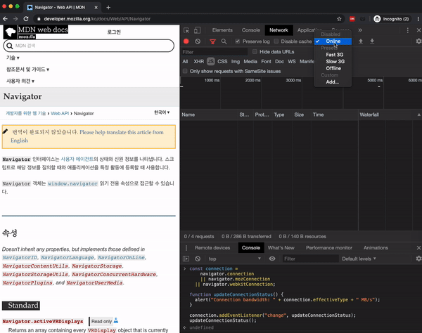
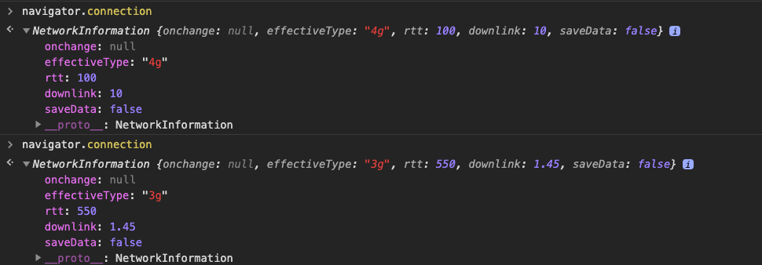
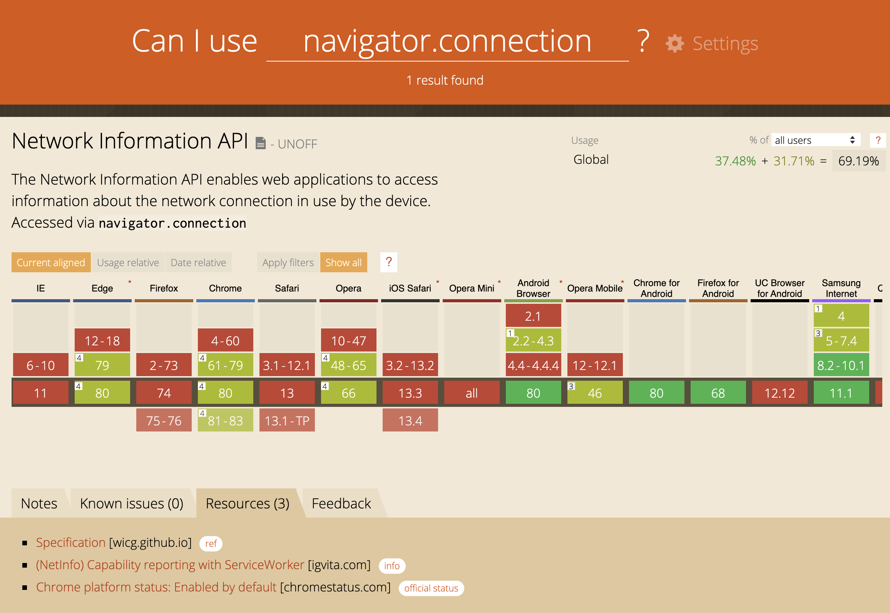
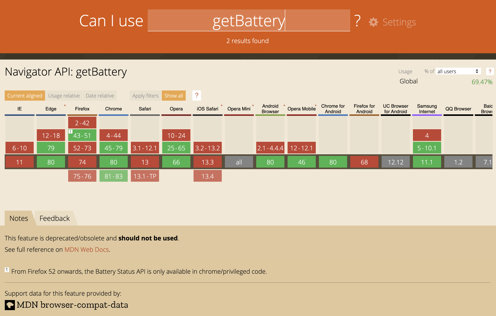
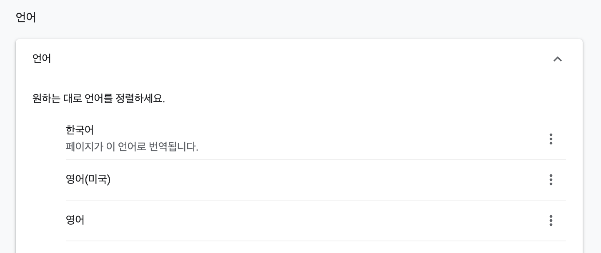
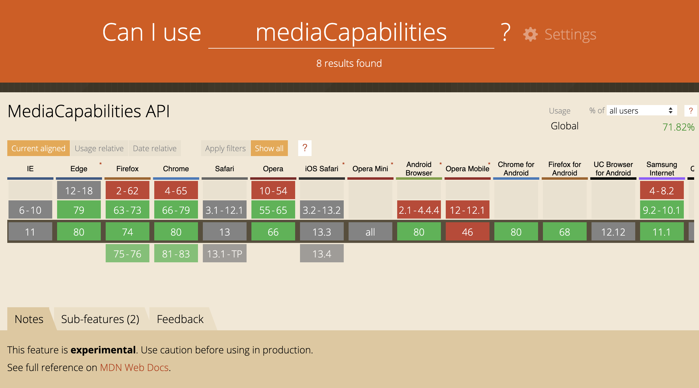
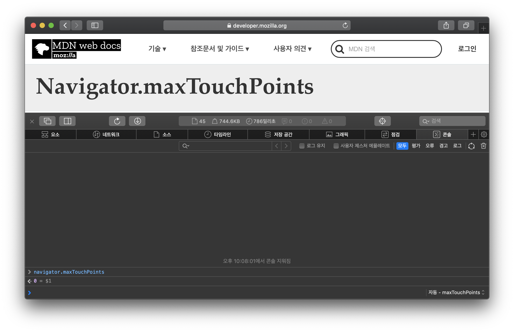
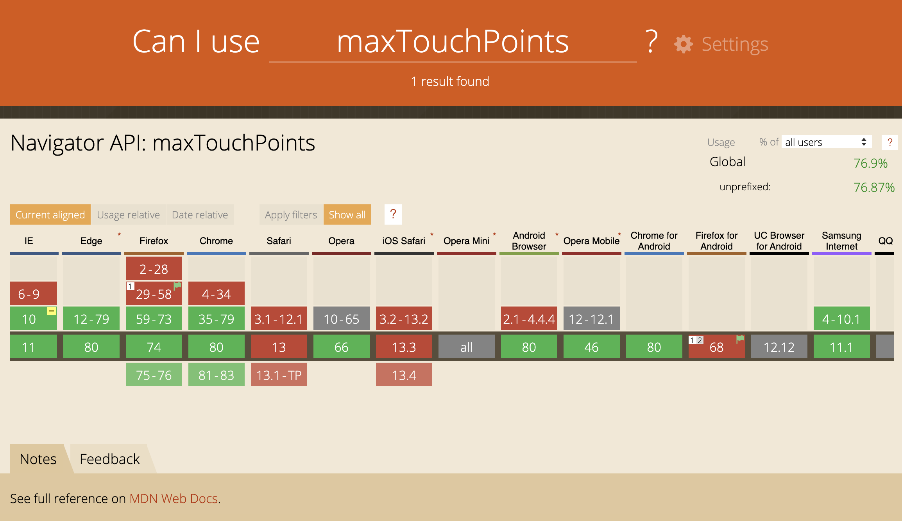
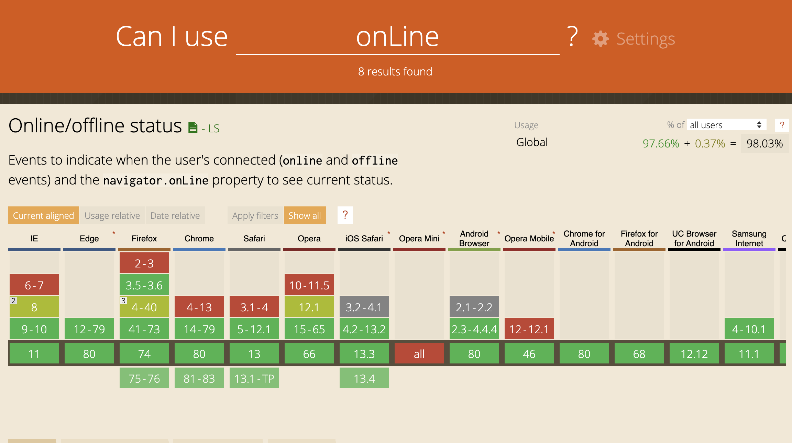
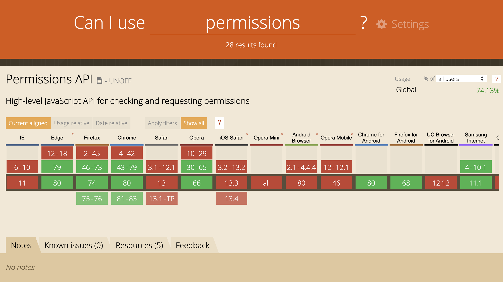

There's no avoiding the `navigator` object in frontend work, so here's a rundown of what its properties actually do.

It holds more than just the well-known User Agent string — plenty of other information about the user's state lives on it too, and every one of its properties is read-only.

## [react-adaptive-hooks](https://github.com/GoogleChromeLabs/react-adaptive-hooks)

ChromeLabs built this set of hooks to surface information about the user's device and network conditions, and under the hood, it's built entirely on properties from the navigator object.

That includes the properties react-adaptive-hooks itself relies on, so between those and a few more, here's what actually counts as a "navigator property worth knowing."

## Before We Start

Some of these properties have pretty spotty browser support, so I've marked each one with a tier based on how widely it's supported.

- 🚨: Deprecated
- ⚠️: Missing support in a handful of browsers
- ✅: Supported almost everywhere, or 100%

## [⚠️ connection](https://developer.mozilla.org/en-US/docs/Web/API/Navigator/connection)

This tells you about the network the user is currently on, and gives you access to the following.

```ts
navigator.connection
---
[Result]
NetworkInformation: {
 onchange: null
 effectiveType: "4g"
 rtt: 100
 downlink: 10
 saveData: false
}
```

- **onchange:** The change event handler on the connection object. Here's how you'd use it.

```js
// Browser Support
const connection = navigator.connection
|| navigator.mozConnection
|| navigator.webkitConnection;

function updateConnectionStatus() {
  alert("Connection bandwidth: " + connection.effectiveType + " MB/s");
}

connection.addEventListener("change", updateConnectionStatus);
updateConnectionStatus();
```



- **effectiveType:** Returns slow-2g, 2g, 3g, or 4g depending on the current connection, based on combining the round-trip time and downlink value from the most recent network activity.
- **rtt:** An estimated round-trip time, rounded to the nearest 25ms.
- **downlink:** An estimated bandwidth, rounded to the nearest 25KB/s and converted into MB.
- **saveData:** Whether the user has data-saving mode turned on.

Here's a before-and-after: starting on a 4g connection, then switching to Fast 3G in Chrome's Network tab. You can watch the effectiveType and downlink values actually change.



### Browser Support

This one is still experimental, so support is limited.



- [Can I use](https://caniuse.com/#search=navigator.connection)

## ✅ [geolocation](https://developer.mozilla.org/en-US/docs/Web/API/Geolocation)

Gives you the user's location, but only once they've granted location access in their device settings.

- [getCurrentPosition](https://developer.mozilla.org/ko/docs/Web/API/Geolocation/getCurrentPosition): Grabs the current location.

```js
navigator.geolocation.getCurrentPosition(function(position) {
  console.log(position);
}, err => console.log(err));

---
[Result]
coords: {
 latitude: longitude
 longitude: latitude
 altitude: altitude
 accuracy: latitude/longitude accuracy
 altitudeAccuracy: accuracy of the altitude
 heading: A number representing the direction of travel. The angle deviated clockwise from true north (true north: 0, east: 90)
 speed: speed
}

timestamp: 1500000000
```

- [watchPosition](https://developer.mozilla.org/ko/docs/Web/API/Geolocation/watchPosition): Fires a callback every time the device's location changes. Used like this.

```js
function success(pos) {
 console.log(pos.coords.latitude, pos.coords.longitude)
}

function error(err) {
  console.warn('ERROR(' + err.code + '): ' + err.message);
}

navigator.geolocation.watchPosition(success, error);
```

> [Can I Use](https://caniuse.com/#search=geolocation)

## 🚨 [getBattery()](https://developer.mozilla.org/en-US/docs/Web/API/Navigator/getBattery)

Info about the device's battery. It returns a Promise, used like this.

```js
navigator.getBattery().then(res => console.log(res))

---
[Result]
charging: true
chargingTime: 0
dischargingTime: Infinity
level: 1
onchargingchange: null
onchargingtimechange: null
ondischargingtimechange: null
onlevelchange: null
```

- **charging:** Whether the device is currently plugged in and charging.
- **chargingTime:** Seconds left until the battery is fully charged. 0 means it's already full.
- **dischargingTime:** Seconds left until the battery fully drains and the system shuts down.
- **level:** Charge level, as a number between 0.0 and 1.0.
- **onchargingchange:** The handler for the [chargingchange](https://developer.mozilla.org/ko/docs/Web/Events/chargingchange) event, which fires whenever the charging state flips. Used like this.

```js
navigator.getBattery().then(battery => {
  battery.addEventListener('chargingchagne', () => {
    console.log('Battery Charging' + battery.charging ? 'yes' : 'no')
  })
})
```

The callback fires every time the charging state changes.

- **ondischargingtimechange, ondischargingtimechange, onlevelchange:** Handlers for the [chargingtimechange](https://developer.mozilla.org/en-US/docs/Web/API/BatteryManager/onchargingtimechange), [dischargingtimechange](https://developer.mozilla.org/en-US/docs/Archive/Events/dischargingtimechange), and [levelchange](https://developer.mozilla.org/en-US/docs/Archive/Events/levelchange) events, respectively.

### DEPRECATED

The `getBattery` API is DEPRECATED and may not work on the latest browsers at all — it got phased out over privacy concerns.



## ✅ [cookieEnabled](https://developer.mozilla.org/en-US/docs/Web/API/Navigator/cookieEnabled)

Tells you whether cookies are enabled. If the user has blocked cookies in their browser settings, this comes back false.

> [Can I use](cookieEnabled)

## ✅ [language](https://developer.mozilla.org/en-US/docs/Web/API/NavigatorLanguage/language)

Returns whatever language is set on the device.



In Chrome, that's whatever sits at the top of "Settings > Languages." Set it to "Korean" and `navigator.language` comes back `ko`; set it to "English (United States)" and you get `en-US`.

> [Can I use](https://caniuse.com/#search=geolocation)

## [⚠️ mediaCapabilities](https://developer.mozilla.org/en-US/docs/Web/API/Navigator/mediaCapabilities)

Tells you whether the device can encode or decode a given media format.

### **encodingInfo**

Only works if the user has turned the feature on. In Chrome, that's a toggle in [settings](chrome://flags/#enable-experimental-web-platform-features).

```js
//Create media configuration to be tested
const mediaConfig = {
    type : 'record', // or 'transmission'
    video : {
        contentType : "video/webm;codecs=vp8.0", // valid content type
        width : 1920,     // width of the video
        height : 1080,    // height of the video
        bitrate : 120000, // number of bits used to encode 1s of video
        framerate : 48   // number of frames making up that 1s.
     }
};

// check support and performance
navigator.mediaCapabilities.encodingInfo(mediaConfig).then(result => {
    console.log('This configuration is ' +
        (result.supported ? '' : 'not ') + 'supported, ' +
        (result.smooth ? '' : 'not ') + 'smooth, and ' +
        (result.powerEfficient ? '' : 'not ') + 'power efficient.')
});
```

With the feature enabled, running the code above logs **"This configuration is supported, not smooth, and not power efficient."**

> Without it enabled, you get an `Uncaught TypeError` instead.

### **decodingInfo**

```js
navigator.mediaCapabilities.decodingInfo({
    type : 'file',
    audio : {
        contentType : "audio/mp3",
        channels : 2,
        bitrate : 132700,
        samplerate : 5200
    }
}).then(function(result) {
  console.log('This configuration is ' +
        (result.supported ? '' : 'not ') + 'supported, ' +
        (result.smooth ? '' : 'not ') + 'smooth, and ' +
        (result.powerEfficient ? '' : 'not ') + 'power efficient.')
});
```

decodingInfo doesn't need any flag turned on. On Chrome 80, running the code above gives **"This configuration is supported, smooth, and power efficient."**

### Browser Support

Still experimental, so only a handful of browsers support it.



> [Can I use](https://caniuse.com/#search=mediaCapabilities)

## [⚠️ maxTouchPoints](https://developer.mozilla.org/en-US/docs/Web/API/Navigator/maxTouchPoints)

Returns how many points the device can register as simultaneous touches. It goes by [TouchEvent](https://developer.mozilla.org/en-US/docs/Web/API/TouchEvent), so on a PC, Chrome returns 0 in desktop mode and 1 in mobile mode.

You can try this yourself on [CodePen](https://codepen.io/soyoung210/pen/GRJPoaV).

```js
// PC - Desktop mode
navigator.maxTouchPoints // result: 0

// PC - Mobile mode
navigator.maxTouchPoints // result: 1

// Mobile Device - iPhoneX
navigator.maxTouchPoints // result: 5
```

### Browser Support

[Can I use](https://caniuse.com/#feat=mdn-api_navigator_maxtouchpoints) lists some limitations on Safari, but in my testing it works just fine there.




## [✅ onLine](https://developer.mozilla.org/en-US/docs/Web/API/NavigatorOnLine/onLine)

Returns whether the device is currently online.

```js
// Internet connected
navigator.onLine //true

// Internet disconnected
navigator.onLine // false
```

### Browser Support

Works in most browsers, with some limitations on IE8.



> [Can I use](https://caniuse.com/#search=onLine)

## [⚠️ permissions](https://developer.mozilla.org/en-US/docs/Web/API/Navigator/permissions)

Lets you check the permission status for anything that needs the user's OK — push notifications, location, and the like.

```js
navigator.permissions.query({name: 'geolocation'})
  .then(res => {
    if (res.state === 'granted') {
      console.log('Got permission!')
    } else if (res.state === 'prompt') {
      console.log('Permission has never been requested.');
    }
  })
```

There are three possible states. ([docs](https://developer.mozilla.org/en-US/docs/Web/API/PermissionStatus))

- **granted:** Permission's been given
- **prompt:** Never been asked yet
- **denied:** Explicitly blocked

`query` takes a PermissionDescriptor argument, made up of three fields.

- **name:** The permission's official name. You can find the full list [here](https://w3c.github.io/permissions/#enumdef-permissionname).
- **userVisibleOnly:** (push notifications only)
- **sysex**

### Browser Support



> [Can I use](https://caniuse.com/#feat=permissions-api)

## [✅ platform](https://developer.mozilla.org/en-US/docs/Web/API/NavigatorID/platform)

Returns what platform it's running on. On a MacBook Pro that's `MacIntel`; here are the common values.

- HP-UX
- Linux i686
- Linux armv7l
- Mac68K
- MacPPC
- MacIntel
- SunOS
- Win16
- Win32
- WinCE

> [Can I use](https://caniuse.com/#feat=mdn-api_navigatorid_platform)

## [✅ plugins](https://developer.mozilla.org/en-US/docs/Web/API/NavigatorPlugins/plugins)

A list of whatever plugins the browser supports. Here's what it looks like in Chrome.

```js
navigator.mimeTypes

---
[Result]
0: {
 0: MimeType,
 application/x-google-chrome-pdf: MimeType,
 name: "Chrome PDF Plugin",
 filename: "internal-pdf-viewer",
 description: "Portable Document Format",
 length: 1
}
1: {
 0: MimeType,
 application/pdf: MimeType,
 name: "Chrome PDF Viewer",
 filename: "mhjfbmdgcfjbbpaeojofohoefgiehjai",
 description: "",
 length: 1
}
2: {
 0: MimeType,
 1: MimeType,
 ...
```

You can check whether a specific plugin is installed with the `namedItem` method.

```js
function getFlashVersion() {
  var flash = navigator.plugins.namedItem('Shockwave Flash');
  if (typeof flash != 'object') {
    // flash is not present
    return undefined;
  }
  if(flash.version){
    return flash.version;
  } else {
    //No version property (e.g. in Chrome)
    return flash.description.replace(/Shockwave Flash /,"");
  }
}
```

> [Can I use](https://caniuse.com/#search=plugins)

## [✅ storage](https://developer.mozilla.org/en-US/docs/Web/API/StorageManager)

Returns a [StorageManager](https://developer.mozilla.org/en-US/docs/Web/API/StorageManager) object, which supports three methods.

- **[estimate](https://developer.mozilla.org/en-US/docs/Web/API/StorageManager/estimate):** Tells you the current page's available storage and how much of it is used. It's async — here's an example.

```js
// https://twitter.com
navigator.storage.estimate().then(
 res => console.log(res)
)

---
[Result]
quota: 150411345100
usage: 18873830
usageDetails: {
 caches: 18312960,
 indexedDB: 413132,
 serviceWorkerRegistrations: 147738
}
```

- **[persist](https://developer.mozilla.org/en-US/docs/Web/API/StorageManager/persist):** Lets storage persist for pages that meet all of the following.
  - Bookmarked
  - Scores high on [chrome://site-engagement/](//site-engagement/)
  - Added to the home screen
  - Has push notifications enabled

> [Can I use](https://caniuse.com/#feat=mdn-api_storage)

## [✅ userAgent](https://developer.mozilla.org/en-US/docs/Web/API/NavigatorID/userAgent)

Holds the browser's name, version, and platform. Every request sent to a server carries a `User-Agent` (UA from here on) HTTP header — the so-called userAgent string — packed with details like browser type, version number, and host OS.

Here's what `navigator.userAgent` actually looks like across a few environments.
<details>
<summary><b>Mac, Chrome</b></summary>
<ul>
<li><b>Result:</b> Mozilla/5.0 (Macintosh; Intel Mac OS X 10_14_6) AppleWebKit/537.36 (KHTML, like Gecko) Chrome/80.0.3987.87 Safari/537.36
</li>
<li>👉 In other words: Chrome 80.0.3987.87, running Gecko-flavored KHTML on Mac OS X 10.14.6, compatible with AppleWebKit and Safari 537.36.
</li>
</ul>
</details>

<details>
<summary><b>Mac, Safari</b></summary>
<ul>
<li><b>Result:</b> Mozilla/5.0 (Macintosh; Intel Mac OS X 10_14_6) AppleWebKit/605.1.15 (KHTML, like Gecko) Version/13.0.5 Safari/605.1.15
</li>
</ul>
</details>

<details>
<summary><b>Windows10, Edge</b></summary>
<ul>
<li><b>Result:</b> Mozilla/5.0 (Windows NT 10.0; Win64; x64) AppleWebKit/537.36 (KHTML, like Gecko) Chrome/70.0.3538.102 Safari/537.36 Edge/18.1836
</li>
</ul>
</details>

<details>
<summary><b>Windows10, IE11</b></summary>
<ul>
<li><b>Result:</b>  Mozilla/5.0 (Windows NT 10.0; WOW64; Trident/7.0; .NET4.0C; .NET4.0E; Tablet PC 2.0; rv:11.0) like Gecko
</li>
</ul>
</details>

<details>
<summary><b>iPhone X, Chrome</b></summary>
<ul>
<li><b>Result:</b> Mozilla/5.0 (iPhone; CPU iPhone OS 13_2_3 like Mac OS X) AppleWebKit/605.1.15 (KHTML, like Gecko) Version/13.0.3 Mobile/15E148 Safari/604.
</li>
<li>
👉 Mobile devices carry strings like `iphone`, `ipod`, or `android` somewhere in there.
</li>
</ul>
</details>
<br/>

<details>
<summary style="color: gray; font-weight:bold">So why does every UA start with 'Mozilla/version'?</summary>
<p style="color: gray;">Back when Netscape Navigator and IE were the only browsers around, Netscape expressed its version as <b>'Mozilla/version'</b>. Other browsers later tacked Mozilla/version onto their own userAgent strings just to signal compatibility with a given Netscape version (even though they weren't actually built on it). That's the whole reason so many browsers still start their userAgent with <b>'Mozilla/version'</b> today.</p>
</details>
<br/>

Starting with Chrome 81, `UA` is being phased out step by step — advertisers using it to track site visitors, and browser support built on parsing this string, both turned out to cause plenty of problems.

Going forward, Chrome won't reveal things like whether a user is on Windows 7 or on a specific device. Here's the rollout plan for phasing UA out.

> "On top of those privacy issues, User-Agent sniffing is an abundant source of compatibility issues, in particular for minority browsers, resulting in browsers lying about themselves (generally or to specific sites), and sites (including Google properties) being broken in some browsers for no good reason," - Yoav Weiss, Google Engineer-

- **Chrome 81** (mid-March 2020) - Logs a console warning telling developers to update any code that relies on UA.
- **Chrome 83** (early June 2020) - Stops updating the Chrome version baked into UA and folds the OS version into a shared value.
- **Chrome 85** (mid-September 2020) - Unifies desktop OS info, and OS/device info generally, into shared values.

### Client Hints

UA is being replaced by a new spec called [Client Hints](https://wicg.github.io/ua-client-hints/). You opt in either with an `Accept-CH` request header, or a `meta tag`.

- **request header:** Accept-CH: UA-Full-Version, UA-Platform, UA-Arch
- **meta tag:**

```html
<meta http-equiv="Accept-CH" content="DPR, Width, Viewport-Width, Downlink">
```

- There's also an Accept-CH-Lifetime option that controls how long Accept-CH stays valid.

You request information through either the header or the meta tag, comma-separated. Here's everything the browser can hand back.

- **Browser brand** (for example: "Chrome", "Edge", "The World's Best Web Browser")
- **Browser major version** (for example: "72", "3", or "28")
- **Browser minor version** (for example: "72.0.3245.12", "3.14159", or "297.70E04154A")
- **OS brand and version** (for example: "Windows NT 6.0", "iOS 15", or "AmazingOS 17G")
- **CPU architecture** (for example: "ARM64", or "ia32")
- **Mobile device model name** (for example: "", or "Pixel 2 XL")
- **Whether it's a mobile browser** (for example: ?0 or ?1)

**Example**

By default, the browser sends back this much.

```js
User-Agent: Mozilla/5.0 (Windows NT 10.0; Win64; x64) AppleWebKit/537.36 (KHTML, like Gecko)
            Chrome/71.1.2222.33 Safari/537.36  
Sec-CH-UA: "Chrome"; v="74"  
Sec-CH-Mobile: ?0
```

You can ask for more, like this

```js
    Accept-CH: UA-Full-Version, UA-Platform, UA-Arch
```

and get back values like these.

```js
Sec-CH-UA: "Chrome"; v="74"
Sec-CH-UA-Full-Version: "74.0.3424.124"
Sec-CH-UA-Platform: "macOS"
Sec-CH-UA-Arch: "ARM64"
```

> [Can I use](https://caniuse.com/#search=geolocation)

## Wrap-up

Going through all of navigator's properties, I realized the web can do a lot more than I gave it credit for. Even a rough sense of what's built into the browser like this seems like it'll come in handy more often than you'd expect.

## Ref

- [https://b.limminho.com/archives/1384](https://b.limminho.com/archives/1384)
- [https://wicg.github.io/ua-client-hints/](https://wicg.github.io/ua-client-hints/)
- [https://www.zdnet.com/article/google-to-phase-out-user-agent-strings-in-chrome/](https://www.zdnet.com/article/google-to-phase-out-user-agent-strings-in-chrome/)
- [https://medium.com/@pakss328/http-client-hint-accept-ch-45c62b393867](https://medium.com/@pakss328/http-client-hint-accept-ch-45c62b393867)
- [https://developers.google.com/web/fundamentals/performance/optimizing-content-efficiency/client-hints](https://developers.google.com/web/fundamentals/performance/optimizing-content-efficiency/client-hints)
- [https://github.com/WICG/ua-client-hints](https://github.com/WICG/ua-client-hints)
