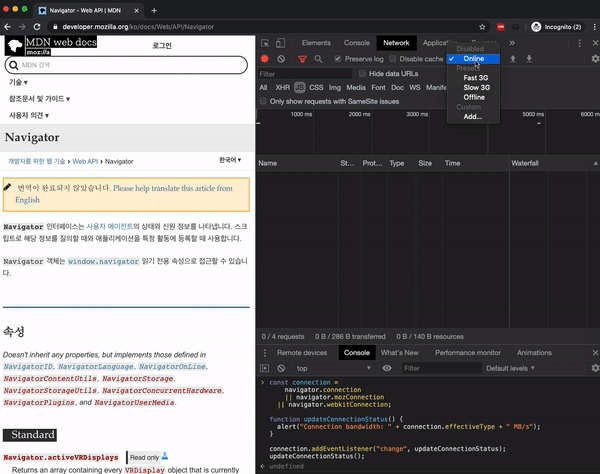
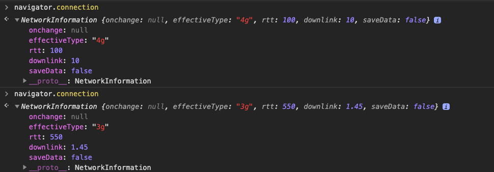
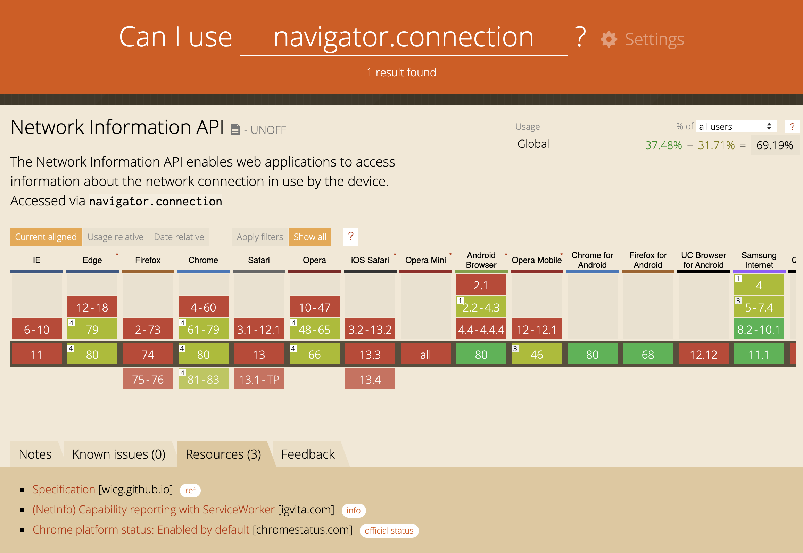
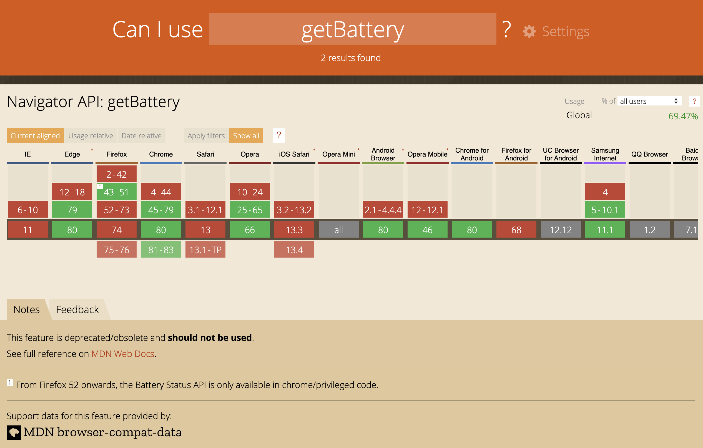
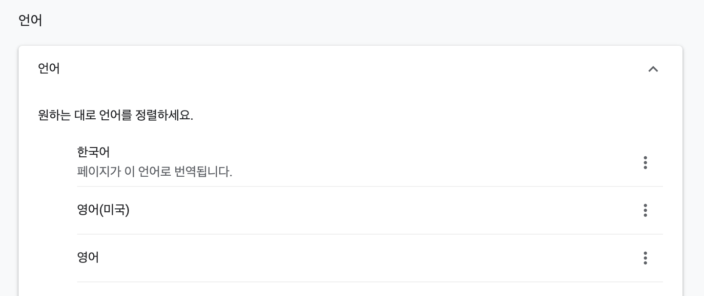
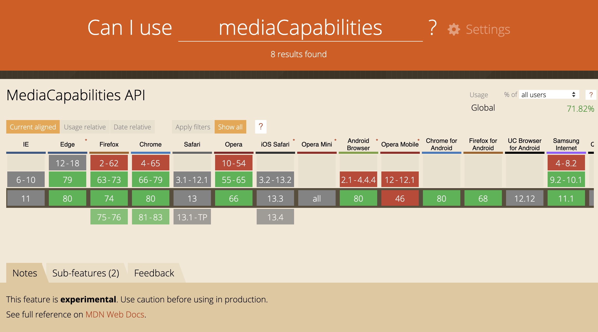
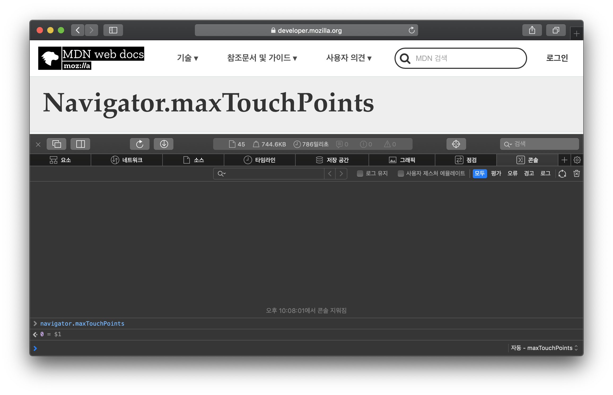
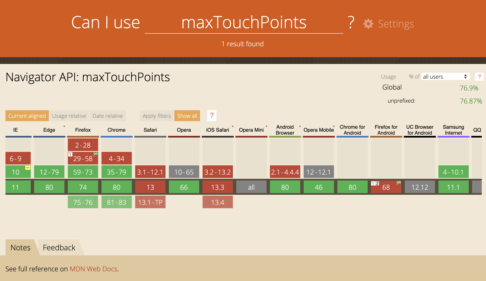
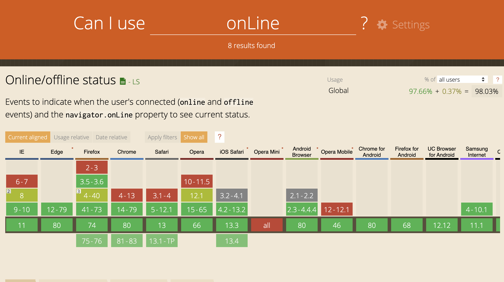
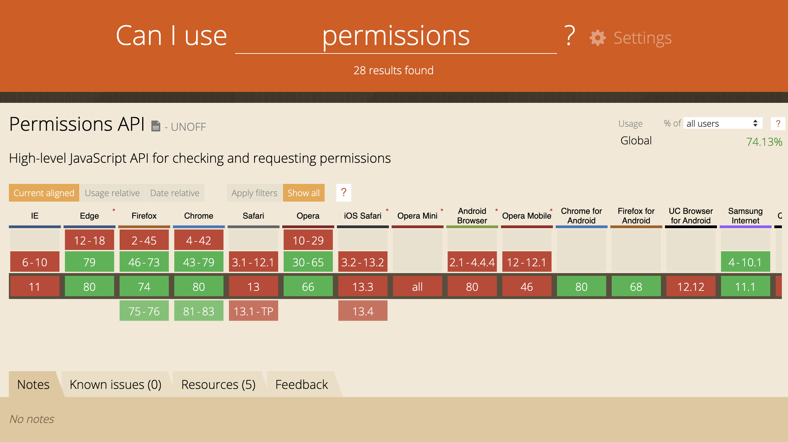

프런트엔드 개발에서 `navigator` 객체에 대한 사용을 빼놓을 수 없습니다. 이 포스팅에서는 navigator객체의 여러 가지 속성들에 대해 살펴봅니다.

`navigator` 객체는 대표적인 User Agent뿐만 아니라 사용자의 상태에 관한 여러가지 정보를 담고 있습니다. navigator의 속성들은 읽기 전용으로 접근할 수 있습니다.

## [react-adaptive-hooks](https://github.com/GoogleChromeLabs/react-adaptive-hooks)

ChromeLabs에서 제작한 사용자 디바이스 및 네트워크 환경에 대한 정보를 담은 hooks입니다. 이 hooks 코드는 navigator객체의 여러 속성을 이용해서 제작되었습니다.

이 글에서는 react-adaptive-hooks에서 사용하는 속성들을 포함하여 '알아두면 쓸모 있는 navigator 속성'에는 어떤 것들이 있는지 살펴봅니다.

## 들어가기 전에

일부 속성들은 브라우저 지원 범위가 매우 제한적입니다. 지원 범위에 따라 세 단계로 나누어 표현했습니다.

- 🚨: Deprecated
- ⚠️: 몇 개의 브라우저에서 지원하지 않음
- ✅: 대부분의 브라우저에서 지원하거나, 100% 지원

## [⚠️ connection](https://developer.mozilla.org/en-US/docs/Web/API/Navigator/connection)

사용자가 사용하고 있는 네트워크 환경에 대한 정보를 제공하며, 아래와 같은 정보들을 확인할 수 있습니다.

```ts
navigator.connection
---
[결과]
NetworkInformation: {
 onchange: null
 effectiveType: "4g"
 rtt: 100
 downlink: 10
 saveData: false
}
```

- **onchange:** connection 객체의 change 이벤트 핸들러입니다. 다음과 같이 사용할 수 있습니다.

```js
// Browser Support
const connection = navigator.connection
|| navigator.mozConnection
|| navigator.webkitConnection;

function updateConnectionStatus() {
  alert("Connection bandwidth: " + connection.effectiveType + " MB/s");
}

connection.addEventListener("change", updateConnectionStatus);
updateConnectionStatus();
```



- **effectiveType:** 연결된 네트워크 상황에 따라 slow-2g, 2g, 3g, 4g 값 중 하나를 반환합니다. 가장 최근 네트워크 통신에서의 round-trip 값과 downlink값을 조합하여 판단합니다.
- **rtt:** round-trip추정치 입니다. 25ms 배수 단위에서 반올림하여 표현합니다.
- **downlink:** 대역폭 추정치입니다. 초당 25KB의 배수로 반올림 후  MB(Mega Bytes)로 변환합니다.
- **saveData:** 사용자가 '배터리 절약 모드'를 사용하고 있는지 여부입니다.

아래 사진은 4g network에 연결되어 있다가 Chrome Network탭에서 Fast 3G로 적용한 뒤의 사진입니다. 실제로 effectiveType과 downlink값이 변한 것을 확인 할 수 있습니다.



### 브라우저 지원 범위

이 기능은 현재 실험 단계에 있어, 브라우저 지원 범위가 제한적 입니다.



- [Can I use](https://caniuse.com/#search=navigator.connection)

## ✅ [geolocation](https://developer.mozilla.org/en-US/docs/Web/API/Geolocation)

사용자의 위치 정보에 대한 속성입니다. 사용자가 디바이스 설정에서 위치 정보에 대한 접근 권한을 허용한 경우에만 사용 가능합니다.

- [getCurrentPosition](https://developer.mozilla.org/ko/docs/Web/API/Geolocation/getCurrentPosition): 현재 위치 정보를 가져올 수 있습니다.

```js
navigator.geolocation.getCurrentPosition(function(position) {
  console.log(position);
}, err => console.log(err));

---
[결과]
coords: {
 latitude: 경도
 longitude: 위도
 altitude: 고도
 accuracy: 위, 경도 정확도
 altitudeAccuracy: 고도의 정확도
 heading: 움직이는 방향을 나타내는 숫자. 정북에서 시계방향으로 벗어난 각의 크기(정북:0, 동쪽: 90)
 speed: 속도
}

timestamp: 1500000000
```

- [watchPosition](https://developer.mozilla.org/ko/docs/Web/API/Geolocation/watchPosition): 디바이스의 위치가 바뀔 때마다 callback함수가 실행됩니다. 다음과 같이 사용할 수 있습니다.

```js
function success(pos) {
 console.log(pos.coords.latitude, pos.coords.longitude)
}

function error(err) {
  console.warn('ERROR(' + err.code + '): ' + err.message);
}

navigator.geolocation.watchPosition(success, error);
```

> [Can I Use](https://caniuse.com/#search=geolocation)

## 🚨 [getBattery()](https://developer.mozilla.org/en-US/docs/Web/API/Navigator/getBattery)

디바이스 배터리에 대한 정보입니다. 이 함수는 Promise를 반환하며, 아래와 같이 사용할 수 있습니다.

```js
navigator.getBattery().then(res => console.log(res))

---
[결과]
charging: true
chargingTime: 0
dischargingTime: Infinity
level: 1
onchargingchange: null
onchargingtimechange: null
ondischargingtimechange: null
onlevelchange: null
```

- **charging:** 현재 디바이스가 충전 중인지 여부를 나타냅니다.
- **chargingTime:** 배터리가 완전히 충전되기까지 남은 시간을 초로 표현합니다. 0이라면 충전이 완료된 상태입니다.
- **dischargingTime:** 배터리가 완전히 방전되고 시스템이 중지될 때까지의 남은 시간을 초로 표현합니다.
- **level:** 충전 상태를 0.0에서 1.0 사이의 값으로 표현합니다.
- **onchargingchange:** [chargingchange](https://developer.mozilla.org/ko/docs/Web/Events/chargingchange)이벤트 핸들러입니다. 이 이벤트는 배터리 충전 상태가 변경될 때 발생합니다. 아래와 같이 사용할 수 있습니다.

```js
navigator.getBattery().then(battery => {
  battery.addEventListener('chargingchagne', () => {
    console.log('Battery Charging' + battery.charging ? 'yes' : 'no')
  })
})
```

배터리 충전 상태가 변할 때마다 callback함수가 실행됩니다.

- **ondischargingtimechange, ondischargingtimechange, onlevelchange:** 각각 [chargingtimechange](https://developer.mozilla.org/en-US/docs/Web/API/BatteryManager/onchargingtimechange), [dischargingtimechange](https://developer.mozilla.org/en-US/docs/Archive/Events/dischargingtimechange), [levelchange](https://developer.mozilla.org/en-US/docs/Archive/Events/levelchange)의 이벤트 핸들러입니다.

### DEPRECATED

`getBattery` API는 DEPRECATED되었으며, 최신 버전 브라우저에서 동작하지 않을 수 있습니다. 개인정보 보호 정책으로 사용하지 않는 방향으로 결정되었습니다.



## ✅ [cookieEnabled](https://developer.mozilla.org/en-US/docs/Web/API/Navigator/cookieEnabled)

쿠키 사용 가능 여부를 나타냅니다. 사용자가 브라우저 환경에서 '쿠키 차단'을 설정했을 경우  이 값은 false입니다.

> [Can I use](cookieEnabled)

## ✅ [language](https://developer.mozilla.org/en-US/docs/Web/API/NavigatorLanguage/language)

디바이스에 설정된 언어 정보를 반환합니다.



크롬의 경우 '설정 > 언어'에서 제일 상단에 설정된 언어 기준이며, '한국어'로 설정된 경우 navigator.language값은 `ko` 이며, '영어(미국)'로 설정된 경우에는 `en-US` 입니다.

> [Can I use](https://caniuse.com/#search=geolocation)

## [⚠️ mediaCapabilities](https://developer.mozilla.org/en-US/docs/Web/API/Navigator/mediaCapabilities)

주어진 포맷에 대해 디바이스의 인코딩, 디코딩 가능 여부에 관한 정보를 반환합니다.

### **encodingInfo**

사용자가 기능을 활성화한 경우에만 사용할 수 있으며, 크롬의 경우 [설정](chrome://flags/#enable-experimental-web-platform-features)에서 변경할 수 있습니다.

```js
//Create media configuration to be tested
const mediaConfig = {
    type : 'record', // or 'transmission'
    video : {
        contentType : "video/webm;codecs=vp8.0", // valid content type
        width : 1920,     // width of the video
        height : 1080,    // height of the video
        bitrate : 120000, // number of bits used to encode 1s of video
        framerate : 48   // number of frames making up that 1s.
     }
};

// check support and performance
navigator.mediaCapabilities.encodingInfo(mediaConfig).then(result => {
    console.log('This configuration is ' +
        (result.supported ? '' : 'not ') + 'supported, ' +
        (result.smooth ? '' : 'not ') + 'smooth, and ' +
        (result.powerEfficient ? '' : 'not ') + 'power efficient.')
});
```

기능을 활성화한 후 위 코드를 실행하면 **"This configuration is supported, not smooth, and not power efficient."** 결과를 확인할 수 있습니다.

> 활성화하지 않은 경우에는, `Uncaught TypeError` 가 발생합니다.

### **decodingInfo**

```js
navigator.mediaCapabilities.decodingInfo({
    type : 'file',
    audio : {
        contentType : "audio/mp3",
        channels : 2,
        bitrate : 132700,
        samplerate : 5200
    }
}).then(function(result) {
  console.log('This configuration is ' +
        (result.supported ? '' : 'not ') + 'supported, ' +
        (result.smooth ? '' : 'not ') + 'smooth, and ' +
        (result.powerEfficient ? '' : 'not ') + 'power efficient.')
});
```

decodingInfo는 별도의 기능 활성화가 필요 없습니다. Chrome80 기준으로 위 코드의 실행 결과는 **"This configuration is supported, smooth, and power efficient."** 입니다.

### 브라우저 지원 범위

이 기능은 아직 실험 단계이므로, 일부 브라우저에서만 지원됩니다.



> [Can I use](https://caniuse.com/#search=mediaCapabilities)

## [⚠️ maxTouchPoints](https://developer.mozilla.org/en-US/docs/Web/API/Navigator/maxTouchPoints)

디바이스에서 동시에 터치할 수 있는 지점이 몇 개인지 반환합니다. [TouchEvent](https://developer.mozilla.org/en-US/docs/Web/API/TouchEvent)를 기준으로 하므로, PC에서 크롬을 데스크탑 모드로 설정했을 경우에는 0, 모바일 모드로 설정한 경우는 1을 반환합니다.

[CodePen](https://codepen.io/soyoung210/pen/GRJPoaV)에서 테스트해 보실 수 있습니다.

```js
// PC - Desktop모드
navigator.maxTouchPoints // result: 0

// PC - Mobile모드
navigator.maxTouchPoints // result: 1

// Mobile Device - iPhoneX
navigator.maxTouchPoints // result: 5
```

### 브라우저 지원 범위

[Can I use](https://caniuse.com/#feat=mdn-api_navigator_maxtouchpoints)에서는 Safari에서 제약이 있다고 하지만, 실제로는 잘 동작합니다.




## [✅ onLine](https://developer.mozilla.org/en-US/docs/Web/API/NavigatorOnLine/onLine)

디바이스가 현재 인터넷에 연결되어 있는지 여부를 반환합니다.

```js
// 인터넷 연결
navigator.onLine //true

// 인터넷 연결 끊김
navigator.onLine // false
```

### 브라우저 지원 범위

대부분의 브라우저에서 사용할 수 있지만, IE8에서는 제약이 있습니다.



> [Can I use](https://caniuse.com/#search=onLine)

## [⚠️ permissions](https://developer.mozilla.org/en-US/docs/Web/API/Navigator/permissions)

사용자로부터 권한을 얻어야 하는 기능들(푸쉬 노티, 위치정보 등)에 대한 권한 설정 상태를 조회할 수 있습니다.

```js
navigator.permissions.query({name: 'geolocation'})
  .then(res => {
    if (res.state === 'granted') {
      console.log('권한을 얻었어요!')
    } else if (res.state === 'prompt') {
      console.log('권한 요청을 한번도 요청한적 없어요.');
    }
  })
```

권한의 상태는 세 가지입니다. ([문서](https://developer.mozilla.org/en-US/docs/Web/API/PermissionStatus))

- **granted:** 권한을 얻은 상태
- **prompt:** 사용자에게 권한을 요청한 적 없는 상태
- **denied:** 명시적으로 차단한 경우

`query` 의 인자로 PermissionDescriptor를 받고, 이 속성은 세 가지 요소로 구성됩니다.

- **name:** 약속된 권한의 이름입니다. 권한 이름 목록은 [여기](https://w3c.github.io/permissions/#enumdef-permissionname)에서 확인할 수 있습니다.
- **userVisibleOnly:** (푸쉬 노티 전용)
- **sysex**

### 브라우저 지원 범위



> [Can I use](https://caniuse.com/#feat=permissions-api)

## [✅ platform](https://developer.mozilla.org/en-US/docs/Web/API/NavigatorID/platform)

운영되고 있는 플랫폼에 대한 정보를 반환합니다. 맥북 프로에서는 `MacIntel`이고, 대표적인 값들은 다음과 같습니다.

- HP-UX
- Linux i686
- Linux armv7l
- Mac68K
- MacPPC
- MacIntel
- SunOS
- Win16
- Win32
- WinCE

> [Can I use](https://caniuse.com/#feat=mdn-api_navigatorid_platform)

## [✅ plugins](https://developer.mozilla.org/en-US/docs/Web/API/NavigatorPlugins/plugins)

브라우저에서 지원하는 여러가지 플러그인 목록입니다. Chrome에서 조회하면 아래 결과를 확인할 수 있습니다.

```js
navigator.mimeTypes

---
[결과]
0: {
 0: MimeType,
 application/x-google-chrome-pdf: MimeType,
 name: "Chrome PDF Plugin",
 filename: "internal-pdf-viewer",
 description: "Portable Document Format",
 length: 1
}
1: {
 0: MimeType,
 application/pdf: MimeType,
 name: "Chrome PDF Viewer",
 filename: "mhjfbmdgcfjbbpaeojofohoefgiehjai",
 description: "",
 length: 1
}
2: {
 0: MimeType,
 1: MimeType,
 ...
```

`namedItem` 메서드를 사용해서 특정 플러그인이 설치되어 있는지 확인할 수 있습니다.

```js
function getFlashVersion() {
  var flash = navigator.plugins.namedItem('Shockwave Flash');
  if (typeof flash != 'object') {
    // flash is not present
    return undefined;
  }
  if(flash.version){
    return flash.version;
  } else {
    //No version property (e.g. in Chrome)
    return flash.description.replace(/Shockwave Flash /,"");
  }
}
```

> [Can I use](https://caniuse.com/#search=plugins)

## [✅ storage](https://developer.mozilla.org/en-US/docs/Web/API/StorageManager)

[StorageManager](https://developer.mozilla.org/en-US/docs/Web/API/StorageManager)객체를 반환합니다. Storage Manager는 세 가지 메서드를 지원합니다.

- **[estimate](https://developer.mozilla.org/en-US/docs/Web/API/StorageManager/estimate):** 현재 페이지의 storage사용 가능 공간과 사용량을 알 수 있습니다. 이 메서드는 비동기로 동작합니다. 사용 예시는 다음과 같습니다.

```js
// https://twitter.com
navigator.storage.estimate().then(
 res => console.log(res)
)

---
[결과]
quota: 150411345100
usage: 18873830
usageDetails: {
 caches: 18312960,
 indexedDB: 413132,
 serviceWorkerRegistrations: 147738
}
```

- **[persist](https://developer.mozilla.org/en-US/docs/Web/API/StorageManager/persist):** 아래 조건을 만족하는 페이지에 대해 storage를 영속적으로 저장할 수 있습니다.
  - 북마크에 등록되어 있음
  - [chrome://site-engagement/](//site-engagement/) 에서 점수가 높음
  - 홈 화면에 추가되어 있음
  - 푸시알람이 활성화되어 있음

> [Can I use](https://caniuse.com/#feat=mdn-api_storage)

## [✅ userAgent](https://developer.mozilla.org/en-US/docs/Web/API/NavigatorID/userAgent)

브라우저의 이름, 버전 및 플랫폼 정보를 담고 있습니다. 서버에 보내는 모든 요청에 userAgent 문자열 이라고 부르는 `User-Agent`(이하 UA) HTTP 헤더를 보냅니다. 이 문자열은 브라우저 종류, 버전 번호, 호스트 운영체제 등의 정보를 포함합니다.

여러가지 환경에서 `navigator.userAgent` 정보를 확인하면 다음과 같습니다.
<details>
<summary><b>Mac, Chrome</b></summary>
<ul>
<li><b>결과:</b> Mozilla/5.0 (Macintosh; Intel Mac OS X 10_14_6) AppleWebKit/537.36 (KHTML, like Gecko) Chrome/80.0.3987.87 Safari/537.36
</li>
<li>👉 Mac OS X 10.14.6버전의 Gecko같은 KHTML을 사용하는 크롬  80.0.3987.87 버전이며 AppleWebkit 및 Safari537.36버전과 호환되는 브라우저라는 뜻입니다.
</li>
</ul>
</details>

<details>
<summary><b>Mac, Safari</b></summary>
<ul>
<li><b>결과:</b> Mozilla/5.0 (Macintosh; Intel Mac OS X 10_14_6) AppleWebKit/605.1.15 (KHTML, like Gecko) Version/13.0.5 Safari/605.1.15
</li>
</ul>
</details>

<details>
<summary><b>Windows10, Edge</b></summary>
<ul>
<li><b>결과:</b> Mozilla/5.0 (Windows NT 10.0; Win64; x64) AppleWebKit/537.36 (KHTML, like Gecko) Chrome/70.0.3538.102 Safari/537.36 Edge/18.1836
</li>
</ul>
</details>

<details>
<summary><b>Windows10, IE11</b></summary>
<ul>
<li><b>결과:</b>  Mozilla/5.0 (Windows NT 10.0; WOW64; Trident/7.0; .NET4.0C; .NET4.0E; Tablet PC 2.0; rv:11.0) like Gecko
</li>
</ul>
</details>

<details>
<summary><b>iPhone X, Chrome</b></summary>
<ul>
<li><b>결과:</b> Mozilla/5.0 (iPhone; CPU iPhone OS 13_2_3 like Mac OS X) AppleWebKit/605.1.15 (KHTML, like Gecko) Version/13.0.3 Mobile/15E148 Safari/604.
</li>
<li>
👉모바일 디바이스는 `iphone`, `ipod`, `android`등의 문자열을 포함하고 있습니다.
</li>
</ul>
</details>
<br/>

<details>
<summary style="color: gray; font-weight:bold">왜 모든 UA에는 'Mozilla/version'이 있을까?</summary>
<p style="color: gray;">Nescape Navigator와 IE만 존재하던 시절, Netscape 브라우저는 <b>'Mozilla/version'</b>과 같은 방식으로 버전을 표현하였고, 이후 다른 브라우저들이 Netscape 브라우저의 특정 버전과 호환된다는 의미로 userAgent정보에 Mozilla/version을 추가했습니다. (실제로는 해당 버전 기반이 아닙니다.) 오늘날 많은 브라우저에서 userAgent가 <b>'Mozilla/version'</b>으로 시작하는 이유입니다.</p>
</details>
<br/>

`UA`는 Chrome81버전부터 단계적으로 지원을 중단할 계획입니다. 광고주가 웹 사이트 방문자를 추적하거나 문자열 파싱에 기반한 브라우저 지원은 여러 가지 문제를 낳았기 때문입니다.

앞으로의 계획은 Chrome을 사용하는 유저가 Windows 7에서 사용하는지, 특정 디바이스에서 사용 중인지에 대한 정보를 제공하지 않는 것입니다. UA에 대한 단계적 지원 중단 계획은 다음과 같습니다.

> "On top of those privacy issues, User-Agent sniffing is an abundant source of compatibility issues, in particular for minority browsers, resulting in browsers lying about themselves (generally or to specific sites), and sites (including Google properties) being broken in some browsers for no good reason," - Yoav Weiss, Google Engineer-

- **Chrome 81** (2020년 3월 중순) - console에 경고를 표시하여, UA를 사용하는 코드를 변경해야 한다는 점을 알립니다.
- **Chrome 83** (2020년 6월 초) - UA에 포함되는 Chrome브라우저 버전을 더이상 업데이트하지 않고 OS버전을 통합시킵니다.
- **Chrome 85** (2020년 9월 중순) - 데스크탑 OS정보를 공통 값으로 통일합니다. OS/기기 정보를 공통 값으로 통일합니다.

### Client Hints

UA는 [Client Hints](https://wicg.github.io/ua-client-hints/)라는 새로운 스펙으로 대체됩니다. `Accept-CH`라는 request header를 명시해주거나 `meta tag` 를 사용해야 합니다.

- **request header:** Accept-CH: UA-Full-Version, UA-Platform, UA-Arch
- **meta tag:**

```html
<meta http-equiv="Accept-CH" content="DPR, Width, Viewport-Width, Downlink">
```

- Accept-CH의 유효시간을 설정해주는 Accept-CH-Lifetime 옵션도 있습니다.

정보를 요청하는 방식은 request header혹은 meta tag를 통해 표현하며 comma로 구분합니다. 브라우저가 제공할 수 있는 정보의 목록은 다음과 같습니다.

- **브라우저 브랜드**(for example: "Chrome", "Edge", "The World’s Best Web Browser")
- **브라우저 메이저 버저닝** (for example: "72", "3", or "28")
- **브라우저 마이너 버저닝** (for example: "72.0.3245.12", "3.14159", or "297.70E04154A")
- **OS 브랜드와 버저닝** (for example: "Windows NT 6.0", "iOS 15", or "AmazingOS 17G")
- **CPU 아키텍쳐** (for example: "ARM64", or "ia32")
- **모바일 기기의 모델명** (for example: "", or "Pixel 2 XL")
- **모바일 브라우저 여부** (for example: ?0 or ?1)

**Example**

기본적으로 브라우저는 다음 정보들을 반환합니다.

```js
User-Agent: Mozilla/5.0 (Windows NT 10.0; Win64; x64) AppleWebKit/537.36 (KHTML, like Gecko)
            Chrome/71.1.2222.33 Safari/537.36  
Sec-CH-UA: "Chrome"; v="74"  
Sec-CH-Mobile: ?0
```

추가적인 정보는 다음과 같이 요청할 수 있으며

```js
    Accept-CH: UA-Full-Version, UA-Platform, UA-Arch
```

위 헤더를 보고 반환한 값은 다음과 같습니다.

```js
Sec-CH-UA: "Chrome"; v="74"
Sec-CH-UA-Full-Version: "74.0.3424.124"
Sec-CH-UA-Platform: "macOS"
Sec-CH-UA-Arch: "ARM64"
```

> [Can I use](https://caniuse.com/#search=geolocation)

## 마치며

navigator의 여러 가지 속성들을 살펴보면서, 웹에서 할 수 있는 일이 생각보다 많았다는 것을 알 수 있었습니다. 이렇게 브라우저에서 제공되는 기본 기능들을 대략적으로나마 알아두면, 여러 가지 상황에서 활용해볼 수 있을것 같습니다.

## Ref

- [https://b.limminho.com/archives/1384](https://b.limminho.com/archives/1384)
- [https://wicg.github.io/ua-client-hints/](https://wicg.github.io/ua-client-hints/)
- [https://www.zdnet.com/article/google-to-phase-out-user-agent-strings-in-chrome/](https://www.zdnet.com/article/google-to-phase-out-user-agent-strings-in-chrome/)
- [https://medium.com/@pakss328/http-client-hint-accept-ch-45c62b393867](https://medium.com/@pakss328/http-client-hint-accept-ch-45c62b393867)
- [https://developers.google.com/web/fundamentals/performance/optimizing-content-efficiency/client-hints](https://developers.google.com/web/fundamentals/performance/optimizing-content-efficiency/client-hints)
- [https://github.com/WICG/ua-client-hints](https://github.com/WICG/ua-client-hints)
