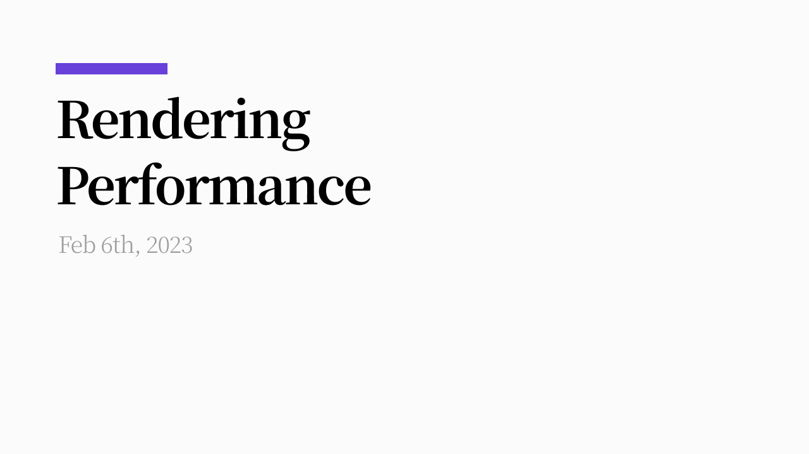
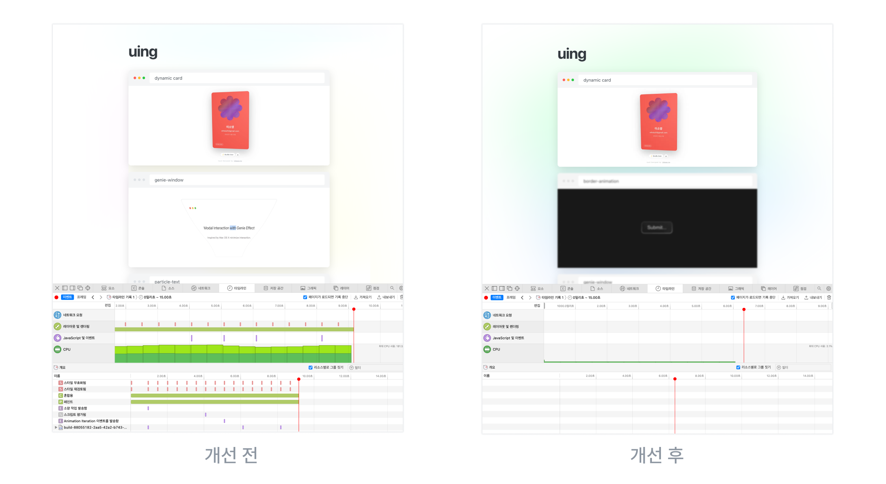
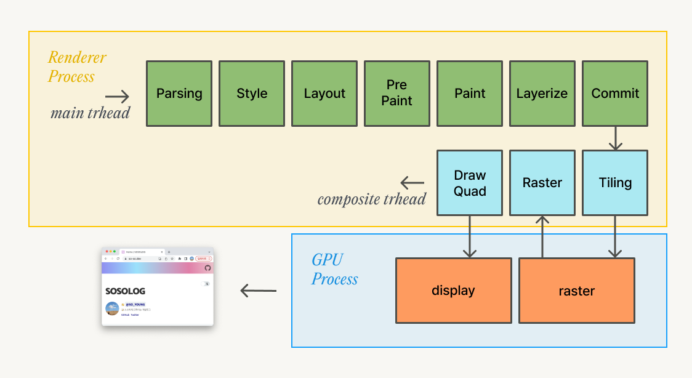
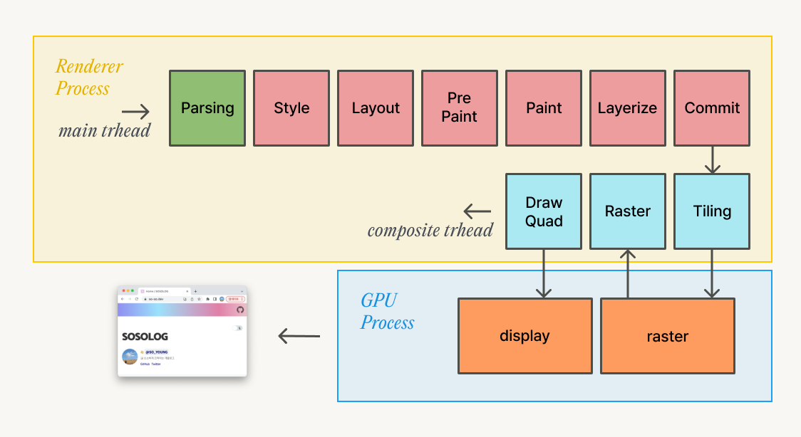
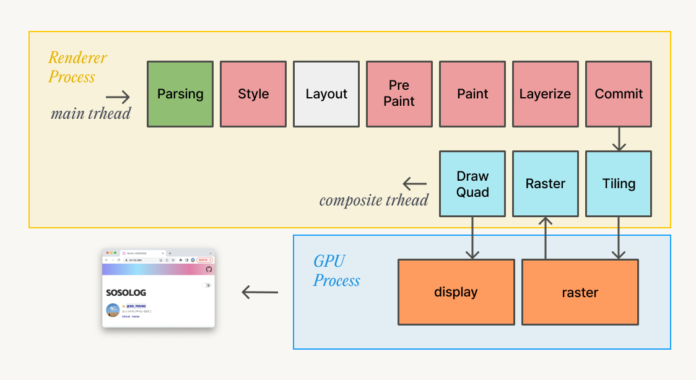
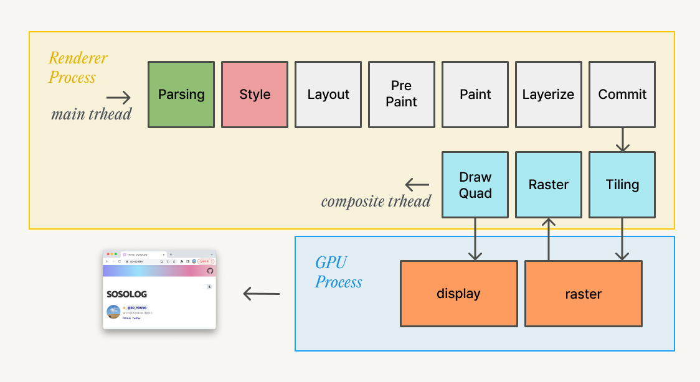
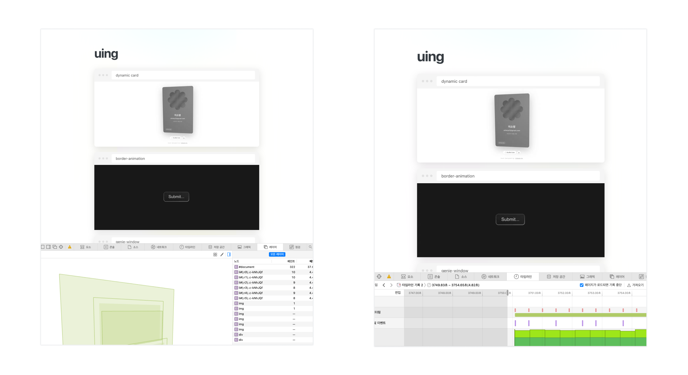
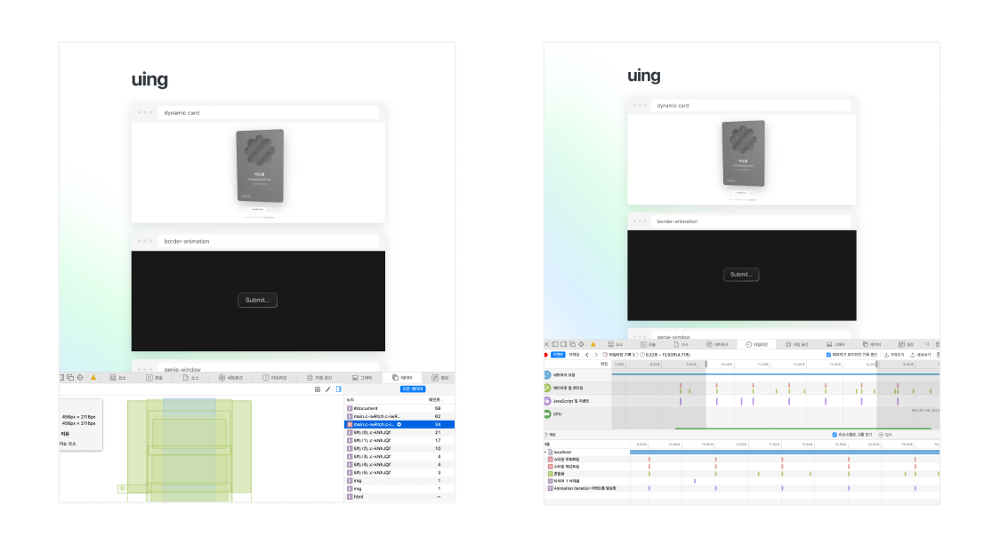
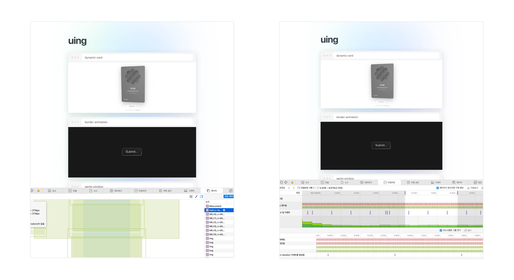
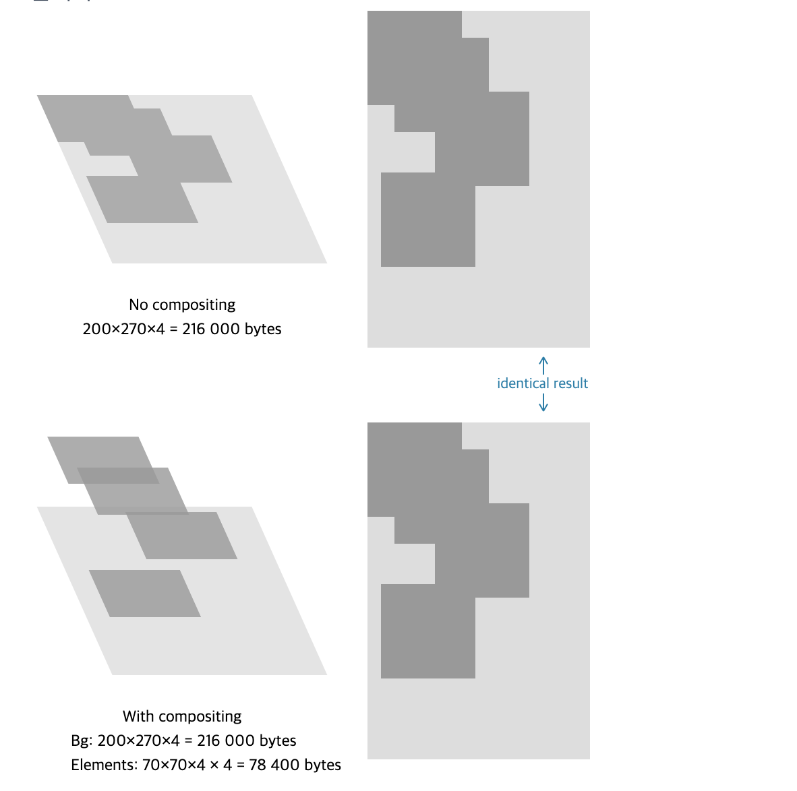

In this post I want to look at rendering again, from the angle of performance improvement. How should we approach rendering performance optimization?

> **Web performance optimization isn't about implementing the fastest possible rendering pass.**

The rendering process runs entirely inside the browser, so we can't improve the rendering process itself.
So the right way to approach performance "improvement" isn't improving the rendering process itself, but a strategy of reducing the sections where bottlenecks occur during that process.

This post won't cover optimizing the DOM tree parsing stage — it'll focus on optimizations related to style calculation.



Here's a before-and-after from the [personal-project rendering performance fix](https://github.com/SoYoung210/Uing/pull/9) that prompted this post. Looking at the performance measurements from before the fix, rendering keeps happening over and over and eating up CPU resources heavily; after the fix, it doesn't.

The visual effect applied is identical, but the difference in rendering performance is huge.



One important factor that determines performance is "whether the main thread gets occupied." Before the fix, a Repaint that occupies the main thread was happening; after the fix, [only compositing happens, so rendering proceeds on the compositor thread and the GPU without occupying the main thread](https://so-so.dev/web/browser-rendering-process/#1-%EB%A0%88%EC%9D%B4%EC%96%B4-%ED%95%A9%EC%84%B1).

Depending on which CSS property you apply, the point in the rendering pipeline where work has to restart differs, and the rendering cost decreases in this order: Reflow → Repaint → Composite. (That said, this isn't always true — using too many layers can actually create a bottleneck due to the overhead of compositing them.)

## Animation

### Reflow

Suppose you change an element's size with JavaScript — what happens?



A "size change" is a style change, and it forces the layout calculation and every step after it to run. When the style step and every step after layout all get re-run, that's called **reflow**.

### Repaint



When you change `background-color`, the style has to be recalculated, but since this property doesn't affect the element's position, the layout stage gets skipped and execution starts from Paint. Re-running from Paint onward like this is called **repaint**.

Both reflow and repaint occupy the main thread, so if processing takes too long, it can also affect how the user's interactions get handled.

### Composition only



As we looked at in the [previous post](https://so-so.dev/web/browser-rendering-process/#%ED%95%A9%EC%84%B1-%EC%8A%A4%EB%A0%88%EB%93%9C), compositing is "the process of converting information about how the page should look into pixels (rasterizing), and then producing a Compositor Frame from that." Animations that use the `transform` or `opacity` properties render using layers that have already been copied over (committed), without any main-thread involvement, so they're fast.

## Performance Improvement

Using what we've covered so far, I compared animation performance across different CSS property changes. (The difference wasn't easy to compare in Chrome, so I tested in the Webkit-based Safari browser instead.)

### Using a Property That Triggers Repaint

```jsx
const backgroundAnimation = keyframes({
  '0%': { backgroundPosition: '0% 50%' },
  '50%': { backgroundPosition: '80% 100%' },
  '100%': { backgroundPosition: '0% 50%' },
});

const Main = styled('main', {
  // ...
  '&::before': {
    position: 'absolute',
    animation: `${backgroundAnimation} infinite 20s linear`,
  }
})
```



Because of the `background-position`-changing animation applied to the `main` element, repaint keeps happening continuously on the top-level `#document` layer, and CPU usage is high.

### Using a Property That Only Triggers Composition

```jsx
const backgroundAnimation = keyframes({
  '0%': { transform: 'translateX(-50%) rotate(0deg)' },
  '50%': { transform: 'translateX(-50%) rotate(270deg)' },
  '100%': { transform: 'translateX(-50%) rotate(0deg)' },
});

const Main = styled('main', {
  // same as before
})
```



The layer carrying the animation effect has been separated out, and only compositing happens, with no repaint. Because the animation can be rendered without occupying the main thread, it can be handled far more smoothly than before.

### Splitting Off Only the Layer (Forcing Hardware Acceleration)

What effect do we get if we leave the repaint-triggering `background-position` animation as-is, but force the layer to split off on its own?



```jsx
const backgroundAnimation = keyframes({
  '0%': { backgroundPosition: '0% 50%' },
  '50%': { backgroundPosition: '80% 100%' },
  '100%': { backgroundPosition: '0% 50%' },
});

const Main = styled('main', {
  // ...
  '&::before': {
    position: 'absolute',
    transform: 'translateZ(0)',
    animation: `${backgroundAnimation} infinite 20s linear`,
  }
})
```

By satisfying the conditions for Graphics Layer creation, the animated `main` element gets split off into a separate layer, making independent rasterization possible. ([Reference post — the browser rendering process#Layerize](https://so-so.dev/web/browser-rendering-process/#6-layerize))

Repaint keeps happening just as it did before, but CPU usage is noticeably lower than it was before splitting off the layer. That's because the region subject to the paint invalidation we described earlier changed from the top-level `#document` element to the `main::before` element. Splitting the background repaint off onto its own layer means repaint still happens, but at a lower cost. (Still, there's overhead compared to an animation that only uses compositing.)

## The Cost of Splitting Off a Layer



For example, splitting four boxes on screen each into their own individual layer requires an additional 78,400 bytes of memory.

If there's more data than the limited memory can hold, the data that isn't in memory has to be reloaded before it can be used, and the overhead of that transfer can end up eating away the very performance gains that splitting off the layer was supposed to give you.

The details on this are explained in the article [CSS GPU Animation: Doing It Right#memory-consumption](https://www.smashingmagazine.com/2016/12/gpu-animation-doing-it-right/#memory-consumption).

## Closing

Improving rendering performance is a process of removing or avoiding elements that hurt performance, while reaching for the maximum performance range the browser can offer. Sometimes, in the course of building a complex animation, you might not be able to avoid `reflow` or `repaint`. But a small reflow or repaint might also be an easy way to get the result you want, without much of a negative impact on performance.

**Every performance improvement should be carried out with measurement.** Rendering performance improvement is no different — you'll get the best results when you diagnose the trade-offs you run into along the way as you go.

## References

- [https://web.dev/stick-to-compositor-only-properties-and-manage-layer-count/](https://web.dev/stick-to-compositor-only-properties-and-manage-layer-count/)
- [https://cabulous.medium.com/how-does-browser-work-in-2019-part-5-optimization-in-the-interaction-stage-66b53b8ec0ad](https://cabulous.medium.com/how-does-browser-work-in-2019-part-5-optimization-in-the-interaction-stage-66b53b8ec0ad)
- [https://web.dev/simplify-paint-complexity-and-reduce-paint-areas/](https://web.dev/simplify-paint-complexity-and-reduce-paint-areas/)
- [https://www.smashingmagazine.com/2016/12/gpu-animation-doing-it-right](https://www.smashingmagazine.com/2016/12/gpu-animation-doing-it-right)