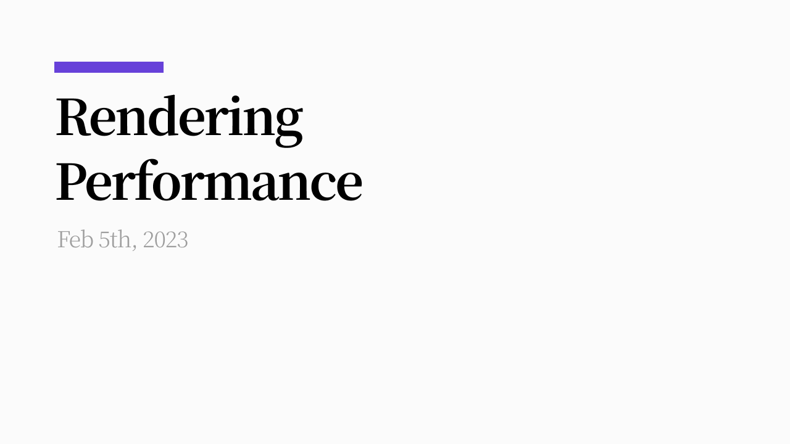

## 들어가며

최근 개인 프로젝트의 [렌더링 성능을 개선](https://twitter.com/th096/status/1613759830703112194)하며 브라우저 렌더링 과정에 대해 정리하고 정확히 무엇이 성능 저하의 원인인지, 어떻게 개선될 수 있었는지 정리해봤다.

## 렌더링 파이프라인

렌더링 성능을 개선하려면 먼저 렌더링 과정과 이에 관여하는 요소를 대해 알아야 한다. 이 글에서 다룰 내용은 Blink엔진 기준이며, [RenderingNG](https://developer.chrome.com/articles/renderingng-architecture/) 글과 [2020년 BlinkOn발표 Life of a Pixel](https://www.youtube.com/watch?v=K2QHdgAKP-s)내용을 참고했다. 따라서 Blink엔진을 사용하지 않는 다른 브라우저에서는 차이가 있을 수 있다.

### 0. Overview

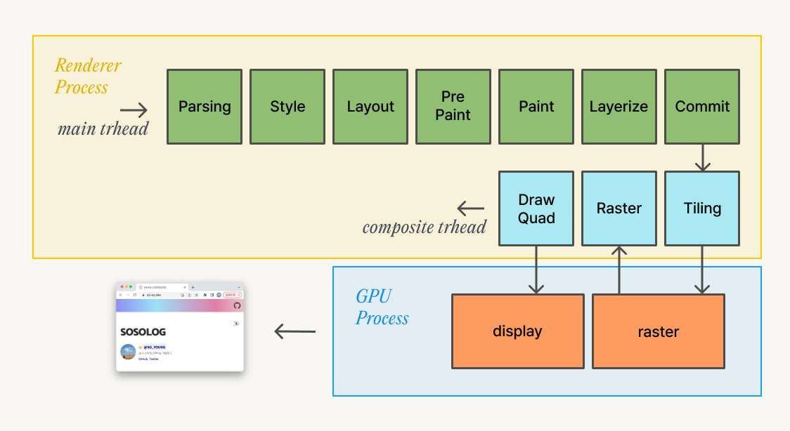

렌더링은 HTML Parsing에서 시작하여 구성을 분석하는 Style, Layout, Paint과정을 거쳐 Layer로 구성되고 합성 스레드와 GPU가 협력하여 화면에 그리는 과정으로 진행된다.

각 단계에 대해 자세히 살펴보자.

### 1. Parsing


가장 첫 단계로 메인 스레드에서 HTML을 브라우저가 해석할 수 있는 자료구조인 DOM Tree로 변환하는 작업이 진행된다. 이 과정은 HTML 파서가 `<link>` 또는 `async`, `defer` 가 없는 `<script>` 와 같은 블로킹 리소스를 만나기 전까지 진행된다.

CSS 파일의 경우 [스타일링이 적용되지 않는 콘텐츠가 잠깐 뜨는 현상(Flash of unstyled content](https://ko.wikipedia.org/wiki/FOUC)을 방지하기 위해 파싱과 렌더링이 차단된다.

`<script>`태그도 DOM을 변경하는 코드(`document.write()`)를 포함할 수 있기 때문에 파싱을 멈춘다.

파싱이 중단됨으로 인해 중요한 리소스 사용이 늦어지는 등 부작용이 생길 수 있는데, 브라우저에서는 이러한 문제를 완하시키기 위해 preload scanner를 사용해서 필요한 요청을 병렬적으로 처리할 수 있다.

### 2. Style


DOM Tree파싱 이후 브라우저는 CSS를 파싱해서 세 가지 단계로 각 DOM노드의 스타일을 계산한다.

#### Step 1. CSS → 스타일 시트

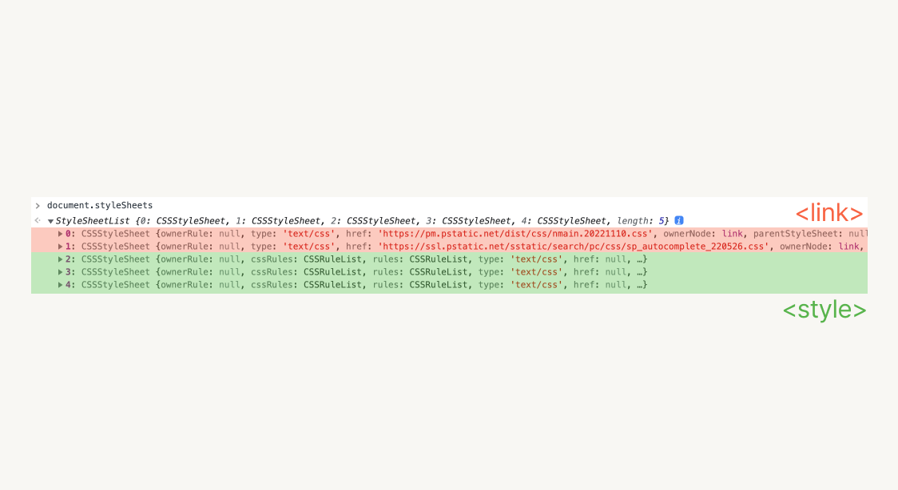

`<link>`태그로 로드하는 CSS, `<style>`, 그리고 inline style의 정보를 바탕으로 브라우저가 해석할 수 있는 스타일 시트를 생성한다.

#### Step 2. 단위 변환

- width: 50%
- padding: 2em 0
- font-size: 1rem

CSS는 px, %, em, rem등 다양한 단위로 작성할 수 있는데, rem등 상대적인 값은 픽셀로 치환되어 계산된다.

> '픽셀'로 표현하는 이유: 렌더링 마지막 단계에서 비트맵 데이터를 구성하는데, 비트맵 데이터가 픽셀로 구성되기 때문이다.

#### Step 3. 스타일 계산

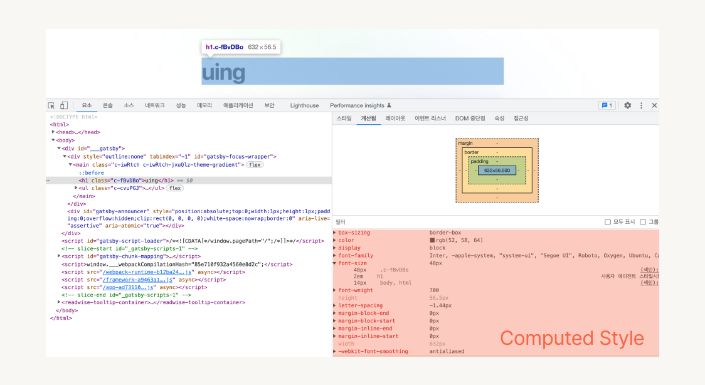

마지막으로, CSS 오버라이딩 등을 고려하여 요소의 최종 스타일을 계산한다.

### 3. Layout


Layout 단계에서는 레이아웃 트리를 구성한다. DOM 트리와 스타일 시트를 기반으로 어떤 요소를 어디에 렌더링 해야하는 지를 결정한다. 레이아웃 트리엔 페이지에 렌더링 되는 정보만 포함되기 때문에 `display: none` 으로 처리된 요소는 포함되지 않는다.

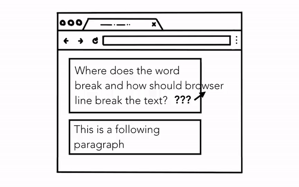

레이아웃 트리를 구성하는 과정은 결코 간단하지 않다. 영상처럼 간단한 페이지에서도 폰트 크기에 따라 단락의 어느 부분에서 줄바꿈이 되어야 하는지 등을 모두 계산해야 하기 때문이다.

### 4. PrePaint

PrePaint단계는 레이어를 구성하기 위한 준비 단계로, 크게 두 가지 작업이 진행된다.

#### 1. Paint Invalidation

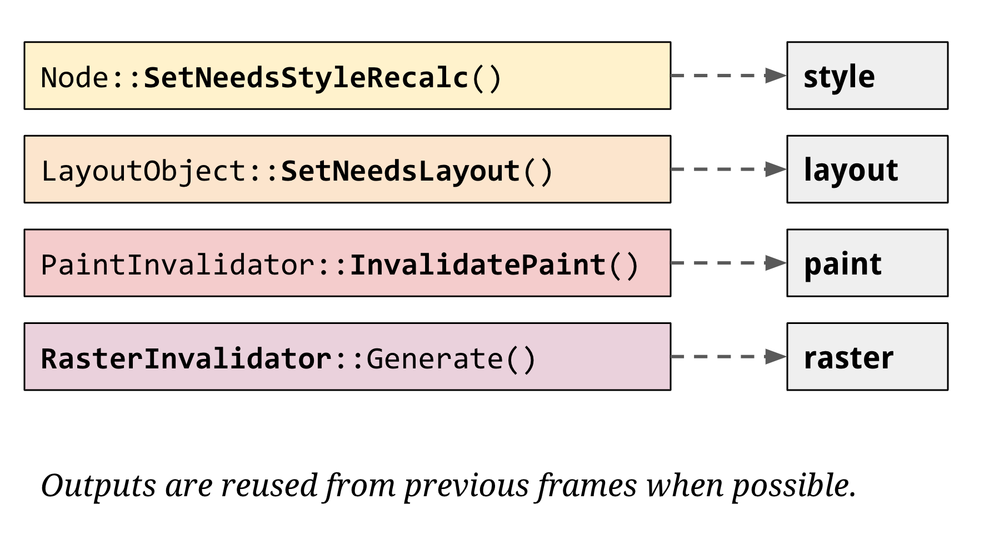

이전 단계(스타일, 레이아웃 단계)에서 변화가 생길 경우(이를 dirty bit이라 한다.), 캐싱해둔 paint 기록을 무효화한다.

#### 2. Property Tree

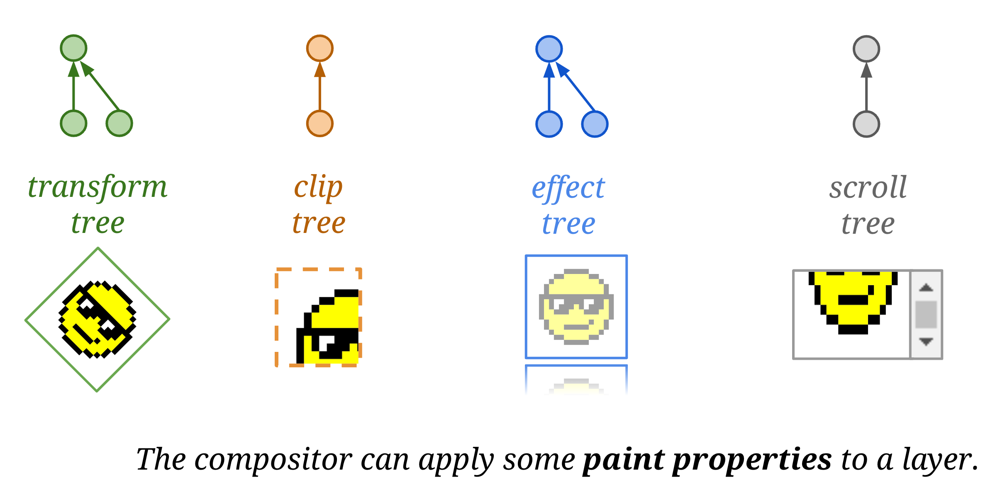

Property Tree는 각 레이어에 할당되는 속성이다. 예를 들어 CSS속성 중 `transform`, `opacity`등의 속성을 적용할 경우, property tree에 반영되고 이후 레이어를 합치는 단계에서 필요한 효과를 빠르게 적용할 수 있다.

기존에는 Property Tree에서 다뤄지는 데이터가 레이어에 함께 저장되어 있었기 때문에 특정 노드의 속성이 변경되면 해당 노드의 하위 노드에도 변경된 값을 반영하면서 노드를 순회해야 했다. 최신 Blink엔진에서는 이런 속성을 별도로 관리하고 각 노드에서는 Property Tree의 노드를 참조하는 방식으로 변경되었다.

### 5. Paint

paint 과정은 실제로 화면을 그리는 과정이 아니라 **어떻게 그려야하는지**에 대한 정보를 담고 있는 `Paint Records`를 생성하는 과정이다. 이 레코드에는 아래 세 가지 정보가 포함된다.

- Action (e.g. Draw Rect)
- Position (e.g. 0, 0, 300, 300)
- Style (e.g. backgroundColor: red)

### 6. Layerize

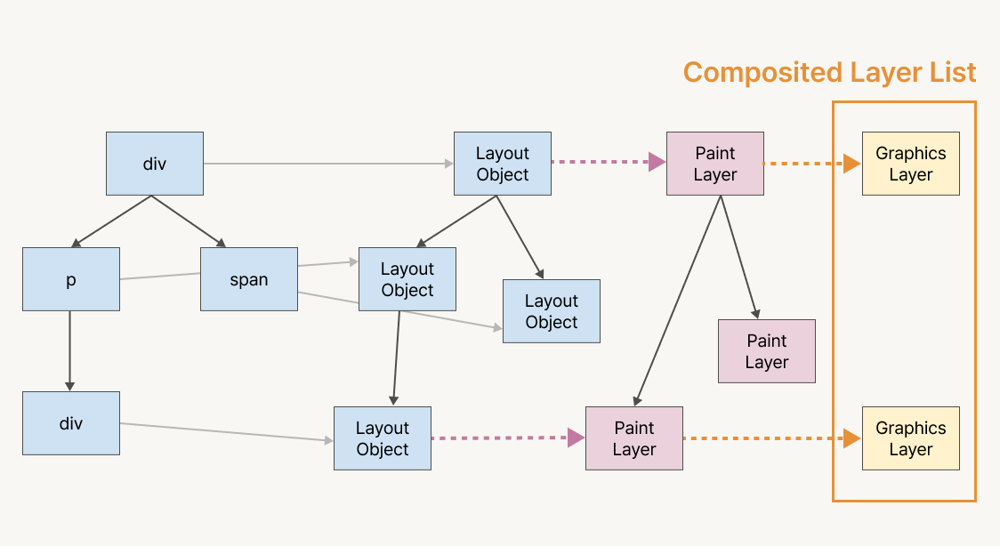

Layerize과정은 paint과정의 결과물을 사용해서 Composited Layer List라는 데이터를 생성하는 단계이다. layout단계에서 Layout Object로 구성된 Layout Tree가 생성되고 Layout Object에서 아래 조건을 만족하면 별도의 Paint Layer가 생성된다.

- 최상위 요소(root element)
- `position: relative, absolute` 사용
- 3D(`translate3d`, `preserve-3d`, ,..)나 perspective transform 사용
- `<video>`, `<canvas>` 태그 사용
- CSS `filter`나 alpha mask 사용

이 조건을 만족하지 않아 별도의 Paint Layer로 생성되지 않은 Layout Object는 가까운 상위 Paint Layer와 대응된다. (두 개 이상의 Layout Object가 하나의 Paint Layer로 다뤄질 수 있다.)

Paint Layer중 Compositing Trigger를 가지고 있거나 스크롤 가능한 컨텐츠가 있을 경우 별도의 Graphics Layer가 생성된다.

**Compositing Trigger 예시**

- 3D 변형: `translate3d`, `translateZ` …
- `<video>`, `<canvas>, <iframe>` 요소
- `position: fixed`
- CSS 트랜지션과 애니메이션을 사용해 구현한 `transform과opacity` 애니메이션
- `position: fixed`
- will-change
- filter

분리된 Graphics Layer들은 독립적인 픽셀화가 가능하며 프레임마다 후에 설명할 단계인 래스터(raster)과정을 다시 실행할 필요 없이 GPU연산이 가능하기 때문에 빠른 스크롤링과 애니메이션이 가능하다.

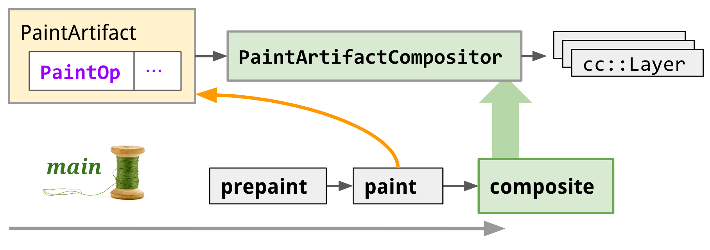

기존에는 레이어를 생성하는 과정이 paint이전에 진행됐지만 [CAP(Composite After Paint)프로젝트](https://developer.chrome.com/articles/blinkng/#composite-after-paint-pipelining-paint-and-compositing) 이후 paint 이후에 진행되도록 변경되었으며 추후 메인스레드가 아닌 tile worker스레드에서 진행되도록 변경될 예정이다.

**Composite After Paint (CAP)**

[RenderingNG](https://developer.chrome.com/articles/renderingng/)라는 Blink렌더링 개선 프로젝트 이전에는  페인트 단계 이전에 합성 레이어(Composited Layer)를 생성했다. 이 순서는 스타일 업데이트 시 렌더링 파이프라인에서 순환참조를 야기했다.

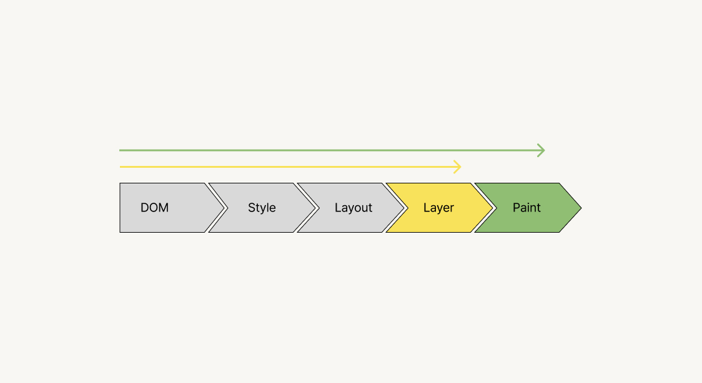

예를 들어 Paint단계를 무효화해야 하는 상황을 생각해보자. Paint무효화는 앞선 단계인 DOM, Style, Layout, 그리고 이전 Layerization 결과의 변경으로 발생할 수 있다.

<iframe loading="lazy" width="300" height="280" src="https://sergeche.github.io/gpu-article-assets/examples/example1.html#.a:anim-left" frameborder="no" allowtransparency="true"></iframe>

요소의 Stacking Context에 의해 [암묵적 컴포지팅](https://www.smashingmagazine.com/2016/12/gpu-animation-doing-it-right/#implicit-compositing)이 필요하다면 브라우저는 컴포짓 레이어를 하나 더 생성하고, 레이어의 변경으로 Paint가 다시한번 발생하게 된다.

CAP프로젝트는 이러한 문제를 개선하기 위한 프로젝트이다. 이에 대한 자세한 내용은 [RenderingNG deep-dive: BlinkNG - Composite after paint](https://developer.chrome.com/articles/blinkng/#composite-after-paint-pipelining-paint-and-compositing) 문서와 [프로젝트에 대한 기술문서](https://docs.google.com/document/d/114ie7KJY3e850ZmGh4YfNq8Vq10jGrunZJpaG6trWsQ/edit#)에 설명되어 있다.

### 7. Commit

Layerize단계의 출력인 Composited Layer List는 PrePaint단계에서 생성한 Property Tree와 함께 합성 스레드(Composite Thread)로 복사된다. 이 과정을 ‘Commit’이라 하며, 이는 메인 스레드에서의 마지막 작업이다. 커밋 이후에는 자바스크립트를 실행하거나 렌더링 파이프라인을 다시 실행할 수 있다.

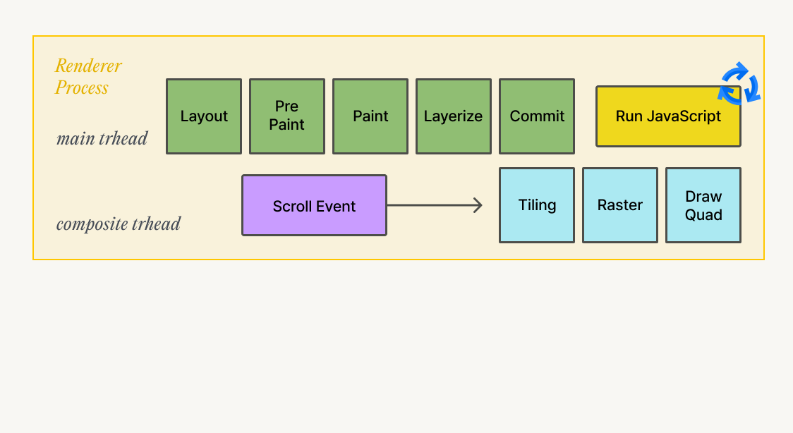

메인 스레드에서의 작업은 종료되었지만, 아직 한 프레임을 그리는 렌더링 과정은 종료되지 않았다. 메인 스레드에서의 작업만으로는 화면을 렌더링할 수 없고, 합성 스레드와 GPU에서의 작업이 완료되어야 한다.

이렇게 스레드 기반으로 작업을 분리한 이유는 작업을 병렬적으로 처리하기 위해서이다. 합성 스레드에서 이후 렌더링 단계를 진행하는 동안 메인 스레드는 순수한 렌더링 파이프라인 과정을 처리할 수 있다.

### **합성 스레드**

합성 스레드에서는 메인 스레드와 별개로 **레이어를 합성**하고 **사용자의 입력**을 처리한다.

#### 1. 레이어 합성

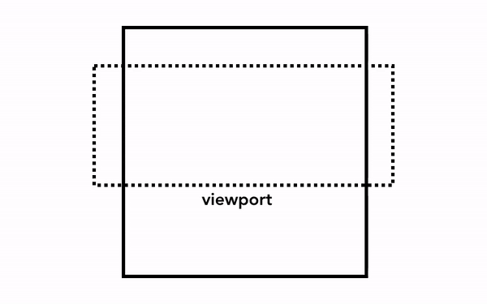

브라우저가 화면에 그리는 실제 렌더링을 하기 위해서는 앞선 단계를 통해 알고 있는 HTML 구조와 각 요소의 스타일, 기하학적 속성, 페인트 속성에 대한 정보를 픽셀로 변환해야 하며, 이 작업을 **픽셀화(래스터화, rasterizing)**라고 한다.

가장 단순한 픽셀화는 필요한 부분을 그대로 픽셀화는 것이다. 사용자가 웹 페이지를 스크롤하면 이미 픽셀화한 프레임을 움직이고 나머지 빈 부분을 추가로 픽셀화한다. 이 방식은 크롬이 처음 출시되었을 때의 픽셀화 방식이다. 최신 브라우저에서는 이보다 정교한 **합성(composition)**이라는 과정을 거친다.

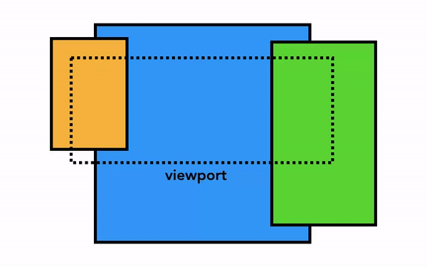

합성은 웹 페이지의 각 부분을 레이어로 분리해 별도로 픽셀화(래스터화)하고 합성 스레드에서 합성하는 기술이다. 스크롤되었을 때 레이어는 이미 픽셀화되어 있으므로 새 프레임을 합성하기만 하면 된다. 애니메이션 역시 레이어를 움직이고 합성하는 방식으로 만들 수 있다.

#### 2. 사용자 입력

컴포짓 레이어에서 발생하는 스크롤 이벤트는 메인 스레드를 거치지 않고 컴포짓 스레드에서 처리할 수 있다. 단, 연결된 이벤트 핸들러가 존재하지 않아야 한다.


자바스크립트 실행은 메인 스레드의 작업이므로 웹 페이지가 합성될 때 컴포지터 스레드는 이벤트 핸들러가 연결된 영역을 '고속 스크롤 불가 영역(non-fast scrollable region)'이라고 표시한다. 웹 페이지의 이 영역에서 이벤트가 발생했을 때 컴포지터 스레드가 입력 이벤트를 메인 스레드로 보내야 하는지를 이 정보로 확인할 수 있다. 입력 이벤트가 고속 스크롤 불가 영역 밖에서 발생했다면 컴포지터 스레드는 메인 스레드에서 commit된 정보를 바탕으로 메인 스레드를 거치지 않고 새 프레임을 합성한다.

```jsx
document.body.addEventListener('touchstart', event => {
  if (event.target === area) {
    event.preventDefault();
  }
});
```

따라서, 이벤트 핸들러를 상위 요소에 연결하는 이벤트 위임 패턴의 코드는 예기치 않은 스크롤 성능 저하를 야기할 수 있다. (이벤트phase에 관한 글은 Jbee님의 [스펙살펴보기: Document Object Model Event](https://jbee.io/web/about-event-in-the-web/)를 추천한다.)


브라우저 관점에서 보면 document, 즉 웹 페이지 모든 영역이 고속 스크롤 불가 영역으로 표시된다. 컴포지터 스레드는 입력 이벤트가 발생할 때마다 메인 스레드와 통신해야 하고 메인 스레드의 작업을 기다려야하기 때문에 스크롤을 부드럽게 처리할 수 없다.

```jsx{5}
document.body.addEventListener('touchstart', event => {
  if (event.target === area) {
    event.preventDefault()
  }
}, { passive: true });
```

이러한 문제를 방지하기 위해 이벤트 리스너에 `passive` 옵션을 설정할 수 있다. 값을 **`true`**
로 지정할 경우, 이벤트가 발생되는 시점에서 [defaultPrevented](https://dom.spec.whatwg.org/#dom-event-defaultprevented) 값을 무시하게 되는데, 이는 메인 스레드에서 이벤트를 입력 받긴 하지만 컴포지터가 메인 스레드의 처리를 기다리지 않고 새 프레임을 합성해도 된다는 것을 의미한다.

### 8. Tilling

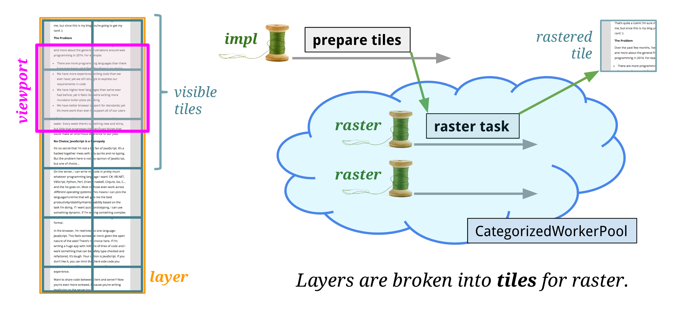

컴포지터 스레드는 메인 스레드에서 넘겨 받은 각 레이어를 래스터화 한다. 이 때, 레이어의 크기가 클 수 있기 때문에 컴포지터 스레드는 레이어를 타일(tile)형태로 분할한다. 각 타일에는 draw과정에서 생성한 PaintRecord가 포함되고, 각 타일은 viewport포함 여부등에 따라 다른 우선순위로 래스터화 된다.

### 9. Raster

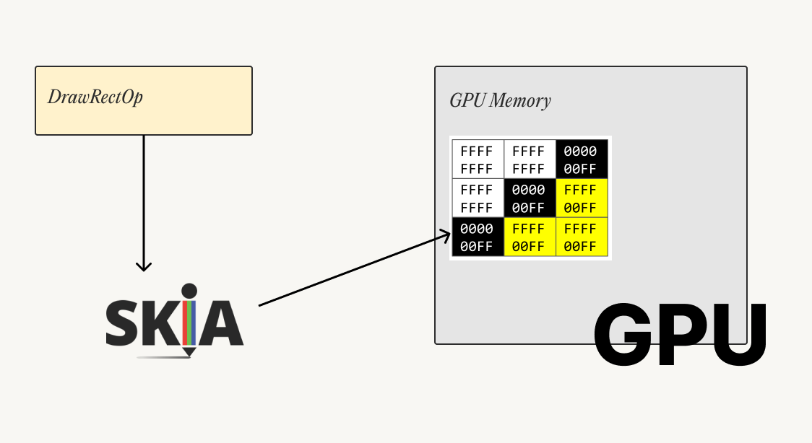

Raster는 타일에 저장된 draw명령어를 실행하는 과정이다. Blink엔진에서는 [Skia](https://skia.org/)라는 그래픽 라이브러리를 사용하여 비트맵 이미지를 생성하고 이를 GPU메모리에 저장한다.

이전 크로미움 아키텍처에서 래스터 과정은 렌더러 프로세스의 래스터 스레드에서 수행됐지만 최근에는 GPU프로세스에서 수행된다. 이를 **'하드웨어 가속'**이라고 한다.

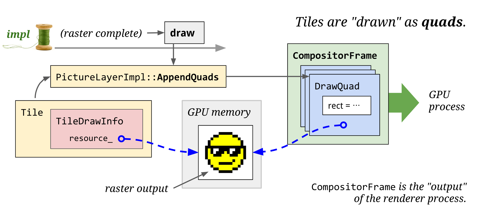

모든 타일이 래스터화 된 후 DrawQuad(이하 쿼드)라는 데이터를 생성한다. 쿼드는 타일을 어디에, 어떻게 그릴지에 대한 정보를 포함하며 이 정보는 앞서 생성한 레이어와 Property Tree 정보를 바탕으로 생성된다.

### 10. Activate

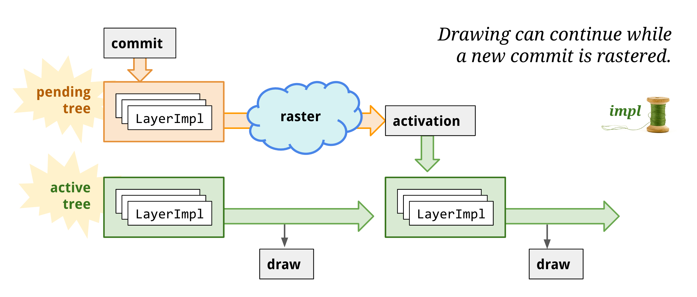

합성 스레드는 pending tree와 active tree를 가지고 swap하는 형태의 멀티 버퍼링 패턴을 가지고 있다.

래스터 작업은 비동기로 진행되는데, 컴포지터 스레드에 이전 작업이 처리 중일 때 새로운 커밋이 들어올 경우 새로운 커밋에 대한 래스터 작업을 진행하기 전 이전 커밋에 대한 내용을 보여주어야 하기 때문이다.

pending tree는 커밋을 받고 렌더링에 필요한 작업이 완료되면 pending tree를 active tree로 복제한다. 이렇게 분리 된 트리구조로 인해 active tree에서 GPU작업을 하는 동안 pending tree에서 커밋된 변경사항을 대기시킬 수 있다.

마지막으로 activate된 쿼드들은 Compositor Frame이라는 데이터로 묶여 GPU프로세스로 전된다. 합성 스레드의 최종 목표는 commit받은 레이어를 쪼개서(tiling) 래스터화하고 Frame으로 만들어 GPU에 전달하는 것이다.

### 11. Display

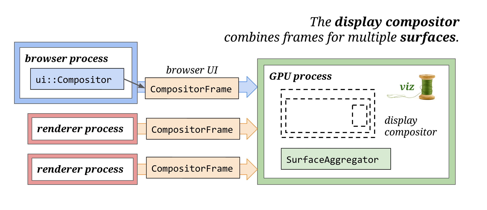

마지막 작업으로, GPU Process의 viz 스레드에서 여러개의 CompositorFrame을 단일 CompositorFrame으로 합치고 화면에 픽셀을 렌더링하면서 한 프레임을 그리는 렌더링 파이프라인이 종료된다.

## Next

다음 포스팅에서는 렌더링 과정에 대한 이해를 바탕으로 성능 개선의 방법과 이유에 대해 살펴본다.

## 참고자료

- [https://developer.chrome.com/blog/inside-browser-part3/](https://developer.chrome.com/blog/inside-browser-part3/#paint)
- [https://developer.chrome.com/articles/renderingng/](https://developer.chrome.com/articles/renderingng/)
- [https://developer.chrome.com/articles/renderingng-architecture/](https://developer.chrome.com/articles/renderingng-architecture/)
- [https://developer.chrome.com/articles/blinkng/](https://developer.chrome.com/articles/blinkng/)
- [https://wit.nts-corp.com/2017/08/31/4861](https://wit.nts-corp.com/2017/08/31/4861)
- [https://tv.naver.com/v/4578425](https://tv.naver.com/v/4578425)
- [https://medium.com/@cwdoh/프론트엔드-개발자를-위한-크롬-렌더링-성능-인자-이해하기-4c9e4d715638](https://medium.com/@cwdoh/%ED%94%84%EB%A1%A0%ED%8A%B8%EC%97%94%EB%93%9C-%EA%B0%9C%EB%B0%9C%EC%9E%90%EB%A5%BC-%EC%9C%84%ED%95%9C-%ED%81%AC%EB%A1%AC-%EB%A0%8C%EB%8D%94%EB%A7%81-%EC%84%B1%EB%8A%A5-%EC%9D%B8%EC%9E%90-%EC%9D%B4%ED%95%B4%ED%95%98%EA%B8%B0-4c9e4d715638)
- [https://www.youtube.com/watch?v=K2QHdgAKP-s](https://www.youtube.com/watch?v=K2QHdgAKP-s)
- [https://docs.google.com/document/d/114ie7KJY3e850ZmGh4YfNq8Vq10jGrunZJpaG6trWsQ/edit](https://docs.google.com/document/d/114ie7KJY3e850ZmGh4YfNq8Vq10jGrunZJpaG6trWsQ/edit)
- [https://www.youtube.com/watch?v=sUbJPHYKZkU](https://www.youtube.com/watch?v=sUbJPHYKZkU)
- [https://www.chromium.org/developers/design-documents/gpu-accelerated-compositing-in-chrome/](https://www.chromium.org/developers/design-documents/gpu-accelerated-compositing-in-chrome/)
