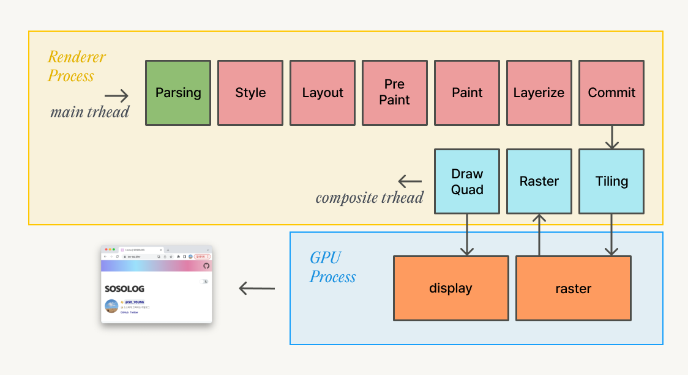

이번 글에서는 성능 개선의 관점에서 렌더링을 다시 살펴보려 한다. 렌더링 성능 최적화는 어떻게 접근해야 할까?

> **웹 성능 최적화는 가장 빠른 렌더링 패스를 구현하는 것이 아니다.**

앞선 글에서 살펴본 것처럼, 렌더링 패스는 선택할 수 있는 것이 아니며 렌더링 과정 자체를 개선할 수는 없다. 따라서, 성능 ‘개선’의 접근 방식은 렌더링 과정 자체의 개선이 아니라 과정 중 병목이 생기는 구간을 줄이는 전략으로 접근해야 한다.

렌더링 첫 단계인 DOM트리 파싱 단계 최적화도 원하는 성능을 달성하기 위해 신경 써야 하는 부분이지만, 이 글에서는 다루지 않고, 스타일 계산과 관련된 최적화에 대해서 다뤄보려고 한다.


글을 작성하는 계기가 된 [개인 프로젝트 렌더링 성능개선 PR](https://github.com/SoYoung210/Uing/pull/9) 적용 전(오른쪽) 후(왼쪽)의 모습이다. 왼쪽은 렌더링이 계속 다시 일어나며 CPU자원을 심하게 소비하고 있고, 오른쪽은 그렇지 않다.

시각적으로 같은 효과를 적용했지만, 렌더링 과정에서는 차이가 크다. 기본적으로 최적화가 잘 되어있는 Chrome에서는 왼쪽도 사용할 수 있는 수준이긴 했지만, Safari에서는 사용이 불가능한 수준이었다.


이러한 차이는 메인 스레드 점유 여부에 따라 달라진다. 왼쪽의 경우 메인 스레드를 점유하는 Repaint가 발생하고 있고, 오른쪽은 합성만 하므로 메인 스레드를 점유하지 않고 합성 스레드 및 GPU에서 렌더링이 진행된다.

적용하는 CSS속성에 따라 렌더링 파이프라인에서 다시 진행해야 하는 시작점이 다르고, Reflow → Repaint → Composite순으로 ‘비용이 낮다.’고 표현할 수 있다. (과도한 레이어 합성으로 인해 오히려 병목이 생길 수 있지만, 이 글에서는 자세히 다루지 않는다. 이에 관한 내용은 [CSS GPU Animation: Doing It Right](https://www.smashingmagazine.com/2016/12/gpu-animation-doing-it-right/#pros-and-cons) 글에서 자세히 소개한다.)

## Animation

### Reflow와 Repaint

JavaScript로 요소의 크기를 변화시켰다고 생각해보자, 어떤 일이 발생할까?



‘크기 변화’는 스타일 변화이고 레이아웃 계산 및 이후 단계를 모두 수행해야 한다. 스타일과 레이아웃 이후 단계가 모두 재실행되는 것을 **reflow**라고 한다.


`background-color` 를 변경한 경우 스타일은 재계산해야 하지만, 이 속성은 요소의 위치에 영향을 주지 않고 레이어를 생성하지 않는 속성이기 때문에 Paint부터 수행된다. 이렇게 Paint 이후 단계부터 재실행 되는 것을 **repaint**라고 부른다.

reflow와 repaint 모두 메인 스레드를 점유하기 때문에 처리 시간이 길어질 경우 유저의 인터랙션 처리에도 영향을 줄 수 있다. (repaint는 레이아웃 단계를 건너뛰기 때문에 reflow보다는 비용이 저렴하다.)

### Composition only


합성이란, [앞선 글](https://so-so.dev/web/browser-rendering-process/#%ED%95%A9%EC%84%B1-%EC%8A%A4%EB%A0%88%EB%93%9C)에서 살펴본 것처럼 ‘페이지가 어떻게 보여야 하는지에 대한 정보를 픽셀로 변환(래스터화)한 다음 Compositor Frame을 생성하는 과정’이다. `transform` 이나 `opacity` 속성을 사용하는 애니메이션은 메인 스레드 개입 없이, 복사 된(Commit) 레이어를 사용해서 렌더링하므로 빠르다.

## 성능 개선

앞서 살펴본 내용으로 CSS속성변화에 대한 애니메이션 성능을 비교해봤다. (Chrome에서는 차이를 비교하기 쉽지 않아 Webkit기반의 Safari브라우저에서 테스트했다.)

### Repaint 발생 속성 사용

```jsx
const backgroundAnimation = keyframes({
  '0%': { backgroundPosition: '0% 50%' },
  '50%': { backgroundPosition: '80% 100%' },
  '100%': { backgroundPosition: '0% 50%' },
});

const Main = styled('main', {
  // ...
  '&::before': {
    position: 'absolute',
    animation: `${backgroundAnimation} infinite 20s linear`,
  }
})
```


앞서 살펴본 바와 같이, `main`요소에 적용된 `background-position` 변경 애니메이션으로 최상위 레이어 `#document`에서 repaint가 지속적으로 발생하고 있고, CPU사용량이 높다.

### Composition만 발생하는 속성 사용

```jsx
const backgroundAnimation = keyframes({
  '0%': { transform: 'translateX(-50%) rotate(0deg)' },
  '50%': { transform: 'translateX(-50%) rotate(270deg)' },
  '100%': { transform: 'translateX(-50%) rotate(0deg)' },
});

const Main = styled('main', {
  // 이전과 동일
})
```


애니메이션 효과를 가진 레이어가 분리되었고, repaint없이 합성만 발생한다. 메인 스레드 점유 없이 애니메이션을 렌더링할 수 있기 때문에 이전보다 훨씬 부드럽게 처리할 수 있다.

### 레이어만 분리 (강제 하드웨어 가속 사용)

repaint를 발생시키는 `background-position` 애니메이션은 그대로 두고, 강제로 레이어만 분리하면 어떤 효과가 있을까?


```jsx
const backgroundAnimation = keyframes({
  '0%': { backgroundPosition: '0% 50%' },
  '50%': { backgroundPosition: '80% 100%' },
  '100%': { backgroundPosition: '0% 50%' },
});

const Main = styled('main', {
  // ...
  '&::before': {
    position: 'absolute',
    transform: 'translateZ(0)',
    animation: `${backgroundAnimation} infinite 20s linear`,
  }
})
```

Graphics Layer생성 조건을 만족시켜 애니메이션을 가진 `main` 요소가 별도 레이어로 분리되어, 독립적인 픽셀화가 가능해졌다. ([참고 글 - 브라우저 렌더링 과정#Layerize](https://so-so.dev/web/browser-rendering-process/#6-layerize))

repaint가 이전과 동일하게 계속 발생하긴 하지만, CPU사용량은 레이어 분리 이전보다 확연히 낮다. 앞서 설명한 페인트 무효화(paint invalidation)의 영역이 `#document`, 최상위 요소에서 `main::before`요소로 변경되었기 때문이다. background repaint가 다른 레이어와 분리됨으로써 여전히 repaint는 발생하지만, 비용을 낮춘 것이다. (하지만, 합성만 사용하는 애니메이션보다는 오버헤드가 있다.)

## 레이어 분리에 대한 비용


예를 들어 화면상의 박스 네개를 전부 개별 레이어로 분리할 경우 78,400바이트의 메모리를 더 필요로 한다.

한정된 메모리를 넘어서는 데이터가 존재한다면 메모리상에 없는 데이터를 사용하기 전에 이를 다시 적재해야 하는 과정이 발생하며 이는 레이어의 분리를 통한 성능의 이점을 송수신 오버헤드로 인해 잡아먹는 경우가 될 수 있다.

## 맺으며

렌더링 성능을 개선하는 과정은 성능상 안좋은 영향을 주는 요소들을 제거하거나 피하면서, 브라우저가 제공하는 최대한의 성능 범위에 도달하는 과정이다. 때로는 복잡한 애니메이션을 구현해나가는 과정에서 `reflow`나 `repaint`를 피할 수 없을지도 모른다. 하지만 작은 reflow나 repaint는 성능상의 악영향은 크지 않으면서 원하는 결과물을 쉽게 얻을 방법일 수도 있다.

**모든 성능 개선은 측정하며 진행되어야 한다.** 렌더링 성능 개선 역시 진행하며 마주하는 트레이드 오프들을 진단하며 진행될 때 최선의 결과를 얻을 수 있을 것이다.

## 참고자료

- [https://web.dev/stick-to-compositor-only-properties-and-manage-layer-count/](https://web.dev/stick-to-compositor-only-properties-and-manage-layer-count/)
- [https://cabulous.medium.com/how-does-browser-work-in-2019-part-5-optimization-in-the-interaction-stage-66b53b8ec0ad](https://cabulous.medium.com/how-does-browser-work-in-2019-part-5-optimization-in-the-interaction-stage-66b53b8ec0ad)
- [https://web.dev/simplify-paint-complexity-and-reduce-paint-areas/](https://web.dev/simplify-paint-complexity-and-reduce-paint-areas/)
- [https://www.smashingmagazine.com/2016/12/gpu-animation-doing-it-right](https://www.smashingmagazine.com/2016/12/gpu-animation-doing-it-right)