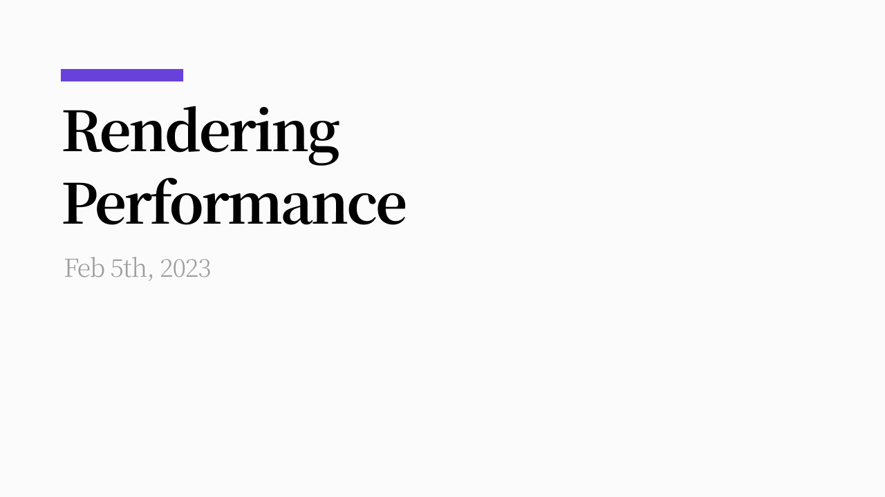

## Intro

While [improving the rendering performance](https://twitter.com/soyoung__ee/status/1613759830703112194) of a personal project recently, I put together notes on the browser's rendering process — what exactly was causing the performance problems, and how I was able to fix them.

## Rendering pipeline

To improve rendering performance, you first need to understand the rendering process and the pieces involved in it. This post covers things from the perspective of the Blink engine, based on the [RenderingNG](https://developer.chrome.com/articles/renderingng-architecture/) article and the [2020 BlinkOn talk, "Life of a Pixel"](https://www.youtube.com/watch?v=K2QHdgAKP-s). So there may be differences in browsers that don't use the Blink engine.

### 0. Overview


Rendering starts with HTML parsing, goes through the Style, Layout, and Paint stages that analyze the page's composition, builds up Layers, and then the compositor thread and the GPU work together to draw everything on screen.

Let's look at each stage in detail.

### 1. Parsing

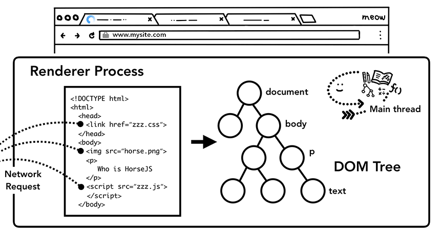

As the very first step, the main thread converts HTML into the DOM Tree, a data structure the browser can interpret. This continues until the HTML parser hits a blocking resource, such as a `<link>` or a `<script>` without `async` or `defer`.

For CSS files, parsing and rendering are blocked in order to avoid [a flash of unstyled content](https://ko.wikipedia.org/wiki/FOUC).

`<script>` tags can also contain code that mutates the DOM (`document.write()`), so parsing pauses there too.

Pausing parsing can have side effects, like delaying the use of important resources, and browsers mitigate this by using a preload scanner to process the requests they'll need in parallel.

### 2. Style

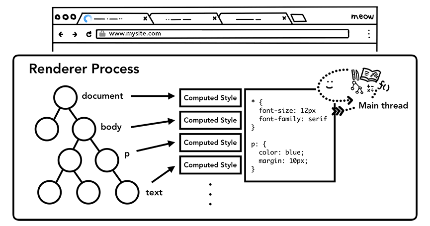

After parsing the DOM Tree, the browser parses the CSS and computes each DOM node's style in three steps.

#### Step 1. CSS → Style Sheet

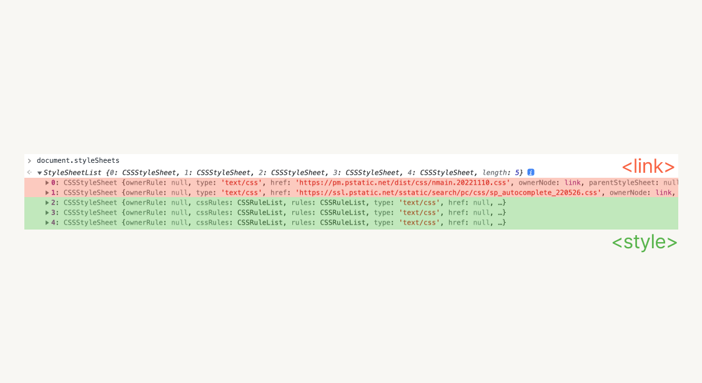

Based on the CSS loaded via `<link>` tags, `<style>` tags, and inline styles, the browser builds a style sheet it can interpret.

#### Step 2. Unit conversion

- width: 50%
- padding: 2em 0
- font-size: 1rem

CSS can be written in a variety of units — px, %, em, rem, and so on — and relative values like rem get converted into pixels during computation.

> Why express it in "pixels": because the final stage of rendering builds bitmap data, and bitmap data is made up of pixels.

#### Step 3. Style computation

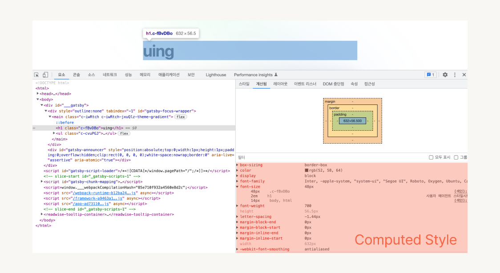

Finally, the element's final style gets computed, accounting for things like CSS overriding.

### 3. Layout

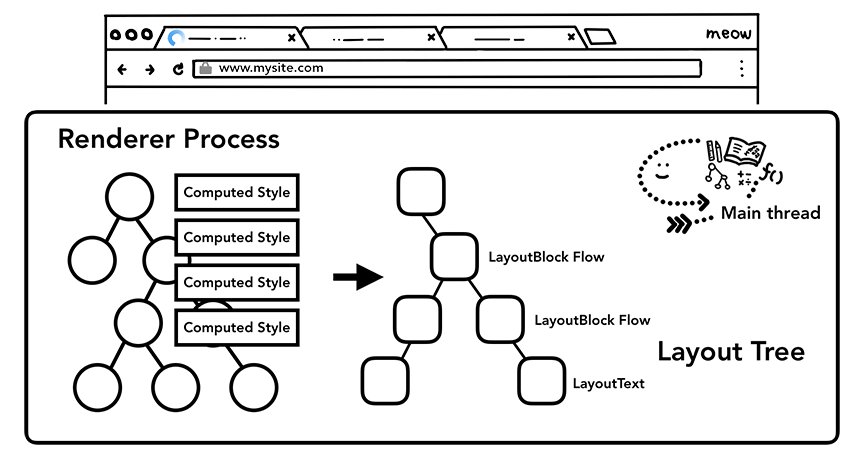

The Layout stage builds the layout tree. Based on the DOM tree and the style sheet, it determines which elements should render where. Since the layout tree only holds information that actually gets rendered on the page, elements set to `display: none` aren't included.


Building the layout tree is far from simple. Even on a page as simple as the one in this clip, the browser has to work out things like exactly where in a paragraph a line should wrap, based on font size.

### 4. PrePaint

The PrePaint stage prepares to build the layers, and it consists largely of two tasks.

#### 1. Paint Invalidation

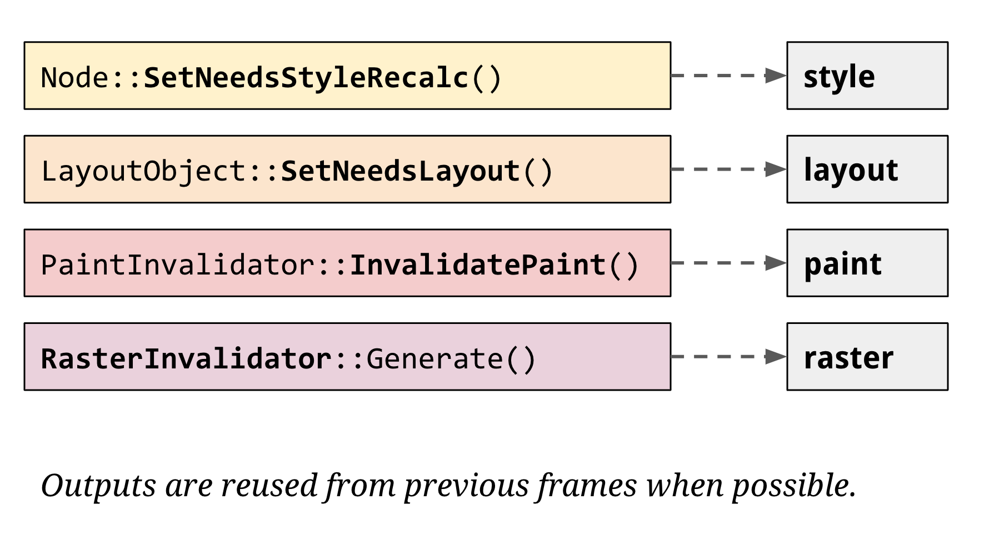

If something changed in an earlier stage (Style, Layout) — referred to as a dirty bit — the cached paint record is invalidated.

#### 2. Property Tree

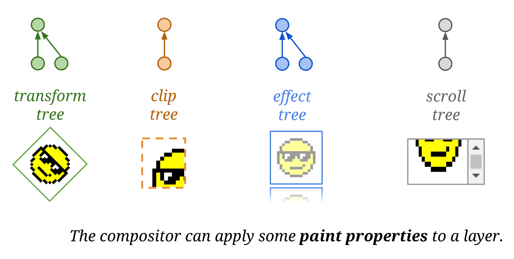

The Property Tree holds the properties assigned to each layer. For example, applying a CSS property like `transform` or `opacity` gets reflected in the property tree, so the necessary effects can be applied quickly during the later layer-merging stage.

Previously, the data handled by the Property Tree was stored together with the layer, so whenever a specific node's property changed, that change had to be propagated by traversing that node's descendants too. In the latest Blink engine, these properties are now managed separately, and each node instead references a node in the Property Tree.

### 5. Paint

The paint process isn't actually drawing to the screen — it's the process of producing `Paint Records`, which hold information about **how something should be drawn**. Each paint record contains three pieces of information:

- Action (e.g. Draw Rect)
- Position (e.g. 0, 0, 300, 300)
- Style (e.g. backgroundColor: red)

### 6. Layerize

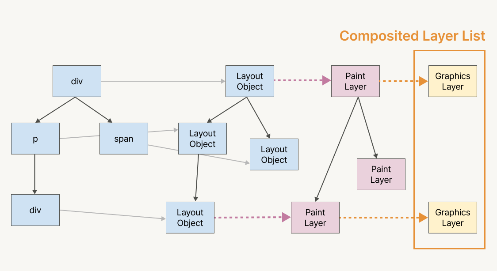

The Layerize stage uses the output of the paint process to build a data structure called the `Composited Layer List`. During the layout stage, a Layout Tree made up of Layout Objects gets built, and a Layout Object is given its own, separate Paint Layer if it meets any of the following conditions:

- It's the root element
- It uses `position: relative` or `absolute`
- It uses 3D (`translate3d`, `preserve-3d`, etc.) or a perspective transform
- It's a `<video>` or `<canvas>` tag
- It uses a CSS `filter` or an alpha mask

A Layout Object that doesn't meet any of these conditions, and so doesn't get its own Paint Layer, is grouped into the nearest ancestor Paint Layer. (Two or more Layout Objects can be handled as a single Paint Layer.)

Among Paint Layers, one that carries a Compositing Trigger, or has scrollable content, gets its own separate Graphics Layer.

**Compositing Trigger examples**

- 3D transforms: `translate3d`, `translateZ`, …
- `<video>`, `<canvas>`, `<iframe>` elements
- `position: fixed`
- `transform` and `opacity` animations built with CSS transitions and animations
- `position: fixed`
- will-change
- filter

Separated Graphics Layers can be pixelated independently, and, since they don't need to rerun the raster process (explained later) on every frame, they can be handled by the GPU — which is what makes fast scrolling and animation possible.

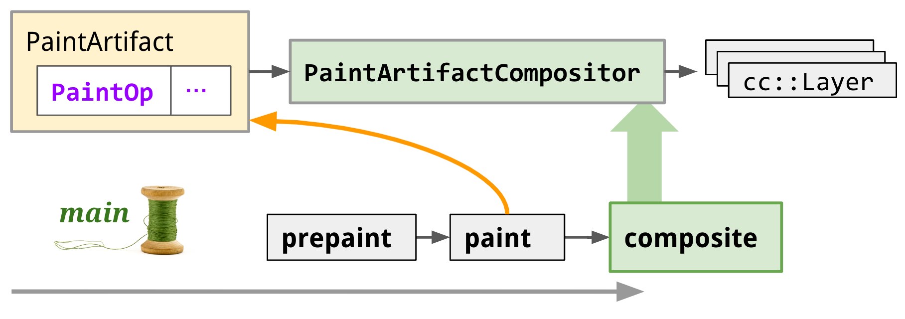

Previously, layer creation happened before paint, but after the [CAP (Composite After Paint) project](https://developer.chrome.com/articles/blinkng/#composite-after-paint-pipelining-paint-and-compositing), it changed to happen after paint, and there are plans to eventually move it off the main thread onto a tile worker thread.

**Composite After Paint (CAP)**

Before [RenderingNG](https://developer.chrome.com/articles/renderingng/), the project that overhauled Blink's rendering, the Composited Layer was created before the paint stage. This ordering caused a circular dependency in the rendering pipeline whenever a style update happened.

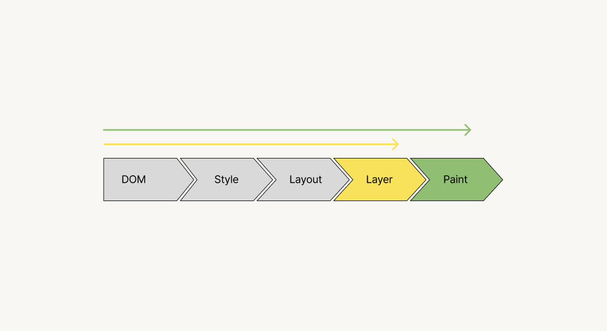

For example, consider a case where the Paint stage needs to be invalidated. Paint invalidation can be triggered by changes in the earlier stages — DOM, Style, Layout — or by a change in the result of a previous Layerization.

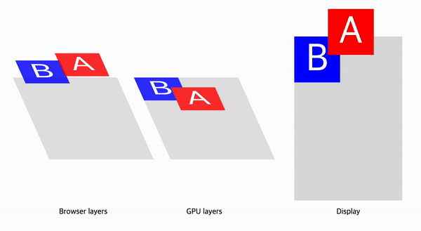

<div style="opacity: 0.5;padding-right: 15px;text-align: center;margin-top: -0.4rem;font-size: 12px;margin-bottom: 1rem;">
    <a href="https://sergeche.github.io/gpu-article-assets/examples/example1.html" target='_blank'>https://sergeche.github.io/gpu-article-assets/examples/example1.html</a></sup>
</div>

If an element's Stacking Context requires [implicit compositing](https://www.smashingmagazine.com/2016/12/gpu-animation-doing-it-right/#implicit-compositing), the browser creates yet another composite layer, and that layer change triggers paint to run once more.

The CAP project exists to fix this exact problem. You can find more detail in the [RenderingNG deep-dive: BlinkNG - Composite after paint](https://developer.chrome.com/articles/blinkng/#composite-after-paint-pipelining-paint-and-compositing) document and in [the project's design doc](https://docs.google.com/document/d/114ie7KJY3e850ZmGh4YfNq8Vq10jGrunZJpaG6trWsQ/edit#).

### 7. Commit

The Composited Layer List produced by the Layerize stage is copied to the compositor thread, along with the Property Tree built during the PrePaint stage. This step is called a "Commit," and it's the last piece of work done on the main thread. After the commit, the main thread is free to run JavaScript or run the rendering pipeline again.

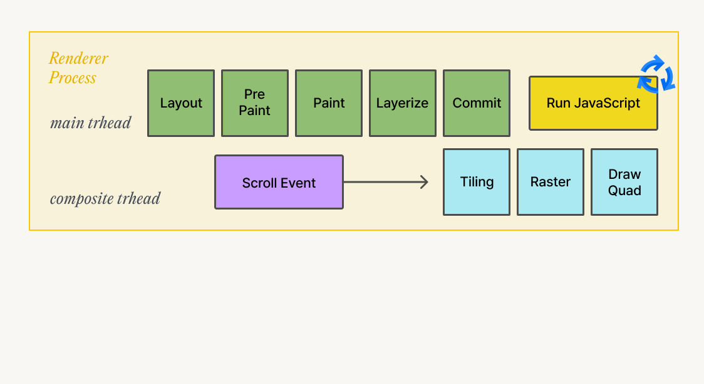

The main thread's work here is done, but the rendering process for drawing a single frame isn't finished yet. The main thread's work alone can't render the screen — work on the compositor thread and the GPU still has to complete.

The reason work gets split across threads like this is to process it in parallel. While the compositor thread runs through the remaining rendering stages, the main thread is free to handle the pure rendering-pipeline work.

### **Compositor thread**

On the compositor thread, separately from the main thread, **layers get composited** and **user input** gets handled.

#### 1. Layer compositing

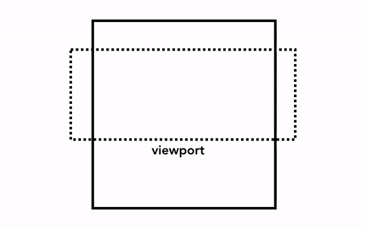

For the browser to actually render pixels on screen, it has to convert the HTML structure and each element's style, geometric properties, and paint properties — all of which are known from the earlier stages — into pixels. This process is called **pixelization (rasterizing)**.

The simplest form of pixelization is to just pixelate whatever's needed, as-is. When a user scrolls a web page, the browser moves the already-pixelated frame and pixelates the newly exposed empty area. This is how Chrome pixelated things when it first launched. Modern browsers go through a more refined process called **composition**.

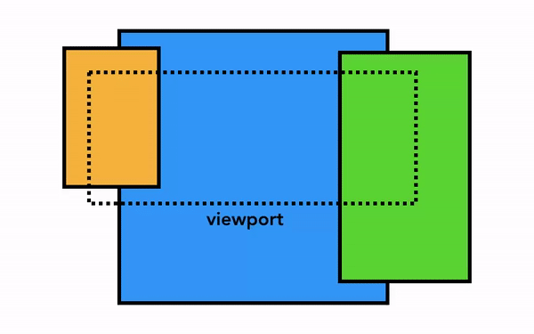

Composition is a technique that splits each part of a web page into layers, pixelates (rasterizes) them separately, and composites them on the compositor thread. When scrolling happens, the layers are already pixelated, so all that's left is to composite the new frame. Animation can likewise be produced by moving and compositing layers.

#### 2. User input

A scroll event that occurs on a composited layer can be handled on the compositor thread without going through the main thread at all — as long as there's no event handler attached.

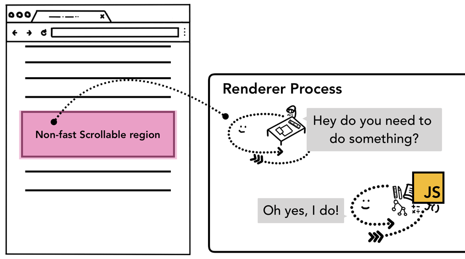

Since running JavaScript is the main thread's job, when a web page gets composited, the compositor thread marks any region with an attached event handler as a "non-fast scrollable region." This lets the compositor thread check, based on where in the page an event occurred, whether it needs to forward the input event to the main thread. If an input event happens outside a non-fast scrollable region, the compositor thread composites a new frame based on what the main thread has already committed, without going through the main thread at all.

```jsx
document.body.addEventListener('touchstart', event => {
  if (event.target === area) {
    event.preventDefault();
  }
});
```

So code that follows the event-delegation pattern — attaching an event handler to a parent element — can cause unexpected scroll-performance regressions. (For more on event phases, I'd recommend Jbee's post [Looking at the spec: Document Object Model Event](https://jbee.io/web/about-event-in-the-web/).)

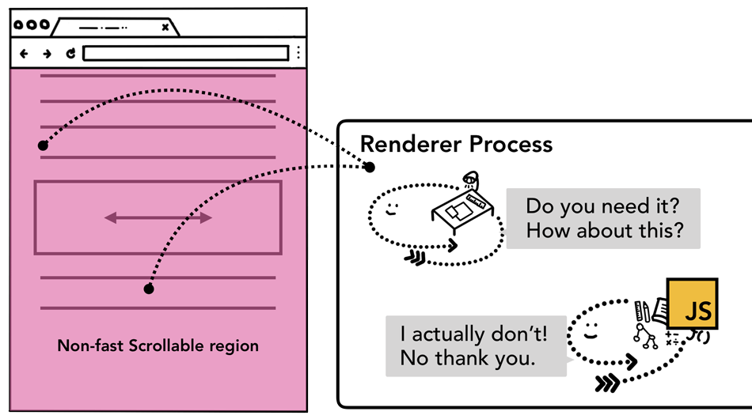

From the browser's point of view, the entire document — the whole page — ends up marked as a non-fast scrollable region. Because the compositor thread has to talk to the main thread every time an input event occurs, and has to wait on the main thread's work, it can't handle scrolling smoothly.

```jsx {5}
document.body.addEventListener('touchstart', event => {
  if (event.target === area) {
    event.preventDefault()
  }
}, { passive: true });
```

To avoid this problem, you can set the `passive` option on the event listener. Setting it to **`true`** means [defaultPrevented](https://dom.spec.whatwg.org/#dom-event-defaultprevented) gets ignored at the moment the event fires — which means that while the main thread still receives the event, the compositor doesn't have to wait for the main thread before compositing a new frame.

### 8. Tiling

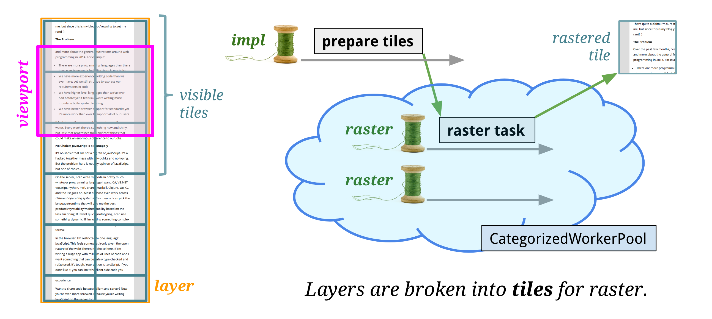

The compositor thread rasterizes each layer handed off from the main thread. Since a layer can be large, the compositor thread splits it into tiles. Each tile holds the PaintRecord produced during the draw process, and each tile gets rasterized at a different priority depending on things like whether it's inside the viewport.

### 9. Raster

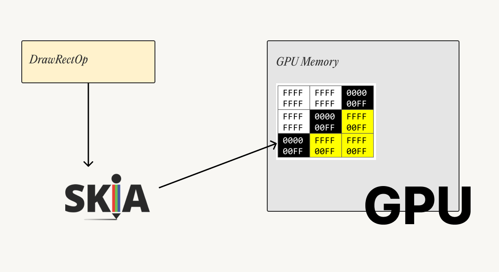

Raster is the process of executing the draw commands stored in a tile. The Blink engine uses a graphics library called [Skia](https://skia.org/) to generate bitmap images and store them in GPU memory.

In the earlier Chromium architecture, rasterizing happened on a raster thread inside the renderer process, but more recently it happens in the GPU process. This is called **"hardware acceleration."**

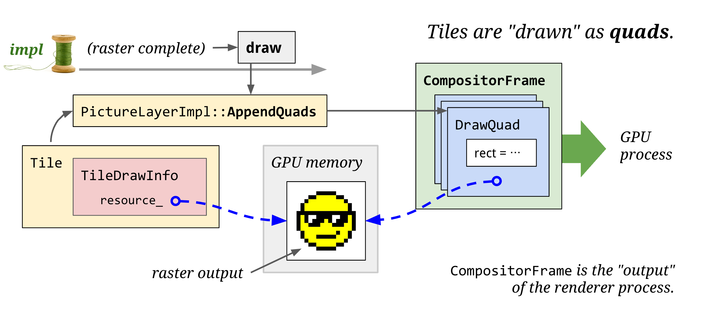

Once every tile has been rasterized, data called a DrawQuad (or "quad" for short) gets generated. A quad holds information about where and how to draw a tile, built from the previously created layers and the Property Tree information.

### 10. Activate

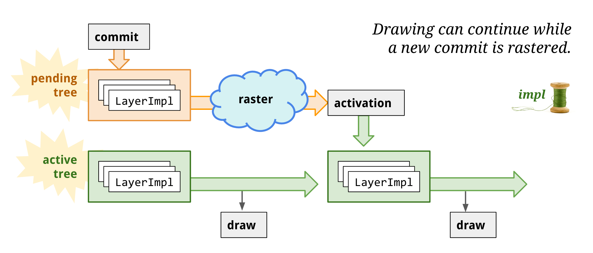

The compositor thread follows a multi-buffering pattern, keeping a pending tree and an active tree and swapping between them.

Rasterization work happens asynchronously, so if a new commit arrives while the compositor thread is still processing a previous one, it needs to keep showing the previous commit's contents before starting rasterization work for the new one.

Once the pending tree receives a commit and finishes the work needed for rendering, it's duplicated into the active tree. Because the trees are split this way, the pending tree can hold committed changes in a queue while the active tree does GPU work.

Finally, the activated quads are bundled into data called a Compositor Frame and passed on to the GPU process. The compositor thread's ultimate goal is to take the committed layers, split them into tiles, rasterize them, build them into a Frame, and hand that off to the GPU.

### 11. Display

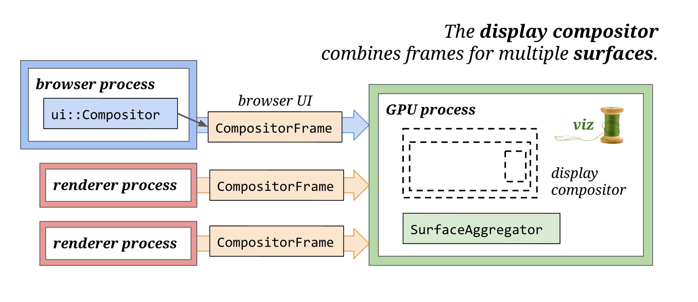

As the last step, the viz thread in the GPU process merges several CompositorFrames into a single CompositorFrame and renders the pixels to the screen — and with that, the rendering pipeline for drawing one frame is complete.

## Next

The next post builds on this understanding of the rendering process to look at how and why performance can be improved.

## References

- [https://developer.chrome.com/blog/inside-browser-part3/](https://developer.chrome.com/blog/inside-browser-part3/#paint)
- [https://developer.chrome.com/articles/renderingng/](https://developer.chrome.com/articles/renderingng/)
- [https://developer.chrome.com/articles/renderingng-architecture/](https://developer.chrome.com/articles/renderingng-architecture/)
- [https://developer.chrome.com/articles/blinkng/](https://developer.chrome.com/articles/blinkng/)
- [https://wit.nts-corp.com/2017/08/31/4861](https://wit.nts-corp.com/2017/08/31/4861)
- [https://tv.naver.com/v/4578425](https://tv.naver.com/v/4578425)
- [Understanding Chrome rendering performance factors, for frontend developers (Korean)](https://medium.com/@cwdoh/%ED%94%84%EB%A1%A0%ED%8A%B8%EC%97%94%EB%93%9C-%EA%B0%9C%EB%B0%9C%EC%9E%90%EB%A5%BC-%EC%9C%84%ED%95%9C-%ED%81%AC%EB%A1%AC-%EB%A0%8C%EB%8D%94%EB%A7%81-%EC%84%B1%EB%8A%A5-%EC%9D%B8%EC%9E%90-%EC%9D%B4%ED%95%B4%ED%95%98%EA%B8%B0-4c9e4d715638)
- [https://www.youtube.com/watch?v=K2QHdgAKP-s](https://www.youtube.com/watch?v=K2QHdgAKP-s)
- [https://docs.google.com/document/d/114ie7KJY3e850ZmGh4YfNq8Vq10jGrunZJpaG6trWsQ/edit](https://docs.google.com/document/d/114ie7KJY3e850ZmGh4YfNq8Vq10jGrunZJpaG6trWsQ/edit)
- [https://www.youtube.com/watch?v=sUbJPHYKZkU](https://www.youtube.com/watch?v=sUbJPHYKZkU)
- [https://www.chromium.org/developers/design-documents/gpu-accelerated-compositing-in-chrome/](https://www.chromium.org/developers/design-documents/gpu-accelerated-compositing-in-chrome/)
