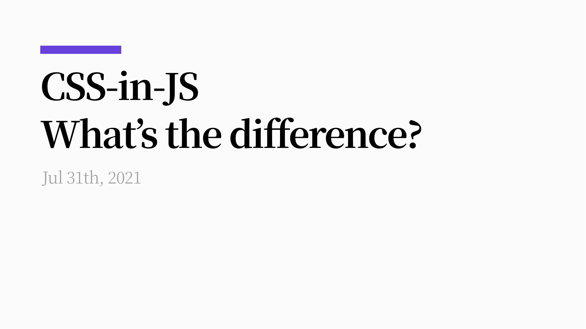
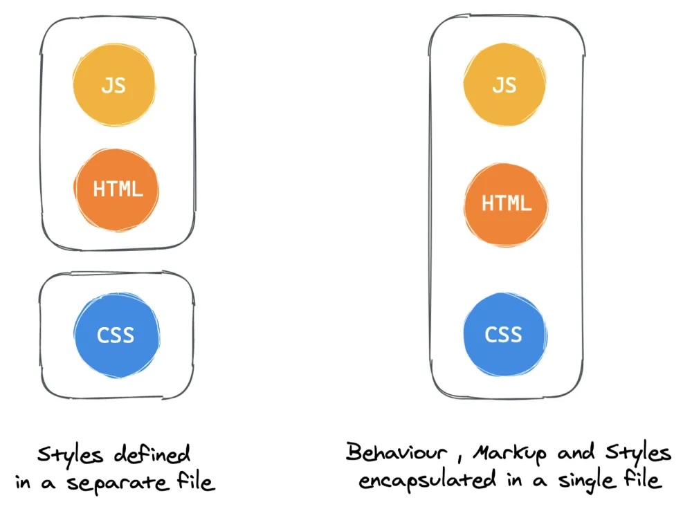
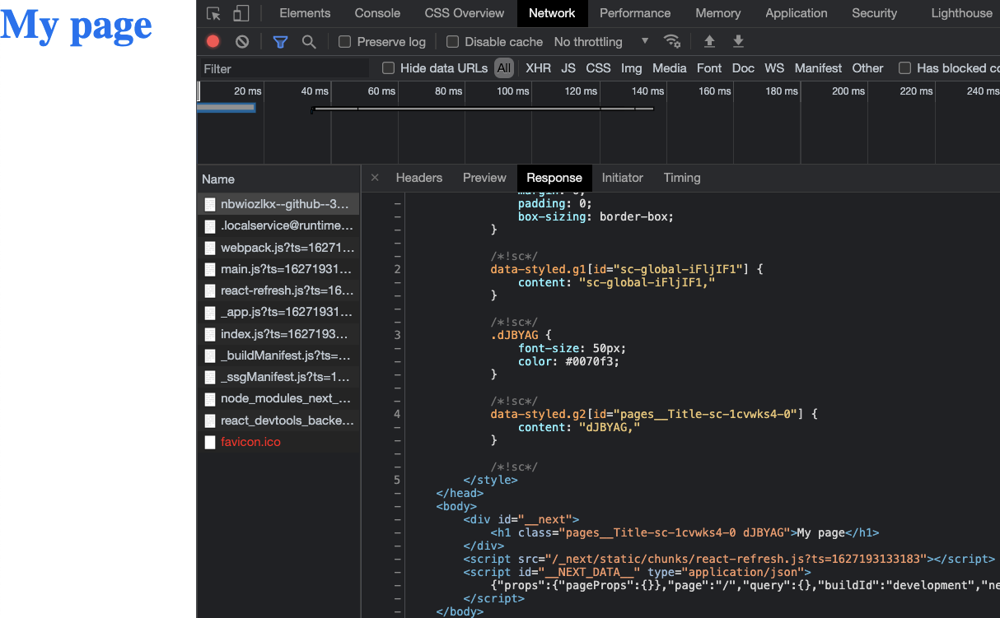
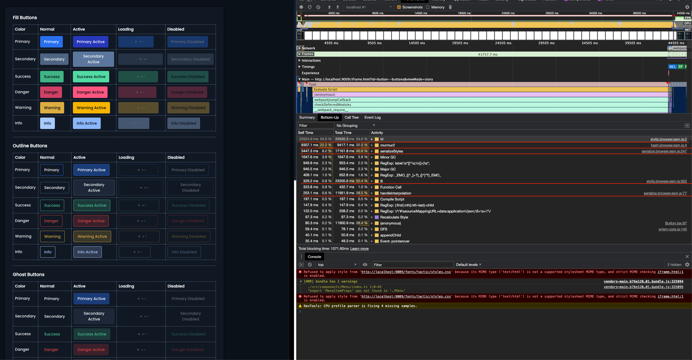
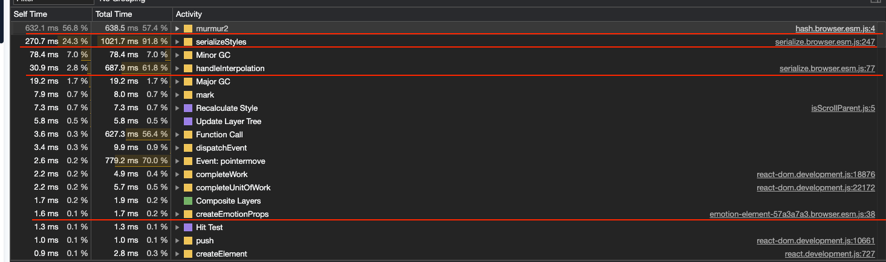
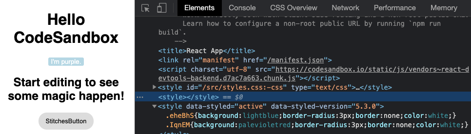
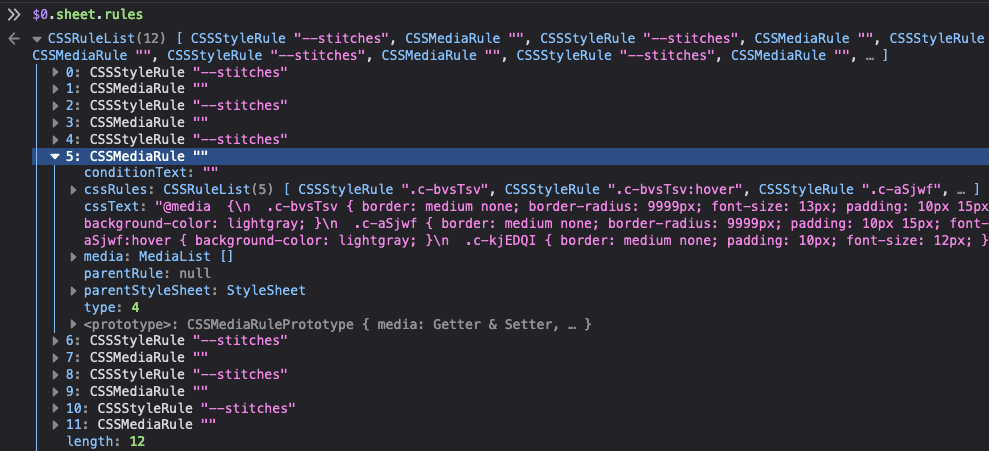
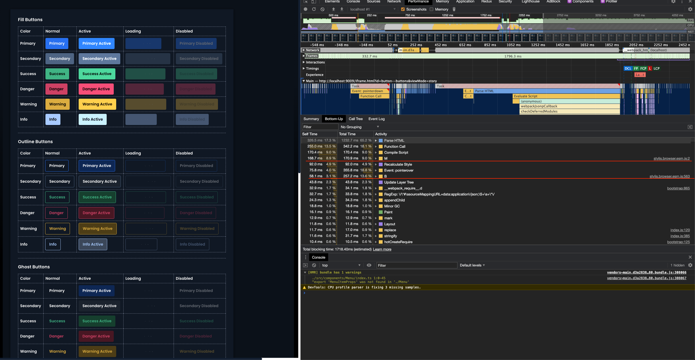
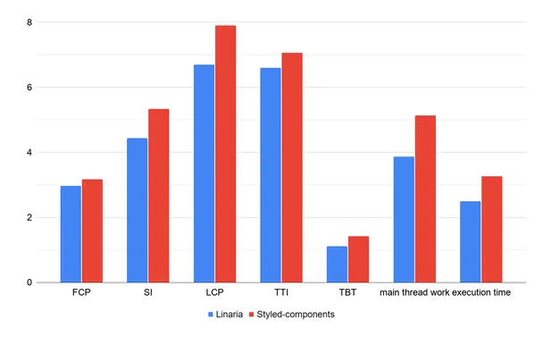
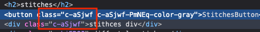

### Table of Contents

- [CSS in JS?](#css-in-js)
- [Critical CSS and CSS-in-JS](#critical-css와-css-in-js)
- [Performance](#performance)
- [Atomic CSS](#atomic-css)
- [Wrapping Up](#마무리)
- [References](#references)

## CSS in JS?



<div align="right">
  <sup><a href="https://css-tricks.com/a-thorough-analysis-of-css-in-js" target="_blank">https://css-tricks.com/a-thorough-analysis-of-css-in-js</a></sup>
</div>

**CSS-in-JS** is exactly what it sounds like: writing CSS inside your JavaScript. Facebook engineer [Christopher Chedeau, aka Vjeux, introduced the idea in a 2014 talk](http://blog.vjeux.com/2014/javascript/react-css-in-js-nationjs.html), walking through how Facebook solved its own CSS management headaches. The idea kept evolving after that talk, and a wave of libraries followed.

What really separates these libraries is **how dynamic the styling can get**: can you use JS variables at all, and if so, how far does that reach? Using that one axis, you can sort CSS-in-JS into roughly four generations, plus one more.

### 1st Generation

CSS wasn't always something you touched from a JS file. Early on, you'd write `*.(module).css` files and run them through a CSS pre-processor as `css module`s.

```jsx
import styles from './Button.module.css'

const Button = () => {
  return <button className={styles.submit}>Submit</button>;
}
```

This approach statically analyzes the CSS and pulls it out into its own file at build time. Since none of it runs at runtime (more on that shortly), it counts as **zero runtime css-in-js**.

### 2nd Generation

Then came libraries like [Radium](https://formidable.com/open-source/radium/), which let you write CSS using JS variables. Components could finally control their own styles, but since it worked through inline styles, **you lost access to a chunk of the CSS spec** — no `:before`, no `:nth-child`, no pseudo selectors at all.

```jsx
// Radium: https://formidable.com/open-source/radium
const styles = {
  base: {
    background: 'blue',
  },

  block: {
    display: 'block'
  }
};

// Inside render
return (
  <button
    style={[
      styles.base,
      this.props.block && styles.block
    ]}>
    {this.props.children}
  </button>
);
```

### 3rd Generation

To get around the syntax limits that came with inline styles, libraries like [aphrodite](https://github.com/Khan/aphrodite/blob/master/src/inject.js#L35-L39) and [glamor](https://github.com/threepointone/glamor) took a different approach. You write CSS as a JavaScript template, and at build time it [generates a `<style>` tag](https://github.com/Khan/aphrodite/blob/225f43c5802259a9e042b384a1f4f2e5b48094ea/src/inject.js#L35-L39) and injects it.

This finally brought back pseudo elements, media queries, and the rest of the spec that had been missing. The catch: **dynamically changing styles were still awkward to define.**

### 4th Generation

The 4th generation fixed the 3rd generation's real limitation — letting JavaScript code drive dynamic styling directly — by adding a runtime.

#### Runtime CSS-in-JS

```tsx
// https://github.com/styled-components/styled-components/blob/8165cbe994f6f749236244f6f7017c2f0b9afcfe/packages/styled-components/src/constructors/constructWithOptions.ts#L39-L44
/* Modify/inject new props at runtime */
templateFunction.attrs = <Props = OuterProps>(attrs: Attrs<Props>) =>
  constructWithOptions<Constructor, Props>(componentConstructor, tag, {
    ...options,
    attrs: Array.prototype.concat(options.attrs, attrs).filter(Boolean),
  });
```

That snippet is from [styled-components](https://styled-components.com/). Every time a `prop` changes, it **generates the style on the spot**, so your styling can respond to actual JavaScript logic. Not every style gets baked in at build time; some of it only exists once the app is running.

Generating styles at runtime is fine most of the time, but the cost of computing them adds up, and it starts to show once a component's styles get complicated. (See: [necolas/react-native-web#benchmark](https://necolas.github.io/react-native-web/benchmarks/).)

### Next Generation

To kill the runtime overhead that comes with complex style computation, a new wave of libraries showed up pushing **zero-runtime**. (We added a runtime in the first place because build time couldn't handle dynamic styling — and now here comes zero-runtime again(!))

#### zero-runtime css-in-js

zero-runtime means exactly what it says: none of the runtime behavior described above. Nothing gets generated dynamically.

[Linaria](https://linaria.dev/) is a CSS-in-JS library with an API modeled on styled-components, but it runs zero-runtime. As [linaria's "how it works" doc](https://github.com/callstack/linaria/blob/master/docs/HOW_IT_WORKS.md) explains, a babel plugin and webpack loader pull out the css you actually used and turn it into a **static stylesheet**.

```tsx
import { styled } from '@linaria/react';
import { families, sizes } from './fonts';

const background = 'yellow';

const Title = styled.h1`
  font-family: ${families.serif};
`;

const Container = styled.div`
  font-size: ${sizes.medium}px;
  background-color: ${background};
  color: ${props => props.color};
  width: ${100 / 3}%;
  border: 1px solid red;

  &:hover {
    border-color: blue;
  }
`;
```

Here's the build output:

```css
.Title_t1ugh8t9 {
  font-family: var(--t1ugh8t-0);
}

.Container_c1ugh8t9 {
  font-size: var(--c1ugh8t-0);
  background-color: yellow;
  color: var(--c1ugh8t-2);
  width: 33.333333333333336%;
  border: 1px solid red;
}

.Container_c1ugh8t9:hover {
  border-color: blue;
}
```

This gets you the prop- and state-driven dynamic styling that 1st-generation zero-runtime css-in-js couldn't pull off.

The trick is [css variables](https://developer.mozilla.org/ko/docs/Web/CSS/var()). Linaria uses them internally, so instead of regenerating the whole stylesheet, it just updates a variable, and the style changes to match whatever condition triggered it.

(Unfortunately, "that browser" doesn't support this.)

<video style="width:100%;" poster="/media/web/images/css-in-js/linaria-dynamic-style-poster.png" controls="true" allowfullscreen="true">
  <source src="/media/web/images/css-in-js/linaria-dynamic-style.mp4" type="video/mp4">
</video>


## Critical CSS and CSS-in-JS

There's another piece to optimizing the first render: **loading only the CSS the current screen actually needs, and doing it efficiently.** So how does each library decide what counts as critical CSS?

Here's how two runtime css-in-js libraries, styled-components and [emotion](https://emotion.sh/docs/introduction), handle this, alongside linaria on the zero-runtime side.

### styled-components



Test it against the [official Next.js example](https://github.com/vercel/next.js/tree/master/examples/with-styled-components) and you'll see that only the css a given page actually uses gets inserted into the head as a style tag. ([Demo project](https://stackblitz.com/edit/github-zmyryx?file=pages%2Fabout.js))

The [collectStyles](https://github.com/styled-components/styled-components/blob/30dab74acedfd26d227eebccdcd18c92a1b3bd9b/packages/styled-components/src/models/ServerStyleSheet.tsx#L37) API generates a separate stylesheet containing only the styles the current page is using.

<video style="width:100%;" poster="/media/web/images/css-in-js/styled-components-dynamic-style-poster.png" controls="true" allowfullscreen="true">
  <source src="/media/web/images/css-in-js/styled-components-dynamic-style.mp4" type="video/mp4">
</video>

After the initial render, any style that changes because of a prop or state update gets injected into the style tag dynamically. (The DOM tree only changes like this in a development-mode build.)

### emotion

emotion ships [extractCritical](https://emotion.sh/docs/ssr#extractcritical) for this.

```tsx
import { renderToString } from 'react-dom/server'
import { extractCritical } from '@emotion/server'
import App from './App'

const { html, ids, css } = extractCritical(renderToString(<App />))
```

Same idea as styled-components: pull out the critical css the initial render needs, and generate everything dynamic afterward at runtime.

### Linaria

Since linaria runs zero-runtime, it extracts critical css at build time instead, using a plugin like [mini-css-extract-plugin](https://github.com/webpack-contrib/mini-css-extract-plugin).

If you're not using code splitting, or the initial css chunk doesn't actually match what the initial load needs, mini-css-extract-plugin can't figure out critical css on its own. That's where linaria's own `collect` comes in.

```tsx
import { collect } from '@linaria/server';

const { critical, other }  = collect(html, css);
```

The `collect` API from the `linaria/server` module takes an HTML string and a CSS string, then splits the CSS into `critical` (whatever the HTML actually uses) and `other` (everything else).

Since the critical CSS sits on the main rendering path, you inject it at the top of the document. Everything else loads through a `<link>` tag asynchronously, without blocking the render.

If you're on Gatsby, where there's no SSR runtime, Hyeseong Kim's ["How to Optimize Stylesheets in Jamstack"](https://blog.cometkim.kr/posts/css-optimization-in-jamstack/) covers stylesheet optimization for that setup.

## Performance

So, css-in-js splits broadly into two camps: runtime and zero-runtime.

Before getting into the performance of each: **runtime doesn't automatically mean worse performance.** It depends heavily on your project's scale and situation, so always **measure before you optimize**.

### runtime

Say you have a component with styles this complicated:

```tsx
const ButtonView = styled('buton')(props => {
  switch (props.emphasis) {
    case 'underline'
      return underlineButtonStyle(props)
    case 'outline'
      return outlineButtonStyle(props)
    case 'ghost'
      return ghostButtonStyle(props)
    case 'token'
      return tokenButtonStyle(props)
    default
      return defaultButtonStyle(props)
  }
})
```



<div align="right">
  <sup><a href="https://itnext.io/how-to-increase-css-in-js-performance-by-175x-f30ddeac6bce" target="_blank">https://itnext.io/how-to-increase-css-in-js-performance-by-175x-f30ddeac6bce</a></sup>
</div>

Analyzing this with `emotion` took 36 seconds.



When hovering the Button renders a Tooltip, emotion re-renders, and that means it has to **re-parse the css from scratch.**

Every time a component updates its styles at runtime, that css has to get parsed again, and rendering blocks for however long that takes. And since that delay comes from emotion's own runtime behavior, it's not easy to optimize away.

#### How runtime CSS-in-JS injects styles

So libraries had to find ways to shrink that css-parsing block as much as possible. The browser combines the DOM and CSSOM trees into a render tree, computes layout, and then paints — so **by touching only the CSSOM and leaving the DOM tree alone**, you skip the cost of re-parsing the DOM. (See: [render-tree construction, layout and paint](https://developers.google.com/web/fundamentals/performance/critical-rendering-path/render-tree-construction).)

Both emotion and styled-components modify the CSSOM in production builds, but fall back to modifying the DOM in development mode. For an easy comparison, here's the difference against [stitches.js](https://stitches.dev/), which sticks with the CSSOM approach even in development mode.



Open the [demo project using styled-components and stitches.js](https://yrhkm.csb.app/) and trace where `.c-bvsTsv`, the style applied to `StitchesButton`, actually lives. You'll find it points at an empty tag.

Right below it, you can read the content styled-components generated directly, but stitches' style is nowhere to be found. That's because, as mentioned above, the two libraries generate their stylesheets in fundamentally different ways.

1. **DOM injection (styled-components:)**  
  It adds a `<style>` tag somewhere in the DOM (`<head>` or `<body>`), attaching the style node with [appendChild](https://developer.mozilla.org/en-US/docs/Web/API/Node/appendChild). It updates the stylesheet by setting [textContent](https://developer.mozilla.org/ko/docs/Web/API/Node/textContent) or [innerHTML](https://developer.mozilla.org/ko/docs/Web/API/Element/innerHTML).

2. **CSSStyleSheet API (stitches.js)**  
  It inserts directly into the CSSOM using [CSSStylesSheet.insertRule](https://developer.mozilla.org/en-US/docs/Web/API/CSSStyleSheet/insertRule).  
  The `<style>` tag looks empty from the outside; you have to select the rule directly in DevTools to actually see it.  

  

**Reference** : [andreipfeiffer/1-using-style-tags](https://github.com/andreipfeiffer/css-in-js/blob/main/README.md#1-using-style-tags)

### zero-runtime

One way to kill runtime overhead entirely is switching to a zero-runtime library like linaria or [compiled](https://compiledcssinjs.com/). But pivoting your whole tech stack mid-project isn't always realistic, so it can also help to **apply the zero-runtime idea only where it's actually causing a bottleneck**.

```tsx
const composedStyle = {
  '--btn-color': theme.derivedColors.button[color],
  ...(style ?? {})
}

const ButtonView = styled.button`
  &[data-color="primary"] {
    color: ${({theme }) => theme.derivedColors.text.primary};
  }

  &[data-emphasis="fill"] {
    background-color: var(--btn-color);
  }
`

<ButtonView
  type="button"
  style={composedStyle}
  data-color={color}
  data-emphasis={emphasis}
  {...props}
/>

```

Here, the existing emotion code got rewritten to use CSS Variables instead.



The css parsing time that used to take 36 seconds dropped to around 200ms.



As this [performance comparison between styled-components and linaria](https://pustelto.com/blog/css-vs-css-in-js-perf/) shows, linaria clearly wins on several metrics. But its limitations are just as clear, so putting it in production still comes down to weighing the trade-offs.

### +) near-zero runtime(stitches.js)

Beyond runtime and zero-runtime, there's a third camp claiming near-zero runtime. Here's [stitches.js](https://stitches.dev/), one of the libraries in that camp.

stitches.js's API looks a lot like styled-components, but it markets itself as **near-zero runtime**. It doesn't literally have zero runtime, but its API is built to minimize interpolation driven by component props.

For example, styled-components lets props drive fully dynamic styling. stitches only lets you style through [variants](https://stitches.dev/docs/variants) you've defined ahead of time.

```jsx
/* 💅  styled-components */
const Input = styled.input`
  margin: ${props => props.size};
  padding: ${props => props.size};
`;
() => <Input size="100px" />

/* 🤓 stitches */
const Button = styled('button', {

  variants: {
    color: {
      violet: {
        backgroundColor: 'blueviolet',
      },
      gray: {
        backgroundColor: 'gainsboro',
      },
    },
  },
});
// color="#9542f5" not possible
() => <Button color="violet">Button</Button>;
```

You could read that as a limitation, but I'd call it a reasonable middle ground between runtime overhead and zero-runtime's constraints. Being able to pass a component a fully dynamic value is really just another way of saying that value couldn't be predefined, which means it's an area you can never optimize ahead of time in the first place.

#### Critical CSS

stitches.js has its own version of emotion's extractCritical, called [getCssString](https://stitches.dev/docs/api#getcssstring). It [analyzes the root's styleSheet](https://github.com/modulz/stitches/blob/ce8e61e25fb26492e53c39d8bd396e899a32fdbe/packages/core/src/sheet.js#L32-L35) to build the stylesheet.

That's not everything stitches.js does. For more, check the [official docs](https://stitches.dev/) and [this post](https://www.javascript.christmas/2020/15).

## Atomic CSS

Both runtime and zero-runtime css-in-js come with trade-offs. css-in-js isn't the only answer for optimizing CSS, either. As one example, [Facebook cut its stylesheet size by 80% by switching to Atomic CSS](https://engineering.fb.com/2020/05/08/web/facebook-redesign/).

```tsx
const styles = stylex.create({
  emphasis: {
    fontWeight: 'bold',
  },
  text: {
    fontSize: '16px',
    fontWeight: 'normal',
  },
});

function MyComponent(props) {
  return <span className={styles('text', props.isEmphasized && 'emphasis')} />;
}
```

Build output:

```css
.c0 { font-weight: bold; }
.c1 { font-weight: normal; }
.c2 { font-size: 0.9rem; }
```

```jsx
function MyComponent(props) {
  return <span className={(props.isEmphasized ? 'c0 ' : 'c1 ') + 'c2 '} />;
}
```

### tailwindcss

[tailwindcss](https://tailwindcss.com/) is probably the best-known example of atomic css. You style things by combining predefined `className`s. Basic usage looks like this:

```jsx
<p class="text-lg text-black font-semibold">
  large text, black, semibold style
</p>
```

Out of all the utility classes tailwindcss ships, whatever you don't use shouldn't make it into your build output. The `purge` setting described in the [tailwindcss - optimization for production](https://tailwindcss.com/docs/optimizing-for-production) docs strips unused styles from the output, but it still can't tell you what counts as critical CSS.

### tailwind + twin.macro

[twin.macro](https://github.com/ben-rogerson/twin.macro) hands off styles written in tailwind css to css-in-js. Since it's just a middleman, you always use it alongside something like styled-components or emotion.

```jsx
import "twin.macro"

<div tw="text-center md:text-left" />

// ↓↓↓↓↓ turns into ↓↓↓↓↓

import "styled-components/macro"

<div
  css={{
    textAlign: "center",
    "@media (min-width: 768px)": {
      "textAlign":"left"
    }
  }}
/>
```

Because the styles get generated dynamically at runtime, you only load what you need on the initial pass. But you're still paying the same runtime overhead discussed above.

- Using atomic css as-is: the initial CSS payload is bigger, but no runtime overhead afterward.
- Using it through twin.macro: the initial CSS payload is smaller, but runtime overhead shows up afterward.

Each approach has a clear trade-off, so which one to pick should come down to what you actually measure.

### stitches.js

stitches.js, covered above, does something similar: it converts repeated styles into atomic classes so they can share the same class.

```tsx
const StitchesDiv = styled("div", {
  // shared area
  border: "none",
  borderRadius: "9999px",
  padding: "10px 15px",
  fontSize: "13px",
});

const StitchesButton = styled("button", {
  // shared area
  border: "none",
  borderRadius: "9999px",
  fontSize: "13px",
  padding: "10px 15px",

  // custom area
  "&:hover": {
    backgroundColor: "lightgray"
  },
  variants: {
    color: {
      violet: {
        backgroundColor: "blueviolet",
      },
      gray: {
        backgroundColor: "gainsboro",
      }
    }
  }
});
```

Whatever `StitchesDiv` and `StitchesButton` share in their "shared area" gets pulled into a separate class and reused.



The catch: if the internal order of an otherwise identical style changes, it stops sharing that class. You'll want style-lint in place, or to define shared pieces through [stitches - util](https://stitches.dev/docs/utils).

## Wrapping Up

As the CSS ecosystem grew, some new tools patched the old ones' weak spots, and plenty of others showed up with entirely new ideas.

I'd love to say there's one silver-bullet tool that's right for every situation. So far, my conclusion is there isn't one. Every tool made its own trade-offs, and the right CSS strategy depends on the service you're actually building.

If your service only deals in components simple enough that rendering optimization never matters, runtime overhead might be negligible — and having no runtime at all could actually leave you solving, by hand, problems a runtime would've solved for you. So you can't just call one "good" and the other "bad." The same rule applies here as everywhere else: measure first, then improve, and pick your CSS approach based on what your service actually needs and where it's headed.

## References

- [https://necolas.github.io/react-native-web/benchmarks/](https://necolas.github.io/react-native-web/benchmarks/)

- [https://blog.cometkim.kr/posts/css-optimization-in-jamstack/](https://blog.cometkim.kr/posts/css-optimization-in-jamstack/)

- [https://community.frontity.org/t/better-css-in-js-performance-with-zero-runtime/3586/9](https://community.frontity.org/t/better-css-in-js-performance-with-zero-runtime/3586/9)

- [https://pustelto.com/blog/css-vs-css-in-js-perf/](https://pustelto.com/blog/css-vs-css-in-js-perf/)

- [https://itnext.io/how-to-increase-css-in-js-performance-by-175x-f30ddeac6bce](https://itnext.io/how-to-increase-css-in-js-performance-by-175x-f30ddeac6bce)

- [https://css-tricks.com/why-i-love-tailwind/](https://css-tricks.com/why-i-love-tailwind/)

- [https://www.javascript.christmas/2020/15](https://www.javascript.christmas/2020/15)
