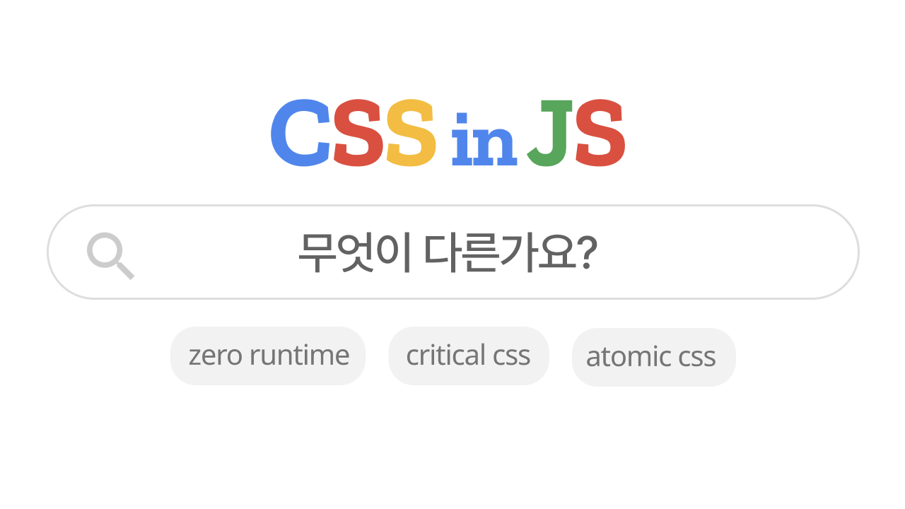
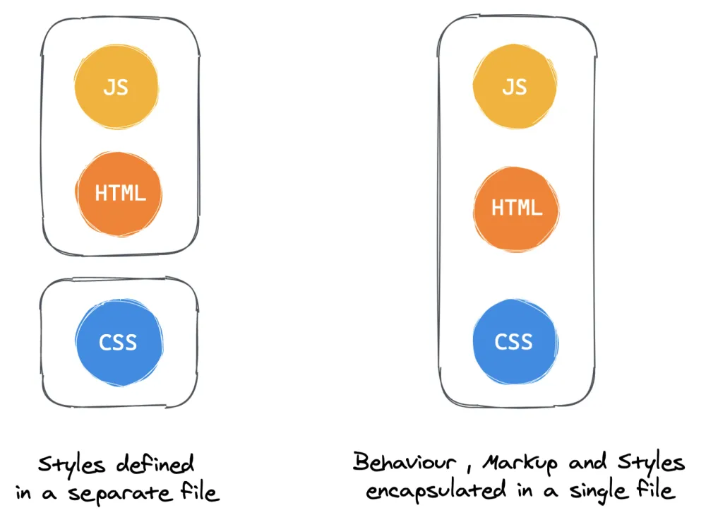
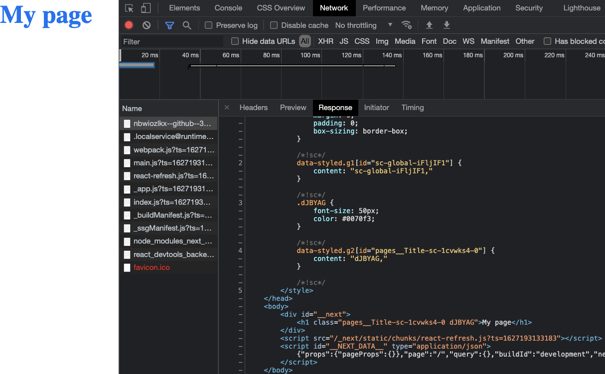
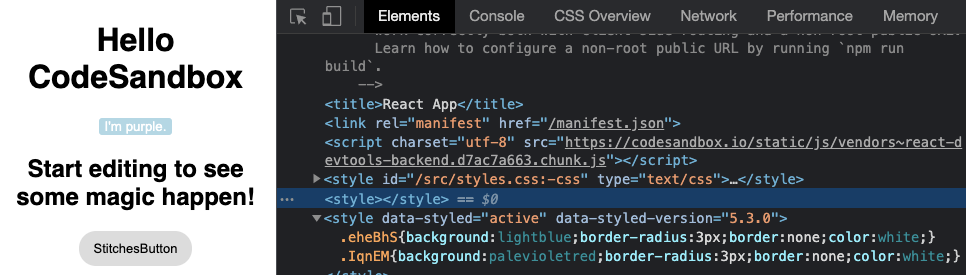
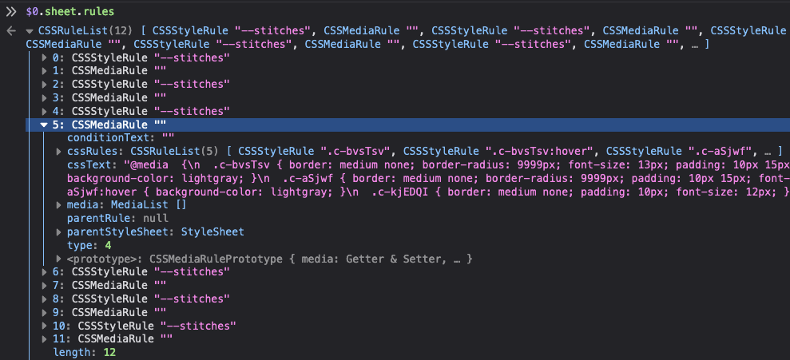
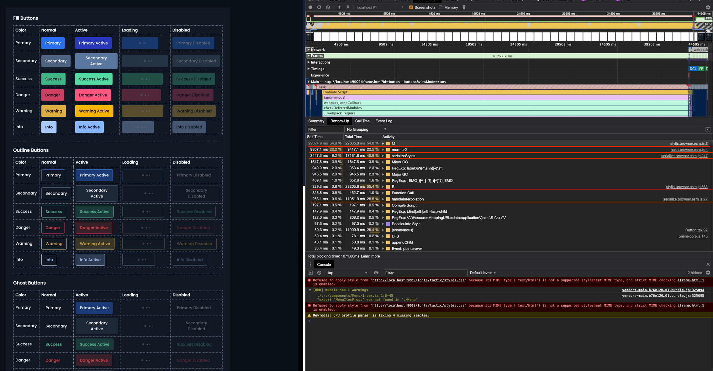
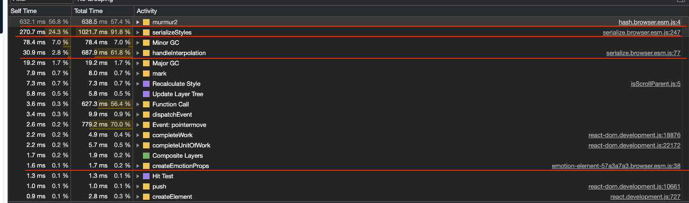
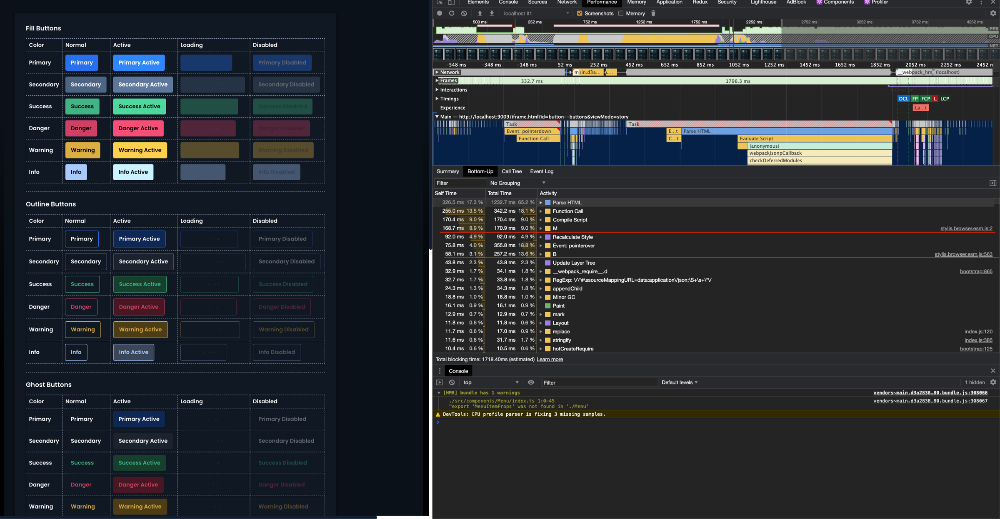
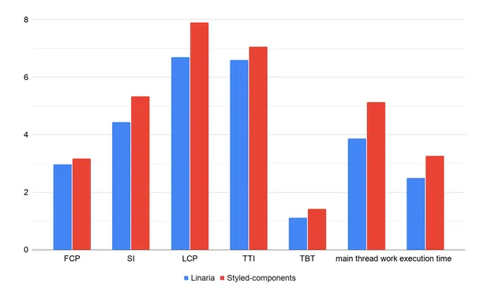

오늘날 프론트엔드 생태계에는 많이 사용하는 emotion, styled-components외에도 linaria, stitches등 많은 CSS-in-JS라이브러리가 있습니다. 이 글에서는 다양한 CSS-in-JS라이브러리들을 Critical CSS관점에서 살펴봅니다.

들어가기에 앞서,  CSS-in-JS와 CSS-in-CSS간의 차이나 장단점에 대해서는 다루지 않습니다

## CSS in JS?



<div align="right">
  <sup><a>https://css-tricks.com/a-thorough-analysis-of-css-in-js/</a></sup>
</div>

**CSS in JS**는 단어 그대로 JavaScript코드에서 CSS를 작성하는 방식을 말합니다. 기존 CSS관리의 어려움을 해결하기 위해 소개된 개념으로 이 개념을 구현한 다양한 라이브러리가 등장했습니다.

CSS-in-JS가 발전하면서 많은 라이브러리가 등장했고, 라이브러리 간의 가장 중요한 차별화 요소는 **'스타일을 얼마나 동적으로  작성할 수 있는가'** - JS변수를 사용할 수 있는지, 사용할 수 있다면 그 범위는 어디인지 - 입니다.

### 1st Generation

처음부터 CSS를 JS파일에서 사용할 수 있었던 것은 아닙니다. `*.(module).css` 으로 파일을 생성하고 CSS pre-processor를 사용하여 css module로 사용하였습니다.

```jsx
import styles from './Button.module.css'

const Button = () => {
  return <button className={styles.submit}>제출</button>;
}
```

위와 같은 방식은 CSS를 정적으로 분석하여 별도의 CSS파일로 추출하는 방식이고, 이후 세대에서 등장한 'runtime 동작'이 없기 때문에 **zero runtime css-in-js** 이라고 부르기도 합니다.

### 2nd Generation

JS변수를 활용하여 CSS를 작성할 수 있는 Radium과 같은 라이브러리가 등장합니다. 컴포넌트 `render` 부분에서 스타일을 제어할 수 있는 형태였지만, inline style을 사용하므로 `:before` , `:nth-child` 등의 psuedo selector를 사용할 수 없는 등 **CSS의 모든 기능을 사용할 수 없다는 한계가 있었습니다.**

```jsx
// Radium: https://formidable.com/open-source/radium
const styles = {
  base: {
    background: 'blue',
  },

  block: {
    display: 'block'
  }
};

// Inside render
return (
  <button
    style={[
      styles.base,
      this.props.block && styles.block
    ]}>
    {this.props.children}
  </button>
);
```

### 3rd Generation

[aphrodite](https://github.com/Khan/aphrodite/blob/master/src/inject.js#L35-L39), [glamor](https://github.com/threepointone/glamor) 등의 라이브러리에서 빌드 결과물을 다르게 다루기 시작합니다. JS템플릿으로 CSS를 작성하고 빌드시 [`<style>` 태그를 생성하여](https://github.com/Khan/aphrodite/blob/225f43c5802259a9e042b384a1f4f2e5b48094ea/src/inject.js#L35-L39) 주입하는 방식으로 동작합니다.

```jsx
// aphrodite: https://github.com/Khan/aphrodite
const styles = StyleSheet.create({
  red: {
    backgroundColor: 'red'
    },

  hover: {
    ':hover': {
      backgroundColor: 'red'
    }
  },
});
```

pseudo element, media query등 css의 기능을 지원하기 시작했으나, 동적으로 변경되는 JS변수에 대한 스타일은 정의할 수 없었습니다.

### 4th Generation

3세대에서 해결하지 못했던 'JS Component범위에서의 동적 스타일링'을 해결했습니다.

`styled-components` 등의 라이브러리가 대표적인데, styled 요소를 render내에서 동적으로 생성할 수 없다는 한계가 있습니다.

```jsx
// 🚫
const Header = () => {
  const Title = styled.h1`
    font-size: 10px;
  `

  return <Title />;
}

// ✅
const Title = styled.h1`
  font-size: 10px;
`
const Header = () => {
  return <Title />;
}
```

리렌더링 되는 시점마다 `Title` 컴포넌트가 재생성되는 방식이기 때문에, React의 diff비교를 통한 렌더링 최적화를 잃게 됩니다.

**Runtime CSS-in-JS**

대표적인 라이브러리 중 하나인 `styled-components` 는 스타일을 Runtime에 스타일을 동적으로 생성합니다.

```tsx
// https://github.com/styled-components/styled-components/blob/8165cbe994f6f749236244f6f7017c2f0b9afcfe/packages/styled-components/src/constructors/constructWithOptions.ts#L39-L44
/* Modify/inject new props at runtime */
templateFunction.attrs = <Props = OuterProps>(attrs: Attrs<Props>) =>
  constructWithOptions<Constructor, Props>(componentConstructor, tag, {
    ...options,
    attrs: Array.prototype.concat(options.attrs, attrs).filter(Boolean),
  });
```

대부분의 경우 문제가 되지 않지만, Table등 복잡한 컴포넌트에서는 차이가 발생할 수 있습니다.

### Next Generation

Runtime overhead를 해결하기 위한 방법중 하나로, zero-runtime css-in-js 라이브러리들이 등장합니다.

**zero-runtime css-in-js**

[Linaria](https://linaria.dev/)는 styled-components에서 영감을 받아 유사한 API를 가진 CSS-in-JS라이브러리 중 하나이지만, styled-components와 다르게 zero-runtime으로 동작합니다.

babel plugin과 webpack loader를 통해 사용된 css코드를 추출해 **정적인 css**파일을 추출합니다.

```tsx
import { styled } from '@linaria/react';
import { families, sizes } from './fonts';

const background = 'yellow';

const Title = styled.h1`
  font-family: ${families.serif};
`;

const Container = styled.div`
  font-size: ${sizes.medium}px;
  background-color: ${background};
  color: ${props => props.color};
  width: ${100 / 3}%;
  border: 1px solid red;

  &:hover {
    border-color: blue;
  }
`;
```

빌드 결과:

```css
.Title_t1ugh8t9 {
  font-family: var(--t1ugh8t-0);
}

.Container_c1ugh8t9 {
  font-size: var(--c1ugh8t-0);
  background-color: yellow;
  color: var(--c1ugh8t-2);
  width: 33.333333333333336%;
  border: 1px solid red;
}

.Container_c1ugh8t9:hover {
  border-color: blue;
}
```

1세대 zero-runtime css-in-js에서는 할 수 없었던 prop, state에 따른 동적인 스타일링이 가능합니다.

완전히 '정적인' css-in-js에서 상태에 따른 동적 스타일링이 가능한 이유는, 내부적으로 css variable을 사용하고 있기 때문입니다.

<video style="width:100%;" controls="true" allowfullscreen="true">
  <source src="./images/css-in-js/linaria-dynamic-style.mp4" type="video/mp4">
</video>

이처럼 동적인 스타일은 [CSS Variable](https://developer.mozilla.org/ko/docs/Web/CSS/var())에 의해 결정되기 때문에 동적인 스타일을 사용하는 부분은 [IE11에서 사용할 수 없습니다.](https://github.com/callstack/linaria#trade-offs)

## Critical CSS와 CSS-in-JS

css-in-js가 4th generation을 넘어 발전하면서 FE생태계도 함께 발전했습니다. Client-side Rendering(CSR)을 사용하던 어플리케이션은 First Paint(FP)등의 성능 이슈로 SSR, SSG등을 고려하기 시작합니다. 그리고 이때 문제가 발생하기 시작합니다.

- 미리 그려진 마크업이 렌더링 되면서 "Flash of unstyled content" (FOUC) 문제가 발생합니다.
- FOUC를 방지하기 위해 **필요한** CSS를 먼저 로딩해야 합니다.
- 이 때, document에 스타일 시트가 추가되면서 Critical Rendering Path가 길어집니다.

최근 많이 사용되고 있는 css-in-js라이브러리들에서는 이 문제를 어떻게 해결하고 있는지 정리해봅니다.

### styled-components



[Next.js 공식예제](https://github.com/vercel/next.js/tree/master/examples/with-styled-components)에 따라 테스트할 경우, 페이지에서 사용하는 css만 head에 style tag로 삽입된 것을 확인할 수 있습니다. ([Demo 프로젝트](https://stackblitz.com/edit/github-zmyryx?file=pages%2Fabout.js))

[collectStyles](https://github.com/styled-components/styled-components/blob/30dab74acedfd26d227eebccdcd18c92a1b3bd9b/packages/styled-components/src/models/ServerStyleSheet.tsx#L37) api를 통해 현재 페이지에서 사용되고 있는 스타일을 style tag로 만들어줍니다.

<video style="width:100%;" controls="true" allowfullscreen="true">
  <source src="./images/css-in-js/styled-components-dynamic-style.mp4" type="video/mp4">
</video>

동적인 스타일은 변경될때 style tag에 동적으로 삽입됩니다.

### emotion

[extractCritical](https://emotion.sh/docs/ssr#extractcritical) 을 제공합니다.

```tsx
import { renderToString } from 'react-dom/server'
import { extractCritical } from '@emotion/server'
import App from './App'

const { html, ids, css } = extractCritical(renderToString(<App />))
```

styled-components와 비슷한 방식으로, 초기 페이지 렌더링에 필요한  critical css를 추출하고 이후 동적인 스타일은 runtime에 생성되는 방식입니다.

### Linaria

zero-runtime으로 동작하는 linaria는 빌드 시 [mini-css-extract-plugin](https://github.com/webpack-contrib/mini-css-extract-plugin)과 같은 플러그인을 사용하여 critical css를 추출합니다.

code splitting을 사용하지 않거나 initial css chunk가 초기로드에 필요한 css가 아닐경우 즉, mini-css-extract-plugin에 의해 critical css를 판단할 수 없는 경우 linaria에서 제공하는 collect를 사용할 수 있습니다.

```tsx
import { collect } from '@linaria/server';

const { critical, other }  = collect(html, css);
```

`linaria/server` 모듈에서 제공하는 `collect` API는 HTML과 CSS 문자열을 각각 받아 CSS 중 실제로 HTML 에서 사용된 것을 `critical`, 나머지를 `other`로 구분합니다.

추출된 Critical CSS는 주요 렌더링 경로에서 사용하므로 문서 상단에 주입하고, 나머지는 `<link>` 태그로 비동기로 로딩하는 식으로 처리할 수 있습니다.

SSR 런타임을 사용하지 않는 Gatsby환경에서의 스타일 시트 최적화는 김혜성님의 ["Jamstack에서 스타일시트를 최적화하는 법"](https://blog.cometkim.kr/posts/css-optimization-in-jamstack/)을 참고하세요.

### stitches

[stitches](https://stitches.dev/) 는 styled-components와 유사한 api를 가진 css-in-js라이브러리이지만 **near-zero runtime**을 표방하고 있습니다. emotion의 extractCritical과 유사한 역할을 하는 [getCssString](https://stitches.dev/docs/api#getcssstring)을 제공합니다. [root의 styleSheet를 분석하여](https://github.com/modulz/stitches/blob/ce8e61e25fb26492e53c39d8bd396e899a32fdbe/packages/core/src/sheet.js#L32-L35) style sheet를 생성합니다.

stitches의 특징에 대해 더 알고싶으신 분은 [공식문서](https://stitches.dev/)와 [이 글](https://www.javascript.christmas/2020/15) 을 참고하시는 것을 추천합니다.

### 📝 Bonus - style inject방식



[styled-components, stitches.js를 사용한 데모 프로젝트](https://yrhkm.csb.app/)에서 `StitchesButton` 에 적용된 `.c-bvsTsv` 스타일이 적용된 곳을 따라가면 빈 tag로 표현되는 것을 볼 수 있습니다.

바로 밑에 styled-components에 의해 생성된 style의 내용은 바로 볼 수 있는 반면, stitches에 적용된 스타일만 볼 수없습니다.

결과가 다른 이유는 두 라이브러리에서 style을 주입하는 방식이 다르기 때문입니다. (참고: 위 예제는 development mode로 빌드되어 다르지만, production mode에서는 동일합니다.)

1. **`style` tag (dom injection)**  
  이 방식은 DOM(`<head>`또는 `<body>`어딘가)에 `<style>`tag를 추가하고  [appendChild](https://developer.mozilla.org/en-US/docs/Web/API/Node/appendChild) 를 style node를 추가하는 방식입니다. `textContent` , `.innerHTML` 을 추가하여 `<style>`태그를 업데이트 합니다.

2. **CSSStyleSheet API**  
  CSSStylesSheet.insertRule 을 사용하여 CSSOM에 직접 삽입합니다.  
  이 접근 방식을 사용하면 `<style>`태그에서는 빈 내용이 보여지게 되고, DevTools에서 직접 선택하여 rule을 확인해야만 결과를 볼 수 있습니다.  

  

**Reference** : [andreipfeiffer/1-using-style-tags](https://github.com/andreipfeiffer/css-in-js/blob/main/README.md#1-using-style-tags)

## Performance

css-in-js에서 critical css를 다루는 방식은 크게 runtime / zero-runtime으로 나누어집니다.

runtime overhead에 대해 설명하기에 앞서, runtime이 반드시 성능저하를 초래하는 것은 아니며 프로젝트 규모와 상황에 따라 달라질 수 있기 때문에 반드시 측정 후 개선하는 것을 추천합니다.

### runtime

간단한 스타일 코드에서는 문제가 두드러지지 않지만, 아래와 같이 복잡한 스타일을 가진 컴포넌트가 있다고 가정합니다.

```tsx
const ButtonView = styled('buton')(props => {
  switch (props.emphasis) {
    case 'underline'
      return underlineButtonStyle(props)
    case 'outline'
      return outlineButtonStyle(props)
    case 'ghost'
      return ghostButtonStyle(props)
    case 'token'
      return tokenButtonStyle(props)
    default
      return defaultButtonStyle(props)
  }
})
```



<div align="right">
  <sup><a>https://itnext.io/how-to-increase-css-in-js-performance-by-175x-f30ddeac6bce/</a></sup>
</div>

`emotion` 코드 분석에 3.6초가 걸린것을 확인할 수 있습니다.



Button hover시 Tooltip을 렌더링 하는 상황에서 리렌더링이 발생하여 emotion은 **css를 다시 parsing합니다.**

컴포넌트가 runtime css로직을 가진다면 그 때마다 css parsing으로 인해 blocking되는 시간이 발생합니다. 그리고 이 시간은 emotion의 동작방식에 의한 것(runtime)이기 때문에 최적화 되기 어렵습니다.

### zero-runtime

이때, 위에서 언급한 linaria나 compiled같은 zero-runtime css-in-js를 고려할 수 있습니다. 하지만, 진행중인 프로젝트에서 기술스택을 pivot하기는 어려울 수 있으니 성능상 **병목을 일으키는 부분에 부분적으로 zero-runtime개념을 도입하여** 개선할 수 있습니다.

```tsx
const composedStyle = {
  '--btn-color': theme.derivedColors.button[color],
  ...(style ?? {})
}

const ButtonView = styled.button`
	&[data-color="primary"] {
    color: ${({theme }) => theme.derivedColors.text.primary};
  }

	&[data-emphasis="fill"] {
    background-color: var(--btn-color);
  }
`

<ButtonView
  type="button"
  style={composedStyle}
  data-color={color}
  data-emphasis={emphasis}
  {...props}
/>

```

기존 emotion코드를 CSS Variable을 사용하도록 변경했습니다.



기존 3.6초 소요되는 css parsing시간이 200ms정도로 단축된 것을 확인할  수 있습니다.



[styled-components와 linaria의 퍼포먼스 비교](https://pustelto.com/blog/css-vs-css-in-js-perf/) 에서도 확인할 수 있듯, 분명하게 linaria가 여러가지 지표에서 앞서지만 도구의 한계가 명확하기 때문에 이를 Production level에서 선택할지에 대해서는 trade-off를 고려한 선택이 필요합니다.

## Atomic CSS

runtime, zero-runtime css-in-js모두 trade-off가 있는 선택지입니다. css-in-js가 변하지 않는 정답은 아니므로, css최적화를 위해 다른 방법도 생각해볼 수 있습니다. 그 중 한 사례로, [Facebook에서는 Atomic CSS 도입으로 style sheet사이즈를 80% 줄인 사례](https://engineering.fb.com/2020/05/08/web/facebook-redesign/)가 있습니다.

```tsx
const styles = stylex.create({
  emphasis: {
    fontWeight: 'bold',
  },
  text: {
    fontSize: '16px',
    fontWeight: 'normal',
  },
});
 
function MyComponent(props) {
  return <span className={styles('text', props.isEmphasized && 'emphasis')} />;
}
```

빌드 결과:

```css
.c0 { font-weight: bold; }
.c1 { font-weight: normal; }
.c2 { font-size: 0.9rem; }
```

```jsx
function MyComponent(props) {
  return <span className={(props.isEmphasized ? 'c0 ' : 'c1 ') + 'c2 '} />;
}
```

### tailwindcss

대표적인 atomic css로는 [tailwindcss](https://tailwindcss.com/)가 있습니다. 미리 정의 된 `className`을 조합하여 스타일링 하는 방식으로, 기본적인 사용법은 다음과 같습니다.

```jsx
<p class="text-lg text-black font-semibold">
  large text, black, semibold style
</p>
```

tailwindcss에서 제공하는 많은 utility class중 사용하지 않는 스타일은 빌드 결과에 포함되지 않아야 합니다. [tailwindcss - optimization for production](https://tailwindcss.com/docs/optimizing-for-production) 문서에서 설명하는 `purge` 설정을 통해 사용하지 않는 스타일은 결과물에서 제외할 수 있지만 Critical CSS에 대한 판단을 할 수 없습니다.

### tailwind + twin.macro

[twin.macro](https://github.com/ben-rogerson/twin.macro)는 tailwind css로 작성한 스타일을 css-in-js로 전달해주는 도구입니다. 중간 매개체 역할을 하기 때문에, styled-components, emotion등과 함께 사용하는 형태입니다.

```jsx
import "twin.macro"

<div tw="text-center md:text-left" />

// ↓↓↓↓↓ turns into ↓↓↓↓↓

import "styled-components/macro"

<div 
  css={{
    textAlign: "center",
    "@media (min-width: 768px)": {
      "textAlign":"left"
    }
  }}
/>
```

runtime에 스타일이 동적으로 생성되기 때문에 최초에는 필요한 스타일만 로드하게 되지만, 위에서 언급했던 runtime overhead는 동일합니다.

- atomic css를 그대로 사용: 최초에 로드하는 CSS의 크기는 크지만, 이후 runtime overhead가 발생하지 않는다.
- twin.macro형태로 사용: 최초에 로드하는 CSS크기는 작지만, 이후 runtime overhead발생

이렇기 때문에, 어떤 방식을 선택할지는 측정 후 결정해야 합니다.

## 결론

CSS생태계가 발전하면서 기존 도구들의 단점을 개선한 새로운 도구가 등장하기도 하고, 아예 새로운 개념을 가진 도구들도 많이 등장했습니다.

모든 상황에 항상 정답인 '은총알'은 어떤 도구일지 결론을 내릴 수 있다면 좋겠지만 아직까지의 결론은 '없다'라고 생각합니다. 각 도구들은 저마다 선택한 trade-off가 있고, 만들고 있는 서비스의 특성을 고려하여 적절한 CSS전략을 세우는 것이 필요합니다.

만들고 있는 서비스에서 rendering 최적화가 필요하지 않은 정도의 컴포넌트들만 다룬다면 runtime overhead는 무시할만한 수준일 수 있고, 오히려 runtime이 존재하지 않음으로서 이를 따로 해결해주어야 하는 상황을 만날 수 있습니다. 그렇기 때문에, 무조건 '좋다 나쁘다'로 나눌 수 없으며 모든 개선이 측정 후 이루어져야 하듯, 서비스의 특성과 계획을 고려하여 알맞은 CSS사용방법을 선택해야 할 것입니다.

## References

- [https://necolas.github.io/react-native-web/benchmarks/](https://necolas.github.io/react-native-web/benchmarks/)

- [https://blog.cometkim.kr/posts/css-optimization-in-jamstack/](https://blog.cometkim.kr/posts/css-optimization-in-jamstack/)

- [https://community.frontity.org/t/better-css-in-js-performance-with-zero-runtime/3586/9](https://community.frontity.org/t/better-css-in-js-performance-with-zero-runtime/3586/9)

- [https://pustelto.com/blog/css-vs-css-in-js-perf/](https://pustelto.com/blog/css-vs-css-in-js-perf/)

- [https://itnext.io/how-to-increase-css-in-js-performance-by-175x-f30ddeac6bce](https://itnext.io/how-to-increase-css-in-js-performance-by-175x-f30ddeac6bce)

- [https://css-tricks.com/why-i-love-tailwind/](https://css-tricks.com/why-i-love-tailwind/)

- [https://www.javascript.christmas/2020/15](https://www.javascript.christmas/2020/15)
