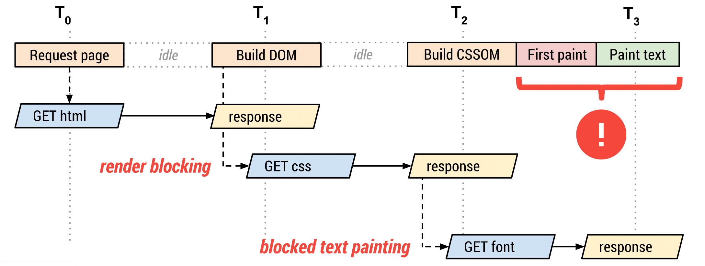
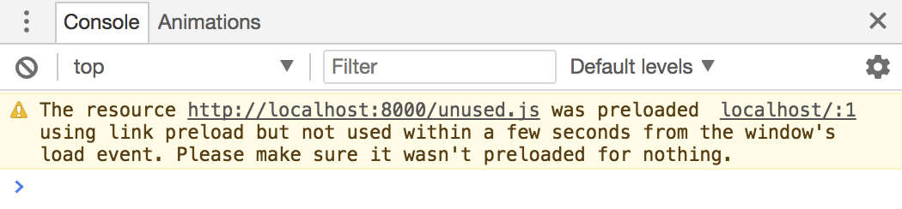
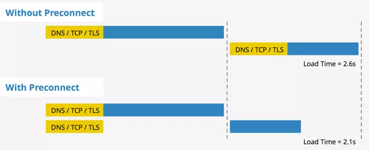
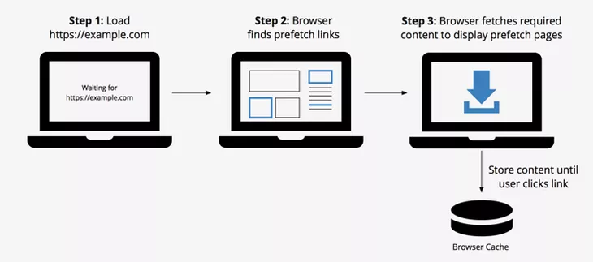
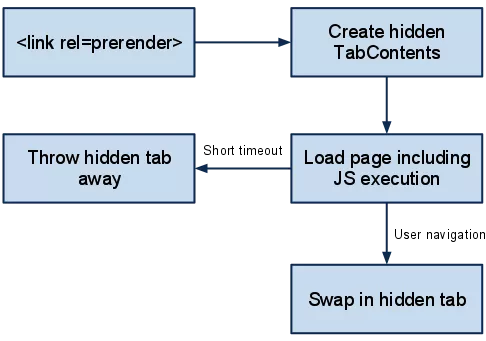
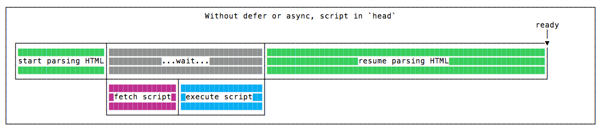
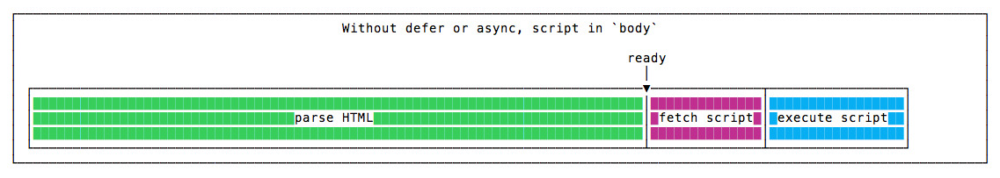
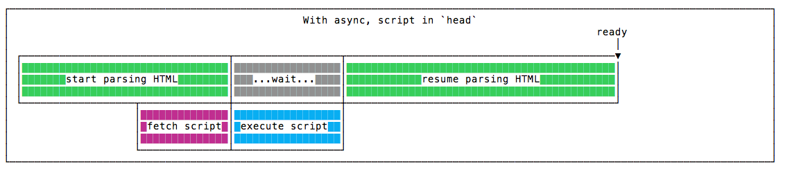
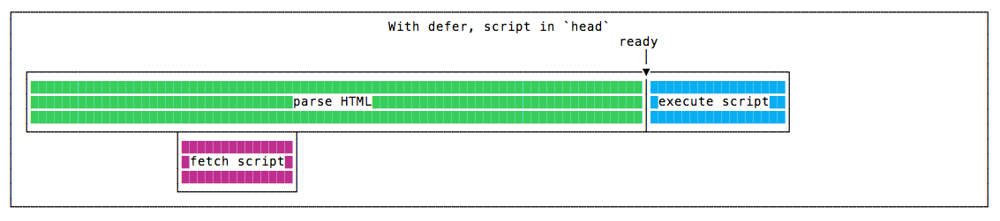

When developing with a library or framework like React, Vue, or Angular, the index.html that comes out of the build is generated automatically, so you might never need to look at it directly.

But if you have a solid grasp of what makes up the final html, you can put that knowledge to good use when improving performance or debugging.

## Parts

- Part 1: link, script tags
- Part 2: meta tags (Open Graph), lang, etc.

## TL;DR

- link tag
  - preload: a resource needed for the current screen=
  - prefetch: not❌ needed for the current screen, a resource needed for a later page
  - preconnect: for when you're requesting multiple resources from the same domain
- script tag
  - async: for scripts unrelated to DOM manipulation
  - defer: for scripts related to DOM manipulation
  - For an SPA's bundle.js, you may not be able to expect much of a reduction in request time

## link - preload / prefetch / preconnect

The `link` tag expresses the relationship between a web page and an external resource. It's most commonly used to bring in css, but it's also used for site icons, sitemaps, and scripts.

Beyond the basic attributes, you can also define a `media` attribute. If you specify a `media` attribute, the css is only loaded when that condition is met.

```html
<link href="print.css" rel="stylesheet" media="print">
<link href="mobile.css" rel="stylesheet" media="screen and (max-width: 600px)">
```

Depending on the option, you can have a resource load before other resources, or have the connection established ahead of time.

### preload

`<link rel="preload">` declares that a resource is needed right now, and sets it up to be fetched **as fast as possible.**



A typical use case is fonts.

```html
<link rel="preload" as="font" crossorigin="crossorigin" type="font/woff2" href="myfont.woff2">
```

If you request a font without preload, text rendering can be delayed, because the font request doesn't start until after the DOM and CSSOM trees are built.
The order in which the browser paints the screen is as follows.

1. The browser requests the HTML file.
2. The browser starts parsing the HTML response and building the DOM.
3. The browser discovers CSS, JS, and other resources, and dispatches requests for them.
4. Once the browser has received all the CSS content, it builds the CSSOM and combines it with the DOM tree to build the render tree.
    - The render tree figures out which fonts are needed, and the font request begins.
5. The browser performs layout work and paints the content to the screen.

For content that needs to show up immediately after the render tree is built, this sequence can cause the font to be applied late.

> Implementation details differ from browser to browser. For more information, see [Web Font Optimization](https://developers.google.com/web/fundamentals/performance/optimizing-content-efficiency/webfont-optimization#%EB%B8%8C%EB%9D%BC%EC%9A%B0%EC%A0%80_%EB%8F%99%EC%9E%91).

For this reason, you should **raise the priority** of essential resources by requesting them via preload. When you request a font via `preload`, the font request goes out without waiting for CSSOM generation to finish.

If a resource fetched via `preload` isn't used within 3 seconds, Chrome Dev Tools shows the following warning.



### preconnect

`<link rel="preconnect">` sets things up so the connection is already established before the HTTP request reaches the server.

When requesting a resource from a different domain, you can't guarantee that server's response speed. In particular, when a secure connection is required, the work of establishing the connection — DNS lookup, redirection, TCP handshake, and so on — can take longer than actually receiving the data.

`preconnect` means **establishing this connection ahead of time.** Here's how you use it.

```html
<link rel="preconnect" href="https://example.com">
```

In practice, the following actions are performed.

1. Resolve the URL from the href attribute, determine whether the URL is valid, handle it as an error if it's invalid, and determine whether it's HTTP/HTTPS

2. If it's valid, treat this URL as the origin

3. Assign the cors status to the target element's crossOrigin attribute

4. If the value of the cors attribute is anonymous, or credential is not false, attempt the connection

5. Perform (DNS+TCP) for http, or (DNS+TCP+TLS) for https, then leave the connection open; the user agent decides how many connections to open



Using preconnect lets you eliminate a round trip, and as a result you can cut down a lot of time.


You can request Google's CSS and font from the same domain at the same time, which ultimately eliminates 3 round trips.

### prefetch

`<link rel="prefetch">` requests all the high-priority resources first, then fetches the remaining resources during idle time and stores them in the browser cache.
> So it isn't suitable for resources that are needed right away on the first page.

There are 3 kinds of `prefetch`.

- Link Prefetching
- DNS Prefetching
- Prerendering

**1. Link Prefetching**



As explained above, `prefetching` fetches a resource and stores the result in the browser cache.

> "This technique has the potential to speed up many interactive sites, but won't work everywhere. For some sites, it's just too difficult to guess what the user might do next. For others, the data might get stale if it's fetched too soon. It's also important to be careful not to prefetch files too soon, or you can slow down the page the user is already looking at. - Google Developers"

This is saying that you need to judge which resources are worth requesting via `prefetch` before using it. Using it carelessly can slow down the page the user is currently looking at.

You should also make sure to check [browser support coverage](https://caniuse.com/#search=prefetch) before using it.

**2. DNS Prefetching**

This performs a [DNS Lookup]([https://developer.mozilla.org/en-US/docs/Glossary/DNS](https://developer.mozilla.org/en-US/docs/Glossary/DNS)) in the background.

By eliminating the time a DNS Lookup would take when the resource is actually needed, you can fetch the resource faster.

Here's how to use it.

```html
<!-- Prefetch DNS for external assets -->
<link rel="dns-prefetch" href="//fonts.googleapis.com">
<link rel="dns-prefetch" href="//www.google-analytics.com">
<link rel="dns-prefetch" href="//cdn.domain.com">
```

**3. Prerendering**

`prerendering` is similar to prefetch in that it requests a resource that might be needed ahead of time.

The difference is that `prerendering` **actually renders the entire page in the background.**



Requesting prerendering for a resource that ends up not being needed wastes bandwidth.

**Note: crossorigin**

When requesting an external resource, if there's no `crossorigin` attribute, the loaded resource is discarded and a newly fetched copy with different attributes is applied instead. This is required information when requesting from an external domain, and the possible values are as follows.

- anonymous: means no extra credentials are required for the cors request.
- user-credentials: the cross-origin request is performed once credentials like cookies or auth tokens succeed.

## script - async / defer

While parsing HTML, when the parser encounters a script tag, that work gets blocked. css is likely to be an essential piece for rendering the screen, so it's placed in the `head`, but delaying rendering to load JavaScript related to 'behavior' isn't a great user experience.

For this reason, most script tags are declared right before `</body>`. But besides that approach, there are also ways to use [async](https://www.w3schools.com/tags/att_script_async.asp) or [defer](https://www.w3schools.com/tags/att_script_defer.asp).

### Typical usage




As you can see in the images above, a script tag blocks HTML parsing.

So if you place a script tag in the head, the amount of time users spend looking at a blank screen increases. To avoid this, it's placed at the very bottom of the body tag.

> This approach is a fallback for browsers that don't support async and defer.

### async



The async attribute means nothing unless it's placed in the `head`.
> It behaves exactly as if it weren't used at all.

The script is requested asynchronously, and once the fetch completes, HTML parsing stops and the script runs. Once execution finishes, parsing resumes.

### defer



Like async, the script is fetched asynchronously, but it runs after HTML parsing finishes. Since it doesn't block HTML parsing, the screen can render quickly.

So how do these two attributes we just looked at apply to a Single Page Application (hereafter SPA)?

### SPA

An SPA doing Client Side Rendering renders the screen by parsing JS. Let's assume there are two JS files.

- external.js: an external module
- app.js: a JS file under the `src` folder (used to draw the screen)

```html
<!DOCTYPE html>
<html lang="ko">
<head>
  <title>SPA - script</title>
</head>
<body>
  <div id="wrap"></div>
  <script src="external.js"></script>
  <script src="app.js"></script>
</body>
</html>
```

#### async

`external.js` is requested, and `app.js` is requested right after. Once loading `external.js` finishes, it executes immediately and HTML Parsing is paused. If `app.js` also finishes loading while HTML Parsing hasn't finished, parsing is paused and the script runs.

Since async doesn't guarantee order when requesting two or more scripts like this, it's best used only for scripts unrelated to DOM manipulation.

#### defer

defer also requests both scripts asynchronously. However, while `defer` requests `vendor.js` and `app.js` asynchronously, it guarantees their execution order.

#### When should you use it

Using `defer` or `async` can reduce script request time. However, in an SPA, HTML Parsing itself doesn't take much time to begin with. So using the two above might not give you a dramatic performance improvement.

> This is because, in the example above, the point at which the screen is displayed comes after app.js runs, and an SPA's HTML has a very simple structure.

In fact, if you request a script that manipulates the DOM via `async`, whose execution order isn't guaranteed, errors can occur. It's better suited for scripts with no dependencies, like analytics scripts such as GA.

## Reference

- [https://developer.mozilla.org/ko/docs/Web/HTML/Element/link]()

- [https://medium.com/@pakss328/resource-hint-8fb4e56ee042](https://medium.com/@pakss328/resource-hint-8fb4e56ee042)

- [https://www.keycdn.com/blog/resource-hints](https://www.keycdn.com/blog/resource-hints)

- [https://www.smashingmagazine.com/2019/04/optimization-performance-resource-hints/](https://www.smashingmagazine.com/2019/04/optimization-performance-resource-hints/)

- [https://www.smashingmagazine.com/2016/02/preload-what-is-it-good-for/](https://www.smashingmagazine.com/2016/02/preload-what-is-it-good-for/)

- [https://developers.google.com/web/fundamentals/performance/optimizing-content-efficiency/webfont-optimization#optimizing_loading_and_rendering](https://developers.google.com/web/fundamentals/performance/optimizing-content-efficiency/webfont-optimization#optimizing_loading_and_rendering)

- [https://blog.asamaru.net/2017/05/04/script-async-defer/](https://blog.asamaru.net/2017/05/04/script-async-defer/)

- [https://flaviocopes.com/javascript-async-defer/](https://flaviocopes.com/javascript-async-defer/)

- [https://medium.com/@DivyaGupta26/when-to-async-when-to-defer-while-using-javascript-frameworks-28a7cf101ca4](https://medium.com/@DivyaGupta26/when-to-async-when-to-defer-while-using-javascript-frameworks-28a7cf101ca4)
