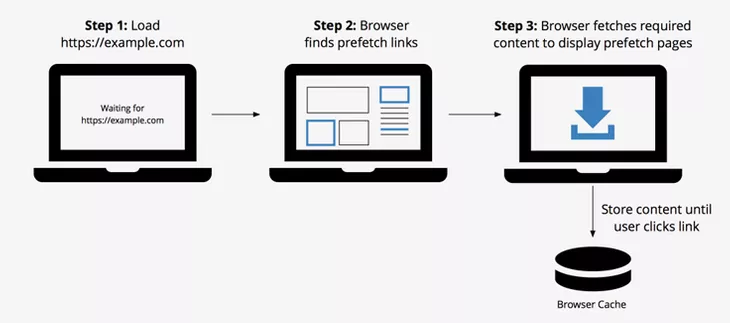

React, Vue, Angular 같은 Library 혹은 Framework로 개발할 경우 빌드 결과물인 index.html은 자동으로 생성되기 때문에 직접 볼 필요가 없을 수도 있습니다.

하지만, 최종 html의 구성 요소를 잘 파악하고 있다면 성능 개선이나 디버깅하는 상황에서 용이하게 활용할 수 있습니다.

## Parts

- 1편: link, script tag
- 2편: meta tag(Open Graph), lang 등

## TL;DR

- link tag
  - preload: 현재 화면에 필요한 리소스=
  - prefetch: 현재 화면에 필요한 것❌, 이후 페이지에 필요한 리소스
  - preconnect: 같은 도메인에 여러개의 리소스를 요청할 때
- script tag
  - async: DOM 제어와 관련 없는 스크립트
  - defer: DOM 제어와 관련 있는 스크립트
  - SPA의 bundle.js에 대해서는 요청 시간 단축 효과를 기대하기 어려울 수 있음

## link - preload / prefetch / preconnect

`link` tag는 웹 페이지와 외부 리소스의 관계를 나타냅니다. css를 가져올 때 많이 사용하지만, 사이트 아이콘, sitemap 그리고 script를 가져올 때도 사용됩니다.

기본 속성 외에 `media` 속성을 추가로 정의할 수 있습니다. `media`속성을 적어줄 경우, 이 조건을 만족하는 경우에만 css를 불러옵니다.

```html
<link href="print.css" rel="stylesheet" media="print">
<link href="mobile.css" rel="stylesheet" media="screen and (max-width: 600px)">
```

옵션에 따라 다른 리소스보다 먼저 로드 되거나 미리 연결을 맺게 할 수 있습니다.

### preload

`<link rel="preload">`는 현재 해당 리소스가 필요하며, **가능한 빠르게** 가져오도록 설정하는 것입니다.


대표적인 사용 사례는 font입니다.

```html
<link rel="preload" as="font" crossorigin="crossorigin" type="font/woff2" href="myfont.woff2">
```

preload 없이 font를 요청할 경우 텍스트 렌더링이 지연될 수 있습니다. font요청은 DOM, CSSOM 트리 생성 이후에 시작되기 때문입니다.
브라우저가 화면을 그리는 순서는 다음과 같습니다.

1. 브라우저가 HTML 파일을 요청합니다.
2. 브라우저가 HTML 응답 파싱과 DOM 구성을 시작합니다.
3. 브라우저가 CSS, JS 및 기타 리소스를 발견하고 요청을 발송합니다.
4. 브라우저가 모든 CSS 콘텐츠가 수신된 후 CSSOM을 생성하고 이를 DOM 트리와 결합하여 렌더링 트리를 생성합니다.
    - 렌더링 트리가 필요한 font가 무엇인지 확인하고, font 요청이 시작됩니다.
5. 브라우저가 레이아웃 작업을 수행하고 콘텐츠를 화면에 Paint 합니다.

Rendering 트리 생성 이후 바로 보여야 하는 컨텐츠의 경우 위 상황으로 인해 font가 늦게 적용되어 보일 수 있습니다.

> 브라우저마다 구현 방식이 다릅니다. 자세한 내용은 [Web Font Optimization](https://developers.google.com/web/fundamentals/performance/optimizing-content-efficiency/webfont-optimization#%EB%B8%8C%EB%9D%BC%EC%9A%B0%EC%A0%80_%EB%8F%99%EC%9E%91) 을 참고해주세요.

이런 이유로, 필수적으로 사용되는 리소스는 preload를 통해 요청함으로써 **우선순위를 높여야 합니다.** font를 `preload`로 요청할 경우 CSSOM 생성이 완료되는 것을 기다리지 않고 font를 요청합니다.

만약 `preload`를 통해 가져온 리소스를 3초 이내로 사용하지 않을 경우 Chrome Dev Tools에서는 다음과 같은 경고를 보여줍니다.


### preconnect

`<link rel="preconnect">` 는 HTTP 요청이 server에 전달되기 전에 미리 연결을 맺어두도록 설정하는 것입니다.

다른 Domain에 리소스를 요청하는 상황에서는 해당 서버의 응답 속도를 보장할 수 없습니다. 특히, 보안 연결이 필요할 경우 데이터를 받아오는 작업보다 DNS Lookup, Redirection, TCP Handshake 등 connection을 맺는 작업이 더 오래 걸릴 수 있습니다.

`preconnect`는 이런 연결을 **미리 맺어 둔다**는 뜻입니다. 사용법은 다음과 같습니다.

```html
<link rel="preconnect" href="https://example.com">
```

실제로는 다음 동작들이 수행됩니다.

1. href 속성으로 URL을 해석, URL이 유효한지 해석하여 유효하지 않을 경우 error 처리를 하고 HTTP/HTTPS 인지 판단

2. 유효할 경우 이 URL을 origin으로 판단

3. cors에 대한 상태를 대상 Element의 crossOrigin 속성에 할당합니다.

4. cors의 속성의 값이 anonymous 이거나 credential이 false가 아닐 경우 연결을 시도

5. http의 경우 (DNS+TCP), https의 경우 (DNS+TCP+TLS)를 수행, 이후 connection을 열어두게 되며, 얼마나 많은 연결을 하게 될지는 user agent가 결정합니다.


preconnect를 이용하면 round trip을 제거할 수 있고, 이 결과로 소요 시간을 많이 줄일 수 있습니다.


같은 도메인의 Google CSS와 font를 동시에 요청할 수 있어, 결과적으로 3개의 Round Trip을 제거할 수 있습니다.

### prefetch

`<link rel="prefetch">`는 우선순위가 높은 리소스들을 모두 요청한 후 나머지 리소스들을 idle time에 가져와서 브라우저 캐시에 저장하는 것입니다.

`prefetch`에는 3가지 종류가 있습니다.

- Link Prefetching
- DNS Prefetching
- Prerendering

**1. Link Prefetching**



위에서 설명한 대로, `prefetching`은 리소스를 fetch 하고 그 결과를 브라우저 캐시에 저장합니다.

> “This technique has the potential to speed up many interactive sites, but won’t work everywhere. For some sites, it’s just too difficult to guess what the user might do next. For others, the data might get stale if it’s fetched too soon. It’s also important to be careful not to prefetch files too soon, or you can slow down the page the user is already looking at. - Google Developers”

어떤 자원을 `prefetch`로 요청해야 할지 판단해서 사용해야 한다고 말하고 있습니다. 무분별하게 사용하면 현재 사용자가 보고 있는 페이지가 느려질 수 있기 때문입니다.

또한, [브라우저 지원 범위](https://caniuse.com/#search=prefetch)도 확인해서 사용해야 합니다.

**2. DNS Prefetching**

백그라운드에서 [DNS Lookup]([https://developer.mozilla.org/en-US/docs/Glossary/DNS](https://developer.mozilla.org/en-US/docs/Glossary/DNS))을 수행하는 것입니다.

리소스가 필요할 때 DNS Lookup에 소요되는 시간을 없앰으로써 리소스를 더 빠르게 가져올 수 있습니다.

사용 방법은 다음과 같습니다.

```html
<!-- Prefetch DNS for external assets -->
<link rel="dns-prefetch" href="//fonts.googleapis.com">
<link rel="dns-prefetch" href="//www.google-analytics.com">
<link rel="dns-prefetch" href="//cdn.domain.com">
```

**3. Prerendering**

`prerendering`은 필요할 수도 있는 리소스를 미리 요청한다는 점에서 prefetch와 같습니다.

차이점은 `preredering`은 **실제로 전체 페이지를 백그라운드에서 렌더링**한다는 점입니다.


필요 없는 자원에 대해 prerendering을 요청할 경우 bandwith 낭비가 발생합니다.

**Note. crossorigin**

외부 리소스를 요청할 때, `crossorigin` 항목이 없다면 로드된 리소스를 무시하고 새로 가져온 다른 속성이 적용됩니다. 외부 도메인에서 요청 시 필요한 정보이며 가능한 값은 다음과 같습니다.

- anonymous: cors 요청 시 별도의 요청 값이 필요하지 않다는 뜻입니다.
- user-credentials:  쿠키, 인증 서 등의 증명이 성공하면 cross-origin 요청이 수행됩니다.

## script - async / defer

HTML을 parsing 하는 과정에서 script tag를 만나면 해당 작업이 block 됩니다. css는 화면 렌더링에 필수적인 요소일 가능성이 높기 때문에 `head`에 위치시키지만, '동작'과 관련된 JavaScript를 load 하느라 Rendering을 지연시키는 것은 좋은 사용자 경험이라고 할 수 없습니다.

이런 이유로 대부분 script tag를 `</body>`바로 앞에 선언합니다. 하지만 이렇게 사용하는 것 말고도, [async](https://www.w3schools.com/tags/att_script_async.asp)나 [defer](https://www.w3schools.com/tags/att_script_defer.asp)를 사용하는 방법도 있습니다.

### 일반적인 사용


위 그림에서 알 수 있듯 script tag는 HTML Parsing을 block 합니다.

따라서, head에 script tag를 위치시킬 경우 사용자가 흰 화면을 보는 시간이 늘어나게 됩니다. 이를 막기 위해 body tag 제일 하단에 위치 시킵니다.

> async와 defer를 지원하지 않는 브라우저에서 이 방법으로 대응합니다.

### async


async 속성은 `head`에 위치하지 않으면 아무 의미가 없습니다.
> 사용하지 않은 것과 똑같이 동작

script를 비동기로 요청하고 fetch가 완료되면 HTML Parsing을 중지하고 script를 실행합니다. 실행이 완료된 후 다시 Parsing 작업이 진행됩니다.

### defer


async와 같이 script를 비동기로 가져오고 HTML Parsing 이후에 실행됩니다. HTML의 parsing을 막지 않아서, 화면이 빠르게 렌더링 될 수 있습니다.

방금 살펴 본 두 속성은 Single Page Application(이하 SPA)에서는 어떻게 적용될까요?

### SPA

Client Side Rendering을 하는 SPA는 JS Parsing을 통해 화면을 Rendering 합니다. 두 가지 JS 파일이 있다고 가정해보겠습니다.

- external.js: 외부 module
- app.js: `src` 폴더 하위의 JS 파일(화면을 그리기 위한 용도)

```html
<!DOCTYPE html>
<html lang="ko">
<head>
  <title>SPA - script</title>
</head>
<body>
  <div id="wrap"></div>
  <script src="external.js"></script>
  <script src="app.js"></script>
</body>
</html>
```

#### async

`external.js`를 요청한 후 바로 `app.js`를 요청합니다. `external.js`에 대한 로드가 완료되면 즉시 실행되고 HTML Parsing이 중단됩니다.`app.js`역시 로드가 완료되었을 때 HTML Parsing이 끝나지 않았다면 중단되고 script가 실행됩니다.

이렇게 두 가지 이상의 스크립트를 요청할 때 async는 순서가 보장되지 않으므로 DOM 제어와 관련 없는 스크립트에 대해서만 사용하는 것이 좋습니다.

#### defer

defer 역시 두 가지 스크립트를 비동기로 요청합니다. 다만, `defer`는 `vendor.js`와 `app.js`를 비동기로 요청하지만, 실행 순서는 보장됩니다.

#### 언제 써야 할까?

`defer`나 `async`를 사용하면 스크립트 요청 시간을 줄일 수 있습니다. 하지만, SPA에서는 HMTL Parsing 자체에는 많은 시간이 소요되지 않습니다. 따라서, 위 두 가지를 사용한다고 해서 비약적인 성능 개선을 기대하기는 어려울 수도 있습니다.

> 위 예제에서 화면이 표현되는 시점은 app.js 실행 이후이고, SPA의 HTML은 매우 간단한 구조이기 때문입니다.

오히려, DOM을 제어하는 스크립트를 실행 순서가 보장되지 않는 `async`로 요청할 경우 오류가 발생할 수 있습니다. 의존성이 없는 GA 같은 통계에 관한 스크립트 등에 사용하는 것이 적합합니다.

## Reference

- [https://developer.mozilla.org/ko/docs/Web/HTML/Element/link]()

- [https://medium.com/@pakss328/resource-hint-8fb4e56ee042](https://medium.com/@pakss328/resource-hint-8fb4e56ee042)

- [https://www.keycdn.com/blog/resource-hints](https://www.keycdn.com/blog/resource-hints)

- [https://www.smashingmagazine.com/2019/04/optimization-performance-resource-hints/](https://www.smashingmagazine.com/2019/04/optimization-performance-resource-hints/)

- [https://www.smashingmagazine.com/2016/02/preload-what-is-it-good-for/](https://www.smashingmagazine.com/2016/02/preload-what-is-it-good-for/)

- [https://developers.google.com/web/fundamentals/performance/optimizing-content-efficiency/webfont-optimization#optimizing_loading_and_rendering](https://developers.google.com/web/fundamentals/performance/optimizing-content-efficiency/webfont-optimization#optimizing_loading_and_rendering)

- [https://blog.asamaru.net/2017/05/04/script-async-defer/](https://blog.asamaru.net/2017/05/04/script-async-defer/)

- [https://flaviocopes.com/javascript-async-defer/](https://flaviocopes.com/javascript-async-defer/)

- [https://medium.com/@DivyaGupta26/when-to-async-when-to-defer-while-using-javascript-frameworks-28a7cf101ca4](https://medium.com/@DivyaGupta26/when-to-async-when-to-defer-while-using-javascript-frameworks-28a7cf101ca4)
