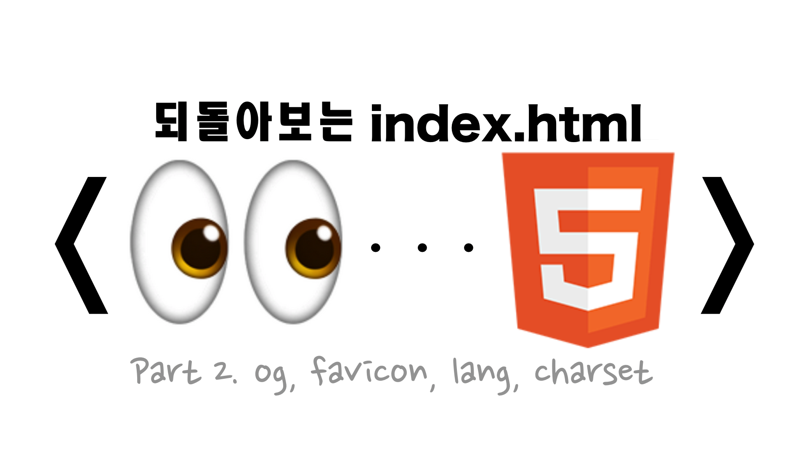

In [Part 1](https://so-so.dev/web/index-html-1/), we looked at the link tag and the script tag. In this post, we'll look at OpenGraph (og for short), favicon, charset, and lang.

## OpenGraph Protocol


The OpenGraph Protocol (og for short) is a convention, defined by Facebook, for how to write _metadata for an HTML document_. When you share a url, the title, thumbnail, and so on that get displayed are what that site's bot figures out and shows based on the og information.

## 🖼 Information that represents a URL

Sharing a web page's url displays information like the following, though it can vary slightly by platform.


Where does each piece of this information come from?

### Title

The 'Revisiting index.html - Part 1' portion is the content of the document's `<meta property="og:title">`. If you visit the [link](https://so-so.dev/web/index-html-1/) and open dev tools, you can confirm the following.

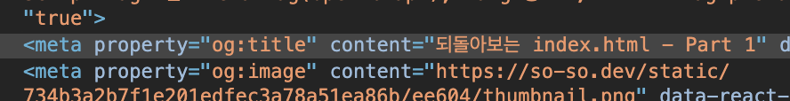

### description

This is the content of `<meta property="og:description">`. In the screenshot above, the description text is long, so it's been truncated with an ellipsis.

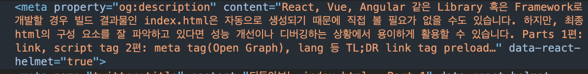

### thumbnail(og:image)

This is the content of `<meta property="og:image">`. One thing to watch out for with `og:image` is that its content needs to **exactly** state the information the bot needs to work with.

```html
<!-- ❌ An absolute path for the image gets treated as invalid og:image info -->
<meta property="og:image" content="/static/image.png">

<!-- ⭕️ A correct example -->
<meta property="og:image" content="https://so-so.dev/static/image.png">
```

> On this blog, I used _siteUrl_ to write it out [like this]([https://github.com/SoYoung210/SOSO/blob/0321ca7b6fa8edf6965faead85ea9953b942ffad/src/components/head/index.jsx#L39](https://github.com/SoYoung210/SOSO/blob/0321ca7b6fa8edf6965faead85ea9953b942ffad/src/components/head/index.jsx#L39)).
> 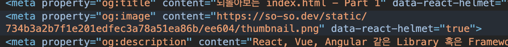

Writing out this kind of page-related information isn't just for how it's displayed when a url gets shared — it's also used to influence search results and boost SEO scores.

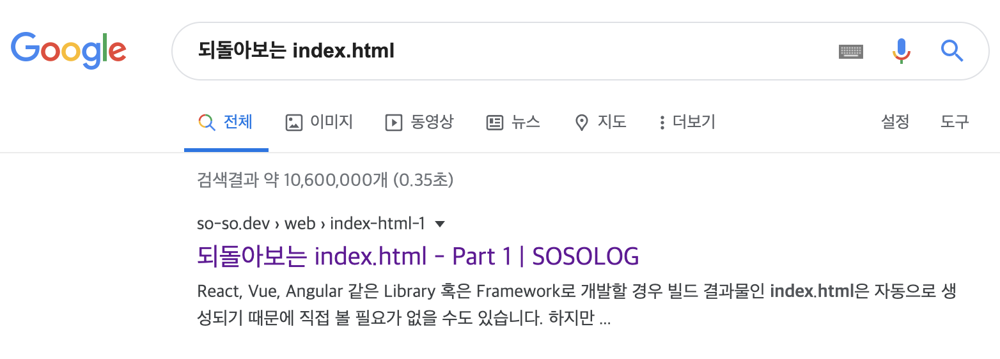

## 🤖 Favicon

If you look at Chrome, you'll notice a small icon next to the current page's title.

This is called the `favicon`.

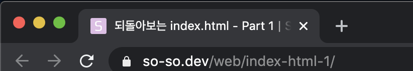

Add an icon file with an `ico` or `png` extension, and write the following to apply a favicon to your website.

```html
<link rel="shortcut icon" href="favicon.ico" type="image/x-icon">
```

> If you need to support IE, you must use the _ico_ format.

An ico favicon supports multiple sizes, so you can pack several icon sizes into a single ico file and use that, but a png favicon can't do this. So, you need to declare every size you need, as shown below.

```html
<link rel="icon" href="favicon-32.png" sizes="32x32">
<link rel="icon" href="favicon-16.png" sizes="16x16">
<link rel="icon" href="favicon-48.png" sizes="48x48">
<link rel="icon" href="favicon-64.png" sizes="64x64">
<link rel="icon" href="favicon-128.png" sizes="128x128">
```

When using a png favicon, here's which favicon each browser ends up using:

- Firefox and Safari use whichever favicon is provided last.
- Chrome on Mac uses the 32x32 favicon unless it's an ico favicon.
- Chrome on Windows uses the ico favicon unless a 16x16 is declared first.
- If none of the above options are available, both Chromes use whichever favicon is declared first, while Firefox and Safari use whichever is declared last. Chrome on Mac actually ignores the 16x16 favicon and only uses the 32x32 favicon when it needs to scale down to 16x16 on a non-retina device.
- Opera picks one of the available icons at random.

so-so.dev has a number of files applied under the name `apple-touch-icon`, which are used for the iOS home-screen shortcut icon, Safari bookmarks, and so on.

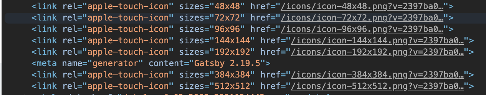

## 👻 Invisible but important pieces that make up a document

The head doesn't only hold information that's meant to stand out. In fact, some of its most important elements never surface at all.

### charset

This is about the encoding a web page allows. Most pages use `utf-8`, because `utf-8` covers a huge range of characters — Korean, English, Japanese, and many more.

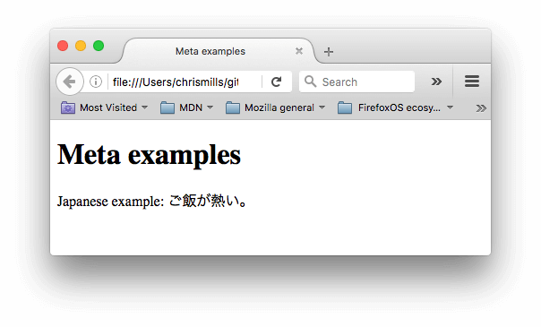

If you set it to `ISO-8859-1` for Latin characters instead, the page in the screenshot above won't render correctly.

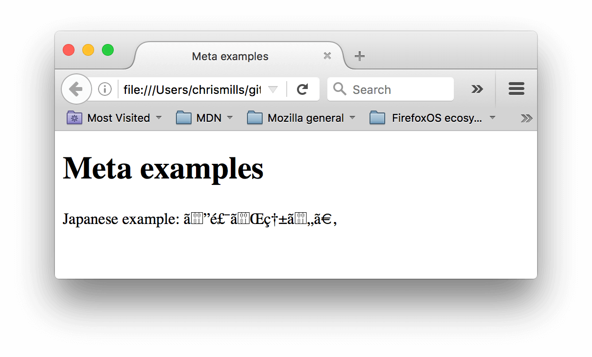

### lang

`lang` is the attribute that specifies language. The screenshot below shows, respectively, the default, ko, ja (Japanese), and zh (Chinese) settings. Even with the same sans-serif font, the way it's rendered differs by language.

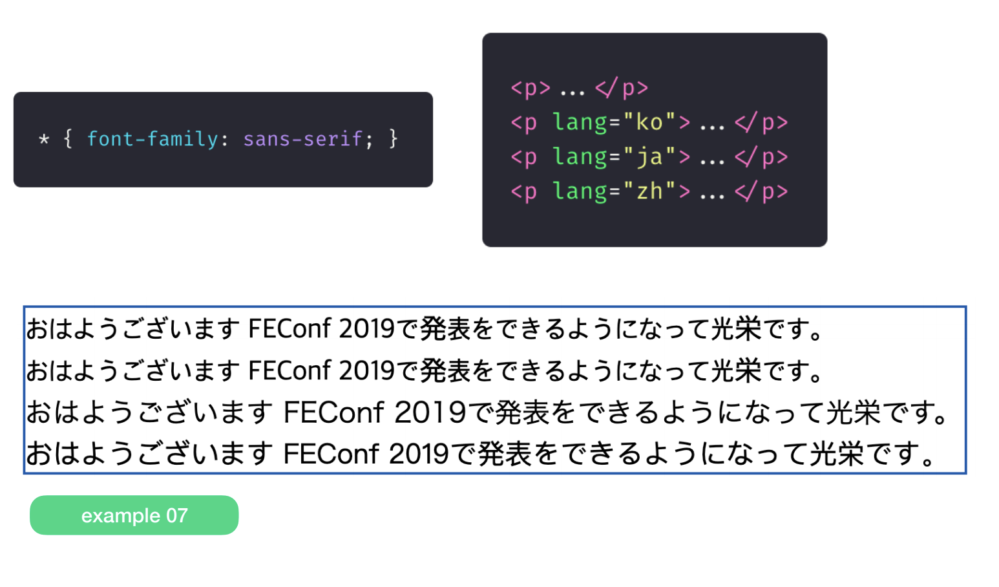

It's best to specify the `lang` attribute accurately so there are no issues with font rendering.

> Source: [Font rendering issues you'll run into once you build a global service](https://drive.google.com/file/d/1abjV5imziJNg62ZE5dH5LS4VJK0f3nZf/view)

Usually, the `lang` attribute is specified on `<html>` (at the very top of the HTML), but if a specific tag needs a different lang, you can use it like this.

```html
<p>Japanese example: <span lang="jp">ご飯が熱い。</span>.</p>
```

### 📝[TIP] Facebook and Twitter thumbnails

How a thumbnail gets displayed can differ by platform. Let's look at Facebook and Twitter as examples.

You can preview how a link you want to check will be displayed at the following sites.

- [Facebook debugger](https://developers.facebook.com/tools/debug/)
- [Twitter validator](https://cards-dev.twitter.com/validator)

### Facebook

Facebook supports two forms of thumbnail.
> See [Facebook's image requirements](https://developers.facebook.com/docs/sharing/webmasters/images#requirements) and the [Facebook link-sharing FAQ](https://developers.facebook.com/docs/sharing/webmasters/faq?locale=ko_KR).

- large (an image of 600 x 315 pixels or larger)
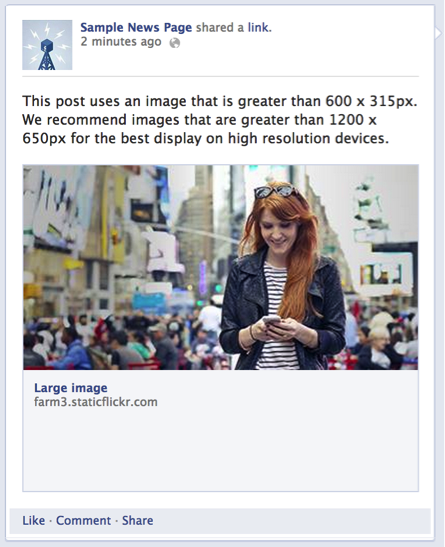

- small (smaller than 600 x 315 pixels)
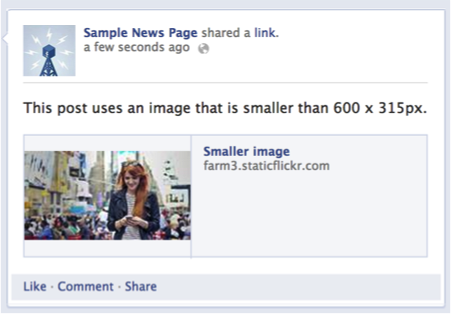

If the thumbnail unintentionally ends up as `small`, you'll need to open dev tools, download the image specified as the content of `og:image` directly, and check it yourself. **It's likely been compressed down below 600 for some reason.**

### Twitter

Twitter supports thumbnails in the form of a Card. So, alongside the `og:image` setting, you also need to set up Twitter-specific meta tags.

1. Which image to use as the thumbnail (og:image)
2. The setting for how it's shown as a card (meta tag)
Looking at [Twitter's card guide](https://developer.twitter.com/en/docs/tweets/optimize-with-cards/guides/getting-started), you can see that a `<meta name="twitter:card">` tag is required.

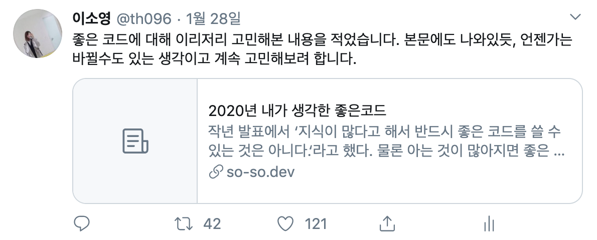

The example above has no `og:image` — only meta tag information.
> On platforms like Facebook or KakaoTalk, missing _og:image_ info sometimes gets filled in "automatically," but Twitter **will never display a thumbnail if the og:image attribute is missing.**

- large (summary_large_image)


If you want it displayed as a large card like this, set `twitter:card`'s content to `summary_large_image`.

- small (summary)
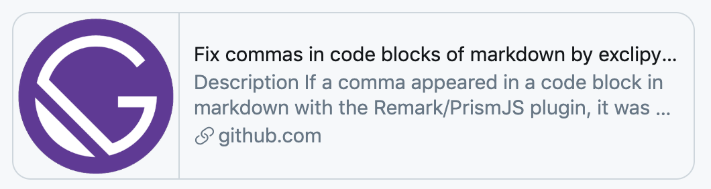

When `twitter:card`'s content is set to `summary`, it's displayed small, as shown above.

## Ref

- [https://developer.mozilla.org/ko/docs/Learn/HTML/Introduction_to_HTML/The_head_metadata_in_HTML](https://developer.mozilla.org/ko/docs/Learn/HTML/Introduction_to_HTML/The_head_metadata_in_HTML)

- [https://drive.google.com/file/d/1abjV5imziJNg62ZE5dH5LS4VJK0f3nZf/view](https://drive.google.com/file/d/1abjV5imziJNg62ZE5dH5LS4VJK0f3nZf/view)

- [https://webdir.tistory.com/337](https://webdir.tistory.com/337)
