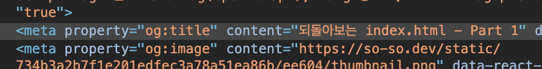
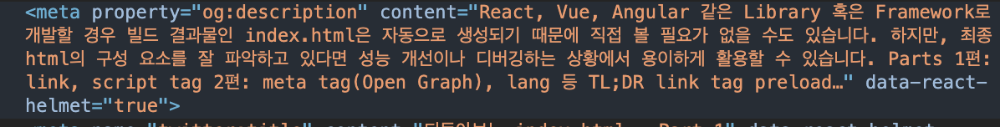
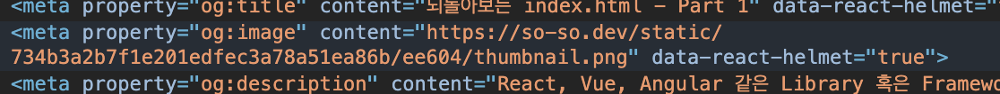
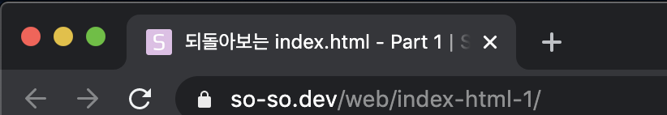
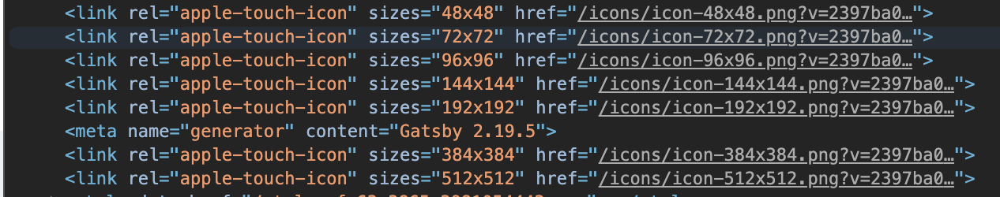
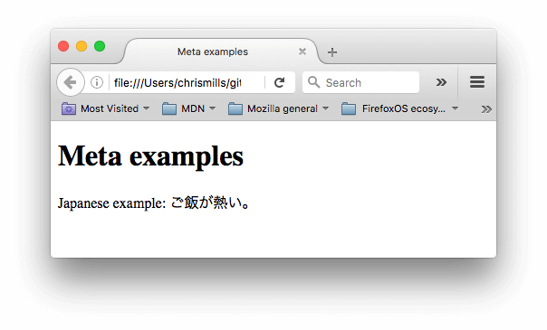
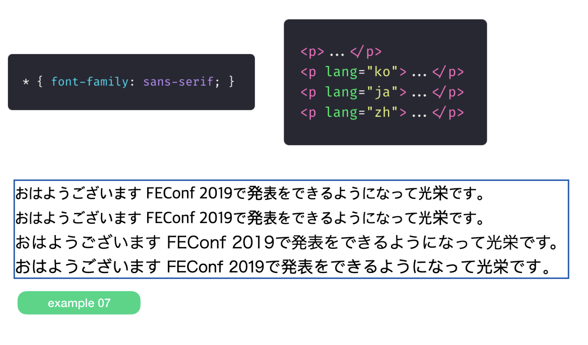
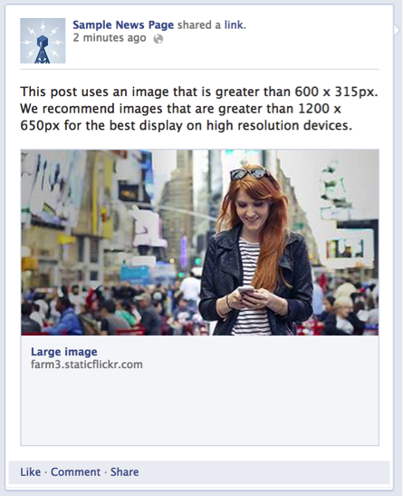
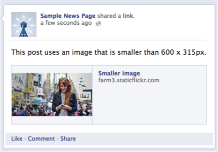
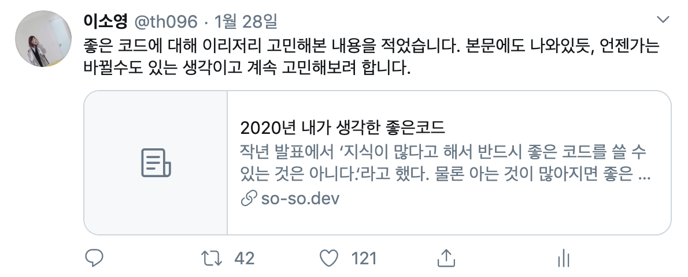

[Part 1](https://so-so.dev/web/index-html-1/)에서는 link tag와 script tag에 대해 알아보았습니다. 이번 편에서는 OpenGraph(이하 og), html lang에 대해 알아봅니다.

## OpenGraph Protocol


OpenGraph Protocol(이하 og)이란, Facebook에서 정의한 HTML문서의 메타 데이터 정보를 적는 방식에 대한 규약입니다. url공유시 표현되는 title, thumbnail등은 해당 사이트의 Bot이 og정보를 기반으로 파악하여 표현하는 것입니다.

## 🖼 URL을 표현하는 정보

웹 페이지의 url을 공유하면 매체마다 조금씩 다르긴 하지만, 다음과 같은 정보가 표현됩니다.


이 정보들은 각각 어디서 온 것일까요?

1. Title
'되돌아보는 index.html - Part 1' 부분은 문서의 `<meta property="og:title" />`의 content 내용입니다. 위 링크로 접속해서 개발자 도구를 통해 살펴보면 아래와 같은 내용이 표현되어 있습니다.



2. description
`<meta property="og:description" />`의 content입니다. 위 사진에서는 description의 내용이 길어 말줄임표 처리 된것입니다.



3. thumbnail(og:image)

`<meta property="og:image" />`의 content입니다. `og:image`에서 주의 해야할 점은, `content="/static/image.png`처럼 절대 경로로 사용하면 안된다는 것이다. Bot이 가져가야 하는 정보를 정확히 적어 주는 것이 중요합니다.

> 이 블로그에서는 `siteUrl`을 이용해서 [이렇게]([https://github.com/SoYoung210/SOSO/blob/0321ca7b6fa8edf6965faead85ea9953b942ffad/src/components/head/index.jsx#L39](https://github.com/SoYoung210/SOSO/blob/0321ca7b6fa8edf6965faead85ea9953b942ffad/src/components/head/index.jsx#L39)) 적어 주었습니다.
> 

이렇게 페이지 관련 정보를 적어주는 것은 url공유 시에 정보를 표현하기 위함도 있지만, SEO점수를 높이는 데에도 활용 됩니다.

- title과 description정보가 아래 사진과 같이 검색 결과에 노출됩니다. **되돌아보는~ 으로 곧 고치기**


### Favicon

Chrome으로 봤을 때 현재 페이지 title옆에 작은 아이콘이 있는 것을 확인할 수 있습니다.

이를 `favicon`이라고 합니다.



`.ico`나 `png` 확장자의 아이콘 파일을 추가하고, 다음과 같이 적어 주면 웹 사이트에 favicon을 적용할 수 있습니다.
> IE를 대응 한다면 반드시 `ico`포맷을 사용해야 합니다.

```html
  <link rel="shortcut icon" href="favicon.ico" type="image/x-icon">
```

ico favicon은 multiple sizes를 지원하기에 하나의 ico 파일에 여러 사이즈의 아이콘을 넣어 두고 이를 활용할 수 있지만 png favicon은 이것이 불가능합니다. 따라서, 각각의 필요한 사이즈를 아래와 같이 모두 선언해야 합니다.

```html
    <link rel="icon" href="favicon-16.png" sizes="16x16">
    <link rel="icon" href="favicon-32.png" sizes="32x32">
    <link rel="icon" href="favicon-48.png" sizes="48x48">
    <link rel="icon" href="favicon-64.png" sizes="64x64">
    <link rel="icon" href="favicon-128.png" sizes="128x128">
```

png favicon 사용 시 브라우저 별로 사용하는 favicon은 다음과 같습니다.

- Firefox와 Safari는 마지막에 제공되는 favicon을 사용한다.
- 맥(Mac) 용 Chrome은 ico favicon이 아니라면 32x32 favicon을 사용한다.
- 윈도우즈(Windows) 용 Chrome은 16x16이 먼저 선언되지 않는다면 ico favicon이 사용된다.
- 상기 옵션 중 아무것도 사용할 수 없는 경우, 양쪽 Chrome은 먼저 선언되는 favicon을 사용하고 Firefox와 Safari는 마지막에 선언된 것이 사용된다. 사실 맥 용 Chrome은 16x16 favicon을 무시하고 non-retina 기기에서 16x16으로 크기를 줄일때만 32x32 favicon을 사용한다.
- Opera는 사용가능한 아이콘 중에서 하나를 임의로 선택하게 된다.

so-so.dev에는 `apple-touch-icon`이라는 이름으로 많은 파일들이 적용되어 있는데, 이는 iOS의 홈 화면 바로가기 아이콘, Safari 북마크 등에 사용됩니다.



### 보이지 않지만 문서를 이루는 중요한 요소

head에는 꼭 눈에 띄는 정보들만 표현되는 것은 아닙니다. 오히려, 겉으로 표현되지 않지만 중요한 요소들이 있습니다.

**charset**
웹 페이지에서 허용하는 인코딩 방식에 대한 것입니다. 대부분은 `utf-8`로 되어 있는데, 그 이유는 `utf-8`이 한국어, 영어, 일본어 등 많은 문자를 포함하기 때문입니다.



만약 (라틴어 사용을 위해) `ISO-8859-1`로 설정한다면, 위 사진의 페이지가 올바르게 표현되지 않습니다.


**lang**
`lang`은 언어를 지정하는 속성입니다. 아래 사진은 각각 default, ko, ja(일본어), zh(중국어)설정입니다. 같은 Sans-serif font이지만 언어별로 표현되는 모양이 상이합니다.



lang 속성을 정확히 명시하여 폰트 설정에 이슈가 없도록 하는 것이 좋습니다.

> 출처: [글로벌 서비스를 하게 되면 겪게 될 폰트 렌더링 문제]([https://drive.google.com/file/d/1abjV5imziJNg62ZE5dH5LS4VJK0f3nZf/view](https://drive.google.com/file/d/1abjV5imziJNg62ZE5dH5LS4VJK0f3nZf/view))

보통 `lang`속성은 `<html>`에 명시하는 것이 일반적이나,(HTML의 최 상단) 특정 tag에서만 다른 lang이 필요한 경우 다음과 같이 사용할 수 있습니다.

```html
  <p>Japanese example: <span lang="jp">ご飯が熱い。</span>.</p>
```

### 📝[TIP] Facebook, Twitter thumbnail

매체별로 thumbnail을 표현하는 방식이 다를 수 있습니다. Facebook과 Twitter를 기준으로 살펴보겠습니다.

확인하고 싶은 링크가 어떤 형태로 표현되는 지는 다음 사이트에서 미리 확인할 수 있습니다.

- [Facebook debugger](https://developers.facebook.com/tools/debug/)
- [twitter validator](https://cards-dev.twitter.com/validator)

### Facebook

페이스북은 두 가지 형태의 thumbnail을 지원합니다.
> [페이스북의 이미지 요구사항](https://developers.facebook.com/docs/sharing/webmasters/images#requirements), [페이스북 링크공유 FAQ](https://developers.facebook.com/docs/sharing/webmasters/faq?locale=ko_KR) 참고

- large(600 x 315픽셀 이상의 이미지)


- small(600 x 315픽셀보다 작은 경우)


만약, 의도하지 않게 thumbnail이 `small`로 표현될 경우, 개발자 도구에서 `og:image`의 content로 명시되어 있는 이미지를 직접 다운로드 해서 확인해봐야 합니다. **압축 설정 등의 이유로 600이하로 설정되어 있을것입니다.**

사실, facebook은 `og:image`속성이 없어도 링크의 첫 이미지를 thumbnail로 표현 해주는 경우도 있습니다.

> 하지만, 정확하게 커스텀 하고 싶다면 og tag속성을 넣어주는 것이 좋습니다.

### Twitter

트위터는 페이스북과 다르게 **og:image 속성이 없다면 절대로 thumbnail을 표현하지 않습니다.**

- card


위 예시는 `og:image`는 없고, meta tag정보만 있는 상태입니다. **Twitter는 두 가지 설정**이 필요합니다.

1. 어떤 사진을 thumbnail로 넣을지(og:image)
2. 카드 형태로 표현하는 설정(meta tag)
[트위터 card 가이드](https://developer.twitter.com/en/docs/tweets/optimize-with-cards/guides/getting-started)를 살펴보면 `<meta name="twitter:card" content="summary"></meta>`이 meta tag가 필수로 있어야 한다는 점을 알 수 있습니다.

- large(summary_large_image)


이렇게 large card형태로 표현하고 싶다면, `twitter:card`의 content를 `summary_large_image`로 설정하면 됩니다.

- small(summary)


`twitter:card`의 content를 `summary`로 설정되어 있으면 위와 같이 작게 표현됩니다.

## Ref

[https://developer.mozilla.org/ko/docs/Learn/HTML/Introduction_to_HTML/The_head_metadata_in_HTML](https://developer.mozilla.org/ko/docs/Learn/HTML/Introduction_to_HTML/The_head_metadata_in_HTML)

[https://drive.google.com/file/d/1abjV5imziJNg62ZE5dH5LS4VJK0f3nZf/view](https://drive.google.com/file/d/1abjV5imziJNg62ZE5dH5LS4VJK0f3nZf/view)

[https://webdir.tistory.com/337](https://webdir.tistory.com/337)
