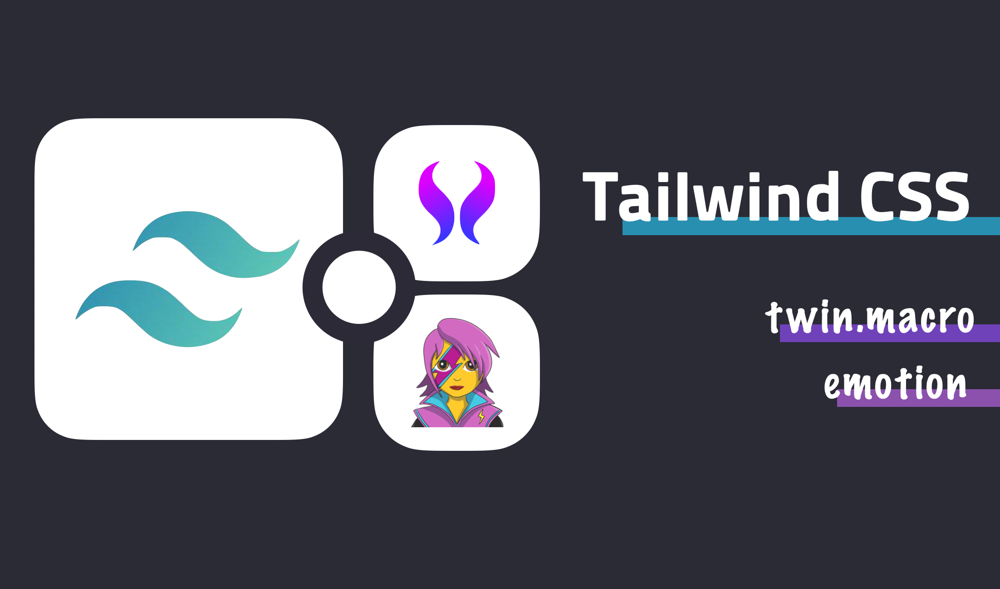
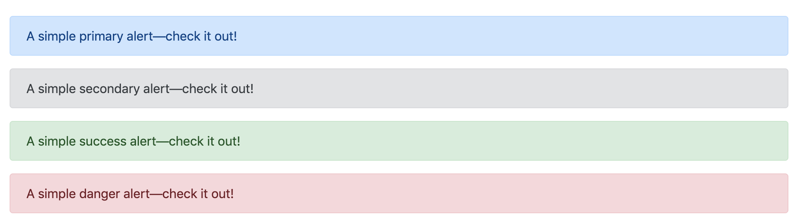
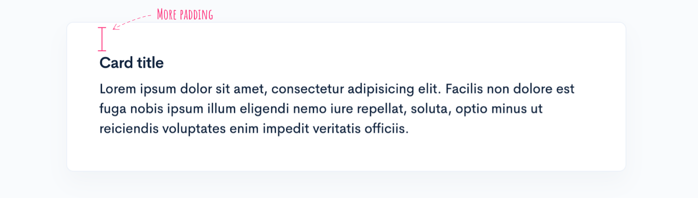
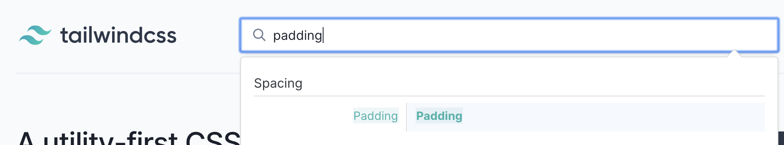
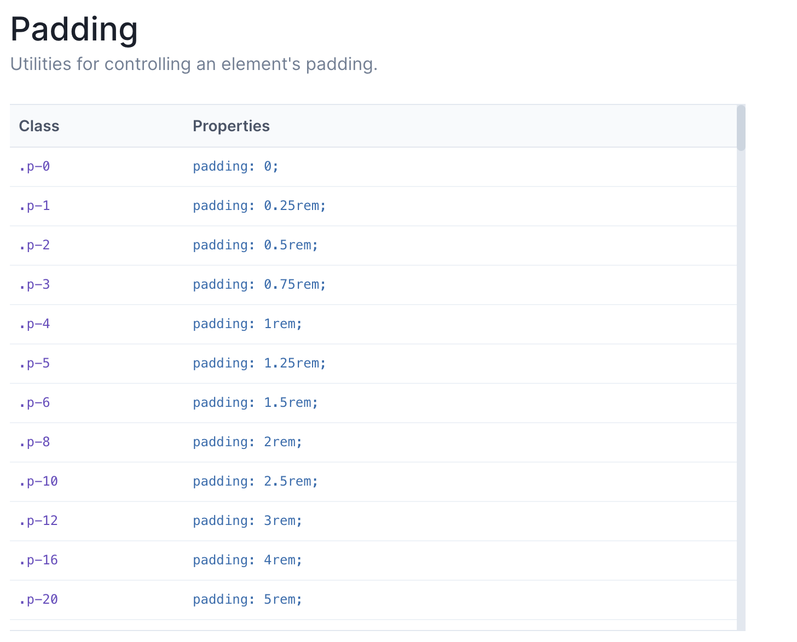
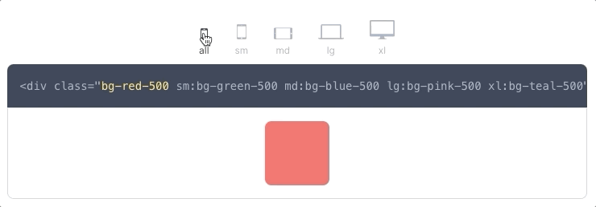
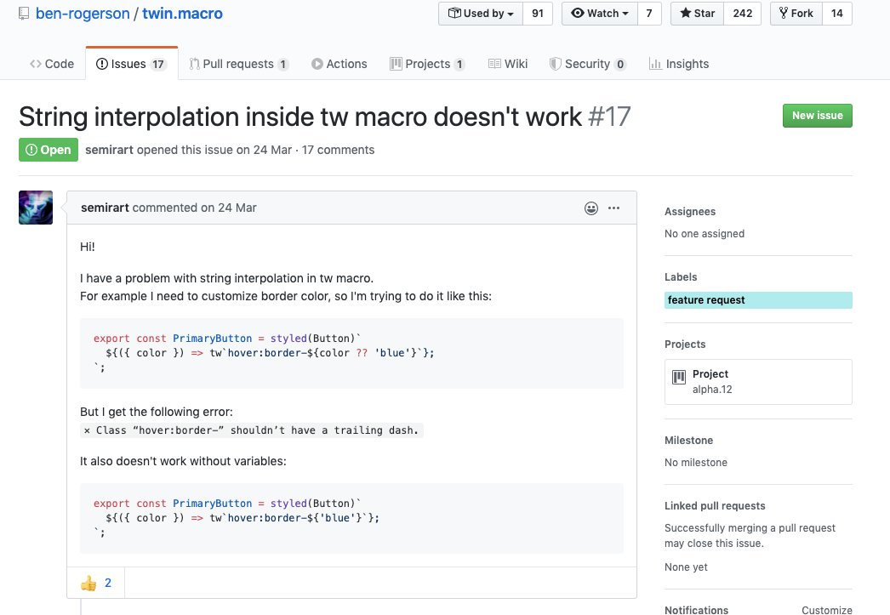

tailwind css는 utility-first CSS 프레임워크입니다.

이 글에서는 utility-first CSS에 대한 개념과 tailwind를 어떻게 사용할 수 있는 지 소개합니다.

## utility-first CSS

utility-first css라는 이름이 생소할 수 있지만, 사용하는 방법은 [Bootstrap](https://getbootstrap.com/)과 매우 유사합니다. Bootstrap에서는 다음과 같이 class를 부여하는 방식으로 스타일을 적용합니다.

```html
<div class="alert alert-primary" role="alert">
  A simple primary alert—check it out!
</div>
<div class="alert alert-secondary" role="alert">
  A simple secondary alert—check it out!
</div>
<div class="alert alert-success" role="alert">
  A simple success alert—check it out!
</div>
<div class="alert alert-danger" role="alert">
  A simple danger alert—check it out!
</div>
```

<details>
<summary><b>결과:</b></summary>
<ul>
  
</ul>
</details>
<br/>

utility-first CSS는 각 class가 담당할 스타일을 미리 정의하고 필요한 class들을 조합해서 적용하는 식으로 사용합니다.

class 이름은 다음과 같은 형태로 짓습니다.

```css
.{property}{side}-{size}
```

### Example

**margin**과 **padding**으로 간단한 예시를 들어보자면 아래와 같습니다.

- `mt-5` : margin-top 값을 5px 등 정의된 속성에 따라 적용
- `pb-3` : padding-bottom 값을 3px 등 정의된 속성에 따라 적용
- `px-2` : x축 기준 padding값(padding-left, padding-right)을 2px등 정의된 속성에 따라 적용



기존에는 Card title을 감싸고 있는 박스에 상하좌우 padding 20px이 필요하다면, `my-card-inner`와 같은 이름을 가진 class를 사용했을 것입니다. 그리고 이 class는 padding외에 여러가지 스타일을 담고 있을 수도 있고, 디자인이 변경될때마다 모든 요소를 파악해서 일괄적으로 수정해주어야 합니다.

하지만, utility-first CSS에서는 다음과 같이 표현할 수 있습니다.

```html{2}
<div class="card">
    <div class="card-body p-20">
    ...
    </div>
</div>
```

이 경우, `p-20`의 기준 값이 20px에서 5rem으로 변경되는 상황에서도 설정값만 변경해주면 되어 수정에 용이하고 class가 담당하는 스타일이 무엇인지 명확하게 드러납니다.

이런식으로 요소의 기능적 측면보다는 스타일 관점에서 사용하는 것이 utility-first css입니다.

## TailwindCSS

이번 글에서 소개 할 tailwind css는 다른 utility-first CSS에 비해 **custom이 쉽고 확장에 용이하다는**는 장점이 있습니다. 여러가지 플러그인을 추가하거나 직접 제작할 수 있고, 문서화도 잘 되어있습니다.

### Example

`padding`속성을 예로 살펴보겠습니다.



[tailwind 페이지](https://tailwindcss.com/)에서 **padding**이라는 키워드로 검색하면, 아래와 같이 사용할 수 있는 속성들이 나옵니다.



기본적으로 적용되어 있는 속성을 사용할 수도 있고, `tailwind.config.js` 에서 커스텀 할수도 있습니다.

### theme.padding 사용

```jsx
// tailwind.config.js
module.exports = {
  theme: {
    padding: {
      sm: '8px',
      md: '16px',
      lg: '24px',
      xl: '48px',
      '20': '20px',
    }
  }
}
```

### theme.spacing 사용

padding옵션을 직접 적용하지 않고, spacing 속성을 통해 적용되도록 하는 것입니다.

```jsx{17,19}
// tailwind.config.js
module.exports = {
  spacing: {
    sm: '8px',
    md: '16px',
    lg: '24px',
    xl: '48px',
    8: '8px',
    9: '9px',
    10: '10px',
    12: '12px',
    14: '14px',
    15: '15px',
    16: '16px',
    18: '18px',
  },
  padding: (theme) => theme('spacing'),
  // margin도 spacing 수치를 통해 적용됨
  margin: (theme) => theme('spacing'),
}

```

`spacing`을 사용해서 margin등 **수치**가 필요한 속성에서 모두 적용할 수 있습니다.

### variants

tailwind.config.js 파일의 `variants` 에서는 반응형 및 pseudo-class를 제어할 수 있도록 해줍니다.

```jsx
// tailwind.config.js
module.exports = {
  variants: {
    appearance: ['responsive'],
    // ...
    borderColor: ['responsive', 'hover', 'focus'],
    // ...
    outline: ['responsive', 'focus'],
    // ...
    zIndex: ['responsive'],
  },
}
```

variants의 Key는 tailwind.config.js `theme`에서 사용하는 property들이며, 아래 목록의 variants는 기본으로 지원됩니다.

- `'responsive'`
- `'group-hover'`
- `'focus-within'`
- `'first'`
- `'last'`
- `'odd'`
- `'even'`
- `'hover'`
- `'focus'`
- `'active'`
- `'visited'`
- `'disabled'`

variants를 커스텀하게 적용하는 경우 기본 값과 자동으로 마이그레이션 되지 않으니, 기본 값과 추가로 정의할 값을 함께 적어주어야 합니다.

**❌ 추가 속성만 정의하면, 기본 속성을 사용할 수 없게 됩니다.**

```jsx{4}
// tailwind.config.js
module.exports = {
  variants: {
    backgroundColor: ['active'],
  },
}
```

✅ **활성화 하고 싶은 모든 속성을 적어주어야 합니다.**

```jsx{4}
// tailwind.config.js
module.exports = {
  variants: {
    backgroundColor: ['responsive', 'hover', 'focus', 'active'],
  },
}
```

### 반응형 적용

tailwindcss에는 screen 크기에 따라 기본적으로 4개의 break point가 적용되어 있고, 유틸리티 클래스를 추가하는 것으로 쉽게 적용할 수 있습니다.

```html
<!-- 기본 16, medium: 32, large: 48 -->

```

아래와 같이 스크린 크기에 따라 배경 색 등 모든 요소를 반응형으로 구성할 수 있습니다.



tailwind.config.js 의 `screens` 속성을 변경하여 breakpoints를 추가로 정의할 수 있습니다.

```jsx{5,8,11}
// tailwind.config.js
module.exports = {
  theme: {
    screens: {
      'tablet': '640px',
      // => @media (min-width: 640px) { ... }

      'laptop': '1024px',
      // => @media (min-width: 1024px) { ... }

      'desktop': '1280px',
      // => @media (min-width: 1280px) { ... }
    },
  }
}
```

### plugins

tailwindcss에서는 필요한 plugin을 추가로 생성할 수 있습니다.

```jsx{16}
// tailwind.config.js
const plugin = require('tailwindcss/plugin')

module.exports = {
  plugins: [
    plugin(function({ addUtilities }) {
      const newUtilities = {
        '.skew-10deg': {
          transform: 'skewY(-10deg)',
        },
        '.skew-15deg': {
          transform: 'skewY(-15deg)',
        },
      }

      addUtilities(newUtilities)
    })
  ]
}
```

위와 같이 원하는 utility class를 추가할 수 있으며, 새롭게 추가한 class에 대해서도 variants속성을 추가할 수 있습니다.

```jsx
// tailwind.config.js
const plugin = require('tailwindcss/plugin')

module.exports = {
  plugins: [
    plugin(function({ addUtilities }) {
      const newUtilities = {
        // ...
      }

      addUtilities(newUtilities, {
        variants: ['responsive', 'hover'],
      })
    })
  ]
}
```

HTML Tag에 기본 스타일을 적용하고 싶다면, plugins에서  `addBase` 를 통해 적용할 수 있습니다.

```jsx
// tailwind.config.js
const plugin = require('tailwindcss/plugin')

module.exports = {
  plugins: [
    plugin(function({ addBase, config }) {
      addBase({
        'h1': { fontSize: config('theme.fontSize.2xl') },
        'h2': { fontSize: config('theme.fontSize.xl') },
        'h3': { fontSize: config('theme.fontSize.lg') },
      })
    })
  ]
}
```

기본 스타일은 [Element Selector](https://www.w3schools.com/cssref/sel_element.asp)만 허용합니다.

## With CSS-in-JS

tailwind css는 [👩‍🎤 emotion](https://emotion.sh/docs/introduction) 이나 [💅 styled-components](https://styled-components.com/)와 같은 CSS-in-JS 라이브러리와 함께 사용할 수 있습니다.  이 경우 **[twin.macro](https://www.npmjs.com/package/twin.macro)**와 함께 사용하면 더 깔끔한 코드를 작성할 수 있습니다.

```jsx{2,7}
import React from 'react'
import tw from 'twin.macro'
import styled from '@emotion/styled/macro'
import { css } from '@emotion/core'

const Input = styled.input([
  tw`p-20`,
  ({ hasDarkHover }) =>
    hasDarkHover
      ? tw`hover:border-black`
      : css`
          &:hover {
            ${tw`border-white`}
          }
        `,
])
export default () => <Input hasDarkHover />
```

> 2020.05 기준 tailwindcss는  1.4.4버전까지 나왔고, twin.macro의 tailwindcss버전은 1.3.4입니다. 현재 twin.macro에서 tailwindcss 1.4.0 [지원을 위한 준비](https://github.com/ben-rogerson/twin.macro/issues/45)중입니다.

몇 가지 간단한 설정만 해주면 쉽게 사용할 수 있습니다.

```jsx{4}
// .babelrc
{
  "plugins": [
    "macros", // babel-plugin-macros
  ],
  "presets": [
  /* Other presets */
    "@emotion/babel-preset-css-prop", // @emotion/babel-preset-css-prop
  ]
}
```

### ⚠️ 주의할 점

주의할 점은, twin.macro는 `tailwind.config.js`에 있는 속성만 참조하기 때문에, `tailwind.config.css` 에 추가로 정의한 className은 twin.macro와 함께 사용할 수 없습니다.

또, 아직은 styled-component내부에서 템플릿 리터럴을 사용할 수 없는데, 이 기능은 [준비 중](https://github.com/ben-rogerson/twin.macro/issues/17)이라고 합니다.



## 마무리하며

새로운 프로젝트에서 약 2달간 tailwindcss를 사용해본 결과 아직까지는 대부분 만족스럽습니다.

> 한 가지 아쉬운 점은 translate속성에 3D를 지원하지 않아, 이 부분은 inline style로 별도로 처리해주었습니다.

분명, 적용 초반기에는 어떤 규칙으로 className을 적용해야 하는지 공식 사이트를 많이 참고해야 한다는 허들이 존재하지만 어느정도 익숙해지니 tailiwindcss는 이 허들을 감내 할만한 가치가 있는 도구라고 생각합니다. 디자인 가이드가 어느정도 통일성 있는 상황이라면 미리 정의해둔 class만 붙여주는 식으로 개발하게 되니 확실히 속도면에서 뚜렷한 장점이 느껴졌습니다.

tailwind css를 사용해보며 style을 완전히 컴포넌트의 목적이나 기능과 분리하여 바라볼 수 있다는 새로운 관점도 생각해 볼 수 있었던 계기가 되었습니다.

## Ref

- [https://blog.usejournal.com/utility-first-css-ridiculously-fast-front-end-development-for-almost-every-design-503130d8fefc](https://blog.usejournal.com/utility-first-css-ridiculously-fast-front-end-development-for-almost-every-design-503130d8fefc)
- [https://tailwindcss.com/docs](https://tailwindcss.com/docs)
