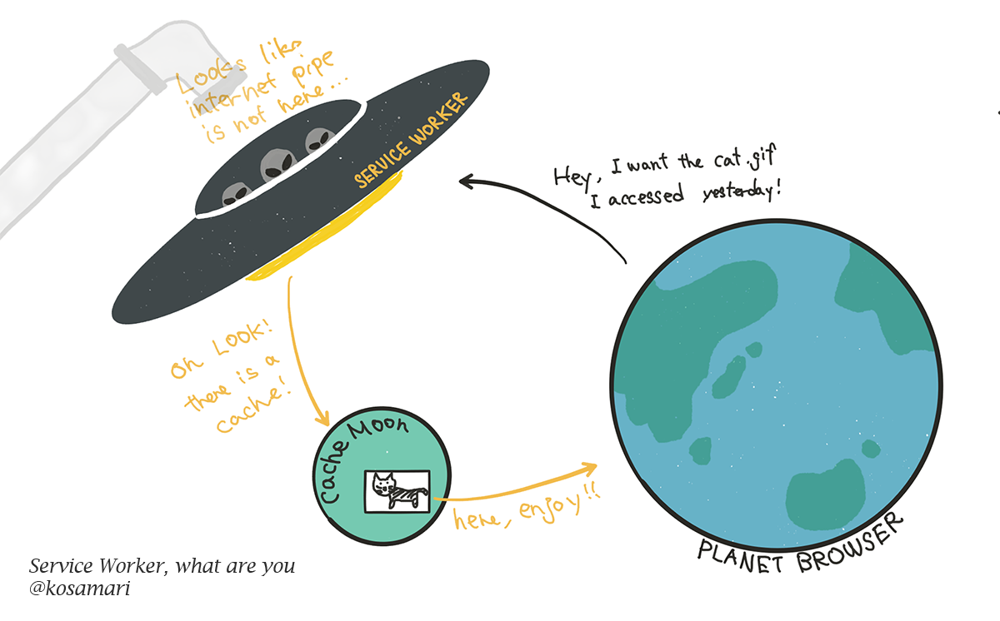
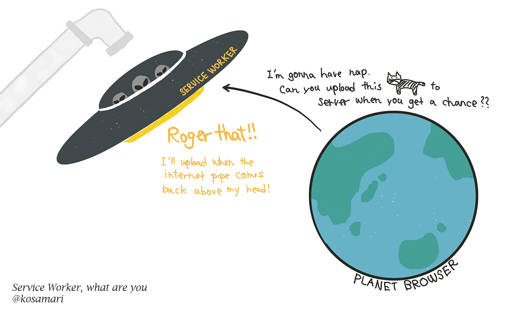
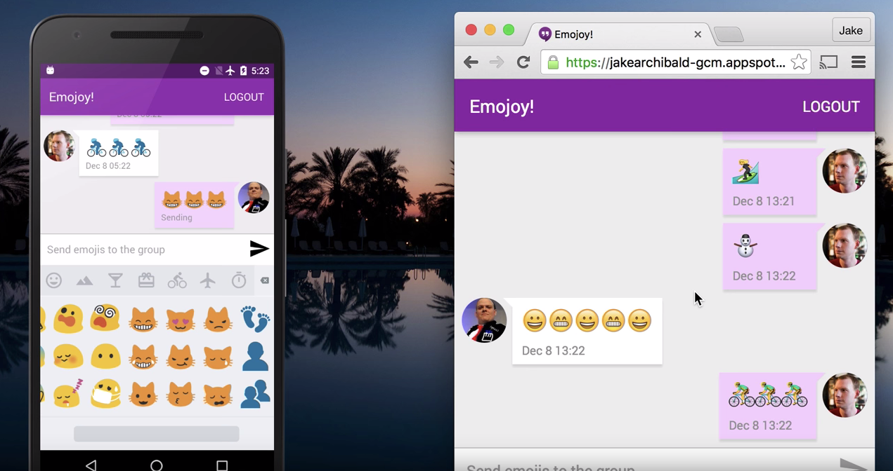
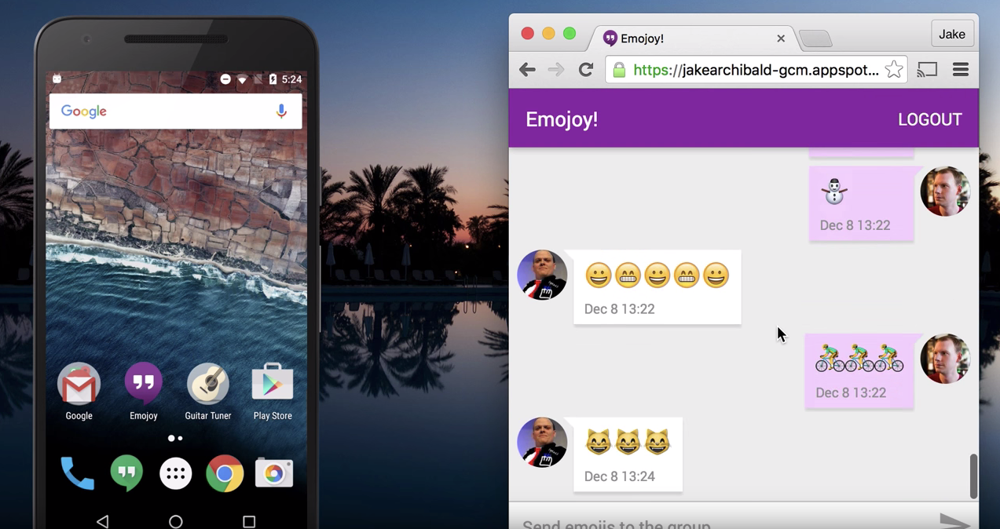
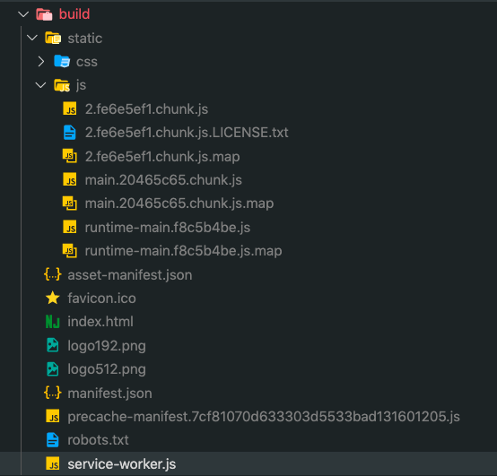
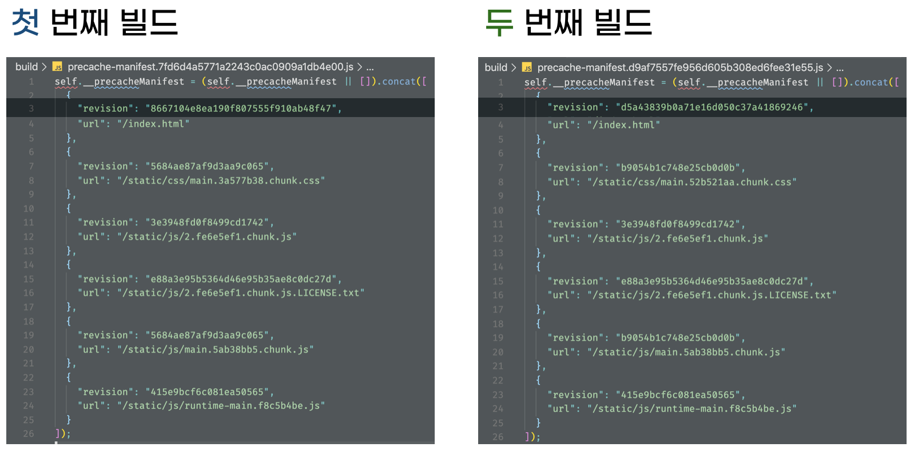

ServiceWorker is what lets a web app do things normally reserved for native apps: syncing in the background, pushing notifications, and so on.

Below: what a service worker actually is, and a quick walkthrough of setting up cache config on top of CRA.

## What Is a Service Worker?

A service worker is a script the browser runs in the background, completely separate from the page itself. It only handles work that doesn't need the page or the user around.

Its lifecycle has **nothing to do with the page's.** It sits between your web app, the browser, and the network like a proxy server, which is what lets the app keep working even offline.

That independence comes with a few constraints, though.

1. Until something requests it, a service worker might as well not exist. Unlike a [Web Worker](https://developer.mozilla.org/ko/docs/Web/API/Web_Workers_API), there's no `.terminate()` command for it.
2. It doesn't follow the page's life cycle. Closing the page doesn't automatically shut it down.
3. Since it lives outside the page, it has no access to the DOM or the window object.

Given those constraints, here's what a service worker is actually good for.

### 1. Working with the cache



It can sit in the middle of every `fetch` event. Instead of going out over HTTP, it can hand back data straight from its own cache. As long as that cache stays intact, the browser can show content with zero internet connection.

### 2. Push notifications


Since it keeps running even with the browser window closed, it's what makes push notifications possible at all.

### 3. Background sync



Say you go offline mid-task — sending a chat message, uploading a photo, whatever. The service worker can pick that task back up and finish it the moment you're back online.



Send '🐱🐱🐱' while offline and it doesn't just fail. It waits, and completes the moment the connection comes back, like this:



## Example: Setting Up Cache (with CRA)

Here's a quick look at wiring up cache settings in a service worker, plus what that looks like in a React project built with [CRA](https://create-react-app.dev/).

### Using a service worker

First step, always: **register** the service worker.

```jsx
if('serviceWorker' in navigator) {
  navigator.serviceWorker.register('/sw.js');
};
```

Once it's registered, you can set up the cache inside the `install` event listener. Start with a variable to hold the cache's name, and an array listing every file you want cached.

```jsx
const cacheName = 'helloCache'
const contentToChache = [
  '/static/main.bundle.js',
  '/static/main.bundle.css',
  '/static/favicon.ico',
];
```

Then just write the caching logic inside the `install` event handler.

```jsx
self.addEventListener('install', (e) => {
  console.log('[Service Worker] Install');

  e.waitUntil(
    caches.open(cacheName).then((cache) => {
      console.log('[Service Worker] Caching all: contentToChache');

      return cache.addAll(contentToCache);
    })
  );
});
```

The service worker won't finish installing until whatever's inside `waitUntil` actually runs. Since installation can take a while, that callback is what lets it happen asynchronously instead of blocking.

`caches` is an object available anywhere inside the service worker's scope, and it's what actually stores the data. [Web Storage](https://developer.mozilla.org/ko/docs/Web/API/Web_Storage_API) is synchronous, so it's off the table here; the Cache API takes its place instead.

From then on, if a requested file is already cached, it gets served straight from the cache instead of going out for another request.

### Using cached files

Whenever the app fires off an HTTP request, the service worker can intercept it and handle it directly.

```jsx
self.addEventListener('fetch', (e) => {
    console.log('[Service Worker] Fetched resource '+e.request.url);
});
```

The code below serves the cached version of a resource if one exists, and adds it to the cache if it doesn't.

```jsx {5,7,16,18}
self.addEventListener('fetch', (e) => {
  e.respondWith(
    caches.match(e.request).then((r) => {
      // If a cached resource exists, return it
      return r || (
        // If not, go ahead with fetch
        fetch(e.request)
          .then((response) {
            return caches
              .open(cacheName)
              .then((cache) => {
                console.log(
                  '[Service Worker] Caching new resource: '+e.request.url
                );
                // Store the response in the cache
                cache.put(e.request, response.clone());
                // Return the response
                return response;
              });
          });
      )
    });
  );
}
```

It checks the cache first. If nothing's there, it fetches the resource over the network and stores that response in the cache for next time.

### CRA's service worker setup

A project scaffolded with CRA comes with [service worker support built in](https://github.com/facebook/create-react-app/blob/c87ab79559e98a5dae2cd0b02477c38ff6113e6a/packages/react-scripts/config/webpack.config.js#L694), courtesy of [Workbox](https://developers.google.com/web/tools/workbox).
> There's [a PR that adds options for overriding workbox-webpack-plugin](https://github.com/facebook/create-react-app/pull/5369), but it hasn't landed yet, and given it's been open since 2018, I wouldn't count on it shipping any time soon. If you need to customize Workbox in the meantime, [@craco/craco](https://www.npmjs.com/package/@craco/craco) can get you there.

The `register` function checks whether the current environment is production, among other things, then registers the service worker through a `load` event listener, like this.

```jsx
export function register(config?: Config) {
  if (process.env.NODE_ENV === 'development' && 'serviceWorker' in navigator) {
    const publicUrl = new URL(
      process.env.PUBLIC_URL,
      window.location.href
    );

    window.addEventListener('load', () => {
      const swUrl = `${process.env.PUBLIC_URL}/service-worker.js`;

      if (isLocalhost) {
        // Let's check if a service worker still exists or not.
        checkValidServiceWorker(swUrl, config);

        navigator.serviceWorker.ready.then(() => {
          console.log(
            'This web app is being served cache-first by a service ' +
              'worker. To learn more, visit https://bit.ly/CRA-PWA'
          );
        });
      } else {
        // Is not localhost. Just register service worker
        registerValidSW(swUrl, config);
      }
    });
  }
}
```

The `swUrl` this function references points at the `service-worker.js` file generated during the build.


A CRA-generated project already ships with the basic service worker config in place.

`registerValidSW`, inside `src/serviceWorker`, checks whether it's safe to run the service worker and then runs it.

```ts {3,11,12,13,14,15}
function registerValidSW(swUrl: string, config?: Config) {
  navigator.serviceWorker
    .register(swUrl)
    .then(registration => {
      registration.onupdatefound = () => {
        const installingWorker = registration.installing;
        if (installingWorker == null) {
          return;
        }
        installingWorker.onstatechange = () => {
          if (installingWorker.state === 'installed') {
            if (navigator.serviceWorker.controller) {
              // At this point, the updated precached content has been fetched,
              // but the previous service worker will still serve the older
              // content until all client tabs are closed.
              console.log(
                'New content is available and will be used when all ' +
                  'tabs for this page are closed. See https://bit.ly/CRA-PWA.'
              );

              // Execute callback
              if (config && config.onUpdate) {
                config.onUpdate(registration);
              }
            } else {
              // At this point, everything has been precached.
              // It's the perfect time to display a
              // "Content is cached for offline use." message.
              console.log('Content is cached for offline use.');

              // Execute callback
              if (config && config.onSuccess) {
                config.onSuccess(registration);
              }
            }
          }
        };
      };
    })
    .catch(error => {
      console.error('Error during service worker registration:', error);
    });
}
```

When the service worker's state hits `installed` and the [navigator object](https://developer.mozilla.org/ko/docs/Web/API/Navigator) already has one registered, the comment says **the newly cached content will only show up once the current tab closes and a fresh one opens — that is, once the whole runtime resets.** That's because Workbox doesn't bump the cache manifest's `revision` value until a new tab opens.


Workbox builds the precache manifest by combining `revision` values with `url` info. Since none of that refreshes until a tab reopens, a plain page reload after a deploy won't surface the new content.
> See the [Workbox Guide](https://developers.google.com/web/tools/workbox) for the full details.

So `index.html` needs to be excluded from the service worker's cached file list, so a fresh deploy actually shows up right away.

There's [a PR for custom Workbox configuration sitting on the CRA GitHub repository](https://github.com/facebook/create-react-app/pull/5369), still unmerged. Until it lands, you either need something like [craco](https://www.npmjs.com/package/@craco/craco) that lets you touch CRA's webpack config and adjust the [Workbox Webpack Plugin](https://developers.google.com/web/tools/workbox/modules/workbox-webpack-plugin) directly, or override the service worker settings yourself using workbox-cli.

## Summary

That covers the basics of a service worker and a cache example. Add a Web App Manifest on top of the service worker config and you've got yourself a simple [PWA](https://developer.mozilla.org/en-US/docs/Web/Progressive_web_apps). Get this right, and it starts closing the gap between what a web app can do and what a native app can.

## Ref

- [https://developers.google.com/web/fundamentals/primers/service-workers?hl=ko](https://developers.google.com/web/fundamentals/primers/service-workers?hl=ko)
- [https://medium.com/@kosamari/service-worker-what-are-you-ca0f8df92b65](https://medium.com/@kosamari/service-worker-what-are-you-ca0f8df92b65)
- [https://serviceworke.rs/push-payload_demo.html](https://serviceworke.rs/push-payload_demo.html)
- [https://www.huskyhoochu.com/how-to-migrate-workbox/](https://www.huskyhoochu.com/how-to-migrate-workbox/)
