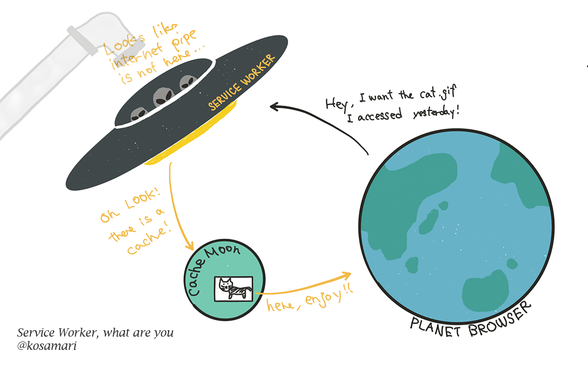
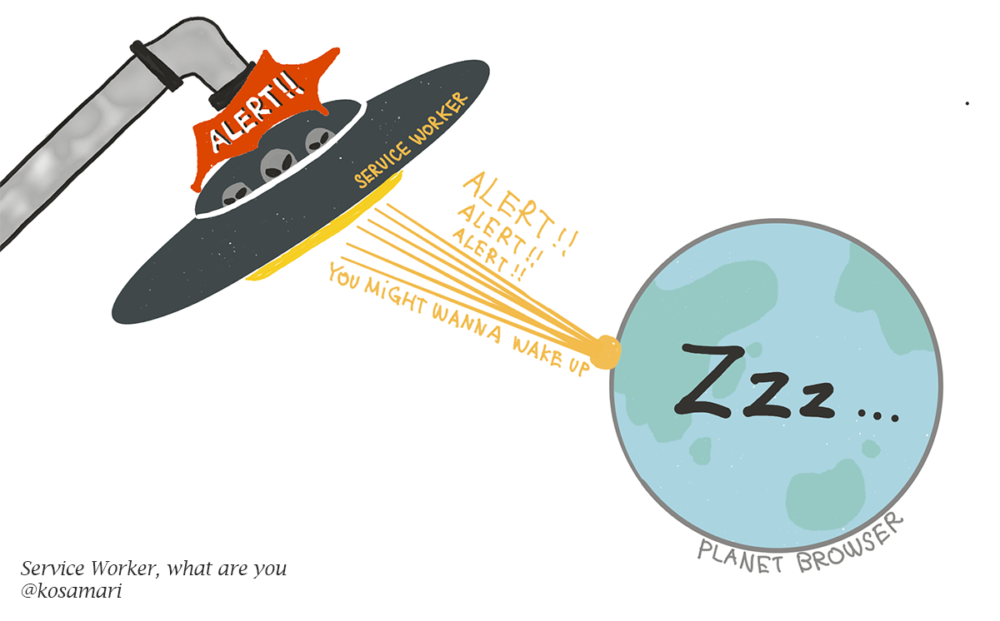
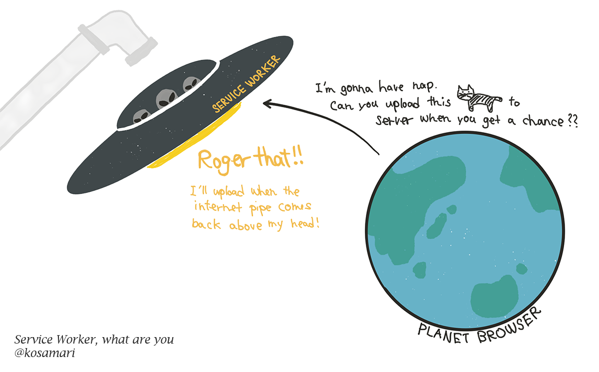
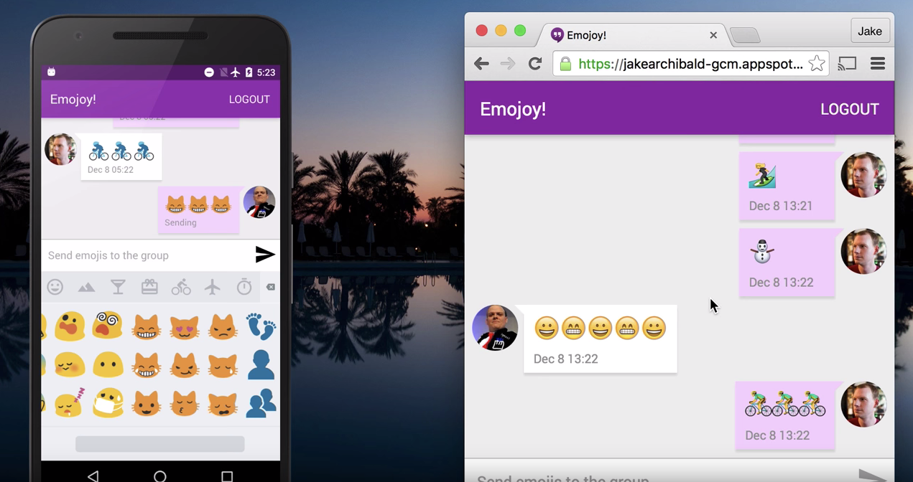
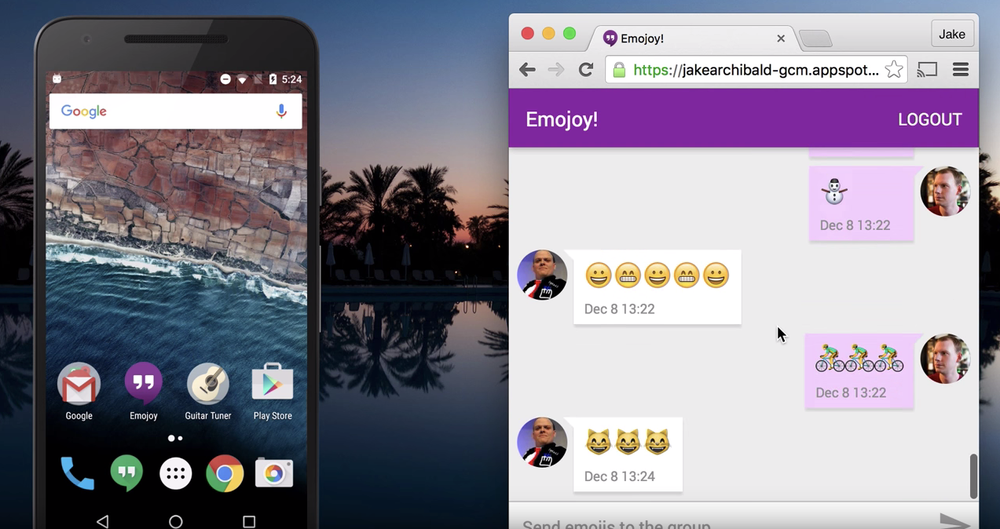
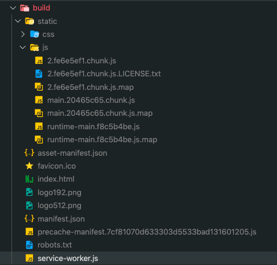
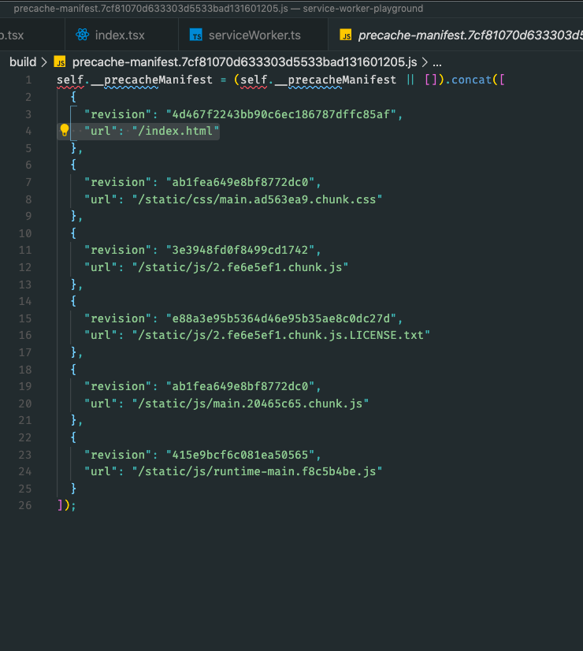

> 이미지 변경하기

ServiceWorker는 웹 서비스에서도 백그라운드 동기화, 푸시 알림 등이 가능하도록 지원해주는 도구입니다.

이 글에서는 ServiceWorker(이하 서비스워커)에 대한 소개와 간단한 사용 예시들을 살펴봅니다.

## 서비스 워커란?

서비스 워커는 브라우저가 백그라운드에서 실행하는 스크립트로, 웹페이지와는 별개로 작동하며, 웹페이지 또는 사용자의 인터랙션이 필요하지 않은 기능에 한해 다양한 기능을 제공하고 있습니다.

서비스 워커의 수명 주기는 웹페이지와는 **완전히 별개입니다.** 웹 서비스와 브라우저 및 네트워크 사이에서 프록시 서버의 역할을 하며, 오프라인에서도 페이지가 사용 가능하도록 할 수도 있습니다.

웹 페이지와 별개로 존재하기 때문에 다음과 같은 제약이 있습니다.

1. 서비스 워커는 요청하지 않는 이상, 없는 것이나 다름 없습니다. 웹 워커(Web Worker)에서와 같은 `.ternimate()` 명령은 존재하지 않습니다.
2. 웹 페이지 life cycle을 따르지 않습니다. 서비스 워커는 웹페이지가 닫히더라도 자동으로 비활성화 되지 않습니다.
3. 웹 페이지와 별개로 존재하므로 DOM이나 window요소에 접근할 수 없습니다.

### 1. 캐시와 상호작용



`fetch` 이벤트의 중간자 역할로 사용할 수 있습니다. 이 경우 서비스 워커는 HTTP를 통해 정보를 요청하는 대신 가지고 있는 캐시에서 자료를 전달합니다. 캐시가 삭제되지 않는 한 브라우저는 인터넷 연결 없이도 정보를 보여줄 수 있습니다.

### 2. 푸쉬 알림



서비스 워커는 브라우저 창이 닫힌 상태에서도 동작하므로, 푸시 알람을 구현할 수 있습니다.

### 3. 백그라운드 동기화



채팅 메시지 또는 사진 업로드 등의 작업 도중 컴퓨터가 오프라인 상태가 되는 경우 오프라인 상태가 되었을 때 해당 작업을 마저 완료하는 것입니다.



오프라인 상태에서 '🐱🐱🐱' 메세지를 보냈을 때 실패하지 않고, 다음과 같이 다시 인터넷에 연결되었을 때  완료됩니다.



## Cache 설정(w. CRA)

서비스워커에서 캐시 관련 설정을 적용하기 위해서는 어떻게 해야하는 지 간단하게 살펴보고, [CRA](https://create-react-app.dev/)의 설정을 살펴보면서 React프로젝트에 어떻게 적용할 수 있는지 살펴보겠습니다.

### 서비스워커 사용

서비스워커를 사용하기 위해서는 먼저 서비스워커를 `등록`하는 단계가 필요합니다.

```jsx
if('serviceWorker' in navigator) {
  navigator.serviceWorker.register('/sw.js');
};
```

등록이 완료되면, `install`이벤트 리스너에서 캐시를 초기화할 수 있습니다. 먼저, 캐시 이름을 저장할 변수를 생성하고 캐싱을 적용할 파일들을 하나의 배열에 담습니다.

```jsx
const cacheName = 'helloCache'
const contentToChache = [
  '/static/main.bundle.js',
  '/static/main.bundle.css',
  '/static/favicon.ico',
];
```

`install` 이벤트 핸들러에서 캐싱에 관한 설정을 적어주면 됩니다.

- 않이 여기서 self가 뭐람..

```jsx
self.addEventListener('install', (e) => {
  console.log('[Service Worker] Install');

  e.waitUntil(
    caches.open(cacheName).then((cache) => {
      console.log('[Service Worker] Caching all: contentToChache');

      return cache.addAll(contentToCache);
    })
  );
});
```

서비스워커는 `waitUntil` 안쪽의 코드가 실행되기 전까지는 install되지 않습니다. 서비스 워커 설치에 시간이 소요될 수 있으므로 이를 비동기로 처리하기 위해 callBack함수를 정의해주는 것입니다.

`caches` 는 데이터를 저장할 수 있는 서비스워커 코드 범위 내에서 사용할 수 있는 객체입니다. [웹 저장소](https://developer.mozilla.org/ko/docs/Web/API/Web_Storage_API)는 동기적이므로 이 데이터를 웹 저장소에 저장할 수는 없습니다. 대신, 서비스 워커는 Cache API를 사용합니다. 

다음 요청 때에는 캐시 된 파일이 있다면 추가적으로 요청하지 않고 캐싱파일을 반환합니다.

### 캐싱된 파일 사용

서비스에서 HTTP요청이 발생할 때 이 요청을 서비스워커에서 감지해서 처리할 수 있습니다.

```jsx
self.addEventListener('fetch', (e) => {
    console.log('[Service Worker] Fetched resource '+e.request.url);
}); 
```

아래 코드는 서비스에서 요청한 리소스가 실제로 캐싱되어 있다면 캐싱파일을 제공하고, 없을 경우 캐시에 추가하는 코드입니다.

```jsx
self.addEventListener('fetch', (e) => {
  e.respondWith(
    caches.match(e.request).then((r) => {
      return r || (
        fetch(e.request)
          .then((response) {
            return caches
              .open(cacheName)
              .then((cache) => {
                console.log('[Service Worker] Caching new resource: '+e.request.url);
                cache.put(e.request, response.clone());

                return response;
              });
          });
      )
    });
  );
}
```

캐싱된 리소스를 먼저 찾고, 리소스가 없을 경우 추가로 요청하여 fetch한 후에 캐시에 응답을 저장합니다.

### CRA의 서비스워커 설정

CRA로 생성한 프로젝트에는 기본적으로 서비스워커에 대한 설정(링크: serviceWorker.ts`)이 되어 있습니다.

`register`함수에서는 다음과 같이 현재 환경이 production인지 등을 검사하고 load이벤트의 리스너로 서비스 워커 등록을 실행하고 있습니다.

```jsx
export function register(config?: Config) {
  if (process.env.NODE_ENV === 'development' && 'serviceWorker' in navigator) {
    const publicUrl = new URL(
      process.env.PUBLIC_URL,
      window.location.href
    );

    window.addEventListener('load', () => {
      const swUrl = `${process.env.PUBLIC_URL}/service-worker.js`;

      if (isLocalhost) {
        // Let's check if a service worker still exists or not.
        checkValidServiceWorker(swUrl, config);

        navigator.serviceWorker.ready.then(() => {
          console.log(
            'This web app is being served cache-first by a service ' +
              'worker. To learn more, visit https://bit.ly/CRA-PWA'
          );
        });
      } else {
        // Is not localhost. Just register service worker
        registerValidSW(swUrl, config);
      }
    });
  }
}
```

이 함수에서 참조하고 있는 `swUrl`은 build시 나오는 파일입니다.


CRA는 workBox를 이용해서 기본적인 설정이 이미 되어있습니다.

실제 서비스워커를 등록하는 `registerValidSW`에서는 실행 조건을 판단하고 실행 뒤 상태를 표시하는 코드가 담겨 있습니다.

```jsx
function registerValidSW(swUrl: string, config?: Config) {
  navigator.serviceWorker
    .register(swUrl)
    .then(registration => {
      registration.onupdatefound = () => {
        const installingWorker = registration.installing;
        if (installingWorker == null) {
          return;
        }
        installingWorker.onstatechange = () => {
          if (installingWorker.state === 'installed') {
            if (navigator.serviceWorker.controller) {
              // At this point, the updated precached content has been fetched,
              // but the previous service worker will still serve the older
              // content until all client tabs are closed.
              console.log(
                'New content is available and will be used when all ' +
                  'tabs for this page are closed. See https://bit.ly/CRA-PWA.'
              );

              // Execute callback
              if (config && config.onUpdate) {
                config.onUpdate(registration);
              }
            } else {
              // At this point, everything has been precached.
              // It's the perfect time to display a
              // "Content is cached for offline use." message.
              console.log('Content is cached for offline use.');

              // Execute callback
              if (config && config.onSuccess) {
                config.onSuccess(registration);
              }
            }
          }
        };
      };
    })
    .catch(error => {
      console.error('Error during service worker registration:', error);
    });
}
```

서비스워커의 상태가 `installed` 일때 이미 `navigator` 객체에 서비스워커가 존재한다면 **현재 탭이 종료되고 새로운 탭이 열렸을 때, 즉 실행 환경이 완전히 초기화 되었을 때 새로 캐시된 컨텐츠가 제공될 것**이라고 되어있습니다.

단순 새로고침으로는 새로운 배포했을 때의 황에서 새로운 컨텐츠를 받아볼 수 없다는 뜻입니다.

[CRA에 custom workbox config PR](https://github.com/facebook/create-react-app/pull/5369)이 올라와있지만 아직 배포 된 기능이 아니므로 이 설정을 override해야 합니다. [craco](https://www.npmjs.com/package/@craco/craco)등 cra의 webpack config를 변경할 수 있는 옵션을 사용하여 [Workbox Webpack Plugin](https://developers.google.com/web/tools/workbox/modules/workbox-webpack-plugin)의 설정을 변경해주어도 되고, workbox-cli를 이용하여 파일 서비스워커 관련 설정을 아예 override해도 됩니다.

**Note.**

workbox에서는 `revision` 값과 `url` 정보를 종합하여 precache manifest를 구성합니다. 아래는 CRA로 빌드 된 preCache설정이며, revision과 url정보가 있는 것을 확인할 수 있습니다.

자세한 내용은 [Workbox Guide](https://developers.google.com/web/tools/workbox)에서 확인하실 수 있습니다.


> `/index.html`을 제외한 js, css파일의 경우 빌드마다 고유한 hash값을 사용하기 때문에 revision 값이 null이어도 괜찮습니다.

```jsx
import {precacheAndRoute} from 'workbox-precaching';

precacheAndRoute([
  {url: '/index.html', revision: '383676' },
  {url: '/styles/app.0c9a31.css', revision: null},
  {url: '/scripts/app.0d5770.js', revision: null},
  // ... other entries ...
]);
```

### Test

[service-worker-playground](https://github.com/SoYoung210/service-worker-playground)에서 위 내용을 직접 테스트해볼 수 있습니다.

## Ref

- [https://developers.google.com/web/fundamentals/primers/service-workers?hl=ko](https://developers.google.com/web/fundamentals/primers/service-workers?hl=ko)
- 저 사진 출처 블로그 쓰기
- [https://serviceworke.rs/push-payload_demo.html](https://serviceworke.rs/push-payload_demo.html)
- [https://www.huskyhoochu.com/how-to-migrate-workbox/](https://www.huskyhoochu.com/how-to-migrate-workbox/)
