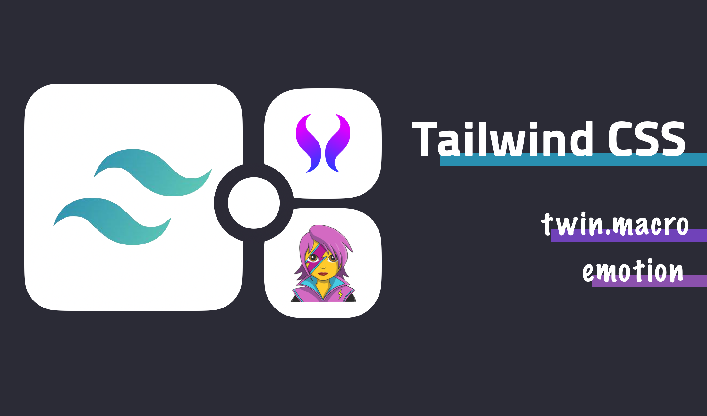
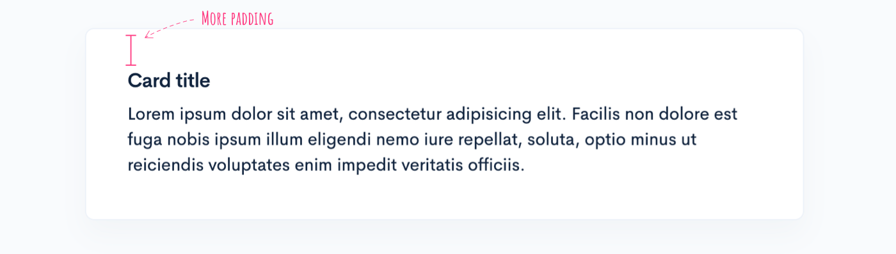
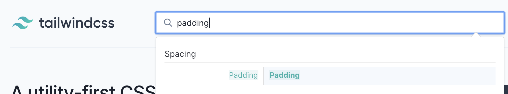
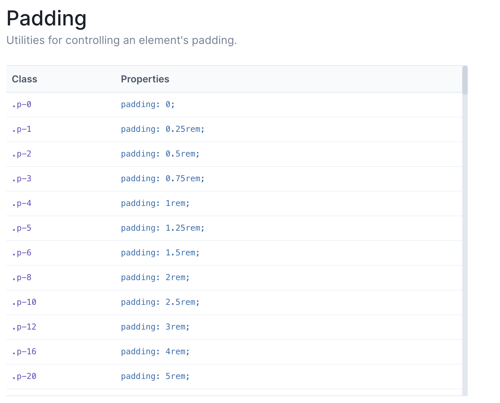
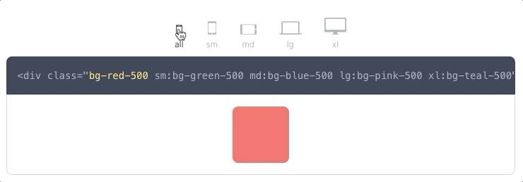
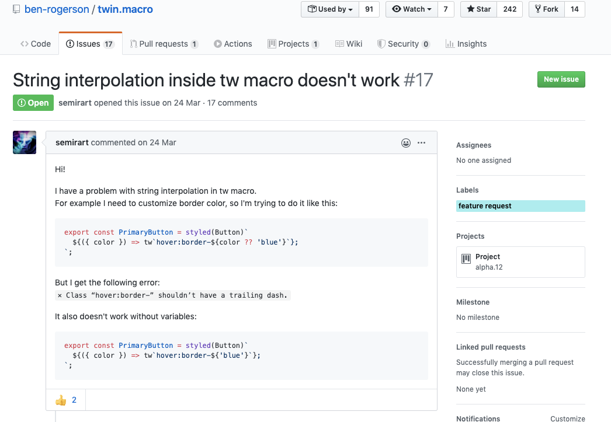

TailwindCSS is a utility-first CSS framework.

Here's a rundown of what utility-first CSS actually means, and how to put TailwindCSS to use. Worth a read if you've been curious about it, or you're weighing whether to adopt it.

## utility-first CSS

The name might sound unfamiliar, but Bootstrap, a library nearly everyone's already used, is actually built on this same idea.

The mechanics look a lot like [Bootstrap](https://getbootstrap.com/): you apply styles by handing an element a class, like this:

```html
<div class="alert alert-primary" role="alert">
  A simple primary alert—check it out!
</div>
<div class="alert alert-secondary" role="alert">
  A simple secondary alert—check it out!
</div>
<div class="alert alert-success" role="alert">
  A simple success alert—check it out!
</div>
<div class="alert alert-danger" role="alert">
  A simple danger alert—check it out!
</div>
```

<details>
<summary><b>Result:</b></summary>
<ul>
  
</ul>
</details>
<br/>

With utility-first CSS, every class is pre-defined for one specific style, and you combine whichever ones you need.

Class names follow a pattern like this:

```css
.{property}{side}-{size}
```

### Example

A quick example with **margin** and **padding**:

- `mt-5`: sets margin-top to whatever's defined for that scale, say 5px
- `pb-3`: sets padding-bottom the same way, say 3px
- `px-2`: sets padding on the x-axis (padding-left and padding-right together), say 2px



The old way: if the box around a card title needs 20px of padding on every side, you'd reach for a class named something like `my-card-inner`. That class probably bundles in a bunch of other styles too, and every time the design shifts, you're stuck hunting down every place it's used and updating them all together.

Utility-first CSS writes the same thing like this instead:

```html {2}
<div class="card">
    <div class="card-body p-20">
    ...
    </div>
</div>
```

Now if `p-20`'s base value ever moves from 20px to 5rem, you change one config value and you're done. What each class actually does stays obvious just from reading it.

That's the core of utility-first CSS: classes built around pure styling, not around what an element functionally is.

## TailwindCSS

TailwindCSS's edge over other utility-first frameworks is that it's **easy to customize and easy to extend**. You can drop in existing plugins or write your own, and the docs actually hold up.

### Example

Take `padding` as an example.



Search **padding** on the [Tailwind site](https://tailwindcss.com/), and here's what comes back:



You can just use what ships by default, or customize it in `tailwind.config.js`.

### Using theme.padding

```jsx
// tailwind.config.js
module.exports = {
  theme: {
    padding: {
      sm: '8px',
      md: '16px',
      lg: '24px',
      xl: '48px',
      '20': '20px',
    }
  }
}
```

### Using theme.spacing

Rather than setting padding directly, you route it through the spacing property instead.

```jsx {17,19}
// tailwind.config.js
module.exports = {
  spacing: {
    sm: '8px',
    md: '16px',
    lg: '24px',
    xl: '48px',
    8: '8px',
    9: '9px',
    10: '10px',
    12: '12px',
    14: '14px',
    15: '15px',
    16: '16px',
    18: '18px',
  },
  padding: (theme) => theme('spacing'),
  // margin also gets applied through the spacing values
  margin: (theme) => theme('spacing'),
}

```

Once `spacing` is set up, anything needing a **numeric value**, margin included, can pull from it.

### variants

The `variants` field in `tailwind.config.js` is your control for responsive behavior and pseudo-classes.

```jsx
// tailwind.config.js
module.exports = {
  variants: {
    appearance: ['responsive'],
    // ...
    borderColor: ['responsive', 'hover', 'focus'],
    // ...
    outline: ['responsive', 'focus'],
    // ...
    zIndex: ['responsive'],
  },
}
```

Each key under `variants` matches a property from `tailwind.config.js`'s `theme`, and the variants below are supported out of the box.

- `'responsive'`
- `'group-hover'`
- `'focus-within'`
- `'first'`
- `'last'`
- `'odd'`
- `'even'`
- `'hover'`
- `'focus'`
- `'active'`
- `'visited'`
- `'disabled'`

Customize variants yourself, and the defaults don't carry over automatically, so you have to list both the defaults and whatever you're adding.

**❌ Define only the new ones, and you lose the defaults entirely.**

```jsx {4}
// tailwind.config.js
module.exports = {
  variants: {
    backgroundColor: ['active'],
  },
}
```

✅ **List out every property you actually want turned on.**

```jsx {4}
// tailwind.config.js
module.exports = {
  variants: {
    backgroundColor: ['responsive', 'hover', 'focus', 'active'],
  },
}
```

### Applying responsive styles

TailwindCSS ships with four breakpoints baked in by default, and turning them on is as easy as adding a utility class.

```html
<!-- base 16, medium: 32, large: 48 -->

```

Pretty much anything, background color included, can go fully responsive this way:



Change the `screens` property in `tailwind.config.js` to define your own breakpoints.

```jsx {5,8,11}
// tailwind.config.js
module.exports = {
  theme: {
    screens: {
      'tablet': '640px',
      // => @media (min-width: 640px) { ... }

      'laptop': '1024px',
      // => @media (min-width: 1024px) { ... }

      'desktop': '1280px',
      // => @media (min-width: 1280px) { ... }
    },
  }
}
```

### plugins

TailwindCSS also lets you write your own plugins whenever you need one.

```jsx {16}
// tailwind.config.js
const plugin = require('tailwindcss/plugin')

module.exports = {
  plugins: [
    plugin(function({ addUtilities }) {
      const newUtilities = {
        '.skew-10deg': {
          transform: 'skewY(-10deg)',
        },
        '.skew-15deg': {
          transform: 'skewY(-15deg)',
        },
      }

      addUtilities(newUtilities)
    })
  ]
}
```

That's how you add whatever utility class you want, and you can attach variants to a newly added class the same way.

```jsx
// tailwind.config.js
const plugin = require('tailwindcss/plugin')

module.exports = {
  plugins: [
    plugin(function({ addUtilities }) {
      const newUtilities = {
        // ...
      }

      addUtilities(newUtilities, {
        variants: ['responsive', 'hover'],
      })
    })
  ]
}
```

Want a default style on an HTML tag itself? `addBase` inside plugins handles that.

```jsx
// tailwind.config.js
const plugin = require('tailwindcss/plugin')

module.exports = {
  plugins: [
    plugin(function({ addBase, config }) {
      addBase({
        'h1': { fontSize: config('theme.fontSize.2xl') },
        'h2': { fontSize: config('theme.fontSize.xl') },
        'h3': { fontSize: config('theme.fontSize.lg') },
      })
    })
  ]
}
```

Base styles only accept [Element Selectors](https://www.w3schools.com/cssref/sel_element.asp).

## With CSS-in-JS

TailwindCSS plays fine with CSS-in-JS libraries like [👩‍🎤 emotion](https://emotion.sh/docs/introduction) or [💅 styled-components](https://styled-components.com/). Pair it with **[twin.macro](https://www.npmjs.com/package/twin.macro)** and the resulting code gets noticeably cleaner.

```jsx {2,7}
import React from 'react'
import tw from 'twin.macro'
import styled from '@emotion/styled/macro'
import { css } from '@emotion/core'

const Input = styled.input([
  tw`p-20`,
  ({ hasDarkHover }) =>
    hasDarkHover
      ? tw`hover:border-black`
      : css`
          &:hover {
            ${tw`border-white`}
          }
        `,
])
export default () => <Input hasDarkHover />
```

> As of May 2020, TailwindCSS is up to version 1.4.4, while twin.macro still runs on 1.3.4. It's currently [working toward support](https://github.com/ben-rogerson/twin.macro/issues/45) for TailwindCSS 1.4.0.

A handful of small config changes and you're up and running.

```jsx {4}
// .babelrc
{
  "plugins": [
    "macros", // babel-plugin-macros
  ],
  "presets": [
  /* Other presets */
    "@emotion/babel-preset-css-prop", // @emotion/babel-preset-css-prop
  ]
}
```

### ⚠️ Things to watch for

One catch: twin.macro only ever looks at what's defined in `tailwind.config.js`, so a className you added separately in `tailwind.config.css` won't work with it.

Template literals inside a styled-component also don't work yet, though that's reportedly [in progress](https://github.com/ben-rogerson/twin.macro/issues/17).



## Wrapping up

Two months into using TailwindCSS on a new project, and I'm mostly happy with it so far.

> One gap: the translate property doesn't support 3D, so I ended up handling that piece with an inline style instead.

Early on, there's a real learning curve: you're constantly flipping back to the docs to figure out which className does what. But once it clicks, the curve is worth it. When the design system is already consistent, development basically becomes attaching pre-defined classes, and the speed difference is obvious.

Using it also handed me a new way of thinking: that style can live completely apart from a component's purpose or function.

## Ref

- [https://blog.usejournal.com/utility-first-css-ridiculously-fast-front-end-development-for-almost-every-design-503130d8fefc](https://blog.usejournal.com/utility-first-css-ridiculously-fast-front-end-development-for-almost-every-design-503130d8fefc)
- [https://tailwindcss.com/docs](https://tailwindcss.com/docs)

## Recommend

- [https://dev.to/michi/utility-first-css-you-have-to-try-it-first-3m85](https://dev.to/michi/utility-first-css-you-have-to-try-it-first-3m85)
