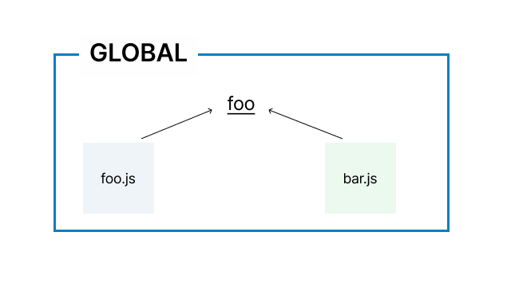
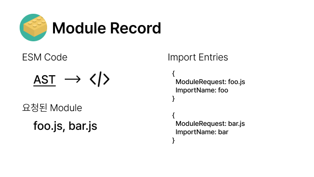
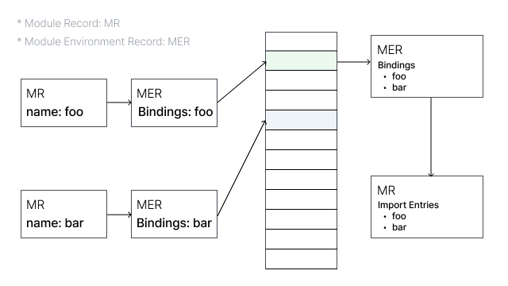
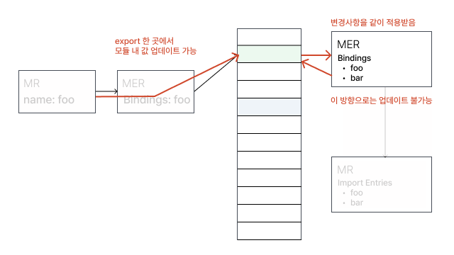
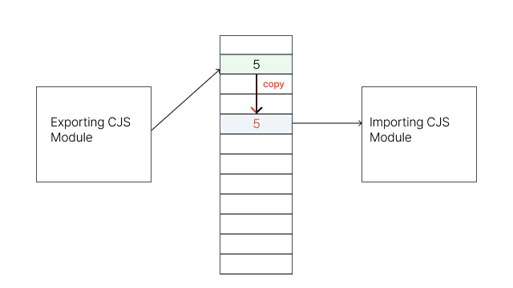
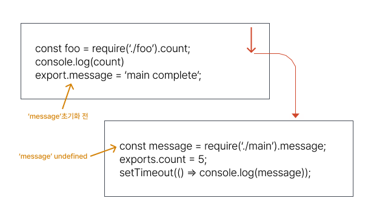
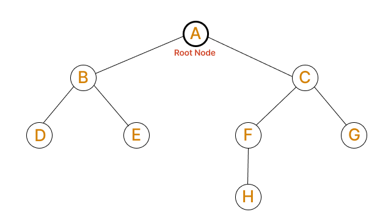
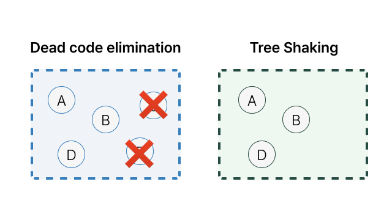

## Introduction

An application is made up of many different pieces of code: code the developer writes directly, external libraries, and so on. As an application grows more complex, bundle size becomes something you have to pay attention to, and that requires a process — commonly called Tree Shaking — to keep only the **code you actually need**.

This article covers the basic concept of Tree Shaking and the conditions that make it possible.

## What Is Tree Shaking?

What we commonly call Tree Shaking, from the perspective of the final bundle output, can be described as the process by which unnecessary code disappears.

> It relies on the import and export statements in ES2015 to detect if code modules are exported and imported for use between JavaScript files.
<sup style="top: 0px;">
  <a href="https://developer.mozilla.org/en-US/docs/Glossary/Tree_shaking" target="_blank" rel="noreferer">mdn/glossary/tree-shaking</a>
</sup>

According to MDN, Tree Shaking relies on ES2015 (ES6)'s import/export statements to determine whether there's a reference between JavaScript files.

Tree Shaking depends on the module system introduced in ES6 called ES Modules (ESM) — in other words, of the many module formats we know, it's the `ESM` format that makes Tree Shaking possible.

Let's look at how ESM makes Tree Shaking possible, and what sets it apart from other module systems.

## Modules

Before getting into the specifics of `ESM`, let's briefly introduce the concept of a module and other module systems.

### What Is a Module?

A module can be described as a **'reusable unit of code.'** Being **reusable** means its behavior is guaranteed to be consistent no matter where it's used, and **unit of code** means an application is made up of a set of N modules.

Modules provide a better way to organize variables and functions. You manage functions and variables within a module's scope, and you can also share variables between modules through that scope.

## A Closer Look at JavaScript's Module Systems



Before the concept of a module was introduced to JavaScript, the easiest way for `foo.js` and `bar.js` to share a common variable `foo` was to hoist the variable into global scope.

This kind of solution makes it impossible to control the state of a globally declared variable or when it gets assigned, so it becomes dependent on JS load order, and dependency management around variable references gets harder.

As the push to bring a module system to JavaScript began, module systems were considered separately for the client side and the server side, and out of that situation came the proposals for [CommonJS](http://www.commonjs.org/) and [AMD (Asynchronous Module Definition)](https://github.com/amdjs/amdjs-api/wiki/AMD).

JavaScript modularization largely split into the `CommonJS` and `AMD` camps, and to use modules in the browser you had to use a module loader library that implemented CommonJS or AMD.

### CJS (CommonJS)

```jsx
//importing 
const doSomething = require('./doSomething.js'); 

//exporting
module.exports = function doSomething(n) {
  // do something
}
```

Node.js, the server-side JavaScript environment, adopted `CommonJS`. Its defining traits are **static binding and synchronous import.**

> **Static binding:** provides a copy of the value obtained through `require`. This means that even if the side doing `module.exports` changes the value later, the side that already did `require` can't use that changed value.

> Aside: [ECMAScript module support was added in Node.js 17](https://nodejs.org/api/esm.html#modules-ecmascript-modules).

### AMD (Asynchronous Module Definition)

```jsx
define(['dep1', 'dep2'], function (dep1, dep2) {
  //Define the module value by returning a value.
  return function () {};
});
```

`CommonJS` assumes a situation where every file is local and can be loaded immediately when needed. In other words, it assumes a server-side JavaScript environment where synchronous behavior is possible.

In a browser, loading modules the CommonJS way can leave the main thread unable to do anything **(blocking)** until every module has finished loading, and that can be seen as a fatal downside of CommonJS.

The AMD group split off after failing to reach an agreement with the CommonJS group over how to handle asynchronous processing of JavaScript modules. CommonJS is the group that came about to take JavaScript outside the browser, while AMD is the group that focused on the browser.

As the name 'Asynchronous Module Definition' suggests, AMD deals with a standard for asynchronous modules (letting a needed module be downloaded over the network).

### UMD (Universal Module Definition)

```jsx
(function (root, factory) {
    if (typeof define === "function" && define.amd) {
        define(["jquery", "underscore"], factory);
    } else if (typeof exports === "object") {
        module.exports = factory(require("jquery"), require("underscore"));
    } else {
        root.Requester = factory(root.$, root._);
    }
}(this, function ($, _) {
    // this is where I defined my module implementation

    var Requester = { // ... };

    return Requester;
}));
```

Because the AMD and CJS camps split apart, they ended up incompatible with each other, and UMD was proposed as a pattern to solve that. UMD, in practice, is closer to **a form that defines a different implementation depending on the module system.**

### ESM

```jsx
import {foo, bar} from './myLib';

export default function() {
  // your Function
};
export const function1() {...};
export const function2() {...};
```

ESM is the official JavaScript module system supported by ECMAScript, and it's the format supported by most modern browsers. ('That browser' ~~IE11~~ does not support it.)

## Characteristics of ESM

### How It Works

The ESM system consists of three stages: **construction, instantiation, and evaluation.**

#### 1. Construction

As the very first stage, a dependency tree is built to figure out which modules need to be loaded.

You specify the file that will be the starting point of the graph, then follow the `import` statements from that starting point to build the dependency tree.



The files connected by `import` can't be used by the browser as they are, so they need to be converted into a [Module Record](https://262.ecma-international.org/6.0/#sec-source-text-module-records) structure (data holding export/import information). In this process, every file is found and loaded, and parsing is performed to convert it into a module record.

#### 2. Instantiation

Next, module records are converted into module instances. This is the process of finding a memory location to allocate for every value that will be imported, so that both `export` and `import` point to that same memory.

> **Module instance:** a form that combines two things — 'code' and 'state.'

#### 3. Evaluation

This is the process of running the code to fill that memory with the actual values of the variables.

'Code' on its own can be thought of as a set of instructions, or a 'recipe' for making something. But by itself it can't do anything — it needs 'values' to work together with.

State becomes the actual 'value' of a variable at a given point in time. (I've said 'state,' but it's more accurate to call it memory.) The 'evaluation' step is what fills in this value.

**Construction, instantiation, and evaluation** can each happen individually, and asynchronously.

### Characteristic 1. Static Structure

```jsx
var foo = 'foo';
var lib = require(`lib/${foo}`);
lib.someFunc(); // property lookup
```

When you access `lib` through `lib.someFunc`, since `lib` is a dynamic value, a property lookup has to be performed.

```jsx
import * as lib from 'lib';
lib.someFunc(); // static analysis possible
```

ESM, by contrast, can determine information about `lib` statically at import time, which means access can be optimized.

Unlike `CommonJS`, `export` statements can only appear at the top level of ESM. This is a restriction meant to make it easier for compilers to parse ESM, but it's also a good restriction, since there aren't many cases where you need to dynamically define and `export` an API based on a method call.

```jsx
function foo () {
  export default 'bar' // SyntaxError
}
foo()
```

```js
// SyntaxError
import foo from `lib/${foo}`;
```

### Characteristic 2. Bindings, Not Values

As mentioned in the [ESM's evaluation step](#평가) section, `import` and `export` both point to the same memory address.



If you change a value at the place where it's `export`ed, that change is reflected wherever it's `import`ed too. The module doing the `export`ing can change the value, but the side doing the `import`ing cannot.



```jsx
// a.js
export let a = 'AAA'
setTimeout(() => a = 'ABC', 500)

// b.js
import 'a.js'
console.log('a', a); // AAA
setTimeout(() => console.log('a', a), 1000); // ABC
```

In the example above, the variable `a` is `AAA` for 0.5 seconds, but changes to `ABC` after 1 second, and wherever this module is used, that same change is reflected too.

In `CommonJS`, you use the **value** of the module loaded through `require`. Since they aren't pointing at the same memory, even if the exporting side changes the value, the side that did `require` can't use the changed value.



When using a module system, the work of resolving reference relationships between modules and allocating memory as above — in other words, building a dependency tree — is carried out. So how does a module with a circular reference get evaluated?



First, let's look at how `CommonJS` behaves.

`main.js` runs, and the first line of code, `require("./counter.js")`, executes. This loads the `counter` module.

The counter module tries to access the `message` variable brought in from main, but **since the main module hasn't finished executing yet, the value of message is undefined.**

Since `export`/`require` in CJS don't point to the same memory address, even after the value gets updated in the main module, the counter module will keep printing an undefined value.

ESM, on the other hand, has `export`/`import` pointing to the same memory address, so the `message` variable in `counter.js` will change from undefined to the value 'main complete.'

### Summary

We've gone over several characteristics of ESM, and the most important one is that ESM has a **static structure.**

Because of that static structure, relationships between modules can be determined at build time, and based on that, it also becomes possible to remove code that isn't used.

In the next section, let's go over the relationship between this characteristic and Tree Shaking, and how webpack and rollup approach Tree Shaking.

## Tree Shaking

Generally, the term Tree Shaking refers to the process of removing nodes (methods/variables) that aren't connected to the root node.



### Supported Modules

Tree Shaking is fundamentally applicable to ESM, which allows the module structure to be analyzed statically.

```jsx
module.exports[localStorage.getItem(Math.random())] = () => { … };
```

In CommonJS, since you can decide at runtime which module to load, as shown above, the bundler can't easily decide at the build stage which modules to include or exclude.

The internal workings of Tree Shaking can differ slightly from bundler to bundler, but the fact that **'structures that allow static analysis can be better supported'** stays the same.

### [webpack] ModuleConcatenationPlugin

Looking at how [webpack's ModuleConcatenationPlugin](https://webpack.js.org/plugins/module-concatenation-plugin/) works helps you understand a bit more about how the CJS and ESM forms affect the final bundle output.

```jsx
// utils.js
export const add = (a, b) => a + b;
export const subtract = (a, b) => a - b;

// index.js
import { add } from './utils';
const subtract = (a, b) => a - b;

console.log(add(1, 2));
```

If you build the code above with [optimization.minimize](https://webpack.js.org/configuration/optimization/#optimizationminimize) set to `false`, you get output like this.

```jsx
/******/ (() => { // webpackBootstrap
/******/ 	"use strict";

// CONCATENATED MODULE: ./utils.js**
const add = (a, b) => a + b;
const subtract = (a, b) => a - b;

// CONCATENATED MODULE: ./index.js**
const index_subtract = (a, b) => a - b;**
console.log(add(1, 2));**

/******/ })();
```

When `minimize` is set to true, work like removing unreferenced functions and stripping comments/whitespace is performed on the output above, and here you can interpret **"the result with unreferenced functions removed"** as the Tree Shaken result.

```jsx
const { maxBy } = require('lodash-es');

const fns = {
  add: (a, b) => a + b,
  subtract: (a, b) => a - b,
  multiply: (a, b) => a * b,
  divide: (a, b) => a / b,
  max: arr => maxBy(arr)
};

Object.keys(fns).forEach(fnName => module.exports[fnName] = fns[fnName]);

// webpack result
...
(() => {

"use strict";
/* harmony import */ var _utils__WEBPACK_IMPORTED_MODULE_0__ = __webpack_require__(288);
const subtract = (a, b) => a - b;
console.log((0,_utils__WEBPACK_IMPORTED_MODULE_0__/* .add */ .IH)(1, 2));

})();
```

When you build CJS code, `__webpack_require__` ends up included in the bundle output. This is code for using a module dynamically, and it ultimately includes every module defined inside `fns`. (See [this article](https://ui.toast.com/weekly-pick/ko_20190418) for more detail on `__webpack_require__` and related topics.)

### [Rollup] AST Analysis

#### TL;DR

`rollup`'s bundling process consists of figuring out dependency relationships to build a graph, converting that graph into an AST (Abstract Syntax Tree) to parse it, and then producing an output that matches the given options.

Rather than removing unnecessary bundles, it works by including whichever modules are judged to belong in the final bundle file.

#### Step 1. Parsing

Through the AST conversion result, you can determine the module request paths for `import`, `export`, and `re-export` statements.

```ts
function createResolveId(preserveSymlinks: boolean) {
	return function(source: string, importer: string) {
		if (importer !== undefined && !isAbsolute(source) && source[0] !== '.') return null;

		return addJsExtensionIfNecessary(
			resolve(importer ? dirname(importer) : resolve(), source),
			preserveSymlinks
		);
	};
}
```

Based on the module path obtained through this process, `rollup` creates the module instance it uses internally.

```ts
const module: Module = new Module(
  this.graph,
  id,
  moduleSideEffects,
  syntheticNamedExports,
  isEntry
);
```

#### Step 2. Determining the `included` Value

Depending on the AST syntax, [getNodeConstructor](https://github.com/rollup/rollup/blob/ce3de491b8ff0f61789c1ab61287ca06c9d19382/src/ast/nodes/shared/Node.ts#L216) is called to handle each construct appropriately.

Each of [rollup's AST modules](https://github.com/rollup/rollup/tree/ca86df280288656c66a948e122c36ccee7e06aca/src/ast) commonly contains an `include` method and a `this.included = true;` statement.

This is the act of flipping [ExpressionEntity's `included` value — false the moment the class, its topmost superclass, is created](https://github.com/rollup/rollup/blob/ce3de491b8ff0f61789c1ab61287ca06c9d19382/src/ast/nodes/shared/Expression.ts#L16) — to `true`.

Each AST module commonly implements code that, when a code block is included, sets its `included` value to true and walks every ES node in the current code block to decide the `included` value based on the necessary conditions.

```ts
// example: ast/nodes/LabelStatement.ts
include(context: InclusionContext, includeChildrenRecursively: IncludeChildren): void {
	this.included = true;
	const brokenFlow = context.brokenFlow;
	this.body.include(context, includeChildrenRecursively);
	if (includeChildrenRecursively || context.includedLabels.has(this.label.name)) {
		this.label.include();
		context.includedLabels.delete(this.label.name);
		context.brokenFlow = brokenFlow;
	}
}
```

#### Step 3. Generating the File

```ts
function render(code: MagicString, options: RenderOptions) {
  if (this.label.included) {
    this.label.render(code, options);
  } else {
    code.remove(
      this.start,
      findFirstOccurrenceOutsideComment(code.original, ':', this.label.end) + 1
    );
  }
  this.body.render(code, options);
}
```

In the process of generating the bundle file, the decision is made based on the `included` value determined in Step 2.

#### +) @rollup/plugin-commonjs

According to a rollup [issue](https://github.com/rollup/rollup-plugin-commonjs/issues/362), converting to ES6 with [rollup/plugin-commonjs](https://github.com/rollup/plugins/tree/master/packages/commonjs) can make code eligible for Tree Shaking, but whether it's actually supported depends on how `module.exports` is used.

```jsx
// ✅ Tree Shaking possible
const foo = require('./foo');

module.exports = {
  bar: foo,
}

// ❌ Tree Shaking not possible
const foo = require('./foo');

module.exports = foo
```

## Wrap-up

ESM support has recently been added to [Next.js](https://nextjs.org/blog/next-12#es-modules-support-and-url-imports) and [Node.js](https://nodejs.org/api/esm.html#modules-ecmascript-modules), and [most modern browsers already support ESM](https://caniuse.com/es6-module).

This article was written to help explain why the news of ESM support in the JavaScript ecosystem matters and what impact it has — questions and feedback are always welcome!

## Appendix

### 1. Supporting Tree Shaking in a Library

According to the [webpack docs](https://webpack.js.org/guides/tree-shaking/#mark-the-file-as-side-effect-free), tree shaking can be applied through two options.

- **usedExports:** exports of a module that are actually used
- **sideEffects:** a module that isn't used and has no sideEffects is skipped

> A module's sideEffects refer to a specific kind of 'code' — code that runs simply by being imported.

```jsx
import 'fooPolyfill';
import 'bar.css'
```

The modules above clearly have side effects, since they affect the application the moment they're imported. From a bundler's point of view, though, since `fooPolyfill` and `bar.css` are only declared as imports and are never directly used or re-exported, they'd be seen as modules that should be Tree Shaken.

But if these two modules disappeared, the application wouldn't work correctly. So, to guarantee the application runs safely, bundlers like webpack and rollup assume by default that **"every module in a library has side effects."**

The one who can most accurately judge sideEffects still isn't the bundler — it's the developer. That's why telling the bundler about sideEffects is what makes effective Tree Shaking possible. Developers can specify this property as `true / false / an array of files ([foo.js, bar.css])`.

Most bundlers determine this by reading the `sideEffects` field in `package.json`, and treat it as true (every module has sideEffects) when it isn't specified.

> "sideEffects is much more effective since it allows to skip whole modules/files and the complete subtree."
<sup style="top: 0px;">
  <a href="https://webpack.js.org/guides/tree-shaking/#clarifying-tree-shaking-and-sideeffects" target="_blank" rel="noreferer">webpack/tree-shaking#clarifying-tree-shaking-and-sideeffects</a>
</sup>

sideEffects is **effective** because it can skip entire modules/files and their whole subtree. To sum up, once more, the two factors that affect webpack's Tree Shaking:

- **sideEffects:** skip if a module that's used elsewhere isn't actually used
- **usedExports:** remove modules that aren't used by anything

If the `usedExports` result were perfectly accurate, the code included in the final bundle would be identical regardless of how `sideEffects` is judged. But figuring out which modules an application actually uses becomes a complicated task the moment the application grows even a little, and that judgment may not be accurate.

That's why judging `sideEffects` is far more efficient and effective, and combining both results gets you the best possible Tree Shaking outcome. (See Appendix 2.)

#### Keeping the Module Tree Intact

To make good use of the benefits of sideEffects optimization, modules need to keep their tree structure rather than being bundled into a single file.

If everything is bundled into a single file, then even without sideEffects, there's no module left to skip, so the benefit of sideEffects optimization disappears.

```jsx
// userAccount.js
import { isNil } from "lodash";

export const checkExistance = (variable) => !isNil(variable);

export const userAccount = {
  name: "user account",
};
```

If you bundle `userAccount.js`, which uses lodash, together with other modules into a single file, it gets bundled like this.

```jsx
// userAccount.js
import { isNil } from "lodash";

const checkExistance = (variable) => !isNil(variable);

const userAccount = {
  name: "user account",
};

const getUserAccount = () => {
  return userAccount;
};

// userPhoneNumber.js
const getUserPhoneNumber = () => "***********";
// userName.js
const getUserName = () => "John Doe";

export { checkExistance, getUserName, getUserPhoneNumber, getUserAccount };
```

Even if `checkExistance` is judged to be unused, the code that imports lodash doesn't go away.

```jsx
/***/ "./node_modules/user-library/dist/index.js":
/*!*************************************************!*\
  !*** ./node_modules/user-library/dist/index.js ***!
  \*************************************************/
/***/ ((__unused_webpack_module, __webpack_exports__, __webpack_require__) => {

"use strict";
/* harmony export */ __webpack_require__.d(__webpack_exports__, {
/* harmony export */   "getUserName": () => (/* binding */ getUserName)
/* harmony export */ });
/* unused harmony exports checkExistance, userAccount, getUserPhoneNumber, getUserAccount */
/* harmony import */ var lodash__WEBPACK_IMPORTED_MODULE_0__ = __webpack_require__(/*! lodash */ "./node_modules/user-library/node_modules/lodash/lodash.js");
/* harmony import */ var lodash__WEBPACK_IMPORTED_MODULE_0___default = /*#__PURE__*/__webpack_require__.n(lodash__WEBPACK_IMPORTED_MODULE_0__);

/*
contains the code for checkExistance, userAccount, getUserPhoneNumber, getUserName
**/

/***/ "./node_modules/user-library/node_modules/lodash/lodash.js":
/*!*****************************************************************!*\
  !*** ./node_modules/user-library/node_modules/lodash/lodash.js ***!
  \*****************************************************************/
/***/ (function(module, exports, __webpack_require__) {

/* module decorator */ module = __webpack_require__.nmd(module);
var __WEBPACK_AMD_DEFINE_RESULT__;/**
 * @license
 * Lodash <https://lodash.com/>
 * Copyright OpenJS Foundation and other contributors <https://openjsf.org/>
 * Released under MIT license <https://lodash.com/license>
 * Based on Underscore.js 1.8.3 <http://underscorejs.org/LICENSE>
 * Copyright Jeremy Ashkenas, DocumentCloud and Investigative Reporters & Editors
 */
// ...
```

Looking at the bundle output, the modules are judged unused, as shown by `unused harmony exports checkExistance, ...`, but since lodash is in CJS format, it can't be included as a Tree Shaking target.

If the module structure had been preserved, `userAccount.js`, which contains lodash, would have been split off into its own file, and **since that module is judged unused, the userAccount.js file itself wouldn't be included — meaning lodash wouldn't be included in the final bundle output either.**

You can preserve the module structure in rollup with [the preserveModules: true setting](https://rollupjs.org/guide/en/#outputpreservemodules), and other bundlers offer similar features. See [How To Make Tree Shakable Libraries](https://blog.theodo.com/2021/04/library-tree-shaking/) for more detail.

### 2. Dead Code Elimination vs. Tree Shaking

In the [Tree Shaking](#tree-shaking) section, I explained that 'the term Tree Shaking refers to the process of removing nodes (methods/variables) not connected to the root node,' but Rollup, which first introduced this concept, actually uses a different definition of Tree Shaking.



"The process of removing nodes (methods/variables) not connected to the root node" is Dead code elimination, but Rollup's Tree Shaking is live code inclusion (building up only the code that's actually needed).

In other words, from Rollup's perspective, Tree Shaking is 'the process of evaluating which modules are needed.'

Dead code elimination simply determines what code isn't needed in the live bundle; Tree Shaking, conversely, determines what code is needed.

You'd expect the final result (the JS bundle file) of both processes to be the same, but because of the limits of JavaScript's static analysis, that's actually not the case. Both processes are necessary, and running Tree Shaking with a bundler and then dead code elimination through the terser plugin gets you the best result in terms of bundle size. Since webpack 5 ships with terser-webpack-plugin by default, you could say these two processes are now basically always performed together by default.

## References

- [https://hacks.mozilla.org/2018/03/es-modules-a-cartoon-deep-dive/](https://hacks.mozilla.org/2018/03/es-modules-a-cartoon-deep-dive/)
- [https://262.ecma-international.org/6.0/#sec-source-text-module-records](https://262.ecma-international.org/6.0/#sec-source-text-module-records)
- [https://exploringjs.com/es6/ch_modules.html#static-module-structure](https://exploringjs.com/es6/ch_modules.html#static-module-structure)
- [https://web.dev/commonjs-larger-bundles/](https://web.dev/commonjs-larger-bundles/)
- [https://blog.theodo.com/2021/04/library-tree-shaking/](https://blog.theodo.com/2021/04/library-tree-shaking/)
- [https://medium.com/@Rich_Harris/tree-shaking-versus-dead-code-elimination-d3765df85c80](https://medium.com/@Rich_Harris/tree-shaking-versus-dead-code-elimination-d3765df85c80)
- [https://www.smashingmagazine.com/2021/05/tree-shaking-reference-guide/](https://www.smashingmagazine.com/2021/05/tree-shaking-reference-guide/)
- [https://programmerall.com/article/7904967526/](https://programmerall.com/article/7904967526/)
