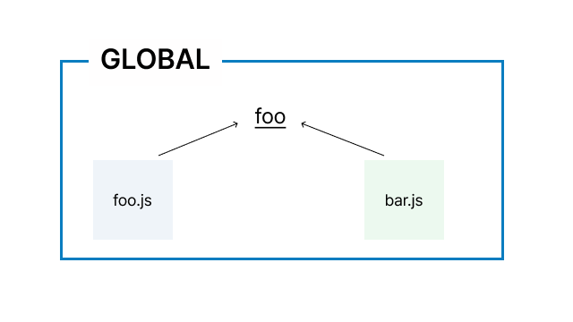
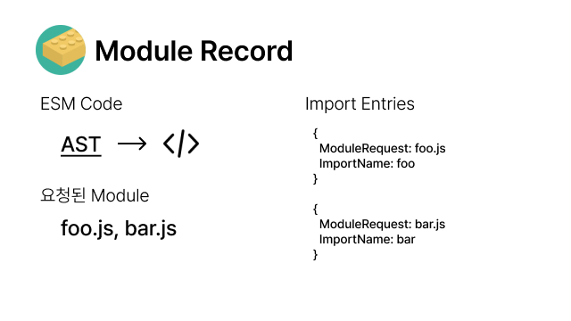
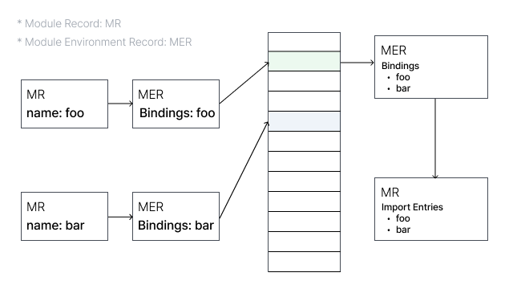
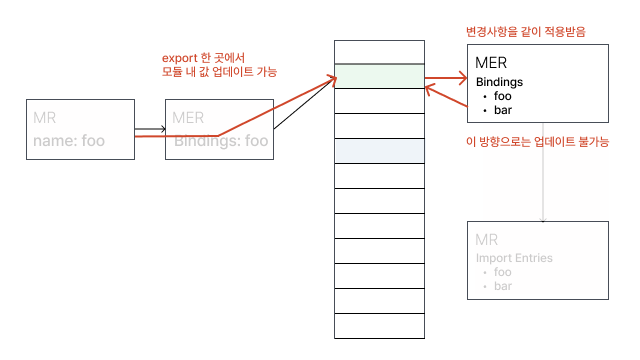
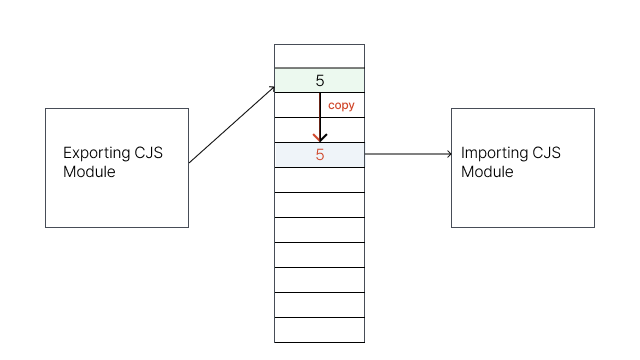
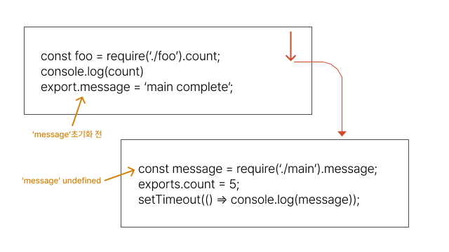
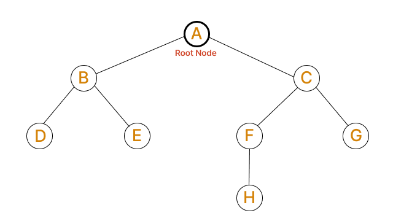

## 들어가며

어플리케이션은 다양한 코드조각들(직접 작성한 코드, 라이브러리 등)로 이루어져 있습니다.  어플리케이션이 복잡해질수록 '필요한 코드'만 남기기 위한 작업, 흔히 Tree Shaking이라고 불리는 과정이 수반되어야 합니다.

이 글에서는 Tree Shaking에 대한 기본 개념과 Tree Shaking을 보장하기 위한 요소들에 대해 알아봅니다.

## Tree Shaking이란?

우리가 흔히 명명하는 Tree Shaking이란 최종 번들 결과물 관점에서 불필요한 코드가 없어지는 과정입니다. 

> It relies on the import and export statements in ES2015 to detect if code modules are exported and imported for use between JavaScript files.
>
> [mdn/glossary/tree-shaking](https://developer.mozilla.org/en-US/docs/Glossary/Tree_shaking)

"ES2015(ES6)의 import/export문에 의존하여 JavaScript파일간의 참조여부를 판단한다."라고 설명되어 있습니다.

Tree Shaking은 ES6부터 도입된 ES Modules라고 불리는 모듈시스템에 의존적이고, 이 말은 곧 우리가 알고 있는 많은 모듈 형식 중 'ESM'이 Tree Shaking을 가능하게 하는 차별점이 있다는 것을 의미합니다.

ESM은 어떻게 Tree Shaking을 가능하게 하는것인지, 다른 모듈 시스템과의 차이점이 무엇인지 알아봅니다.

## 모듈

ESM에 대한 구체적인 이야기를 하기에 앞서, 모듈에 대한 개념과 다른 모듈 시스템들에 대해 간단히 소개합니다.

### 모듈이란?

모듈이란 **'재활용 가능한 코드 단위'**라고 말할 수 있습니다. '재활용'가능하다는 것은 모듈의 범위 내에 있는 동작들이 어디에서 사용되더라도 같은 동작이 보장되는것이고, 모듈이 '코드 단위'라는 것은 하나의 어플리케이션을 작성하는데에 있어 N개의 모듈 집합으로 구성할 수 있다는 것을 의미합니다.

## JavaScript의 모듈 시스템 톺아보기



JavaScript에는 모듈 개념이 뒤늦게 도입되었습니다. 모듈 개념이 도입되기 이전에 `foo.js`와 `bar.js`가 공통변수 foo를 공유하는 가장 쉬운 방법'전역'범위로 변수를 끌어올리는 것이었습니다. 

이런 해결책은 전역에 선언된 변수의 상태나 선언시점을  제어할 수 없기 때문에 JS 로드 순서에 의존적이고 변수참조에 대한 의존성 관리가 어려워집니다. 

모듈은 변수와 함수를 구성하는 더 나은 방법을 제공합니다. 함수와 변수를 모듈 스코프 내에서 관리하고, 모듈 스코프를 통해 모듈간에 변수를 공유하는것도 가능합니다.

JavaScript를 클라이언트 사이드에 국한하지 않고 범용적으로 사용하고자 하는 움직임이 생기면서 모듈 기능은 반드시 해결해야 하는 핵심과제가 되었고, 이런 상황에서 제안된 것이 [CommonJS](http://www.commonjs.org/)와 [AMD(Asynchronous Module Definition)](https://github.com/amdjs/amdjs-api/wiki/AMD)입니다.

JavaScript 모듈화는 크게 CommonJS와 AMD진영으로 나뉘게 되었고, 브라우저에서 모듈을 사용하기 위해서는 CommonJS 혹은 AMD를 구현한 모듈 로더 라이브러리를 사용해야 하는 상황이 되었습니다.

### CJS(CommonJS)

```jsx
//importing 
const doSomething = require('./doSomething.js'); 

//exporting
module.exports = function doSomething(n) {
  // do something
}
```

서버 사이드 JavaScrtip런타임 환경인 Node.js는 CommonJS를 채택하였습니다. (덧붙임: [Node.js 17버전에서는 ECMASCript module지원이 추가](https://nodejs.org/api/esm.html#modules-ecmascript-modules)되었습니다.) 특징은 **정적인 바인딩, 동기(synchronous) import**를 꼽을 수 있습니다.

> 정적인 바인딩: 'require' 를 통해 가져온 값의 복사본을 제공합니다. 이는 'module.exports' 를 수행한 쪽에서 값의 변경이 있더라도 최초 'require'이후에는 변경된 값을 사용할 수 없다는 것을 의미합니다.

### AMD(Asynchronous Module Definition)

```jsx
define(['dep1', 'dep2'], function (dep1, dep2) {
    //Define the module value by returning a value.
    return function () {};
});
```

CommonJS는 모든 파일이 로컬에 있어 필요할 때 바로 불러올 수 있는 상황을 전제로 합니다. 즉 동기적인 동작이 가능한 서버사이드 자바스크립트 환경을 전제로 하는 것입니다.

브라우저에서는 이런 방식으로 인해 **모듈이 모두 다운로드 될 때 까지 아무것도 할 수 없는** 상태가 만들어질 수 있고, 이는 치명적인 단점이 됩니다.

AMD그룹은 자바스크립트 모듈의 비동기 처리에 대해 CJS 그룹과 논의하다 합의점을 찾지 못해 독립한 그룹입니다. CJS는 자바스크립트를 브라우저 밖으로 꺼내기 위해 탄생한 그룹이고, AMD는 브라우저에 중점을 둔 그룹이라고 할 수 있습니다.

'Asynchronous Module Definition'이라는 말에서 알 수 있듯이, AMD는 비동기 모듈(필요한 모듈을 네트워크를 통해 내려받을 수 있도록 하는 것)에 대한 표준안을 다루고 있습니다.

### UMD(Universal Module Definition)

```jsx
(function (root, factory) {
    if (typeof define === "function" && define.amd) {
        define(["jquery", "underscore"], factory);
    } else if (typeof exports === "object") {
        module.exports = factory(require("jquery"), require("underscore"));
    } else {
        root.Requester = factory(root.$, root._);
    }
}(this, function ($, _) {
    // this is where I defined my module implementation

    var Requester = { // ... };

    return Requester;
}));
```

AMD와 CJS진영이 나뉘어지다보니 서로 호환되지 않는 문제가 발생합니다. 이를 해결하기 위한 패턴으로 UMD가 제안되었고, 이렇기 때문에 UMD는 사실상 **모듈 시스템에 따라 다른 구현을 정의하고 있는 형태**에 가깝습니다.

### ESM

```jsx
import {foo, bar} from './myLib';

export default function() {
  // your Function
};
export const function1() {...};
export const function2() {...};
```

ESM은 ECMAScript에서 지원하는 JavaScript공식 모듈 시스템이며, 대부분의 모던 브라우저에서 지원하는 형식입니다. (역시  '그 브라우저'는 지원하지 않습니다.)

ESM은 모듈 로더를 비동기 환경에서 실행할 수 있고, 스크립트를 바로 실행하지 않고 `import` 와 `export` 구문을 찾아서 스크립트를 파싱하여 모듈 dependency그래프를 만든 이후 실행합니다.

## ESM의 특징들

### TL;DR

- ES6에서는 정적 import / export를 강제
    - '정적 구조'를 가지고 있기 때문에 조건부로 로드된 모듈이 없다는 것을 의미
- `import` 는 `export` 에 대한 읽기전용 속성으로 여겨지기 때문에, 값을 직접 복사하지 않고 레퍼런스만 참조

### 동작 방식

ESM 시스템은 **구성, 인스턴스화, 평가** 세 단계로 이루어집니다.

#### 구성

가장 첫 단계로 모듈의 종속성 트리를 구성합니다. 종속성 그래프는 브라우저 또는 노드가 로드해야 하는 모듈(코드)을 파악하는 재료가 됩니다.

그래프의 시작점이 될 파일을 명시하고 시작점에서 import문을 따라가며 종속성 트리를 생성합니다.



import로 연결된 파일 자체는 브라우저가 사용할 수없으므로 [Module Record](https://262.ecma-international.org/6.0/#sec-source-text-module-records)(export, import정보가 담긴 데이터 구조)로 변환합니다. 이 과정에서 모든 파일을 찾아 로드하고 Module Record로 변환하기 위해 구문분석을 수행합니다.

#### 인스턴스화

그 다음 모듈 레코드를 모듈 인스턴스로 변환합니다. (인스턴스: 'code'와 'state'라는 두 가지를 결합한 형태) import할 모든 값을 할당할 메모리 공간을 찾는 과정이며, export, import모두 해당 메모리를 가리키도록 합니다.

#### 평가

코드를 실행하여 변수의 실제 값으로 메모리를 채우는 과정입니다.

'code'는 그 자체로는 일련의 지침, 혹은 무언가를 만드는 '레시피'로 볼 수 있습니다. 그러나 그 자체로는 아무것도 할 수 없고 함께 사용할 '값'이 필요합니다.

상태는 특정 시점에서의 변수의 실제 '값'이 됩니다.('상태'라고 표현했지만, 메모리라고 표현하는 것이 좀 더 정확합니다.) '평가'과정이 이 값을 채우는 과정입니다.

구성 · 인스턴스화 · 평가는 개별적으로, 비동기적으로 수행될 수 있습니다.

### 특징 1. 정적 구조

```jsx
var lib = require('lib');
lib.someFunc(); // property lookup
```

`lib.someFunc` 를 통해 lib에 접근할 때, lib는 동적인 값이기 때문에 property lookup을 수행해야 합니다.

```jsx
import * as lib from 'lib';
lib.someFunc(); // 정적분석 가능
```

ES6는 이와 반대로, lib를 가져올 때 lib의 정보를 정적으로 알 수 있고 이로 인해 access를 최적화 할 수 있습니다.

`CommonJS` 와 달리 export문은 ES6모듈의 최상위 레벨에만 위치할 수 있습니다. 컴파일러가 ES6모듈을 좀 더 쉽게 해석할 수 있게 하기 위한 제한이지만 메서드 호출 기반으로 api를 동적으로 정의하고 `export`해야만 하는 경우는 많지 않기 때문에 좋은 제한이기도 합니다.

```jsx
function foo () {
  export default 'bar' // SyntaxError
}
foo()
```

### 특징 2. Bindings, Not Values

[ESM동작방식 - 평가](#평가)단락에서 언급했듯, import와 export는 모두 같은 메모리 주소를 바라봅니다.



`export`한 곳에서 값을 변경하면 해당 변경사항이 `import`한 곳에서도 반영됩니다. `export`하는 모듈에서는 값을 변경할 수 있지만, `import`하는 쪽에서는 값을 변경할 수 없습니다.



```jsx
// a.js
export let a = 'AAA'
setTimeout(() => a = 'ABC', 500)

// b.js
import 'a.js'
console.log('a', a); // AAA
setTimeout(() => console.log('a', a), 1000); // ABC
```

위 예제에서 `a`변수는 0.5초간 AAA이지만, 1초 후에는 ABC로 변경되며, 이 모듈을 사용한 곳에서도 같은 변경사항을 적용받을 수 있습니다.

이 방식은 CommonJS와 큰 차이가 있는데, CommonJS에서는 `require`로 로드한 모듈의 **값**을 사용합니다. 같은 메모리를 바라보고 있지 않기 때문에, `export`된쪽에서 값을 변경해도 `require`한 쪽에서는 변경된 값으로 사용할 수 없습니다.



모듈 시스템을 사용할 때 모듈간에 참조 관계를 해석하고 위와같이 메모리에 할당하는 작업, 즉 종속성 그래프를 만드는 작업이 수행됩니다. 이 때 순환참조가 발생한 모듈은 어떻게 평가될까요?



우선 CommonJS에서의 동작방식을 살펴봅니다.

`main.js` 가 실행되고 코드의 첫 줄인 `require("./counter.js")` 를 수행합니다. 이 코드는 `counter` 모듀을 로드하게 됩니다.

counter 모듈은 main에서 가져온 `message` 변수에 접근하려고 하지만, **main모듈이 아직 완전히 실행되지 않았기 때문에 message의 값은 undefiend입니다.**

cjs에서 `export/require`는 같은 메모리 주소를 바라보지 않기 때문에 main모듈에서 갑싱 업데이트 되었다고 해도 counter모듈에서는 계속 undefined값이 출력될 것입니다.

반대로 ESM은 `export/import`가 같은 메모리 주소를 바라보기 때문에 `counter.js`의 `message`변수는 undefined에서 'main complete'값으로 변경될 것입니다.

### 정리

ESM의 여러 특징들에 대해 정리해보았는데, ESM은 '정적인 구조'를 가지고 있다는 점이 가장 중요합니다.

정적인 구조를 가졌기 때문에 빌드 타임에 모듈간 관계를 파악할 수 있고, 이를 기반으로 사용되지 않는 코드를 제거하는 작업도 가능하기 때문입니다.

다음 단락에서는 이 특징과 Tree Shaking관계 그리고 번들러의 Tree Shaking방식에 대해서 정리해봅니다.

## Tree Shaking

일반적으로 Tree Shaking이라는 단어는 루트 노드에 연결되지 않은 노드(메소드/변수)를 제거하는 과정으로 정의 됩니다.



이 개념을  처음 도입한 Rollup에서는 Tree Shaking에 대한 정의를 다르게 사용하고 있습니다.

"루트 노드에 연결되지 않은 노드(메소드/변수)를 제거하는 과정"은 **Dead code elimination**(죽은 코드 제거)이지만 Rollup의 Tree Shaking은 **live code inclusion**(필요한 코드만 쌓아나가는 것)입니다.

즉, 번들러 관점에서는Tree-Shaking이란 '어떤 모듈이 필요한지 평가하는 과정'입니다. ([* 부록 2. Dead code elimination vs Tree Shaking](#부록-2-dead-code-elimination죽은코드-없애기-vs-tree-shaking))

### 지원모듈

Tree Shaking은 기본적으로 모듈 구조를 정적으로 분석할 수 있는 ESM에 대해 적용 가능합니다.

```jsx
module.exports[localStorage.getItem(Math.random())] = () => { … };
```

CommonJS에서는 위와같이 runtime에서 결정되는 모듈구조를 다룰 수 있기 때문에 번들러가 어떤 모듈을 포함할지, 포함하지 않을지 쉽게 결정할 수 없습니다.

번들러마다 Tree Shaking의 내부 원리는 조금씩 다를 수 있지만,  **"정적으로 분석할 수 있는 모듈 시스템에 대해서 더 잘 지원할 수 있다."**는 사실은 동일합니다.

### [webpack] ModuleConcatenationPlugin

[webpack의 ModuleConcatenationPlugin](https://webpack.js.org/plugins/module-concatenation-plugin/)의 동작을 살펴보면 CJS, ESM형태가 최종 번들 결과물에 미치는 영향을 좀더 이해할 수 있습니다.

```jsx
// utils.js
export const add = (a, b) => a + b;
export const subtract = (a, b) => a - b;

// index.js
import { add } from './utils';
const subtract = (a, b) => a - b;

console.log(add(1, 2));
```

위 코드를 [optimization.minimize](https://webpack.js.org/configuration/optimization/#optimizationminimize): `false` 로 빌드하면 아래와 같은 결과물을 확인할 수 있습니다.

```jsx
/******/ (() => { // webpackBootstrap
/******/ 	"use strict";

// CONCATENATED MODULE: ./utils.js**
const add = (a, b) => a + b;
const subtract = (a, b) => a - b;

// CONCATENATED MODULE: ./index.js**
const index_subtract = (a, b) => a - b;**
console.log(add(1, 2));**

/******/ })();
```

minimize가 true로 설정되면 위 결과물에서 참조되지 않는 함수 제거, 주석/공백제거 등의 작업이 수행되며 여기서 **"참조되지 않는 함수가 제거된 결과"**를 Tree Shaking된 결과라고  해석할 수 있습니다.

참조되지 않는 함수가 최종 번들에 포함되지 않도록 하는 작업이 가능한 이유는 모든 모듈이 정적으로 분석될 수 있었기 때문이고, 반대로 모듈을 동적인 형태로 선언할 수 있는 CJS형태의 모듈은 Tree Shaking을 적용하기 어렵습니다.

```jsx
const { maxBy } = require('lodash-es');

const fns = {
  add: (a, b) => a + b,
  subtract: (a, b) => a - b,
  multiply: (a, b) => a * b,
  divide: (a, b) => a / b,
  max: arr => maxBy(arr)
};

Object.keys(fns).forEach(fnName => module.exports[fnName] = fns[fnName]);

// webpack result
...
(() => {

"use strict";
/* harmony import */ var _utils__WEBPACK_IMPORTED_MODULE_0__ = __webpack_require__(288);
const subtract = (a, b) => a - b;
console.log((0,_utils__WEBPACK_IMPORTED_MODULE_0__/* .add */ .IH)(1, 2));

})();
```

위와같은 CJS코드를 빌드하면 번들 결과물에 `__webpack_require__` 가 포함되어 있는 것을 확인할 수 있습니다. 모듈을 동적으로 사용하기 위한 코드이며, 최종적으로 `fns` 내에 정의된 모든 모듈을포함하는 형태입니다. (`__webpack_require__` 등 이에 대한 자세한 내용은 [이 글](https://ui.toast.com/weekly-pick/ko_20190418) 을 참고해주세요.)

### [Rollup] AST분석

#### TL;DR

`rollup`의 번들링 과정은 의존성 관계를 파악하여 Graph를 만들고, 이 그래프를 AST(Abstract Syntax Tree)로 치환하여 구문 분석 후 옵션에 맞게 결과물을 만드는 과정으로 이루어 집니다.

> rollup의 전체 과정에 대해서는 [이 글](https://programmerall.com/article/2523859516/)을 참고해주세요.

(표현을 다듬어야겠군)
Tree Shaking은 AST트리의 각 노드를 순회하는 단계에서 수행되며, 포함되어야 하는 모듈에 마킹한 뒤 chunk파일을 생성합니다.

#### Step 1. 구문분석

AST 변환 결과를 통해 `import`, `export`, `re-export` 구문에 대해 모듈 요청 경로를 파악할 수 있습니다.

```ts
function createResolveId(preserveSymlinks: boolean) {
	return function(source: string, importer: string) {
		if (importer !== undefined && !isAbsolute(source) && source[0] !== '.') return null;

		 // Finally call path.resolve to convert the legal path fragment into an absolute path
		return addJsExtensionIfNecessary(
			resolve(importer ? dirname(importer) : resolve(), source),
			preserveSymlinks
		);
	};
}
```

이 과정을 통해 얻은 모듈 경로를 바탕으로 `rollup`내부에서 사용 하는 모듈 인스턴스를 생성합니다.

```ts
const module: Module = new Module(
  this.graph,
  id,
  moduleSideEffects,
  syntheticNamedExports,
  isEntry
);
```

#### Step 2. `included`여부 결정

AST구문 내용에 따라 [getNodeConstructor](https://github.com/rollup/rollup/blob/ce3de491b8ff0f61789c1ab61287ca06c9d19382/src/ast/nodes/shared/Node.ts#L216)를 호출하여 각 구문에 맞는 처리를 수행합니다.

[rollup의 각 AST모듈](https://github.com/rollup/rollup/tree/ca86df280288656c66a948e122c36ccee7e06aca/src/ast)에는 공통적으로 `include`메서드와 `this.included = true;`구문이 포함되어 있습니다.

이는 class가 생성되는 순간 가장 super class인 [ExpressionEntity의 included값이 false](https://github.com/rollup/rollup/blob/ce3de491b8ff0f61789c1ab61287ca06c9d19382/src/ast/nodes/shared/Expression.ts#L16)인 것을 `true`로 변경하는 동작입니다.

각 AST모듈에는 코드블록이 포함되는 경우 `included`값을 true로 설정하고 현재 코드블록의 모든 es노드를 순회하여 필요한 조건에 따라 `included`값을 결정하는 코드가 공통적으로 구현되어 있습니다.

```ts
// 예시 ast/nodes/LabelStatement.ts
include(context: InclusionContext, includeChildrenRecursively: IncludeChildren): void {
	this.included = true;
	const brokenFlow = context.brokenFlow;
	this.body.include(context, includeChildrenRecursively);
	if (includeChildrenRecursively || context.includedLabels.has(this.label.name)) {
		this.label.include();
		context.includedLabels.delete(this.label.name);
		context.brokenFlow = brokenFlow;
	}
}
```

#### Step 3. 번들파일 write 

```ts
function render(code: MagicString, options: RenderOptions) {
  if (this.label.included) {
    this.label.render(code, options);
  } else {
    code.remove(
      this.start,
      findFirstOccurrenceOutsideComment(code.original, ':', this.label.end) + 1
    );
  }
  this.body.render(code, options);
}
```

번들파일을 생성하는 과정에서는 Step 2에서 판단한 `included`값에 따라 판단합니다. 

#### +) @rollup/plugin-commonjs

rollup의 [이슈](https://github.com/rollup/rollup-plugin-commonjs/issues/362)에 따르면, [rollup/plugin-commonjs](https://github.com/rollup/plugins/tree/master/packages/commonjs)를 사용하여 ES6로 변환할 경우 tree-shaking대상에 포함될 수 있지만 `module.exports` 사용 방식에 따라 지원여부가 달라집니다.

```jsx
// ✅ tree-shaking가능
const foo = require('./foo');

module.exports = {
  bar: foo,
}

// ❌ tree-shaking불가능
const foo = require('./foo');

module.exports = foo
```

### 부록 1. 라이브러리에서 tree shaking지원하기

[webpack 문서](https://webpack.js.org/guides/tree-shaking/#mark-the-file-as-side-effect-free)에 따르면 tree-shaking은 두 가지 옵션으로 적용될 수 있다고 설명하고 있습니다.

- **usedExports:** 사용한 모듈 export
- **sideEffects:** 사용되지 않았고, sideEffects가 없는 모듈은 건너뛴다.

> 모듈의 sideEffects는 특정종류의 '코드'를 지칭하는데, 단순히 import하는 것만으로 실행되는 코드를 뜻합니다.

```jsx
import 'fooPolyfill';
import 'bar.css'
```

위 모듈들은 import하는 즉시 어플리케이션에 영향을 미치므로 확실히 sideEffect가 있습니다. 하지만 번들러 관점에서는 `fooPolyfill` , `bar.css`모듈이 import선언만 되어있고 직접적으로 사용하거나 다시 export하지 않으므로 Tree Shaking되어야 하는 모듈로 볼 것입니다.

그러나 두 모듈이 사라지면 어플리케이션이 제대로 동작하지 않게 됩니다. 따라서, webpack과 rollup같은 번들러는 어플리케이션의 안전한 동작을 보장하기 위해 기본적으로 라이브러리의 모든 모듈이 **"sideEffect가 있다."**고 판단합니다.

sideEffects를 가장 정확히 판단할 수 있는 주체는 아직까지 번들러가 아니라 개발자입니다. 그렇기 때문에 번들러에게 sideEffects를 알려주는 방식으로 효과적인 Tree Shaking이 가능합니다. 개발자는 이 속성을 `true / false / 파일 배열([foo.js, bar.css])`로 명시할 수 있습니다.

대부분의 번들러는 `package.json` 의 sideEffects 속성을 읽어 판단하고, 명시되지 않은 경우 true(모든 모듈에 sideEffects가 있음)로 판단합니다. 

> "sideEffects is much more effective since it allows to skip whole modules/files and the complete subtree." ([webpack tree-shaking](https://webpack.js.org/guides/tree-shaking/#clarifying-tree-shaking-and-sideeffects))
> 

sideEffects는 전체 모듈/파일 및 전체 하위 트리를 **건너뛸 수 있으므로 효과적**입니다. 다시한번 webpack Tree Shaking에 영향을 주는 두 요소를 정리해보면,

- **sideEffects:** 사용한 모듈이 사용되지 않는 경우 skip
- **usedExports:** 어떤 모듈에서도 사용되지 않는 모듈 제거

`usedExports`결과가 정확하다면, `sideEffects`에 대한 판단없이도 최종 번들에 포함되는 코드는 동일할 것입니다. 그러나 어플리케이션에서 어떤 모듈이 사용되었는지 판단하는 것은 어플리케이션 크기가 조금만 커져도 복잡한 일이 되고 판단이 정확하지 않을 수 있습니다.

그렇기 때문에 `sideEffects`에 대한 판단이 훨씩 효율적이고 효과적이며, 두 개의 결과를 종합하면 최적의 Tree Shaking결과를 얻을 수 있습니다. (부록 2. 참고)

#### 모듈 트리 유지

sideEffects 최적화의 이점을 잘 활용할 수 있으려면, 모듈이 하나의 파일로 번들링 되지 않고 모듈 tree구조를 그대로 유지해야 합니다.

단일 파일로 번들링 될경우 sideEffects가 없더라도 건너뛸 수 있는 모듈이 없기때문에 sideEffects최적화의 이점이 사라집니다. 

```jsx
// userAccount.js
import { isNil } from "lodash";

export const checkExistance = (variable) => !isNil(variable);

export const userAccount = {
  name: "user account",
};
```

lodash를 사용하는 `userAccount.js` 를 포함하여 다른 모듈들을 전부 하나의 파일로 번들링하면 아래와 같이 번들링됩니다.

```jsx
// userAccount.js
import { isNil } from "lodash";

const checkExistance = (variable) => !isNil(variable);

const userAccount = {
  name: "user account",
};

const getUserAccount = () => {
  return userAccount;
};

// userPhoneNumber.js
const getUserPhoneNumber = () => "***********";
// userName.js
const getUserName = () => "John Doe";

export { checkExistance, getUserName, getUserPhoneNumber, getUserAccount };
```

`checkExistance` 가 사용되지 않는다고 판단되더라도 lodash를 import하는 코드는 사라지지 않습니다.

```jsx
/***/ "./node_modules/user-library/dist/index.js":
/*!*************************************************!*\
  !*** ./node_modules/user-library/dist/index.js ***!
  \*************************************************/
/***/ ((__unused_webpack_module, __webpack_exports__, __webpack_require__) => {

"use strict";
/* harmony export */ __webpack_require__.d(__webpack_exports__, {
/* harmony export */   "getUserName": () => (/* binding */ getUserName)
/* harmony export */ });
/* unused harmony exports checkExistance, userAccount, getUserPhoneNumber, getUserAccount */
/* harmony import */ var lodash__WEBPACK_IMPORTED_MODULE_0__ = __webpack_require__(/*! lodash */ "./node_modules/user-library/node_modules/lodash/lodash.js");
/* harmony import */ var lodash__WEBPACK_IMPORTED_MODULE_0___default = /*#__PURE__*/__webpack_require__.n(lodash__WEBPACK_IMPORTED_MODULE_0__);

/*
checkExistance, userAccount, getUserPhoneNumber, getUserName 내용포함
**/

/***/ "./node_modules/user-library/node_modules/lodash/lodash.js":
/*!*****************************************************************!*\
  !*** ./node_modules/user-library/node_modules/lodash/lodash.js ***!
  \*****************************************************************/
/***/ (function(module, exports, __webpack_require__) {

/* module decorator */ module = __webpack_require__.nmd(module);
var __WEBPACK_AMD_DEFINE_RESULT__;/**
 * @license
 * Lodash <https://lodash.com/>
 * Copyright OpenJS Foundation and other contributors <https://openjsf.org/>
 * Released under MIT license <https://lodash.com/license>
 * Based on Underscore.js 1.8.3 <http://underscorejs.org/LICENSE>
 * Copyright Jeremy Ashkenas, DocumentCloud and Investigative Reporters & Editors
 */
// ...
```

번들 결과물을 살펴보면, `unused harmony exports checkExistance, ...` 로 모듈이 사용되지 않았다고 판단되었지만 lodash는 cjs포맷이기 때문에 Tree Shaking대상에 포함될 수 없습니다.

모듈 구조가 유지된다면 lodash를 포함하고 있는 `userAccount.js`모듈이 별도의 파일로 분리되었을 것이고, 모듈이 **사용되지 않았다고 판단되면 userAccount.js파일자체가 포함되지 않기 때문에 lodash도 최종 번들 결과물에 포함되지 않습니다.**

[rollup에서는 preserveModules: true 설정](https://rollupjs.org/guide/en/#outputpreservemodules)으로 모듈 구조를 유지할 수 있고, 다른 번들러에서도 비슷한 기능을 제공합니다. 더 자세한 내용은 [How To Make Tree Shakable Libraries](https://blog.theodo.com/2021/04/library-tree-shaking/) 글을 참고해주세요.

### [부록 2. Dead code elimination(죽은코드 없애기) vs Tree Shaking](https://medium.com/@Rich_Harris/tree-shaking-versus-dead-code-elimination-d3765df85c80)

'죽은 코드 없애기'과정은 달걀을 깨서 넣는 대신 계란 전체를 넣고 믹싱 볼에 넣고 **케이크를 만든 다음** 케이크에서 달걀껍질을 제거하는 과정이고 'Tree Shaking'은 케이크를 만들기 위해 **어떤 재료가 필요한지 판단해서** 넣는 것입니다. 즉, 죽은코드를 없애는 과정은 단순히 live bundle에서 어떤 코드가 필요하지 않은 지 판단하고, 반대로 Tree Shaking은 어떤 코드가 필요한지 판단합니다.

두 과정의 최종 결과물(JS Bundle file)이 같을 것이라고 생각되자만 사실은 JavaScript정적분석의 한계로 인해 그렇지 않습니다.  두 과정 모두 필요하고, Bundler로 Tree Shaking후에 terser plugin을 통해서 죽은 코드를 제거하는 과정까지 수행하면 번들 사이즈 측면에서 가장 나은 결과를 얻을 수 있습니다. webpack 5에는 terser-web-pack-plugin이 기본으로 제공되므로 이 두 과정이 기본적으로 항상 같이 수행된다고 볼 수 있습니다.

## References

- [https://hacks.mozilla.org/2018/03/es-modules-a-cartoon-deep-dive/](https://hacks.mozilla.org/2018/03/es-modules-a-cartoon-deep-dive/)
- [https://262.ecma-international.org/6.0/#sec-source-text-module-records](https://262.ecma-international.org/6.0/#sec-source-text-module-records)
- [https://exploringjs.com/es6/ch_modules.html#static-module-structure](https://exploringjs.com/es6/ch_modules.html#static-module-structure)
- [https://web.dev/commonjs-larger-bundles/](https://web.dev/commonjs-larger-bundles/)
- [https://blog.theodo.com/2021/04/library-tree-shaking/](https://blog.theodo.com/2021/04/library-tree-shaking/)
- [https://medium.com/@Rich_Harris/tree-shaking-versus-dead-code-elimination-d3765df85c80](https://medium.com/@Rich_Harris/tree-shaking-versus-dead-code-elimination-d3765df85c80)
- [https://www.smashingmagazine.com/2021/05/tree-shaking-reference-guide/](https://www.smashingmagazine.com/2021/05/tree-shaking-reference-guide/)
