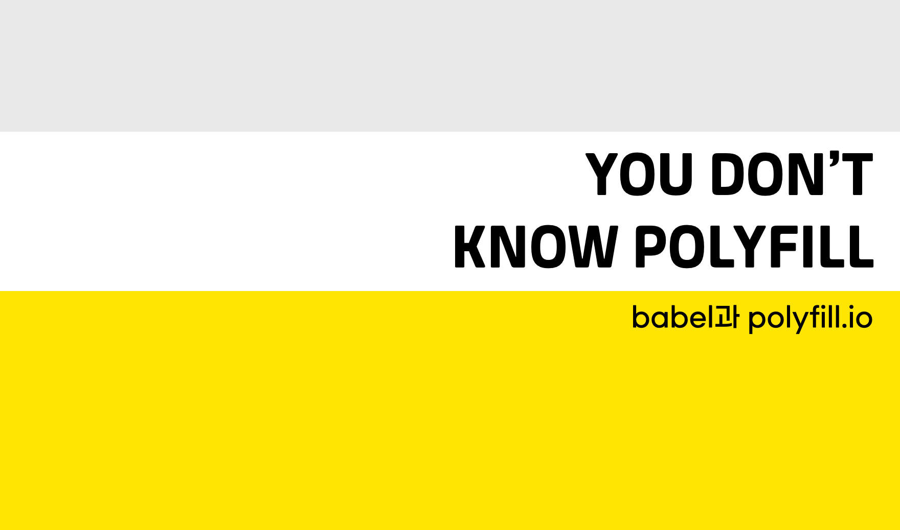
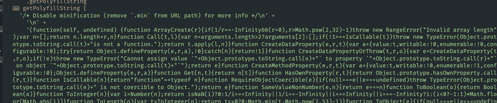
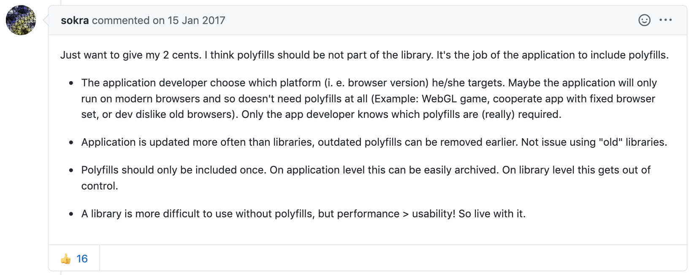

Babel transforms ES6+ code into ES5. Read that sentence on its own and you might assume Babel and polyfills are the same thing — they're not. Babel has no way to support ES6 methods or constructors that simply don't exist in ES5.

`Promise`, `Object.assign`, `Array.from`, and the like never get touched, because there's no ES5 syntax to swap them for.

```jsx {2,7,13,18}
// Yes! I can Do!
// Before
const helloBabel = () => {
  return 'world';
}

// After
var helloBabel = function helloBabel() {
  return 'world';
}

// No I can't
// Before
const helloPromise = new Promise(resolve => {
  return resolve('world')
})

// After
const helloPromise = new Promise(resolve => {
  return resolve('world')
})
```

Notice the `Promise` syntax didn't change at all. Ship that code as-is and it throws in any browser that doesn't support ES6.

That gap — the part Babel can't transform — is exactly what a polyfill fills in. Below, I'll walk through [babel](https://github.com/babel/babel) and [polyfill.io](https://polyfill.io/).

## babel

Before babel@7.4.0, most people reached for `@babel/polyfill`, but for the reasons below, it's now folded into `@babel/preset-env`.

> ⚠️  @babel/polyfill was deprecated in babel@7.4.0.

### @babel/polyfill

@babel/polyfill is really just a package wrapping two dependencies: the generator polyfill [regenerator runtime](https://www.npmjs.com/package/regenerator-runtime), and [core-js](https://www.npmjs.com/package/core-js), which polyfills ES5/6/7.

```jsx
// core-js@2.6.
// Cover all standardized ES6 APIs.
import "core-js/es6";

// Standard now
import "core-js/fn/array/includes";
import "core-js/fn/array/flat-map";
/* omitted */

// Ensure that we polyfill ES6 compat for anything web-related, if it exists.
import "core-js/web";

import "regenerator-runtime/runtime";
```

[The code behind @babel/polyfill](https://github.com/babel/babel/blob/master/packages/babel-polyfill/src/noConflict.js) is barely anything — all it does is import the `core-js` and `regenerator-runtime` polyfill modules.

Before `core-js` patches the global scope, it checks whether a feature already exists, so on modern browsers it just runs without touching anything, which makes it faster than going through `@babel/plugin-transform-runtime(corejs: false)`.

> `@babel/plugin-transform-runtime` also accepts `corejs: 2 | 3 | false` — more on that [further down](https://so-so.dev/web/you-dont-know-polyfill#babel-plugin-transform-runtime).

```jsx {6,9}
// https://github.com/zloirock/core-js/blob/v2/modules/_export.js

var $export = function (type, name, source) {
  /* omitted */
  for (key in source) {
    // contains in native
    own = !IS_FORCED && target && target[key] !== undefined;
    // export native or passed
    out = (own ? target : source)[key];
    // bind timers to global for call from export context
    exp = IS_BIND && own ? ctx(out, global) : IS_PROTO && typeof out == 'function' ? ctx(Function.call, out) : out;
    // extend global
    if (target) redefine(target, key, out, type & $export.U);
    /* omitted */
  }
}
```

A quick look at the core-js@2.6.5 code `@babel/polyfill` used to ship shows exactly how it works: it patches the global object directly.

```jsx
// https://github.com/zloirock/core-js/blob/v2/modules/es7.array.includes.js
$export($export.P, 'Array', {
  includes: function includes(el /* , fromIndex = 0 */) {
    return $includes(this, el, arguments.length > 1 ? arguments[1] : undefined);
  }
});
```

Because it edits the global object directly, newly added prototype methods like `Array.prototype.includes` just work, and you never have to track which prototype methods any given library happens to call.

That said, `@babel/polyfill` has two real problems.

#### Problem 1

```js
import "core-js/es6"
/* ...omitted */
import "regenerator-runtime/runtime";
```

Because it imports modules exactly like this, polyfills you'll never touch still end up in your bundle, bloating its size. The moment you import @babel/polyfill, nearly everything under [core-js's es6/index.js](https://github.com/zloirock/core-js/blob/v2/es6/index.js) gets pulled in with it.

#### Problem 2

@babel/polyfill can only be imported once. Import it twice and you'll hit this error.

```text
:rotating_light: Uncaught Error : only one instance of babel-polyfill is allowed
```

It keeps a global flag, `global._babelPolyfill`, internally, and throws whenever more than one copy gets loaded.

```js
if (global._babelPolyfill && typeof console !== "undefined" && console.warn) {
  console.warn(
    "@babel/polyfill is loaded more than once on this page. This is probably not desirable/intended " +
      /* ... */
  );
}
```

`core-js`'s ES6/7 polyfills, which @babel/polyfill depends on, break internally if they're invoked twice, so the polyfill never applies correctly.
So you have to be careful never to trigger @babel/polyfill more than once.

### @babel/plugin-transform-runtime

`@babel/plugin-transform-runtime` takes a different approach: during transpiling, it swaps out anything that needs a polyfill for an internal helper function instead. ([related code](https://github.com/babel/babel/blob/6.x/packages/babel-plugin-transform-runtime/src/index.js#L4-L16))

It lists `core-js` as a [peerDependency](https://nodejs.org/es/blog/npm/peer-dependencies/), and following an [alias list](https://github.com/babel/babel/blob/master/packages/babel-plugin-transform-runtime/src/runtime-corejs3-definitions.js), it applies polyfills by swapping in helper functions instead of ever touching the global object.

```jsx
new Promise(resolve => resolve(1))
```

Run that through the transpiler and it comes out looking like this — instead of patching the `Promise` global directly, it constructs an internal object instead.

```jsx {3}
var _promise = require("babel-runtime/core-js/promise");

var _promise2 = _interopRequireDefault(_promise);

function _interopRequireDefault(obj) { return obj && obj.__esModule ? obj : { default: obj }; }

new _promise2.default(function (resolve) {
  return resolve(1);
});
```

Babel generates a bunch of helper functions to turn ES6+ syntax into ES5, and @babel/plugin-transform-runtime rewrites those helpers during transpiling so they point at another module instead.

```js
class Circle {}
```

Without `@babel/plugin-transform-runtime`, this is what it compiles to.

```js {1,6}
function _classCallCheck(instance, Constructor) {
  //...
}

var Circle = function Circle() {
  _classCallCheck(this, Circle);
};
```

Every single file with a `class` in it regenerates its own copy of `_classCallCheck`, over and over.

Turn on `@babel/plugin-transform-runtime` and that stops — instead of regenerating the helper each time, it just references `@babel/runtime` or `corejs`.

```js {1,9}
var _classCallCheck2 = require("@babel/runtime/helpers/classCallCheck");

var _classCallCheck3 = _interopRequireDefault(_classCallCheck2);

function _interopRequireDefault(obj) {
  return obj && obj.__esModule ? obj : { default: obj };
}

var Person = function Person() {
  (0, _classCallCheck3.default)(this, Person);
};
```

Which module it references depends on the [`corejs` option](https://babeljs.io/docs/en/babel-plugin-transform-runtime#corejs); leave it at the default `false` and it points to `@babel/runtime`. ([code](https://github.com/babel/babel/blob/main/packages/babel-plugin-transform-runtime/src/index.js#L165-L169))

```js
const moduleName = injectCoreJS3 // corejs === 3 ?
  ? "@babel/runtime-corejs3"
  : injectCoreJS2 // corejs === 2 ?
  ? "@babel/runtime-corejs2"
  : "@babel/runtime";

this.addDefaultImport(
  `${modulePath}/${helpersDir}/${name}`,
  name,
  blockHoist,
);
// `${modulePath}/${helpersDir}/${name}` example:
// @babel/runtime/helpers/esm/${toArray}.js
```

There's one gotcha with this approach, though.

Take a project that depends on `axios` — you need to make sure `node_modules/axios` itself is included in the transpile scope. axios uses Promise internally, and since **babel-plugin-transform-runtime never creates the Promise global, you'll get an error**.

Unlike @babel/polyfill, it only polyfills what's actually needed, which is a real win for bundle size, but it puts a lot more of the burden on the developer to get right.

> You can try the code above yourself at [SoYoung210/test-polyfill-babel-transform-runtime](https://github.com/SoYoung210/test-polyfill/tree/babel-transform-runtime).

### @babel/preset-env

This one depends on [core-js-compat](https://www.npmjs.com/package/core-js-compat), and reads the `target` set in `babelrc` to load only the polyfills it actually needs, via [core-js-compat/data](https://github.com/zloirock/core-js/blob/master/packages/core-js-compat/src/data.js). In practice, it checks which JS syntax your target doesn't support and adds the matching `@babel/plugin-*` for it. ([Code](https://github.com/babel/babel/blob/eea156b2cb/packages/babel-preset-env/src/index.js#L303-L326))

#### useBuiltIns

`useBuiltIns` decides how polyfills get injected. It defaults to `false`, so leave it unset and you get no polyfills at all.

#### useBuiltIns: entry

```jsx
// index.js
import 'core-js';
```

It rewrites the `core-js` and `regenerator-runtime` modules imported at your transpile entry point, tailored to whatever `target` you set in babelrc.

```js {1,14}
// modern browser
module.exports = {
  "presets": [
    [
      "@babel/preset-env", {
        "targets": ">= 0.25%, not dead",
        "useBuiltIns": "entry",
        "corejs":3
      }
    ]
  ]
}

// include IE10
module.exports = {
  "presets": [
    [
      "@babel/preset-env", {
        "targets": ">= 0.25%, not dead, ie >= 10",
        "useBuiltIns": "entry",
        "corejs":3
      }
    ]
  ]
}

```

Add `ie >=10` to the target and it pulls in the `es/object.set-prototype-of` polyfill.

```diff
// modern browser
require("core-js/modules/es.array-buffer.is-view");

// include IE10
+ require("core-js/modules/es.object.set-prototype-of");
```

Target something really old, and you end up with far more polyfills than you need: wasted weight that even modern browsers have to download.

> [test-polyfill/babel-preset-env](https://github.com/SoYoung210/test-polyfill/tree/babel-preset-env) lets you compare the two bundles side by side — one targeting IE ≥ 10, one without.

#### useBuiltIns: usage

This setting imports only the polyfills your code actually calls.

Run `npm run build:modern:usage` in [test-polyfill/babel-preset-env](https://github.com/SoYoung210/test-polyfill/blob/babel-preset-env/index.js) and you'll get output like this.

```jsx
// Input
new Set([1,2,3])

var a = new Promise();

// Output
require("core-js/modules/es.array.iterator");

require("core-js/modules/es.object.to-string");

require("core-js/modules/es.promise");

require("core-js/modules/es.set");

require("core-js/modules/es.string.iterator");

require("core-js/modules/web.dom-collections.iterator");
```

Because `usage` only looks at your own code to decide what needs polyfilling, it can blow up if one of your `node_modules` dependencies ships code that itself needed a polyfill.

And in code like the following, Babel has no way to tell whether `fooArrayOrObject` is a string or an array, so it just imports both polyfills to be safe.

```jsx
// Before
import { fooArrayOrObject } from './test';
console.log(fooArrayOrObject.includes());

// After
require("core-js/modules/es.array.includes");

require("core-js/modules/es.string.includes");

var _test = require("./test");

console.log(_test.fooArrayOrObject.includes());
```

## polyfill.io

[polyfill.io](http://polyfill.io) works differently: it reads the requesting browser's [User-Agent](https://developer.mozilla.org/en-US/docs/Web/HTTP/Headers/User-Agent) and only ships the polyfills that browser actually needs. You can check supported browsers on the [polyfill.io page](https://polyfill.io/v3/supported-browsers/); IE 10 and below aren't on the list.

It reads the User-Agent through [polyfill-useragent-normaliser](https://github.com/Financial-Times/polyfill-useragent-normaliser/blob/master/lib/normalise-user-agent.vcl), then generates every polyfill it needs through the [getPolyfillString function](https://github.com/Financial-Times/polyfill-library/blob/e9cfb03a55ae343e1d6fb2e4f06176eee691298b/lib/index.js#L235).

> Run `npm run test-node` in [polyfill-library](https://github.com/Financial-Times/polyfill-library) and you can watch it generate a script like this.


### Usage

For the default setup, just drop this script tag into your html file.

```html
<head>
<script src="https://polyfill.io/v3/polyfill.min.js?features=default"></script>
</head>
```

polyfill-library, like @babel/polyfill, works by patching the global object.

```jsx {2,15}
// https://github.com/Financial-Times/polyfill-library/blob/master/polyfills/Array/isArray/polyfill.js
CreateMethodProperty(Array, 'isArray', function isArray(arg) {
  return IsArray(arg);
});

// https://github.com/Financial-Times/polyfill-library/blob/master/polyfills/_ESAbstract/CreateMethodProperty/polyfill.js
function CreateMethodProperty(O, P, V) { // eslint-disable-line no-unused-vars
var newDesc = {
  value: V,
  writable: true,
  enumerable: false,
  configurable: true
  };

Object.defineProperty(O, P, newDesc);
}
```

### Options

```text
https://polyfill.io/v3/polyfill.min.js?features=default
```

Use the default value like this and it automatically pulls in whatever polyfills are listed in its internal [aliases.json](https://github.com/Financial-Times/polyfill-library/blob/e9cfb03a55ae343e1d6fb2e4f06176eee691298b/lib/sources.js#L51).
> I couldn't find any docs spelling out exactly what's in the default set, so I dug through the polyfills/_dist/aliases.json file that `npm run test-polyfills` generates in polyfill-library instead.

```js
"default":
[
"Array.from","Array.isArray","Array.of","Array.prototype.every",
"Array.prototype.fill","Array.prototype.filter","Array.prototype.forEach",
....
]
```

Want only specific features? Pass them via the **feature** parameter. Want to exclude something? Use **excludes**.

```md {2,3}
https://cdn.polyfill.io/v3/polyfill.min.js
?features=fetch,IntersectionObserver
&excludes=Document
```

If you want a polyfill to load every time, regardless of User Agent, turn on the `flags=always` option. Pair it with `flags=always, gated` and it'll still check whether the browser actually implements the feature before loading anything.

```md {3}
https://cdn.polyfill.io/v2/polyfill.min.js
?features=fetch,IntersectionObserver&
flags=always,gated
```

Every option is documented in the [API Reference](https://polyfill.io/v3/api/), and the [url-builder](https://polyfill.io/v3/url-builder/) tool, which generates the query parameters for you, makes all of this a lot less tedious.

### Security

Specifying options through query parameters naturally raises [XSS attack](https://developer.mozilla.org/en-US/docs/Glossary/Cross-site_scripting) concerns. polyfill.io guards against this by escaping option values: the script characters `<` become `&lt` and `>` become `&gt`, so even a script tag slipped into the code never gets interpreted as HTML.

> [This writeup](https://snyk.io/vuln/npm:polyfill-service:20160126) covers it in more detail.

polyfill-service added this protection in [this commit](https://github.com/financial-times/polyfill-service/commit/aadd8d08b50f7f9c02b431d06f6ee2158902c53c), and it's been in place since version 3.1.2.

### Setting Up Your Own polyfill.io Server

There's no guarantee the polyfill.io server stays up forever, so depending on it directly in production can feel risky. Running [polyfill-library](https://github.com/Financial-Times/polyfill-library) as a self-hosted server takes that worry off the table.

Docker makes standing up your own [polyfill-service](https://github.com/financial-times/polyfill-service) pretty painless.

```docker
FROM node:12.18.0-alpine

RUN apk add --no-cache --update bash
RUN apk add --no-cache --update --virtual build git python make gcc g++

WORKDIR /polyfill

# Specify the correct version
ARG POLYFILL_TAG='v4.8.1'
ARG NODE_ENV='production'
RUN \
  git clone https://github.com/Financial-Times/polyfill-service . && \
  git checkout ${POLYFILL_TAG} && \
  rm -rf .git && \
  yarn install && \
  sed -i.bak -e 's,^node,exec node,' start_server.sh && \
  mv start_server.sh /bin/ && \
  chmod a+x /bin/start_server.sh && \
  apk del build
ENV PORT 8801

EXPOSE ${PORT}

CMD ["/bin/start_server.sh", "server/index.js"]
```

## If You're a Library Author

Once I'd worked through all these ways of handling polyfills, I found myself wondering what the right approach even is when you're the one building the library.

In a [GitHub Issue](https://github.com/w3ctag/polyfills/issues/6) debating whether polyfilling is the library's job or the application's, webpack maintainer sokra put it this way.



<div style="opacity: 0.5" align='center'>
<sup>
<a target='_blank' rel='noopner noreferrer' href='https://github.com/w3ctag/polyfills/issues/6#issuecomment-272647475'>
https://github.com/w3ctag/polyfills/issues/6#issuecomment-272647475
</a>
</sup>
</div>
<br/>

Whether you need a polyfill is easy to control at the application level. At the library level, it isn't.

That's why a lot of people came out in favor of pushing polyfill responsibility onto the application, with the library just **providing hints about where polyfills are needed**.

## Wrap-up

babel is still the easiest, most reliable way to add polyfills, but it inflates your bundle size even on modern browsers that never needed the polyfill in the first place.

If bundle size, one of the eternal headaches of building an [SPA](https://developer.mozilla.org/en-US/docs/Glossary/SPA), is what's keeping you up, polyfill.io's User-Agent-based approach, which loads only what a given browser needs, is worth considering too.

Just factor in the extra cost of managing a server, and test thoroughly enough to rule out the [inaccurate polyfill](https://github.com/babel/website/issues/1366#issuecomment-326543755) issue core-js maintainer "zloirock" has flagged before.

## References

- [https://programmingsummaries.tistory.com/](https://programmingsummaries.tistory.com/)
- [https://github.com/babel/babel/blob/master/packages/babel-polyfill/package.json](https://github.com/babel/babel/blob/master/packages/babel-polyfill/package.json)
- [https://github.com/zloirock/core-js](https://github.com/zloirock/core-js)
- [https://3perf.com/blog/polyfills/](https://3perf.com/blog/polyfills/)
- [https://babeljs.io/docs/en/babel-plugin-transform-runtime](https://babeljs.io/docs/en/babel-plugin-transform-runtime)
- [https://github.com/Financial-Times/polyfill-library](https://github.com/Financial-Times/polyfill-library)
- [https://slides.com/odyss/deck-8](https://slides.com/odyss/deck-8)
- [https://www.youtube.com/watch?v=8GcVBTBI4Ew&list=PLZl3coZhX98oeg76bUDTagfySnBJin3FE&index=12](https://www.youtube.com/watch?v=8GcVBTBI4Ew&list=PLZl3coZhX98oeg76bUDTagfySnBJin3FE&index=12)
- [https://snyk.io/vuln/npm:polyfill-service:20160126](https://snyk.io/vuln/npm:polyfill-service:20160126)
- [https://github.com/3YOURMIND/js-polyfill-docker](https://github.com/3YOURMIND/js-polyfill-docker)
