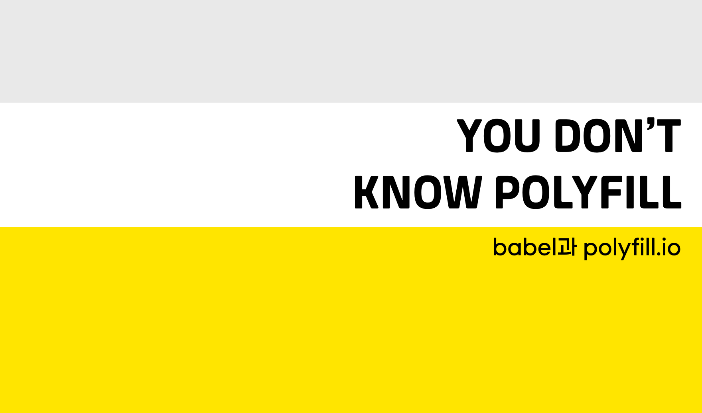
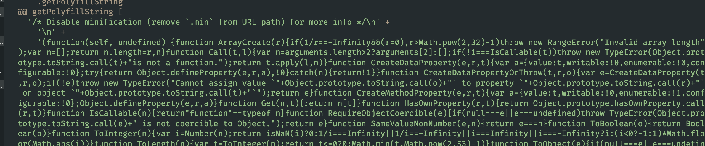
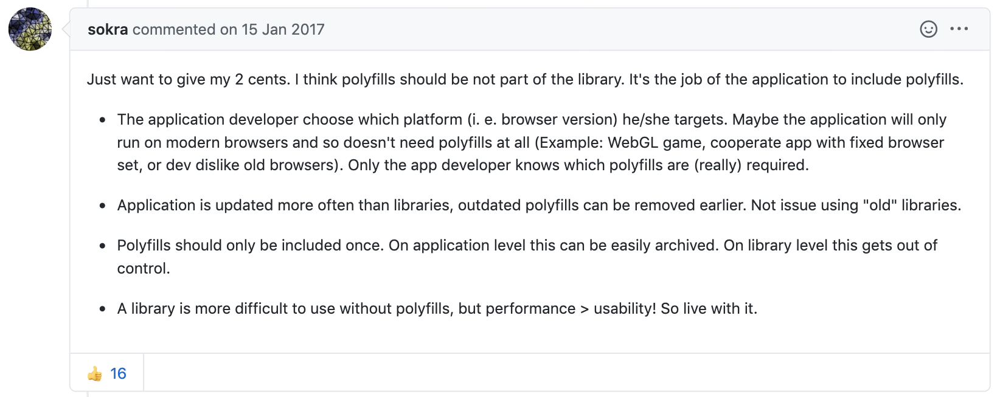

Babel은  ECMAScript2015+ 코드를 ECMAScript5 버전으로 변환하는 도구이다. 이 문장만 읽으면 Babel이 polyfill과 동일한 개념이라고 쉽게 오해할 수 있지만, Babel이 곧 Polyfill을 의미하는 것은 아니다. ES5에 존재하지 않는 ES6의 메서드나 생성자까지 지원하지 않기 때문이다.

예를 들어 ES6에 추가된 Promise, Object.assign, Array.from등은 ES5로 taranpiling하여도 대체할 ES5 Syntax가 없기 때문에 그대로 남아있게 된다.

```jsx{2,7,13,18}
// Yes! I can Do!
// Before
const helloBabel = () => {
  return 'world';
}

// After
var helloBabel = function helloBabel() {
  return 'world';
}

// No I cant
// Before
const helloPromise = new Promise(resolve => {
  return resolve('world')
})

// After
const helloPromise = new Promise(resolve => {
  return resolve('world')
})
```

`Promise`구문은 바뀌지 않았다. ES6를 지원하지 않는 IE에서 이 코드가 실행될 경우 에러가 발생된다.

Babel이 변환할 수 없는 부분을 채우는 것이 바로 polyfill이다. polyfill은 여러가지 방법으로 추가할 수 있는데, 이 글에서는 babel을 사용하는 방법과 polyfill.io를 사용하는 방법을 소개한다.

## babel

babel 7.4.0 이전과 이후로 babel을 사용하여 polyfill을 적용하는 방식이 바뀌었다. babel@7.4.0 이전에는 `@babel/polyfill`을 많이 사용했지만 밑에서 소개할 여러 문제로, 이제는 `@babel/preset-env`로 통합하여 사용한다.

> @babel/polyfill은 babel@7.4.0에서 deprecated되었다.

### @babel/polyfill

@babel/polyfill은 [regenerator runtime](https://www.npmjs.com/package/regenerator-runtime)과 ES5/6/7 폴리필인 [core-js](https://www.npmjs.com/package/core-js)를 dependency로 가지고 있는 패키지이다. @babel/polyfill의 코드는 매우 간단하다.

```jsx
// core-js@2.6.
// Cover all standardized ES6 APIs.
import "core-js/es6";

// Standard now
import "core-js/fn/array/includes";
import "core-js/fn/array/flat-map";
/* 생략 */

// Ensure that we polyfill ES6 compat for anything web-related, if it exists.
import "core-js/web";

import "regenerator-runtime/runtime";

```

@babel/polyfill의 장점으로는 먼저 전역에 폴리필을 추가하기전에 해당 기능이 있는지를 체크하므로, polyfill이 필요없는 최신 브라우저에서는 polyfill없이 동작하게 되어 babel-plugin-transform-runtime를 사용하는 것에 비해서는 빠르다.

> 번들은 우선 포함되고, 사용하는 코드만 core-js를 사용할지, 브라우저 코드를 사용하는 지 달라진다.

```jsx
// https://github.com/zloirock/core-js/blob/v2/modules/_export.js

var $export = function (type, name, source) {
  /* 생략 */
  for (key in source) {
    // contains in native
    own = !IS_FORCED && target && target[key] !== undefined;
    // export native or passed
    out = (own ? target : source)[key];
    // bind timers to global for call from export context
    exp = IS_BIND && own ? ctx(out, global) : IS_PROTO && typeof out == 'function' ? ctx(Function.call, out) : out;
    // extend global
    if (target) redefine(target, key, out, type & $export.U);
    // export
    if (exports[key] != out) hide(exports, key, exp);
    if (IS_PROTO && expProto[key] != out) expProto[key] = out;
  }
}
```

하지만 @babel/polyfill에는 크게 두 가지 문제가 있다.

#### Bundle Size

`import "core-js/es6"` 구문을 통해 모든 polyfill을 load하게 되므로 필연적으로 번들 사이즈가 커진다. ([core-js es6/index.js](https://github.com/zloirock/core-js/blob/v2/es6/index.js))

#### global 객체

@babel/polyfill 에서 사용했던 core-js@2.6.5의 코드를 간단히 살펴보면, 전역 객체를 직접 수정하는 방식임을 알 수 있다.

```jsx
// https://github.com/zloirock/core-js/blob/v2/modules/es7.array.includes.js
$export($export.P, 'Array', {
  includes: function includes(el /* , fromIndex = 0 */) {
    return $includes(this, el, arguments.length > 1 ? arguments[1] : undefined);
  }
});
```

이렇게 전역 객체를 직접 수정하는 방식이기 때문에, babel/polyfill은 딱 한번만 import되어야 한다. 두 개 이상의 @babel/polyfill을 import하게 되면 아래와 같이 오류를 발생 시킨다.

```text
:rotating_light: Uncaught Error : only one instance of babel-polyfill is allowed
```

@babel/polyfill의 디펜던시인 core-js 의 ES6/7 폴리필의 경우 두 번 호출되면 내부적으로 오류가 발생되어 정상적으로 폴리필이 적용되지 않는다.
따라서 @babel/polyfill 이 두 번 호출되지 않도록 주의해야 한다.

### babel-plugin-transform-runtime

babel-plugin-transform 플러그인은 transpile과정에서 polyfill이 필요한 부분의 동작을 내부 helper함수로 치환하는 것이다. ([관련 코드](https://github.com/babel/babel/blob/6.x/packages/babel-plugin-transform-runtime/src/index.js#L4-L16))

core-js를 디펜던시로 가지고 있고, [alias를 생성](https://github.com/babel/babel/blob/master/packages/babel-plugin-transform-runtime/src/runtime-corejs2-definitions.js)해서 전역 객체 변경 없이 polyfill이 적용 되도록 한다.

예를 들어, 아래 코드는

```jsx
new Promise(resolve => resolve(1))
```

transpile과정을 거치면 다음과 같이 변한다.

```jsx
var _promise = require("babel-runtime/core-js/promise");

var _promise2 = _interopRequireDefault(_promise);

function _interopRequireDefault(obj) { return obj && obj.__esModule ? obj : { default: obj }; }

new _promise2.default(function (resolve) {
  return resolve(1);
});
```

이 방식을 사용할 땐 한 가지 주의할 점이 있다.

예를 들어, axios를 디펜던시로 사용하는 프로젝트에서는 `node_modules/axios`까지 transpile범위에 포함되도록 해야한다. axios는 내부적으로 Promise를 사용하는 라이브러리인데, **babel-plugin-transform-runtime은 Promise전역 객체를 생성하지 않으므로 에러**가 발생한다.

@babel/polyfill과 달리 필요한 부분에만 polyfill을 적용하기 때문에 bundle size 측면에서 이점이 있고, 전역 객체를 직접 수정하지 않는다는 점에서 @babel/polyfill보다 안전하다고 볼 수 있으나, 개발자가 많은 부분을 신경써야 한다는 점에서 비효율적이다.

> 위 코드는 [SoYoung210/test-polyfill-babel-transform-runtime](https://github.com/SoYoung210/test-polyfill/tree/babel-transform-runtime) 에서 테스트해볼 수 있다.

### @babel/preset-env

babel/preset-env@7.12.1 기준, babel/preset-env으로 polyfill을 설정할 수 있다.

[core-js-compat](https://www.npmjs.com/package/core-js-compat)을 디펜던시로 가지고 있고, `babelrc`에 설정된 target값을 보고 [core-js-compat/data](https://github.com/zloirock/core-js/blob/master/packages/core-js-compat/src/data.js) 를 이용해 필요한 polyfill만 로드한다. 명시된 target에서 지원되지 않는 JS문법을 확인하여 `@babel/plugin-*`를 설정해주는 방식이다. ([Code](https://github.com/babel/babel/blob/eea156b2cb/packages/babel-preset-env/src/index.js#L303-L326))

**useBuiltIns**

`useBuiltIns` 옵션은 어떤 방식으로 polyfill을 사용할 지 설정하는 옵션이다. 기본 값은 false이므로 이 값을 설정하지 않으면 번들 결과물에 아무런 polyfill도 추가되지 않는다.

#### entry

transpile하는 시작점에 import된 `core-js`모듈과 `regenerator-runtime`모듈을 babelrc에서 지정한 `target`에 맞게 변경한다.

```jsx
// index.js
import 'core-js';
```

[test-polyfill/babel-preset-env Repo](https://github.com/SoYoung210/test-polyfill/tree/babel-preset-env) 에서 target에 IE ≥ 10이 포함되어 있는 번들과 그렇지 않은 번들의 diff를 확인하면 다음과 같다.

```bash
$ npm run build:ie
$ npm run build:modern
$ diff ./dist/ie/index.js ./dist/modern/index.js
```

```
89,90d88
< require("core-js/modules/es.array-buffer.is-view");
<
201,202d198
< require("core-js/modules/es.object.set-prototype-of");
<
```

`"targets": ">= 0.25%, not dead, ie >= 10",` 설정으로 빌드한 파일에는 IE지원을 위한 polyfill이 추가로 포함되어 있다.

target이 매우 구형 브라우저일 경우 과도한 polyfill이 추가되어 최신 브라우저에서도 크기가 큰 bundle file을 로드하게 되는 낭비가 발생할 수 있다.

#### usage

실제 코드에서 사용하는 polyfill만 import하는 설정이다.

[test-polyfill/babel-preset-env](https://github.com/SoYoung210/test-polyfill/blob/babel-preset-env/index.js) 에서 `npm run build:modern:usage`를 수행하면 아래와 같은 결과를 확인할 수 있습니다.

```jsx
// Input
new Set([1,2,3])

var a = new Promise();

// Output
require("core-js/modules/es.array.iterator");

require("core-js/modules/es.object.to-string");

require("core-js/modules/es.promise");

require("core-js/modules/es.set");

require("core-js/modules/es.string.iterator");

require("core-js/modules/web.dom-collections.iterator");
```

`usage`옵션은 사용하는 코드만 polyfill대상으로 보기 때문에, 사용하는 `node_modules`의 dependency에서 polyfill이 적용되지 않은 코드가 있다면 에러가 발생할 수 있다.

또, 아래와 같은 코드에서 babel은 `fooArrayOrObject`이 string에 필요한 지 array에 필요한 지 판단할 수 없기 때문에 두 가지 polyfill을 모두 import한다.

```jsx
// Before
import { fooArrayOrObject } from './test';
console.log(fooArrayOrObject.includes());

// After
require("core-js/modules/es.array.includes");

require("core-js/modules/es.string.includes");

var _test = require("./test");

// new Set([1,2,3])
// var a = new Promise();
console.log(_test.fooArrayOrObject.includes());
```

## polyfill.io

[polyfill.io](http://polyfill.io) service는 요청하는 브라우저의 User-Agent를 확인하여 필요한 polyfill script만 다운로드할 수 있는 서비스이다. 지원되는 브라우저는 [polyfill.io 페이지](https://polyfill.io/v3/supported-browsers/) 에서 확인할 수 있는데, IE 10이하는 지원하지 않는다. ~~이만 보내주자.~~

User-Agent는 [polyfill-useragent-normaliser](https://github.com/Financial-Times/polyfill-useragent-normaliser/blob/master/lib/normalise-user-agent.vcl) 를 통해 확인하고, 필요한 polyfill을 load하는 부분은 [polyfill-library/lib/index.js](https://github.com/Financial-Times/polyfill-library/blob/e9cfb03a55ae343e1d6fb2e4f06176eee691298b/lib/index.js#L250) 에서 관리되고 있다.

실제로, polyfill을 가져오는 함수는 getPolyfillString polyfill-library에서 `npm run test-node` 를 수행하여 다음과 같은 script가 생성되는 것을 확인할 수 있다.



[polyfill.io](http://polyfill.io) 의 기본 설정으로 사용한다면 html파일에 script tag를 추가해주면 된다.

```jsx
<script src="https://polyfill.io/v3/polyfill.min.js?features=default"></script>
```

production에서 [polyfill.io](http://polyfill.io) 를 사용하는 방식은 부담스러울 수 있다. polyfill.io 서버가 항상 안정적이라는 보장이 없기 때문인데, 이럴 경우 [polyfill-library](https://github.com/Financial-Times/polyfill-library) 를 self-hosted server에 얹어서 운영하는 방안이 있다. 이 방법에 대해서는 polyfill.io(링크 추가하기) 서버 구축 단락에서 자세히 다룬다.

polyfill-library는 전역객체에 접근하여 속성을 추가하는 방식이다.

```jsx
// https://github.com/Financial-Times/polyfill-library/blob/master/polyfills/Array/isArray/polyfill.js
CreateMethodProperty(Array, 'isArray', function isArray(arg) {
	return IsArray(arg);
});

// https://github.com/Financial-Times/polyfill-library/blob/master/polyfills/_ESAbstract/CreateMethodProperty/polyfill.js
function CreateMethodProperty(O, P, V) { // eslint-disable-line no-unused-vars
var newDesc = {
  value: V,
  writable: true,
  enumerable: false,
  configurable: true
  };

Object.defineProperty(O, P, newDesc);
}
```

### Options

babel-preset-env에서는 browser target을 지정하여 필요한 polyfill을 load하는 방식이었다면, [polyfill.io](http://polyfill.io) 에서는 쿼리파라미터에 옵션을 명시하는 방식으로 사용할 수 있다.

```jsx
https://cdn.polyfill.io/v3/polyfill.min.js
```

이렇게 default값으로 사용할 경우 내부에 정의된 [aliases.json](https://github.com/Financial-Times/polyfill-library/blob/e9cfb03a55ae343e1d6fb2e4f06176eee691298b/lib/sources.js#L51) 을 참고하여 필요한 polyfill목록을 자동으로 추가한다. (default옵션에 어떤 polyfill이 정의되어 있는지 정리한 문서를 찾지 못하였는데, polyfill-library에서 `npm run test-polyfills` 명령어를 통해 생성되는 polyfills/_dist/aliases.json 파일을 참고했다.)

```jsx
"default":
[
"Array.from","Array.isArray","Array.of","Array.prototype.every",
"Array.prototype.fill","Array.prototype.filter","Array.prototype.forEach",
....
]
```

특정 기능만 사용하고 싶다면 **feature** 파라미터로, 제외하고 싶은 polyfill이 있다면 **excludes**로 명시해주면 된다.

```jsx
https://cdn.polyfill.io/v3/polyfill.min.js
?features=fetch,IntersectionObserver
&excludes=Document
```

polyfill을 load할 때 User Agent값과 관계 없이 항상 load하도록 설정하고 싶다면 **flags=always** 옵션을 활성화 하면 된다.

flags=always로 요청할 때, 사용하고자 하는 polyfill이 브라우저에 구현되어 있는지 확인하는 옵션은 **flags=always, gated** 이다.

```jsx
https://cdn.polyfill.io/v2/polyfill.min.js
?features=fetch,IntersectionObserver&
flags=always,gated
```

모든 옵션에 대한 정보는 [API Reference](https://polyfill.io/v3/api/)에서 확인할 수 있고, 옵션에 따라 쿼리파라미터를 자동으로 생성해주는 [url-builder](https://polyfill.io/v3/url-builder/) 를 활용하면 좀더 편하게 쓸 수 있다.

쿼리파라미터로 옵션을 명시하는 방식이다보니, [XSS 공격](https://developer.mozilla.org/en-US/docs/Glossary/Cross-site_scripting)에 대한 취약점이 우려될 수 있다. 자세한 내용은 [이 글](https://snyk.io/vuln/npm:polyfill-service:20160126) 에 정리되어 있는데, 요약하자면 옵션값들을 escape처리하여 방지하고 있다는 글이다. `<` 는 `&lt`,  `>` 는 `&gt` 로 escape하여 코드상에 스크립트 태그등이 있더라도 HTML로 해석되지 않도록 한다.

polyfill-service에서는 [이 커밋](https://github.com/financial-times/polyfill-service/commit/aadd8d08b50f7f9c02b431d06f6ee2158902c53c) 을 통해 XSS공격 방지 기능을 추가했고, polyfill-service 3.1.2 version부터 대응되어 있다.

### 자체 [polyfill.io](http://polyfill.io) 서버 구축하기

Docker를 통해 쉽게 자체 [polyfill-service](https://github.com/financial-times/polyfill-service)를 구축할 수 있다.

```docker
FROM node:12.18.0-alpine

RUN apk add --no-cache --update bash
RUN apk add --no-cache --update --virtual build git python make gcc g++

WORKDIR /polyfill

# 맞는 버전 명시
ARG POLYFILL_TAG='v4.8.1'
ARG NODE_ENV='production'
RUN \
	git clone https://github.com/Financial-Times/polyfill-service . && \
	git checkout ${POLYFILL_TAG} && \
	rm -rf .git && \
	yarn install && \
	sed -i.bak -e 's,^node,exec node,' start_server.sh && \
	mv start_server.sh /bin/ && \
	chmod a+x /bin/start_server.sh && \
	apk del build
ENV PORT 8801

EXPOSE ${PORT}

CMD ["/bin/start_server.sh", "server/index.js"]
```

## 라이브러리 제작자라면?

babel과 [polyfill](http://polyfill.io).io가 polyfill을 처리하는 방식을 정리하고 나니, 라이브러리를 개발할 때 polyfill설정은 어떻게 적용하는 것이 가장 효율적인 방법인지 의문이 들었다.

polyfill의 책임은 라이브러리일까, 아니면 Application레벨일까에 관해 논의하던 [GitHub Issue](https://github.com/w3ctag/polyfills/issues/6) 에서 webpack 메인테이너 sokra는 다음과 같이 말했다.



[https://github.com/w3ctag/polyfills/issues/6#issuecomment-272647475](https://github.com/w3ctag/polyfills/issues/6#issuecomment-272647475)

polyfill필요 여부는 Application레벨에서는 쉽게 제어할 수 있지만, 라이브러리 레벨에서는 그렇지 않다.

때문에, 많은 사람들이 polyfill의 책임을 Application으로 이양하고 **polyfill이 필요한 부분에 대해 힌트**를 제공하는 방식을 긍정적으로 이야기 했다.

## 마무리

## Ref

- [https://programmingsummaries.tistory.com/](https://programmingsummaries.tistory.com/)
- [https://github.com/babel/babel/blob/master/packages/babel-polyfill/package.json](https://github.com/babel/babel/blob/master/packages/babel-polyfill/package.json)
- [https://github.com/zloirock/core-js](https://github.com/zloirock/core-js)
- [https://3perf.com/blog/polyfills/](https://3perf.com/blog/polyfills/)
- [https://github.com/Financial-Times/polyfill-library](https://github.com/Financial-Times/polyfill-library)
- [https://slides.com/odyss/deck-8](https://slides.com/odyss/deck-8)
- [https://www.youtube.com/watch?v=8GcVBTBI4Ew&list=PLZl3coZhX98oeg76bUDTagfySnBJin3FE&index=12](https://www.youtube.com/watch?v=8GcVBTBI4Ew&list=PLZl3coZhX98oeg76bUDTagfySnBJin3FE&index=12)
- [https://snyk.io/vuln/npm:polyfill-service:20160126](https://snyk.io/vuln/npm:polyfill-service:20160126)
- [https://github.com/3YOURMIND/js-polyfill-docker](https://github.com/3YOURMIND/js-polyfill-docker)
