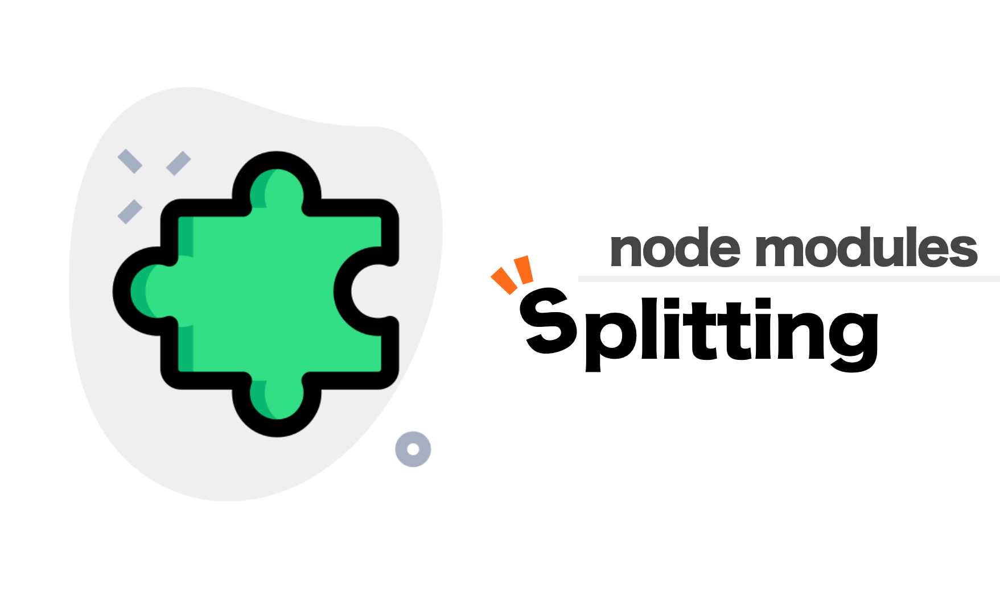
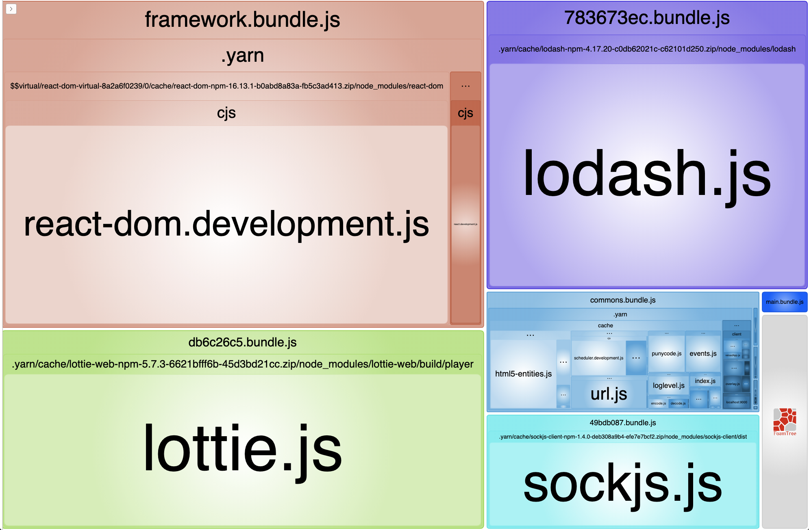
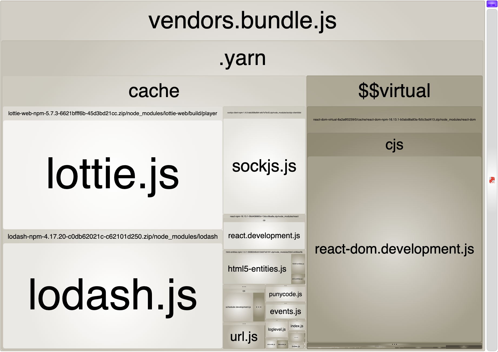

web application을 만들 때 여러 기능을 빠르고 쉽게 지원하기 위해 여러 library를 사용합니다. 이 library를 어떻게 build하는지에 따라 초기 페이지 로딩 속도가 크게 좌우될 수 있습니다.

이 글에서는 `webpack`의 splitChunk 옵션을 수정하여 node module을 여러 개의 bundle file로 나눌 수 있는 방법에 대해 소개합니다.

> 사용되는 모든 코드는 [이 저장소](https://github.com/SoYoung210/webpack-node-modules-splitting)에서 확인하실 수 있습니다.

## cacheGroups

주요하게 수정할 부분은 webpack splitChunks의 `cacheGroups`옵션입니다.

**[cacheGroups](https://webpack.js.org/plugins/split-chunks-plugin/#splitchunkscachegroups)는 특정 조건에 따라서 청크파일을 생성한다는 규칙 정의입니다.** cacheGroups object의 key값이 각 '규칙의 이름'이 됩니다. 이 글에서 설명할 cacheGroups 규칙은 [Next.js의 webpack-config.ts](https://github.com/vercel/next.js/blob/ed0820f763e74d0071625030aed70b3b21184aef/packages/next/build/webpack-config.ts) 를 일부 수정한 내용입니다.

## framework, lib, commons 3가지 규칙

cacheGroups의 default 설정은 모두 false로 '사용하지 않음'으로 명시해 주고, 커스텀 한 규칙 3가지를 정의합니다.

```js
cacheGroups: {
  default: false,
  vendors: false,
  framework: {},
  lib: {},
  commons: {}
}
```

> 여기서 이름이 꼭 위 예시와 같을 필요는 없습니다. [webpack splitChunk 문서](https://webpack.js.org/plugins/split-chunks-plugin/#splitchunkscachegroups)에서는 `splitChunks.cacheGroups.{cacheGroup}.priority` 형태로 안내하고 있습니다.

- framework: react, react-router-dom 등 프로젝트가 사용하는 core framework를 분리한 chunk
- lib: 기준 크기를 넘어가는 노드 모듈에 대한 별도 chunk
- commons: 그 외의 모듈 chunk

위 규칙을 담은 config는 다음과 같습니다.

```js{7, 14}
cacheGroups: {
  default: false,
  vendors: false,
  framework: {
    chunks: 'all',
    name: 'framework',
    test: /(?<!node_modules.*)[\\/]node_modules[\\/](react|react-dom|react-router-dom)[\\/]/,
    priority: 40,
    enforce: true,
  },
  lib: {
    test(module) {
      return (
        module.size() > 80000 &&
        /node_modules[/\\]/.test(module.identifier())
      );
    },
    name(module) {
      const hash = crypto.createHash('sha1');

      hash.update(module.libIdent({ context: __dirname }));

      return hash.digest('hex').substring(0, 8);
    },
    priority: 30,
    minChunks: 1,
    reuseExistingChunk: true,
  },
  commons: {
    name: 'commons',
    minChunks: 1, // entry points length
    priority: 20,
  }
}
```

이 규칙에 따라 나눠진 bundle입니다. framework, commons 그리고 lib에서 정의한 [hash] 이름으로 분리되었습니다.



이제, 각 규칙을 이루고 있는 속성들에 대해 알아보겠습니다.

### Priority

각 노드 모듈을 cacheGroups의 `test 규칙`에 따라 여러 cacheGroup에 속할 수 있습니다.

모듈이 두 가지 이상의 그룹에 속할 수 있을 때, 이 priority를 보고 높은 규칙에 속하게 됩니다.

### chunks: all

chunks 설정에 줄 수 있는 옵션은 세 가지입니다.

**initial, async, all**

```jsx
// a.js
import React from 'react'
import('lodash') // dynamic load

console.log('hello a')

export default a;
```

`a.js`에서 lodash는 dynamic import 되었고, react는 즉시 import되었습니다.

```js
// webpack.config.js
splitChunks: {
  cacheGroups: {
    defaultVendors: {
      test: /[\\/]node_modules[\\/]/,
      chunks: 'async'
    },
  }
}
```

위 설정은 defaultVendors라는 chunk 그룹을 생성하고 **이 그룹에는 node_modules 폴더 아래에 있는 파일 중 비동기로 import된 파일들을 포함 시키는** 설정입니다.

만약 chunks 옵션이 `all`인 경우 import 방식에 상관 없이 node_modules 아래에 있는 파일은 모두 defaultVendors.js로 모듈이 나눠지게 됩니다.

웹팩 node_modules splitting의 전제 자체가 browser에서 리소스를 병렬적으로 로드할 수 있으니, 번들을 작게 쪼개서 전체 로딩 타임을 감소시킨다는 컨셉입니다.

### enforce: true?

webpack splitChunks의 다른 설정(minSize, minChunks, maxAsyncRequests등)을 무시하고 이 그룹에 대한 청크를 항상 생성하도록 명시하는 것입니다.

### default, vendors, defaultVendors: false?

```jsx
cacheGroups: {
  default: false,
  vendors: false,
 // vendors was renamed to defaultVendors
  defaultVendors: false,
}
```

위 속성들을 `false`로 지정한다는건 무슨 뜻일까요?

webpack은 기본적인 splitChunk 옵션들을 제공합니다.

[SplitChunk 옵션 문서](https://github.com/webpack/webpack.js.org/blob/master/src/content/plugins/split-chunks-plugin.md)에는 아래와 같은 기본 값 설정이 명시되어 있습니다.

```jsx
module.exports = {
  //...
  optimization: {
    splitChunks: {
      chunks: 'async',
      minSize: 20000,
      minRemainingSize: 0,
      maxSize: 0,
      minChunks: 1,
      maxAsyncRequests: 30,
      maxInitialRequests: 30,
      automaticNameDelimiter: '~',
      enforceSizeThreshold: 50000,
      cacheGroups: {
        defaultVendors: {
          test: /[\\/]node_modules[\\/]/,
          priority: -10
        },
        default: {
          minChunks: 2,
          priority: -20,
          reuseExistingChunk: true
        }
      }
    }
  }
};
```

위 옵션을 모두 false로 처리할 경우, 기본 `SplitChunk` 설정을 모두 사용하지 않고 custom rule만 적용한다는 뜻입니다.

### test와 name의 parameter가 되는 modules

`lib` 설정 쪽에서 기준 크기를 작게 잡으면, css 관련 모듈도 lib 규칙에 포함될 수 있는데, 이때 CSS 모듈관련 오류가 발생할 수 있습니다.

```text
TypeError: module.libIdent is not a function
    at Object.name [as getName] (/webpack.config.js:169:34)
    at addModuleToChunksInfoMap (/webpack/lib/optimize/SplitChunksPlugin.js:497:31)
    at /webpack/lib/optimize/SplitChunksPlugin.js:630:9
    at SyncBailHook.eval [as call] (eval at create (/node_modules/tapable/lib/HookCodeFactory.js:19:10), <anonymous>:5:16)
    at SyncBailHook.lazyCompileHook (/node_modules/tapable/lib/Hook.js:154:20)
```

다시 아까 적었던 설정을 살펴봅시다.

```jsx
 lib: {
   test(module) {
     return (
       module.size() > 80000 &&
         /node_modules[/\\]/.test(module.identifier())
      );
    },
   name(module) {
     const hash = crypto.createHash('sha1');
     if (!module.libIdent) {
       throw new Error(
         `Encountered unknown module type: ${module.type}. Please open an issue.`,
        );
      }

     hash.update(module.libIdent({ context: __dirname }));

     return hash.digest('hex').substring(0, 8);
   }
},
```

css 모듈의 크기가 `test` 조건에 부합하였고, `name` 부분에서 이름을 정하는 규칙에서 에러가 throw 되었습니다.

mini-css-extract plugin에 의해 생성된 CSS 모듈에는 `libIdent`가 없습니다. module type이 mini-css-extract에 의해 분리된 모듈인지 확인하는 조건문이 필요합니다.

```jsx
const isModuleCSS = (module) => {
  return module.type === 'css/mini-extract';
};

lib: {
  test(module) {
    return (
      module.size() > 80000 &&
      /node_modules[/\\]/.test(module.identifier())
    );
  },
  name(module) {
    const hash = crypto.createHash('sha1');

    if (isModuleCSS(module)) {
      module.updateHash(hash);

      return hash.digest('hex').substring(0, 8);
    } else {
      if (!module.libIdent) {
        throw new Error(
          `Encountered unknown module type: ${module.type}. Please open an issue.`,
        );
      }
    }
    hash.update(module.libIdent({ context: __dirname }));

    return hash.digest('hex').substring(0, 8);
  },
  priority: 30,
  minChunks: 1,
  reuseExistingChunk: true,
}
```

사용하고 있는 module 객체 정보에 대한 정보는 간략히 다음과 같이 정리할 수 있습니다.

- libIdent: 모듈의 위치 정보입니다. module.libIndent()를 호출하면 다음과 같은 결과를 확인할 수 있습니다.
  - ex: /${projectPath}/node_modules/${moduleName}/${fileName}js
- type: 모듈의 타입. 대부분의 노드 모듈은 `javascript/auto` 타입이고, css module의 경우 `css/mini-extract`입니다.
- size: 모듈의 사이즈

## 마무리

`cacheGroups`을 적용하기 전/후의 [bundle analyzer](https://www.npmjs.com/package/webpack-bundle-analyzer) 결과입니다.

### Before



### After


lottie, lodash 등 비교적 큰 모듈을 각각 chunk로 나누고, 이를 병렬적으로 load 하는 방식으로 첫 페이지 로딩 속도를 개선시킬 수 있습니다.

## Reference

- [https://medium.com/@simsimjae/webpack4-splitchunksplugin-옵션-파헤치기-19f5de32425a](https://medium.com/@simsimjae/webpack4-splitchunksplugin-%EC%98%B5%EC%85%98-%ED%8C%8C%ED%97%A4%EC%B9%98%EA%B8%B0-19f5de32425a)
- [https://webpack.js.org/plugins/split-chunks-plugin/#splitchunkscachegroups](https://webpack.js.org/plugins/split-chunks-plugin/#splitchunkscachegroups)
